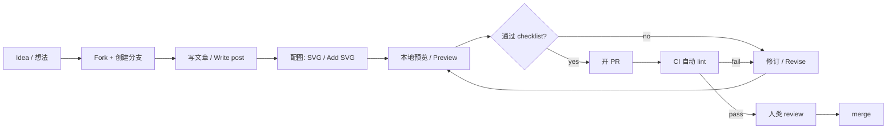

# Contributing · 投稿与共建 / Contributing Guide

> 欢迎贡献一篇 / 修一个错 / 提一个 issue。
> 我们的理念是：**方法论公开，闭源内容不混进来。**
>
> Welcome contributions! Our principle: **methodology is open, closed-source content stays out.**

---

## 📋 范围 / Scope

**✅ 可投稿 / Accepted：**
- Agent 编排、调度、监控、成本控制等方法论
- 真实踩坑、复盘、反思
- 架构图、YAML schema、CI/CD 模板
- 外部视角的 AI 项目深度解读
- 翻译现有中文内容为英文

**❌ 不投稿 / Not Accepted：**
- 闭源产品代码
- 付费 API 集成
- 内部组织信息、姓名、邮箱、凭据
- 任何可识别为"客户"或"用户"的数据

---

## 🔄 投稿流程 / Contribution Flow



---

## ✅ Checklist（必过 / Required）

每篇 PR 提交前自查 / Pre-PR checklist：

- [ ] **双语完整** — 中英两版都写完，不是"先写中文、英文 TODO"
- [ ] **脱敏** — 没有人名 / 客户名 / 内部凭证 / 内部 GitHub org 名
- [ ] **代码片段用通用示例** — 不暴露内部项目名 / 业务逻辑
- [ ] **图用 SVG** — 不要 PNG / 外部链接（GitHub 渲染 SVG 最好）
- [ ] **每篇 600-1500 字** — 短了不够深，长了读者跑掉

---

## 📝 文章结构 / Post Structure

### External Lens / 外部视角

每篇 `day-NN.zh.md` / `day-NN.en.md` 必须有：

```markdown
# AI棱镜 · 外部视角 · Day NN
> 日期 · 第 N 期

---

## TL;DR

[3-5 行要点]

## 正文

[深度解读内容]

## Appendix: Tools & Links

[关联链接 + 下篇预告]
```

### Yason and His Roberts / Yason 和他的罗伯特们

每篇 `chNN.zh.md` 必须有：

```markdown
# 第N章：标题

> **核心观点：一句话概括**

---

[正文内容]
```

---

## 🎨 图标准 / Illustration Standards

- **格式 / Format**：SVG（矢量、可 git diff、GitHub 完美渲染）
- **viewBox**：1200×600 或 1000×500
- **字号 / Font size**：标题 28-32px，正文 11-14px
- **色板 / Palette**：
  - 🔮 Indigo `#6366f1` — External Lens
  - 🤖 Pink `#ec4899` — Internal Practice
  - ✨ Amber `#f59e0b` — Highlights
  - 🌑 Dark `#0f0b1a` — Background
- **文件命名 / Naming**：`day-NN-描述.svg` 或 `NN-描述.svg`

---

## 📌 Commit & PR 规范 / Commit & PR Conventions

- **Commit**: `post: day-NN` / `post: chNN` 或 `fix: day-NN typo`
- **Branch**: `post/day-NN-主题` 或 `fix/day-NN-具体问题`
- **PR Title**: `Day NN: 中文标题` 或 `Ch NN: 中文标题`

---

## 🤝 行为准则 / Code of Conduct

- 友善、尊重、就事论事
- 接受建设性批评
- 不接受人身攻击 / 歧视 / 骚扰
