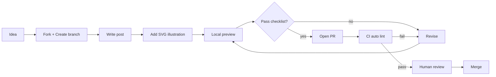

# Contributing Guide

[English](./CONTRIBUTING.md) | [简体中文](./CONTRIBUTING.zh.md)

> Welcome contributions! Our principle: **methodology is open, closed-source content stays out.**

---

## 📋 Scope

**✅ Accepted：**
- Agent orchestration, scheduling, monitoring, cost control methodologies
- Real-world lessons learned, retrospectives, reflections
- Architecture diagrams, YAML schemas, CI/CD templates
- External Lens AI project deep dives
- Translating existing Chinese content to English

**❌ Not Accepted：**
- Closed-source product code
- Paid API integrations
- Internal org info, names, emails, credentials
- Any data identifiable as "customer" or "user"

---

## 🔄 Contribution Flow



---

## ✅ Checklist (Required)

Pre-PR checklist for every submission:

- [ ] **Bilingual complete** — Both EN and ZH versions are done, not "ZH first, EN TODO"
- [ ] **Desensitized** — No names / client names / internal credentials / internal GitHub org names
- [ ] **Generic code snippets** — Don't expose internal project names / business logic
- [ ] **SVG illustrations** — No PNG / external links (GitHub renders SVG best)
- [ ] **600-1500 words per post** — Too short lacks depth, too long loses readers

---

## 📝 Post Structure

### External Lens

Every `en/day-NN.md` / `zh/day-NN.md` must have:

```markdown
# AI Prism · External Lens · Day NN

[English](./day-NN.md) | [简体中文](../zh/day-NN.md)

> Date · Issue #N

---

## TL;DR

[3-5 key points]

## Main Content

[Deep dive content]

## Appendix: Tools & Links

[Related links + next post preview]
```

### Yason and His Roberts

Every `en/chNN.md` / `zh/chNN.md` must have:

```markdown
# Chapter N: Title

[English](./chNN.md) | [简体中文](../zh/chNN.md)

> **Core insight: one-sentence summary**

---

[Main content]
```

---

## 🎨 Illustration Standards

- **Format**：SVG (vector, git-diffable, GitHub-perfect rendering)
- **viewBox**：1200×600 or 1000×500
- **Font size**：Title 28-32px, body 11-14px
- **Palette**：
  - 🔮 Indigo `#6366f1` — External Lens
  - 🤖 Pink `#ec4899` — Internal Practice
  - ✨ Amber `#f59e0b` — Highlights
  - 🌑 Dark `#0f0b1a` — Background
- **Naming**：`day-NN-description.svg` or `NN-description.svg`

---

## 📌 Commit & PR Conventions

- **Commit**: `post: day-NN` / `post: chNN` or `fix: day-NN typo`
- **Branch**: `post/day-NN-topic` or `fix/day-NN-specific-issue`
- **PR Title**: `Day NN: English title` or `Ch NN: English title`

---

## 🤝 Code of Conduct

- Be friendly, respectful, and constructive
- Accept constructive criticism
- No personal attacks / discrimination / harassment
