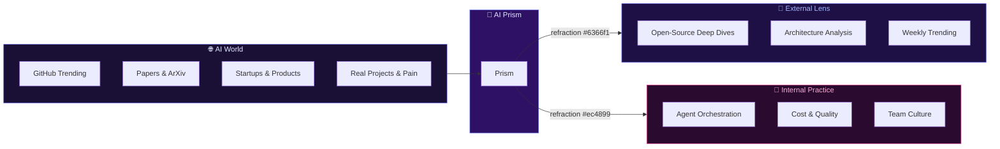

# 🔮 AI Prism

[English](./README.md) | [简体中文](./README.zh.md)

> **Two lenses, one prism — refracting the AI world through external insights and internal practice.**

---

## 🌈 What is AI Prism?

AI Prism is a bilingual (ZH + EN) daily journal that refracts the AI world through two lenses:

- 🔭 **External Lens** — Daily AI insights: deep dives into GitHub open-source projects, AI architecture analysis, startup and pain-point observations
- 🤖 **Internal Practice** — The narrative series "Yason and His Roberts": the true story of a human and his AI agent team

---

## 🔮 The Prism Metaphor

---

## 📖 Table of Contents

### Part I: 🔭 External Lens

> Daily AI industry insights — deep dives, architecture analysis, weekly trending

| Day | Topic | English | 中文 |
|-----|-------|---------|------|
| 01 | Agents Colonize GitHub & Vector Search Bottleneck | [EN](posts/external-lens/en/day-01.md) | [中文](posts/external-lens/zh/day-01.md) |
| 06 | 6 Skills Projects Worth Starring | [EN](posts/external-lens/en/day-06.md) | [中文](posts/external-lens/zh/day-06.md) |
| 07 | 5 MCP Protocol Production Cases | [EN](posts/external-lens/en/day-07.md) | [中文](posts/external-lens/zh/day-07.md) |
| 08 | 6 Must-Read Agent Papers | [EN](posts/external-lens/en/day-08.md) | [中文](posts/external-lens/zh/day-08.md) |
| 09 | 8 Agent Frameworks Engineering Comparison | [EN](posts/external-lens/en/day-09.md) | [中文](posts/external-lens/zh/day-09.md) |
| 10 | 2026.05.24 Weekly AI Tools | [EN](posts/external-lens/en/day-10.md) | [中文](posts/external-lens/zh/day-10.md) |
| 11 | Build Your Own MCP Server | [EN](posts/external-lens/en/day-11.md) | [中文](posts/external-lens/zh/day-11.md) |
| 12 | Writing DNA Distillation | [EN](posts/external-lens/en/day-12.md) | [中文](posts/external-lens/zh/day-12.md) |
| 13 | 6-in-1 General Agent Framework | [EN](posts/external-lens/en/day-13.md) | [中文](posts/external-lens/zh/day-13.md) |
| 14 | 2026 H1 Agent Landscape | [EN](posts/external-lens/en/day-14.md) | [中文](posts/external-lens/zh/day-14.md) |
| 15 | 2026.05.31 Weekly AI Repos | [EN](posts/external-lens/en/day-15.md) | [中文](posts/external-lens/zh/day-15.md) |
| 16 | Rust Revolution in Vector Search & Agent Skills Tipping Point | [EN](posts/external-lens/en/day-16.md) | [中文](posts/external-lens/zh/day-16.md) |

---

### Part II: 🤖 Yason and His Roberts

> The true story of a human and his AI agent team — 14 months from zero to 7×24

| Ch | Title | English | 中文 |
|----|-------|---------|------|
| 01 | The First Roberts — Birth of an AI Manager | [EN](posts/yason-and-roberts/en/ch01.md) | [中文](posts/yason-and-roberts/zh/ch01.md) |
| 02 | Team Division — Production, Operations, Collaboration | [EN](posts/yason-and-roberts/en/ch02.md) | [中文](posts/yason-and-roberts/zh/ch02.md) |
| 03 | Communication — From CLI to LLM | [EN](posts/yason-and-roberts/en/ch03.md) | [中文](posts/yason-and-roberts/zh/ch03.md) |
| 04 | Memory — How to Make AI Remember Everything | [EN](posts/yason-and-roberts/en/ch04.md) | [中文](posts/yason-and-roberts/zh/ch04.md) |
| 05 | The Art of Debate — Multi-Model Deliberation | [EN](posts/yason-and-roberts/en/ch05.md) | [中文](posts/yason-and-roberts/zh/ch05.md) |
| 06 | Cost vs Quality — Routing Economics | [EN](posts/yason-and-roberts/en/ch06.md) | [中文](posts/yason-and-roberts/zh/ch06.md) |
| 07 | Assigning Tasks — Decomposition & Tracking | [EN](posts/yason-and-roberts/en/ch07.md) | [中文](posts/yason-and-roberts/zh/ch07.md) |
| 08 | Who Reviews Roberts? — QA & Acceptance | [EN](posts/yason-and-roberts/en/ch08.md) | [中文](posts/yason-and-roberts/zh/ch08.md) |
| 09 | Don't Let Roberts Run Wild — Security & Permissions | [EN](posts/yason-and-roberts/en/ch09.md) | [中文](posts/yason-and-roberts/zh/ch09.md) |
| 10 | When Roberts Crash — Recovery & Fallback | [EN](posts/yason-and-roberts/en/ch10.md) | [中文](posts/yason-and-roberts/zh/ch10.md) |
| 11 | Good Tools — Ecosystem & API Integration | [EN](posts/yason-and-roberts/en/ch11.md) | [中文](posts/yason-and-roberts/zh/ch11.md) |
| 12 | The Brain — Knowledge Base & Memory Upgrade | [EN](posts/yason-and-roberts/en/ch12.md) | [中文](posts/yason-and-roberts/zh/ch12.md) |
| 13 | *(Missing)* | — | — |
| 14 | Stop Burning Money — Budget & Cost Control | [EN](posts/yason-and-roberts/en/ch14.md) | [中文](posts/yason-and-roberts/zh/ch14.md) |
| 15 | Culture Building — Norms & Code of Conduct | [EN](posts/yason-and-roberts/en/ch15.md) | [中文](posts/yason-and-roberts/zh/ch15.md) |
| 16 | See Through Roberts — Observability & Monitoring | [EN](posts/yason-and-roberts/en/ch16.md) | [中文](posts/yason-and-roberts/zh/ch16.md) |
| 17 | The Avengers — Multi-Agent Collaboration | [EN](posts/yason-and-roberts/en/ch17.md) | [中文](posts/yason-and-roberts/zh/ch17.md) |
| 18 | Where Do Humans Stand? — Division of Labor | [EN](posts/yason-and-roberts/en/ch18.md) | [中文](posts/yason-and-roberts/zh/ch18.md) |
| 19 | Make Roberts Smarter — Feedback Loops & Improvement | [EN](posts/yason-and-roberts/en/ch19.md) | [中文](posts/yason-and-roberts/zh/ch19.md) |
| 20 | Advanced — Prompt Engineering, Context & Caching | [EN](posts/yason-and-roberts/en/ch20.md) | [中文](posts/yason-and-roberts/zh/ch20.md) |
| 21 | The Future Is Here — The Next Phase | [EN](posts/yason-and-roberts/en/ch21.md) | [中文](posts/yason-and-roberts/zh/ch21.md) |

---

## 📜 License

[MIT](LICENSE) · 2026

---

> **"AI won't replace people, but it will replace people who don't use AI."**
