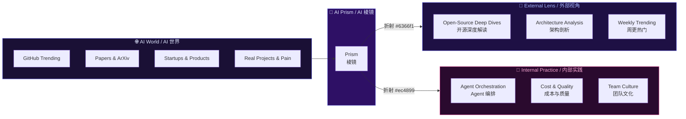
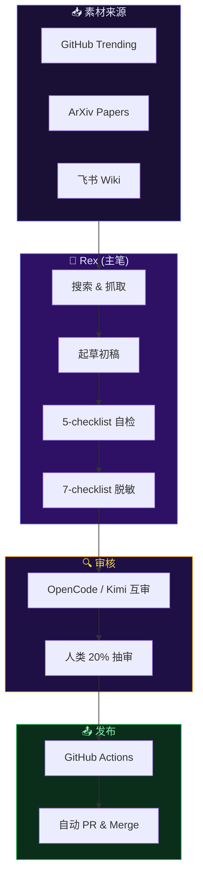

# 🔮 AI Prism / AI 棱镜



> **Two lenses, one prism — refracting the AI world through external insights and internal practice.**
>
> **两个棱面，一面棱镜 — 从外部洞见与内部实践折射 AI 世界。**

[](LICENSE)
[](#)
[](posts/external-lens/)
[](posts/yason-and-roberts/)

---

## 🌈 What is AI Prism? / 什么是 AI 棱镜？

**中文：** AI 棱镜是一个双语（中英）AI 日刊，通过两个棱面折射 AI 世界的光：

- 🔭 **外部视角 (External Lens)** — 每日一篇 AI 洞见：GitHub 开源项目深度解读、AI 技术架构剖析、AI 创业与痛点观察
- 🤖 **内部实践 (Internal Practice)** — 拟人化叙事系列「Yason 和他的罗伯特们」：一个人类和他的 AI Agent 团队的真实故事

**English:** AI Prism is a bilingual (ZH + EN) daily journal that refracts the AI world through two lenses:

- 🔭 **External Lens** — Daily AI insights: deep dives into GitHub open-source projects, AI architecture analysis, startup and pain-point observations
- 🤖 **Internal Practice** — The narrative series "Yason and His Roberts": the true story of a human and his AI agent team

---

## 🔮 The Prism Metaphor / 棱镜隐喻



---

## 📖 Table of Contents / 目录

### Part I: 🔭 External Lens / 第一部分：外部视角

> 每日 AI 业界洞见 — GitHub 开源项目深度解读、技术架构剖析、周更热门
>
> Daily AI industry insights — deep dives, architecture analysis, weekly trending

| Day | 主题 Topic | 中文 | English |
|-----|-----------|------|---------|
| 01 | Agent 屠榜 GitHub & 向量检索新瓶颈 | [中文](posts/external-lens/day-01.zh.md) | [EN](posts/external-lens/day-01.en.md) |
| 06 | Skills 生态 6 个值得 star 的项目 | [中文](posts/external-lens/day-06.zh.md) | [EN](posts/external-lens/day-06.en.md) |
| 07 | MCP 协议生态 5 个生产案例 | [中文](posts/external-lens/day-07.zh.md) | [EN](posts/external-lens/day-07.en.md) |
| 08 | 6 篇必读 Agent 论文 | [中文](posts/external-lens/day-08.zh.md) | [EN](posts/external-lens/day-08.en.md) |
| 09 | 8 个 Agent 框架工程实践横评 | [中文](posts/external-lens/day-09.zh.md) | [EN](posts/external-lens/day-09.en.md) |
| 10 | 2026.05.24 周更热门 AI 工具榜 | [中文](posts/external-lens/day-10.zh.md) | [EN](posts/external-lens/day-10.en.md) |
| 11 | 自建一个 MCP Server | [中文](posts/external-lens/day-11.zh.md) | [EN](posts/external-lens/day-11.en.md) |
| 12 | 写作 DNA 蒸馏 | [中文](posts/external-lens/day-12.zh.md) | [EN](posts/external-lens/day-12.en.md) |
| 13 | 通用 Agent 框架 6 选 1 | [中文](posts/external-lens/day-13.zh.md) | [EN](posts/external-lens/day-13.en.md) |
| 14 | 2026 H1 Agent 现状图 | [中文](posts/external-lens/day-14.zh.md) | [EN](posts/external-lens/day-14.en.md) |
| 15 | 2026.05.31 周更热门 AI 仓库 | [中文](posts/external-lens/day-15.zh.md) | [EN](posts/external-lens/day-15.en.md) |

---

### Part II: 🤖 Yason and His Roberts / 第二部分：Yason 和他的罗伯特们

> 一个人类和他的 AI Agent 团队的真实故事 — 从零到 7×24 的 14 个月
>
> The true story of a human and his AI agent team — 14 months from zero to 7×24

| Ch | 标题 Title | 中文 | 一句话 / One-liner |
|----|-----------|------|-------------------|
| 01 | 罗伯特初现 | [中文](posts/yason-and-roberts/ch01.zh.md) | 一个 AI 管理者的诞生 / The First Roberts — Birth of an AI Manager |
| 02 | 团队分工 | [中文](posts/yason-and-roberts/ch02.zh.md) | 生产、运营、协作 / Team Division — Production, Operations, Collaboration |
| 03 | 沟通体系 | [中文](posts/yason-and-roberts/ch03.zh.md) | 从 CLI 到大模型 / Communication — From CLI to LLM |
| 04 | 记忆系统 | [中文](posts/yason-and-roberts/ch04.zh.md) | 如何让 AI 记住一切 / Memory — How to Make AI Remember Everything |
| 05 | 吵架的艺术 | [中文](posts/yason-and-roberts/ch05.zh.md) | 多模型辩论让输出更可靠 / The Art of Debate — Multi-Model Deliberation |
| 06 | 成本与质量的走钢丝 | [中文](posts/yason-and-roberts/ch06.zh.md) | 用路由经济学榨干每分钱 / Cost vs Quality — Routing Economics |
| 07 | 给罗伯特派活 | [中文](posts/yason-and-roberts/ch07.zh.md) | 任务拆解与追踪 / Assigning Tasks — Decomposition & Tracking |
| 08 | 谁审罗伯特？ | [中文](posts/yason-and-roberts/ch08.zh.md) | 质量审查与验收机制 / Who Reviews Roberts? — QA & Acceptance |
| 09 | 不要让罗伯特乱跑 | [中文](posts/yason-and-roberts/ch09.zh.md) | 安全边界与权限控制 / Don't Let Roberts Run Wild — Security & Permissions |
| 10 | 罗伯特翻车了怎么办 | [中文](posts/yason-and-roberts/ch10.zh.md) | 故障恢复与兜底 / When Roberts Crash — Recovery & Fallback |
| 11 | 给罗伯特一把好工具 | [中文](posts/yason-and-roberts/ch11.zh.md) | 工具生态与 API 集成 / Good Tools — Ecosystem & API Integration |
| 12 | 罗伯特的大脑 | [中文](posts/yason-and-roberts/ch12.zh.md) | 知识库与记忆体系升级 / The Brain — Knowledge Base & Memory Upgrade |
| 13 | *(缺失 / Missing)* | — | — |
| 14 | 别烧冤枉钱 | [中文](posts/yason-and-roberts/ch14.zh.md) | 预算管理与成本控制 / Stop Burning Money — Budget & Cost Control |
| 15 | 罗伯特的文化建设 | [中文](posts/yason-and-roberts/ch15.zh.md) | 团队规范与行为准则 / Culture Building — Norms & Code of Conduct |
| 16 | 看穿罗伯特 | [中文](posts/yason-and-roberts/ch16.zh.md) | 可观测性与性能监控 / See Through Roberts — Observability & Monitoring |
| 17 | 罗伯特的"复仇者联盟" | [中文](posts/yason-and-roberts/ch17.zh.md) | 多 Agent 协同作战 / The Avengers — Multi-Agent Collaboration |
| 18 | 人往哪儿站 | [中文](posts/yason-and-roberts/ch18.zh.md) | 人机分工与创始人的自我管理 / Where Do Humans Stand? — Division of Labor |
| 19 | 让罗伯特变聪明 | [中文](posts/yason-and-roberts/ch19.zh.md) | 反馈循环与持续改进 / Make Roberts Smarter — Feedback Loops & Improvement |
| 20 | 高手进阶 | [中文](posts/yason-and-roberts/ch20.zh.md) | Prompt 工程、上下文管理与缓存技巧 / Advanced — Prompt Engineering, Context & Caching |
| 21 | 未来已来 | [中文](posts/yason-and-roberts/ch21.zh.md) | AI Agent 团队的下一阶段 / The Future Is Here — The Next Phase |

---

## 🎨 Visual Style / 视觉风格

**配色方案 / Color Palette：**

| 颜色 | Hex | 用途 |
|------|-----|------|
| 🔮 Indigo | `#6366f1` | 外部视角主色 / External Lens primary |
| 🤖 Pink | `#ec4899` | 内部实践主色 / Internal Practice primary |
| ✨ Amber | `#f59e0b` | 未来/高亮 / Future & highlights |
| 🌑 Dark | `#0f0b1a` | 背景 / Background |
| 🌙 Light | `#e0e7ff` | 文字 / Text |

**配图规范 / Illustration Standards：**
- 所有配图使用 **原创 SVG** — 矢量、可 git diff、GitHub 完美渲染
- viewBox: `1200×600` 或 `1000×500`
- 深色主题为主，浅色为辅
- 文件命名：`day-NN-描述.svg` 或 `NN-描述.svg`

---

## 📊 Some Numbers / 一些数字

| 指标 / Metric | 数值 / Value |
|--------------|-------------|
| 运营时长 / Operating | 14 个月 / months |
| 仓库 / Repos | 30+ (开源 + 闭源 / open + closed source) |
| 月均 PR | 380 |
| 代码行数 / Lines of Code | 30 万 / 300K |
| 月成本 / Monthly Cost | ¥6,300 |
| 常驻 Agent / Standing Agents | 7 台 |
| 应用 / Apps | 27+ |

---

## 📁 Repository Structure / 仓库结构

```
ai-prism/
├── README.md                          # 本文件 / This file
├── LICENSE                            # MIT
├── CONTRIBUTING.md                    # 贡献指南 / Contributing guide
├── .github/
│   └── workflows/
│       └── lint.yml                   # CI: 脱敏 + SVG 校验
├── assets/
│   ├── hero.svg                       # 🔮 仓库主图 / Repo hero image
│   ├── 01-*.svg ... 05-*.svg          # Part II 配图 / Part II illustrations
│   └── day-06-*.svg ... day-15-*.svg  # Part I 配图 / Part I illustrations
├── posts/
│   ├── external-lens/                 # 🔭 外部视角 / External Lens
│   │   ├── day-01.zh.md / .en.md     # (新内容 / New content)
│   │   └── day-06 ~ day-15            # (从 ai-insights 迁入)
│   └── yason-and-roberts/             # 🤖 内部实践 / Internal Practice
│       ├── ch01.zh.md ~ ch21.zh.md   # 21 章中文 / 21 chapters in Chinese
│       └── en/                        # (英文版 / English versions)
├── references/
│   ├── app-yaml/                      # App YAML schema 参考
│   ├── feishu-card/                   # 飞书卡片模板
│   ├── four-brain/                    # 四大脑架构参考
│   ├── kg-schema/                     # 知识图谱 schema
│   ├── templates/                     # 文章模板
│   └── review-pipeline.md            # 审核流水线文档
└── scripts/
    ├── call_brain.py                  # 调用大脑 API
    ├── pull_feishu_material.py        # 拉取飞书素材
    ├── rex_daily_post.sh              # Rex 日更脚本
    ├── rex_publish.sh                 # Rex 发布脚本
    ├── rex_review.sh                  # Rex 审核脚本
    ├── insights_review.sh             # External Lens 审核
    ├── split_bilingual.py             # 双语拆分工具
    └── validate_svg.py               # SVG 校验工具
```

---

## 🛠 Pipeline / 流水线



---

## ⚖️ Compliance / 合规底线

所有内容**必须**通过 7-checklist：

- [ ] **不违法** — 不涉及盗版、隐私、违禁内容
- [ ] **不引战** — 不涉及政治、敏感人物、宗教
- [ ] **不泄露** — 闭源项目名 / 客户名 / API key 全部脱敏
- [ ] **不夸大** — 项目评级必须有 GitHub 真实数据支撑
- [ ] **不抄袭** — 引用必须注明，大段复制使用 `> blockquote` 格式
- [ ] **不误导** — 评分公式公开，主观评价必须标注「我」
- [ ] **不刷屏** — 每天最多 1 篇，周末不更新

---

## 🤝 Contributing / 贡献

欢迎贡献！请阅读 [CONTRIBUTING.md](CONTRIBUTING.md) 了解详情。

**可投稿 / Accepted：**
- ✅ Agent 编排、调度、监控、成本控制等方法论
- ✅ 真实踩坑、复盘、反思
- ✅ 架构图、YAML schema、CI/CD 模板
- ✅ 外部视角的 AI 项目深度解读

**不投稿 / Not Accepted：**
- ❌ 闭源产品代码
- ❌ 付费 API 集成
- ❌ 内部组织信息、姓名、邮箱、凭据
- ❌ 任何可识别为"客户"或"用户"的数据

---

## 🙏 Acknowledgments / 致谢

- [OpenGithubs](https://github.com/OpenGithubs) — 排行数据源
- [EvanLi](https://github.com/EvanLi) — Top 100 列表
- [luo-junyu](https://github.com/luo-junyu) — Agent 论文分类
- [piglei](https://github.com/piglei) — 写作风格范本
- [Koalalive](https://github.com/Koalalive) / [wewrite](https://github.com/xtyseven8/wewrite) / [vibe-blog](https://github.com/datawhorechina/vibe-blog) — 写作 skill 范本

---

## 📜 License

[MIT](LICENSE) · 2026 MindApex

---

> **"AI 不会替代人，但会替代不会用 AI 的人。"**
> — MindApex Team, M14
