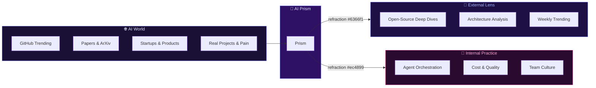
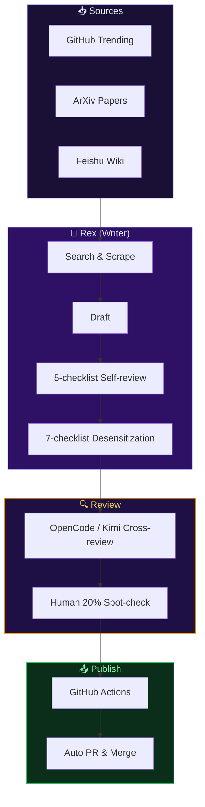

# 🔮 AI Prism

[English](./README.md) | [简体中文](./README.zh.md)


> **Two lenses, one prism — refracting the AI world through external insights and internal practice.**

[](LICENSE)
[](#)
[](posts/external-lens/en/)
[](posts/yason-and-roberts/en/)

---

## 🌈 What is AI Prism?

AI Prism is a bilingual (ZH + EN) daily journal that refracts the AI world through two lenses:

- 🔭 **External Lens** — Daily AI insights: deep dives into GitHub open-source projects, AI architecture analysis, startup and pain-point observations
- 🤖 **Internal Practice** — The narrative series "Yason and His Roberts": the true story of a human and his AI agent team

---

## 🔮 The Prism Metaphor



---

## 📖 Table of Contents

### Part I: 🔭 External Lens

> Daily AI industry insights — deep dives, architecture analysis, weekly trending

| Day | Topic | English | 中文 |
|-----|-------|---------|------|
| 01 | Agents Colonize GitHub & Vector Search Bottleneck | [EN](posts/external-lens/en/day-01.md) | [中文](posts/external-lens/zh/day-01.md) |
| 06 | 6 Skills Projects Worth Starring | [EN](posts/external-lens/en/day-06.md) | [中文](posts/external-lens/zh/day-06.md) |
| 07 | 5 MCP Protocol Production Cases | [EN](posts/external-lens/en/day-07.md) | [中文](posts/external-lens/zh/day-07.md) |
| 08 | 6 Must-Read Agent Papers | [EN](posts/external-lens/en/day-08.md) | [中文](posts/external-lens/zh/day-08.md) |
| 09 | 8 Agent Frameworks Engineering Comparison | [EN](posts/external-lens/en/day-09.md) | [中文](posts/external-lens/zh/day-09.md) |
| 10 | 2026.05.24 Weekly AI Tools | [EN](posts/external-lens/en/day-10.md) | [中文](posts/external-lens/zh/day-10.md) |
| 11 | Build Your Own MCP Server | [EN](posts/external-lens/en/day-11.md) | [中文](posts/external-lens/zh/day-11.md) |
| 12 | Writing DNA Distillation | [EN](posts/external-lens/en/day-12.md) | [中文](posts/external-lens/zh/day-12.md) |
| 13 | 6-in-1 General Agent Framework | [EN](posts/external-lens/en/day-13.md) | [中文](posts/external-lens/zh/day-13.md) |
| 14 | 2026 H1 Agent Landscape | [EN](posts/external-lens/en/day-14.md) | [中文](posts/external-lens/zh/day-14.md) |
| 15 | 2026.05.31 Weekly AI Repos | [EN](posts/external-lens/en/day-15.md) | [中文](posts/external-lens/zh/day-15.md) |
| 16 | Rust Revolution in Vector Search & Agent Skills Tipping Point | [EN](posts/external-lens/en/day-16.md) | [中文](posts/external-lens/zh/day-16.md) |

---

### Part II: 🤖 Yason and His Roberts

> The true story of a human and his AI agent team — 14 months from zero to 7×24

| Ch | Title | English | 中文 |
|----|-------|---------|------|
| 01 | The First Roberts — Birth of an AI Manager | [EN](posts/yason-and-roberts/en/ch01.md) | [中文](posts/yason-and-roberts/zh/ch01.md) |
| 02 | Team Division — Production, Operations, Collaboration | [EN](posts/yason-and-roberts/en/ch02.md) | [中文](posts/yason-and-roberts/zh/ch02.md) |
| 03 | Communication — From CLI to LLM | [EN](posts/yason-and-roberts/en/ch03.md) | [中文](posts/yason-and-roberts/zh/ch03.md) |
| 04 | Memory — How to Make AI Remember Everything | [EN](posts/yason-and-roberts/en/ch04.md) | [中文](posts/yason-and-roberts/zh/ch04.md) |
| 05 | The Art of Debate — Multi-Model Deliberation | [EN](posts/yason-and-roberts/en/ch05.md) | [中文](posts/yason-and-roberts/zh/ch05.md) |
| 06 | Cost vs Quality — Routing Economics | [EN](posts/yason-and-roberts/en/ch06.md) | [中文](posts/yason-and-roberts/zh/ch06.md) |
| 07 | Assigning Tasks — Decomposition & Tracking | [EN](posts/yason-and-roberts/en/ch07.md) | [中文](posts/yason-and-roberts/zh/ch07.md) |
| 08 | Who Reviews Roberts? — QA & Acceptance | [EN](posts/yason-and-roberts/en/ch08.md) | [中文](posts/yason-and-roberts/zh/ch08.md) |
| 09 | Don't Let Roberts Run Wild — Security & Permissions | [EN](posts/yason-and-roberts/en/ch09.md) | [中文](posts/yason-and-roberts/zh/ch09.md) |
| 10 | When Roberts Crash — Recovery & Fallback | [EN](posts/yason-and-roberts/en/ch10.md) | [中文](posts/yason-and-roberts/zh/ch10.md) |
| 11 | Good Tools — Ecosystem & API Integration | [EN](posts/yason-and-roberts/en/ch11.md) | [中文](posts/yason-and-roberts/zh/ch11.md) |
| 12 | The Brain — Knowledge Base & Memory Upgrade | [EN](posts/yason-and-roberts/en/ch12.md) | [中文](posts/yason-and-roberts/zh/ch12.md) |
| 13 | *(Missing)* | — | — |
| 14 | Stop Burning Money — Budget & Cost Control | [EN](posts/yason-and-roberts/en/ch14.md) | [中文](posts/yason-and-roberts/zh/ch14.md) |
| 15 | Culture Building — Norms & Code of Conduct | [EN](posts/yason-and-roberts/en/ch15.md) | [中文](posts/yason-and-roberts/zh/ch15.md) |
| 16 | See Through Roberts — Observability & Monitoring | [EN](posts/yason-and-roberts/en/ch16.md) | [中文](posts/yason-and-roberts/zh/ch16.md) |
| 17 | The Avengers — Multi-Agent Collaboration | [EN](posts/yason-and-roberts/en/ch17.md) | [中文](posts/yason-and-roberts/zh/ch17.md) |
| 18 | Where Do Humans Stand? — Division of Labor | [EN](posts/yason-and-roberts/en/ch18.md) | [中文](posts/yason-and-roberts/zh/ch18.md) |
| 19 | Make Roberts Smarter — Feedback Loops & Improvement | [EN](posts/yason-and-roberts/en/ch19.md) | [中文](posts/yason-and-roberts/zh/ch19.md) |
| 20 | Advanced — Prompt Engineering, Context & Caching | [EN](posts/yason-and-roberts/en/ch20.md) | [中文](posts/yason-and-roberts/zh/ch20.md) |
| 21 | The Future Is Here — The Next Phase | [EN](posts/yason-and-roberts/en/ch21.md) | [中文](posts/yason-and-roberts/zh/ch21.md) |

---

## 🎨 Visual Style

**Color Palette：**

| Color | Hex | Usage |
|-------|-----|-------|
| 🔮 Indigo | `#6366f1` | External Lens primary |
| 🤖 Pink | `#ec4899` | Internal Practice primary |
| ✨ Amber | `#f59e0b` | Future & highlights |
| 🌑 Dark | `#0f0b1a` | Background |
| 🌙 Light | `#e0e7ff` | Text |

**Illustration Standards：**
- All illustrations use **original SVG** — vector, git-diffable, GitHub-perfect rendering
- viewBox: `1200×600` or `1000×500`
- Dark theme primary, light theme secondary
- File naming: `day-NN-description.svg` or `NN-description.svg`

---

## 📊 Some Numbers

| Metric | Value |
|--------|-------|
| Operating | 14 months |
| Repos | 30+ (open + closed source) |
| Monthly PRs | 380 |
| Lines of Code | 300K |
| Monthly Cost | ¥6,300 |
| Standing Agents | 7 |
| Apps | 27+ |

---

## 📁 Repository Structure

```
ai-prism/
├── README.md                          # This file (English)
├── README.zh.md                       # 中文版 README
├── LICENSE                            # MIT
├── CONTRIBUTING.md                    # Contributing guide (English)
├── CONTRIBUTING.zh.md                 # 贡献指南 (中文)
├── .github/
│   └── workflows/
│       └── lint.yml                   # CI: desensitization + SVG validation
├── assets/
│   ├── hero.svg                       # 🔮 Repo hero image
│   ├── 01-*.svg ... 05-*.svg          # Part II illustrations
│   └── day-06-*.svg ... day-15-*.svg  # Part I illustrations
├── posts/
│   ├── external-lens/                 # 🔭 External Lens
│   │   ├── en/                        # English versions
│   │   │   ├── day-01.md
│   │   │   └── day-06.md ~ day-16.md
│   │   └── zh/                        # 中文版
│   │       ├── day-01.md
│   │       └── day-06.md ~ day-16.md
│   └── yason-and-roberts/             # 🤖 Internal Practice
│       ├── en/                        # English versions
│       │   └── ch01.md ~ ch21.md
│       └── zh/                        # 中文版
│           └── ch01.md ~ ch21.md
├── references/
│   ├── app-yaml/                      # App YAML schema reference
│   ├── feishu-card/                   # Feishu card templates
│   ├── four-brain/                    # Four-brain architecture reference
│   ├── kg-schema/                     # Knowledge graph schema
│   ├── templates/                     # Post templates
│   └── review-pipeline.md            # Review pipeline docs
└── scripts/
    ├── call_brain.py                  # Brain API calls
    ├── pull_feishu_material.py        # Pull Feishu materials
    ├── rex_daily_post.sh              # Rex daily post script
    ├── rex_publish.sh                 # Rex publish script
    ├── rex_review.sh                  # Rex review script
    ├── insights_review.sh             # External Lens review
    ├── split_bilingual.py             # Bilingual split tool
    └── validate_svg.py               # SVG validation tool
```

---

## 🛠 Pipeline



---

## ⚖️ Compliance

All content **must** pass the 7-checklist:

- [ ] **Legal** — No piracy, privacy violations, or prohibited content
- [ ] **No flame wars** — No politics, sensitive figures, or religion
- [ ] **No leaks** — Closed-source project names, client names, and API keys must be desensitized
- [ ] **No exaggeration** — Project ratings must be backed by real GitHub data
- [ ] **No plagiarism** — Citations required; large quotes use `> blockquote` format
- [ ] **No misleading** — Scoring formulas are public; subjective opinions must be marked with "I"
- [ ] **No spam** — Max 1 post per day, no updates on weekends

---

## 🤝 Contributing

Contributions welcome! Please read [CONTRIBUTING.md](CONTRIBUTING.md) for details.

**Accepted：**
- ✅ Agent orchestration, scheduling, monitoring, cost control methodologies
- ✅ Real-world lessons learned, retrospectives, reflections
- ✅ Architecture diagrams, YAML schemas, CI/CD templates
- ✅ External Lens AI project deep dives

**Not Accepted：**
- ❌ Closed-source product code
- ❌ Paid API integrations
- ❌ Internal org info, names, emails, credentials
- ❌ Any data identifiable as "customer" or "user"

---

## 🙏 Acknowledgments

- [OpenGithubs](https://github.com/OpenGithubs) — Ranking data source
- [EvanLi](https://github.com/EvanLi) — Top 100 list
- [luo-junyu](https://github.com/luo-junyu) — Agent paper classification
- [piglei](https://github.com/piglei) — Writing style reference
- [Koalalive](https://github.com/Koalalive) / [wewrite](https://github.com/xtyseven8/wewrite) / [vibe-blog](https://github.com/datawhorechina/vibe-blog) — Writing skill references

---

## 📜 License

[MIT](LICENSE) · 2026 MindApex

---

> **"AI won't replace people, but it will replace people who don't use AI."**
> — MindApex Team, M14
