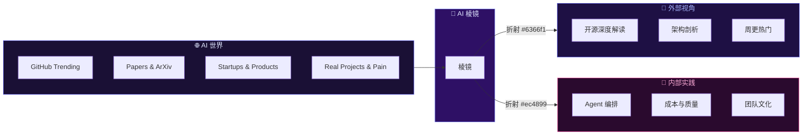

# 🔮 AI 棱镜

[English](./README.md) | [简体中文](./README.zh.md)

> **两个棱面，一面棱镜 — 从外部洞见与内部实践折射 AI 世界。**

---

## 🌈 什么是 AI 棱镜？

AI 棱镜是一个双语（中英）AI 日刊，通过两个棱面折射 AI 世界的光：

- 🔭 **外部视角 (External Lens)** — 每日一篇 AI 洞见：GitHub 开源项目深度解读、AI 技术架构剖析、AI 创业与痛点观察
- 🤖 **内部实践 (Internal Practice)** — 拟人化叙事系列「Yason 和他的罗伯特们」：一个人类和他的 AI Agent 团队的真实故事

---

## 🔮 棱镜隐喻

---

## 📖 目录

### 第一部分：🔭 外部视角

> 每日 AI 业界洞见 — GitHub 开源项目深度解读、技术架构剖析、周更热门

| Day | 主题 | 中文 | English |
|-----|------|------|---------|
| 01 | Agent 屠榜 GitHub & 向量检索新瓶颈 | [中文](posts/external-lens/zh/day-01.md) | [EN](posts/external-lens/en/day-01.md) |
| 06 | Skills 生态 6 个值得 star 的项目 | [中文](posts/external-lens/zh/day-06.md) | [EN](posts/external-lens/en/day-06.md) |
| 07 | MCP 协议生态 5 个生产案例 | [中文](posts/external-lens/zh/day-07.md) | [EN](posts/external-lens/en/day-07.md) |
| 08 | 6 篇必读 Agent 论文 | [中文](posts/external-lens/zh/day-08.md) | [EN](posts/external-lens/en/day-08.md) |
| 09 | 8 个 Agent 框架工程实践横评 | [中文](posts/external-lens/zh/day-09.md) | [EN](posts/external-lens/en/day-09.md) |
| 10 | 2026.05.24 周更热门 AI 工具榜 | [中文](posts/external-lens/zh/day-10.md) | [EN](posts/external-lens/en/day-10.md) |
| 11 | 自建一个 MCP Server | [中文](posts/external-lens/zh/day-11.md) | [EN](posts/external-lens/en/day-11.md) |
| 12 | 写作 DNA 蒸馏 | [中文](posts/external-lens/zh/day-12.md) | [EN](posts/external-lens/en/day-12.md) |
| 13 | 通用 Agent 框架 6 选 1 | [中文](posts/external-lens/zh/day-13.md) | [EN](posts/external-lens/en/day-13.md) |
| 14 | 2026 H1 Agent 现状图 | [中文](posts/external-lens/zh/day-14.md) | [EN](posts/external-lens/en/day-14.md) |
| 15 | 2026.05.31 周更热门 AI 仓库 | [中文](posts/external-lens/zh/day-15.md) | [EN](posts/external-lens/en/day-15.md) |
| 16 | 向量检索的 Rust 革命 & Agent Skills 爆发临界点 | [中文](posts/external-lens/zh/day-16.md) | [EN](posts/external-lens/en/day-16.md) |

---

### 第二部分：🤖 Yason 和他的罗伯特们

> 一个人类和他的 AI Agent 团队的真实故事 — 从零到 7×24 的 14 个月

| Ch | 标题 | 中文 | English |
|----|------|------|---------|
| 01 | 罗伯特初现 — 一个 AI 管理者的诞生 | [中文](posts/yason-and-roberts/zh/ch01.md) | [EN](posts/yason-and-roberts/en/ch01.md) |
| 02 | 团队分工 — 生产、运营、协作 | [中文](posts/yason-and-roberts/zh/ch02.md) | [EN](posts/yason-and-roberts/en/ch02.md) |
| 03 | 沟通体系 — 从 CLI 到大模型 | [中文](posts/yason-and-roberts/zh/ch03.md) | [EN](posts/yason-and-roberts/en/ch03.md) |
| 04 | 记忆系统 — 如何让 AI 记住一切 | [中文](posts/yason-and-roberts/zh/ch04.md) | [EN](posts/yason-and-roberts/en/ch04.md) |
| 05 | 吵架的艺术 — 多模型辩论让输出更可靠 | [中文](posts/yason-and-roberts/zh/ch05.md) | [EN](posts/yason-and-roberts/en/ch05.md) |
| 06 | 成本与质量的走钢丝 — 用路由经济学榨干每分钱 | [中文](posts/yason-and-roberts/zh/ch06.md) | [EN](posts/yason-and-roberts/en/ch06.md) |
| 07 | 给罗伯特派活 — 任务拆解与追踪 | [中文](posts/yason-and-roberts/zh/ch07.md) | [EN](posts/yason-and-roberts/en/ch07.md) |
| 08 | 谁审罗伯特？ — 质量审查与验收机制 | [中文](posts/yason-and-roberts/zh/ch08.md) | [EN](posts/yason-and-roberts/en/ch08.md) |
| 09 | 不要让罗伯特乱跑 — 安全边界与权限控制 | [中文](posts/yason-and-roberts/zh/ch09.md) | [EN](posts/yason-and-roberts/en/ch09.md) |
| 10 | 罗伯特翻车了怎么办 — 故障恢复与兜底 | [中文](posts/yason-and-roberts/zh/ch10.md) | [EN](posts/yason-and-roberts/en/ch10.md) |
| 11 | 给罗伯特一把好工具 — 工具生态与 API 集成 | [中文](posts/yason-and-roberts/zh/ch11.md) | [EN](posts/yason-and-roberts/en/ch11.md) |
| 12 | 罗伯特的大脑 — 知识库与记忆体系升级 | [中文](posts/yason-and-roberts/zh/ch12.md) | [EN](posts/yason-and-roberts/en/ch12.md) |
| 13 | *(缺失)* | — | — |
| 14 | 别烧冤枉钱 — 预算管理与成本控制 | [中文](posts/yason-and-roberts/zh/ch14.md) | [EN](posts/yason-and-roberts/en/ch14.md) |
| 15 | 罗伯特的文化建设 — 团队规范与行为准则 | [中文](posts/yason-and-roberts/zh/ch15.md) | [EN](posts/yason-and-roberts/en/ch15.md) |
| 16 | 看穿罗伯特 — 可观测性与性能监控 | [中文](posts/yason-and-roberts/zh/ch16.md) | [EN](posts/yason-and-roberts/en/ch16.md) |
| 17 | 罗伯特的"复仇者联盟" — 多 Agent 协同作战 | [中文](posts/yason-and-roberts/zh/ch17.md) | [EN](posts/yason-and-roberts/en/ch17.md) |
| 18 | 人往哪儿站 — 人机分工与创始人的自我管理 | [中文](posts/yason-and-roberts/zh/ch18.md) | [EN](posts/yason-and-roberts/en/ch18.md) |
| 19 | 让罗伯特变聪明 — 反馈循环与持续改进 | [中文](posts/yason-and-roberts/zh/ch19.md) | [EN](posts/yason-and-roberts/en/ch19.md) |
| 20 | 高手进阶 — Prompt 工程、上下文管理与缓存技巧 | [中文](posts/yason-and-roberts/zh/ch20.md) | [EN](posts/yason-and-roberts/en/ch20.md) |
| 21 | 未来已来 — AI Agent 团队的下一阶段 | [中文](posts/yason-and-roberts/zh/ch21.md) | [EN](posts/yason-and-roberts/en/ch21.md) |

---

## 📜 License

[MIT](LICENSE) · 2026

---

> **"AI 不会替代人，但会替代不会用 AI 的人。"**
