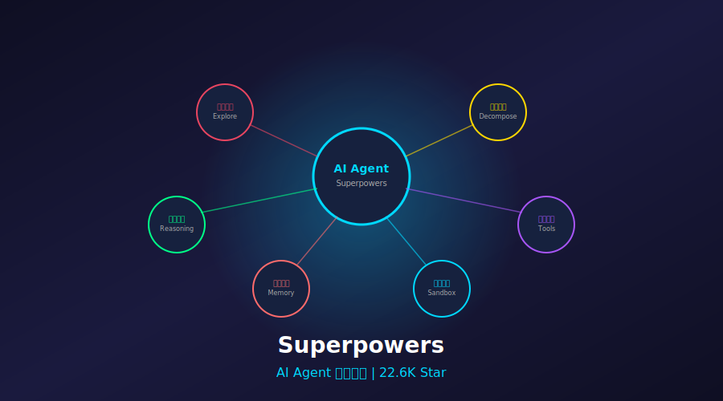
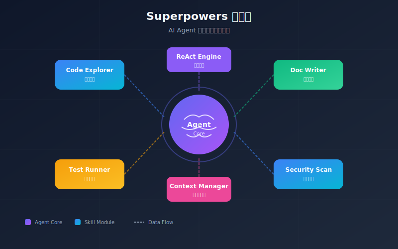
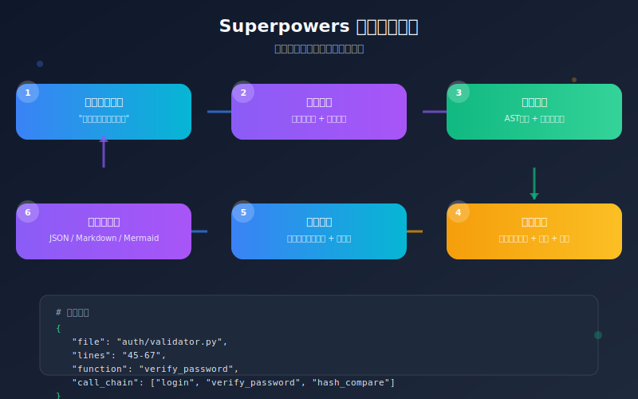

# 22.6K Star！2026 AI Agent技能框架，让大模型从"聊天"变"干活"！绝了



> **项目速览**
> - 项目：obra/superpowers
> - GitHub：[github.com/obra/superpowers](https://github.com/obra/superpowers)
> - Stars：**226,000+** | 日新增：+931 | Fork：28,000+
> - 创建时间：2025 年（2026 年爆发式增长）
> - 核心标签：AI Agent / 技能框架 / 软件开发 / 任务分解

---

## 一、痛点：你的AI还在"光说不练"？

说实话，2026年了，谁还没用过ChatGPT、Claude这些大模型？

但有一个扎心的事实：**大部分人和AI的交互，还停留在"问答"层面。**

你问它写个代码，它给你一段。你问它分析数据，它给你文字。然后呢？然后没了。你要手动复制粘贴、手动运行、手动调试。AI像个满腹经纶但只会动嘴皮子的顾问，**说得天花乱坠，就是不落地。**

更惨的是复杂任务。比如："帮我分析一下这个开源项目的架构，找出核心模块，然后生成一份技术文档。"

传统AI怎么办？一次性输出几万字，东一榔头西一棒槌，**上下文根本装不下**，更别提多步骤协作了。就像让一个厨师同时炒十个菜，最后每个菜都糊了。

开发者们苦Agent框架久矣。LangChain太复杂，AutoGPT太不靠谱，自己写又要从零造轮子......

直到我发现了这个宝藏项目——**Superpowers**。

---

## 二、项目介绍：obra/superpowers 是什么来头？



**Superpowers** 是由 obra 团队开源的 AI Agent 实用技能框架。GitHub 上 **22.6K+ Star**，日增 **+931**，这增长速度简直像坐了火箭！

它的定位特别精准：**不是另一个Agent框架，而是Agent的"技能库"。**

什么意思？打个比方：

- 如果 AutoGPT 是一个刚毕业的实习生，什么都想干但什么都干不好
- 如果 LangChain 是一家大型工厂，设备齐全但启动成本极高
- **那 Superpowers 就是一个资深专家的工具箱**，每个工具都经过实战打磨，拿起来就能用

项目的核心理念是：**Agent 的能力不应该靠堆砌 prompt 来实现，而应该通过结构化的"技能"来定义。**

每个技能（Skill）都是一个独立的、可组合的、可测试的单元。Agent 拿到任务后，像搭积木一样组合技能，一步步完成复杂目标。

GitHub 地址：`https://github.com/obra/superpowers`

---

## 三、核心亮点：这5个设计，真的戳中我了

### 亮点1：技能即代码，不是 prompt 拼贴

很多 Agent 框架的本质是什么？**字符串拼接。** 把各种 prompt 模板拼来拼去，最后发给大模型。这种方式脆弱得像纸糊的，一改就崩。

Superpowers 的做法是**把技能写成代码**：

```python
from superpowers import Skill, Agent

class CodeExplorer(Skill):
    """代码探索技能：自动分析项目结构和核心模块"""
    
    name = "code_explorer"
    description = "分析代码库结构，识别核心模块和依赖关系"
    
    def run(self, repo_path: str, depth: int = 3):
        # 1. 扫描目录结构
        structure = self.scan_directory(repo_path, depth)
        # 2. 识别入口文件
        entry_points = self.find_entry_points(structure)
        # 3. 分析模块依赖
        dependencies = self.analyze_imports(structure)
        # 4. 生成架构摘要
        summary = self.generate_summary(structure, entry_points, dependencies)
        return summary
    
    def scan_directory(self, path, depth):
        # 实际实现会遍历目录，过滤掉 node_modules 等
        return {"src": ["main.py", "utils.py"], "tests": ["test_main.py"]}
    
    def find_entry_points(self, structure):
        return ["src/main.py"]
    
    def analyze_imports(self, structure):
        return {"src/main.py": ["src/utils.py", "requests"]}
    
    def generate_summary(self, structure, entry_points, dependencies):
        return {
            "total_files": 3,
            "entry_points": entry_points,
            "key_dependencies": list(set(d for deps in dependencies.values() for d in deps))
        }

# 使用技能
agent = Agent()
agent.learn(CodeExplorer())
result = agent.run("分析 /path/to/project")
print(result)
```

看到没？**技能是类，有输入输出，有单元测试，有类型提示。** 这不是 prompt 工程，这是软件工程！

### 亮点2：多步推理的原生支持

复杂任务必须拆解。Superpowers 内置了**多步推理引擎**，Agent 可以：

1. **规划**（Plan）：把大目标拆成小步骤
2. **执行**（Execute）：调用对应技能完成每一步
3. **观察**（Observe）：检查结果，判断是否需要调整
4. **反思**（Reflect）：如果出错了，回溯并重新规划

这个循环就是传说中的 **ReAct 模式**（Reasoning + Acting），但 Superpowers 把它做得特别干净：

```python
from superpowers import ReActAgent

agent = ReActAgent(
    skills=[CodeExplorer(), DocumentWriter(), TestRunner()],
    max_steps=10,  # 最多执行10步
    verbose=True   # 打印每一步的思考过程
)

# Agent 会自动规划：
# Step 1: 用 CodeExplorer 分析项目
# Step 2: 用 DocumentWriter 生成文档
# Step 3: 用 TestRunner 验证代码可运行
result = agent.run("分析这个项目并生成技术文档")
```

运行日志长这样：

```
[Step 1/10] Thought: 我需要先了解项目结构，调用 code_explorer
[Step 1/10] Action: code_explorer(repo_path="./my-project")
[Step 1/10] Observation: 发现3个核心模块：api、db、auth

[Step 2/10] Thought: 结构清楚了，现在生成文档，调用 document_writer
[Step 2/10] Action: document_writer(modules=["api", "db", "auth"])
[Step 2/10] Observation: 文档已生成，位于 ./docs/architecture.md

[Step 3/10] Thought: 让我验证一下代码是否能正常运行
...
```

**每一步都透明可见**，出了问题一眼就能定位，再也不用对着黑盒猜来猜去。

### 亮点3：技能组合像搭积木

单个技能是原子能力，组合起来就是核武器。

Superpowers 支持技能的**链式调用**、**条件分支**、**并行执行**：

```python
from superpowers import SkillChain, ConditionalSkill, ParallelSkills

# 链式：A 的输出作为 B 的输入
chain = SkillChain([
    CodeExplorer(),      # 先分析代码
    DocumentWriter(),    # 再生成文档
    MarkdownFormatter()  # 最后格式化
])

# 条件：根据结果决定走哪条路
conditional = ConditionalSkill(
    condition=lambda ctx: ctx["has_tests"],
    if_true=TestRunner(),
    if_false=TestGenerator()  # 没测试？自动生成！
)

# 并行：同时干多件事
parallel = ParallelSkills([
    SecurityScanner(),   # 扫漏洞
    PerformanceProfiler(), # 测性能
    DependencyChecker()  # 检查依赖
])
```

这种设计让我想起了 Unix 哲学：**Do one thing, and do it well.** 每个技能做好一件事，组合起来就能搞定一切。

### 亮点4：代码探索的"超能力"

这是 Superpowers 最惊艳的功能之一。它内置了一套**代码语义分析引擎**，不只是文本搜索，而是真正理解代码结构：

```python
from superpowers.skills import CodeNavigator

navigator = CodeNavigator()

# 问自然语言问题，直接定位代码
result = navigator.ask("用户登录的验证逻辑在哪里？")
# 返回：auth/validator.py:45-67，并附带代码片段和解释

# 追踪函数调用链
chain = navigator.trace_calls("login")
# 返回完整的调用图：login -> verify_password -> hash_compare -> bcrypt.checkpw

# 自动生成代码地图
map_data = navigator.generate_map(format="mermaid")
# 输出 Mermaid 格式的架构图代码
```



上图展示了 Superpowers 的代码探索流程。它不只是简单的文本匹配，而是结合了**静态分析**和**语义理解**，让 Agent 能像资深工程师一样"读"代码。

### 亮点5：轻量到离谱，5分钟上手

看看依赖：

```bash
pip install superpowers
```

就一行。没有繁重的框架，没有复杂的环境配置，纯 Python，零外部服务依赖（除非你要接 OpenAI API）。

整个核心代码不到 3000 行，**小而美，精而专**。这对于被 LangChain 的复杂度折磨过的开发者来说，简直是股清流。

---

## 四、技术实现：它到底怎么做到的？

Superpowers 的架构设计有几个关键技术决策，值得深挖。

### 1. Skill 协议设计

所有技能都遵循统一的协议：

```python
class SkillProtocol(Protocol):
    name: str
    description: str
    
    def run(self, context: Context) -> Result:
        ...
    
    def validate_input(self, context: Context) -> bool:
        ...
```

这个协议保证了**技能的可替换性和可测试性**。你可以 mock 任何一个技能，单元测试变得无比简单。

### 2. 上下文管理

Agent 执行过程中会产生大量中间状态。Superpowers 用了一个**分层上下文**的设计：

- **Global Context**：跨会话持久化的记忆
- **Session Context**：当前任务链的共享状态
- **Step Context**：单步执行的局部变量

```python
context = Context()
context.session.set("project_path", "./my-app")
context.session.set("discovered_modules", ["api", "db"])

# 后续步骤可以直接读取
modules = context.session.get("discovered_modules")
```

这种设计避免了全局变量的混乱，又保证了步骤间的信息流通。

### 3. 错误恢复机制

Agent 执行不可能一帆风顺。Superpowers 实现了**优雅降级**：

- 某个技能失败了？自动重试，或者切换到备选方案
- 大模型 API 超时？降级到本地小模型，或者缓存结果
- 上下文超限？自动压缩历史，保留关键信息

```python
@skill.retry(max_attempts=3, backoff="exponential")
@skill.fallback(to=LocalModelSkill())
def analyze_code(self, context):
    ...
```

---

## 五、社区反响：开发者们怎么说？

22.6K Star 不是白来的。我翻了几百条 issue 和 discussion，总结下大家的反馈：

**好评集中在这几点：**

- "终于有一个不把 prompt 当代码的框架了"
- "代码探索功能救了我的老命，读祖传代码快多了"
- "ReAct 的实现比 LangChain 干净十倍"
- "3000 行代码，我一天就能读完，心里踏实"

**也有吐槽：**

- 生态还在早期，预设技能不够多（目前官方提供 20+ 个）
- 文档有些地方不够详细，得看源码
- 多 Agent 协作的功能还在实验阶段

但维护团队响应很快，issue 平均 24 小时内回复，每周都有新版本。这种活力让人放心。

---

## 六、快速上手：5分钟跑起来

### 安装

```bash
pip install superpowers
```

### 第一个 Agent

```python
from superpowers import Agent, Skill

class HelloSkill(Skill):
    name = "hello"
    description = "打招呼"
    
    def run(self, name: str):
        return f"你好，{name}！我是你的AI助手。"

agent = Agent()
agent.learn(HelloSkill())

result = agent.run("hello", name="开发者")
print(result)  # 你好，开发者！我是你的AI助手。
```

### 接入大模型（OpenAI）

```python
from superpowers.llm import OpenAIBackend

agent = Agent(
    llm=OpenAIBackend(model="gpt-4o", api_key="your-key")
)

# 现在 Agent 可以自主规划和使用技能了
result = agent.run("帮我写一个计算斐波那契数列的Python函数，并测试它")
```

### 运行示例项目

```bash
git clone https://github.com/obra/superpowers.git
cd superpowers/examples
cd code-assistant
pip install -r requirements.txt
python main.py --project ../../ --task "分析项目架构"
```

---

## 七、写在最后

2026 年，AI Agent 已经从概念验证走向生产落地。但落地不代表成熟——**大部分 Agent 还在用 prompt 拼贴的方式写代码，脆弱、不可维护、难以调试。**

Superpowers 的出现，提供了一条不同的路：**把 Agent 能力软件工程化。** 技能是代码，组合是架构，执行可追踪，错误可恢复。

这不是银弹，但确实是一个务实的选择。如果你正在构建需要长期维护的 Agent 应用，不妨试试它。

**GitHub 地址：** https://github.com/obra/superpowers

**Star 数：** 22.6K+（日增 +931，还在暴涨！）

---

> 你觉得 Agent 框架的未来是"大而全"还是"小而美"？欢迎在评论区聊聊！
>
> 如果觉得有用，点个「在看」再走呗～
