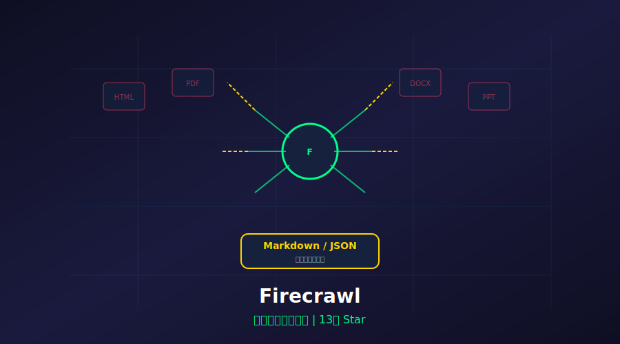
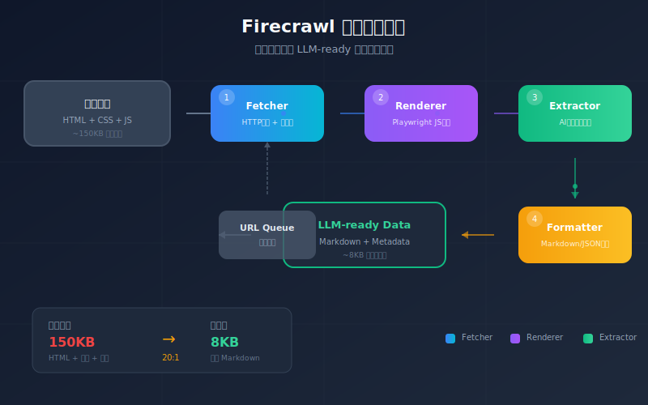
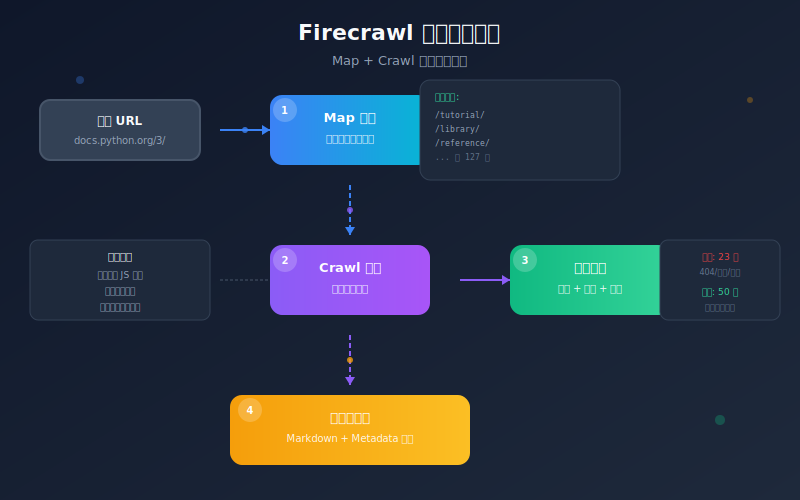

# 13万Star！2026网页数据基础设施，把任意网页变成AI的"口粮"！太香了



> **项目速览**
> - 项目：Firecrawl
> - GitHub：[github.com/firecrawl](https://github.com/firecrawl)
> - Stars：**130,000+** | 全球前100仓库 | Fork：15,000+
> - 创建时间：2024 年（YC 孵化项目）
> - 核心标签：网页抓取 / 数据基础设施 / MCP / RAG

---

## 一、痛点：网页数据这碗饭，AI根本咽不下去

你有没有遇到过这种情况？

想做个AI知识库，手里有一堆网页链接。复制粘贴吧，格式全乱了；写爬虫吧，反爬机制把你当贼防；用现成的API吧，贵得离谱还限流。

更崩溃的是，现在的网页越来越"花里胡哨"：

- JavaScript 渲染的 SPA，传统爬虫抓下来一堆空壳
- 无限滚动加载，翻页逻辑千奇百怪
- 内容藏在 iframe 里，像俄罗斯套娃
- 反爬手段层出不穷：验证码、IP封禁、行为检测...

**AI 模型再聪明，喂给它的是垃圾，吐出来的也只能是垃圾。**

RAG（检索增强生成）火了一整年，但大家都忽略了一个前提：你的数据质量够好吗？

把一堆 HTML 标签、广告弹窗、导航栏塞给向量数据库，检索出来的内容能准才怪。就像让米其林大厨用过期食材做菜，手艺再好也白搭。

直到我挖到了这个 YC 孵化的宝藏项目——**Firecrawl**。

---

## 二、项目介绍：Firecrawl 到底是什么神仙工具？



**Firecrawl** 是一个开源的网页数据基础设施项目，GitHub 上 **13万+ Star**，跻身全球前100仓库！这成绩，妥妥的顶流。

它的口号特别直白：**"Turn any website into LLM-ready data"**（把任意网站变成大模型就绪的数据）。

翻译成人话：你扔给它一个 URL，它还你一份干净、结构化、AI友好的数据。就像一台**网页洗衣机**，脏衣服进去，白衬衫出来。

项目背景也很硬：YC 孵化（就是孵化了 Airbnb、Dropbox 那家），团队来自 Google、Stripe。不是草台班子，是正经的硅谷正规军。

GitHub 地址：`https://github.com/mendableai/firecrawl`

---

## 三、核心亮点：这4个功能，直接解决我的数据焦虑

### 亮点1：一键清洗，HTML变Markdown

这是 Firecrawl 的看家本领。你给它一个网页，它自动：

1. **抓取**：处理 JS 渲染、等待动态加载
2. **清洗**：去掉广告、导航、页脚、弹窗
3. **结构化**：把正文转成干净的 Markdown
4. **分块**：按语义切分，方便向量存储

```python
from firecrawl import FirecrawlApp

app = FirecrawlApp(api_key="your-api-key")

# 抓取单个页面
result = app.scrape_url("https://docs.python.org/3/tutorial/")

print(result['markdown'])
# 输出：
# # The Python Tutorial
# Python is an easy to learn, powerful programming language...
# 干净！没有广告，没有侧边栏，没有"返回顶部"按钮
```

对比一下原始 HTML 和 Firecrawl 的输出：

```python
# 原始 HTML（约 150KB）
<html>
  <head>...</head>
  <body>
    <nav>50个导航链接...</nav>
    <div class="ad-banner">广告...</div>
    <main>
      <article>真正想要的内容...</article>
    </main>
    <footer>30个页脚链接...</footer>
    <script>10个追踪脚本...</script>
  </body>
</html>

# Firecrawl 输出（约 8KB）
# The Python Tutorial
# Python is an easy to learn...
# ## Using the Python Interpreter
# ...
```

**压缩率接近 20:1**，而且全是有效信息。这省下的不仅是存储空间，更是向量检索的准确率。

### 亮点2：整站抓取，像蜘蛛一样爬遍每个角落

单页抓取只是开胃菜，Firecrawl 的 **Map + Crawl** 组合才是真正的核武器。

```python
# 1. 先"地图"整个网站：找出所有有效链接
map_result = app.map_url("https://docs.python.org/3/")
# 返回：['https://docs.python.org/3/tutorial/', 'https://docs.python.org/3/library/', ...]

# 2. 再批量抓取
 crawl_result = app.crawl_url(
    "https://docs.python.org/3/",
    params={
        "limit": 100,           # 最多抓100页
        "scrapeOptions": {
            "formats": ["markdown", "html"]
        }
    }
)

# 返回一个包含所有页面结构化数据的数组
for page in crawl_result['data']:
    print(f"URL: {page['metadata']['sourceURL']}")
    print(f"标题: {page['metadata']['title']}")
    print(f"内容长度: {len(page['markdown'])} 字符")
```

更绝的是它的**智能去重和过滤**：

- 自动跳过重复内容（比如打印版页面、移动端页面）
- 识别并排除 404、500 等错误页面
- 根据 URL 模式过滤（只抓 `/docs/` 下的内容）
- 支持深度限制（只抓 3 层链接）



上图展示了 Firecrawl 的完整抓取流程。从种子 URL 开始，它会像真正的蜘蛛一样在网页间游走，但每一步都经过智能筛选，确保只带回有价值的内容。

### 亮点3：LLM-ready 输出格式

Firecrawl 不只是清洗数据，它是**为 AI 场景量身定制的**：

```python
# 多种输出格式可选
result = app.scrape_url(
    "https://example.com/article",
    params={
        "formats": ["markdown", "html", "screenshot", "links"],
        "onlyMainContent": True,  # 只保留主要内容
        "includeTags": ["h1", "h2", "p", "code"],  # 只保留这些标签
        "excludeTags": ["nav", "footer", "aside"]
    }
)

# 返回结构
{
    "markdown": "# 标题\n正文内容...",
    "html": "<h1>标题</h1><p>正文...</p>",
    "metadata": {
        "title": "文章标题",
        "description": "SEO描述",
        "sourceURL": "https://example.com/article",
        "ogImage": "https://example.com/image.jpg"
    },
    "screenshot": "base64编码的截图",
    "links": {
        "internal": [...],
        "external": [...]
    }
}
```

看到没？**metadata 自动提取**，截图自动生成，链接自动分类。这些数据直接就能喂给向量数据库，或者作为 RAG 的上下文。

### 亮点4：反反爬的专家级处理

做爬虫的都知道，现在的网站防你跟防贼似的。Firecrawl 内置了一整套**反反爬武器库**：

```python
result = app.scrape_url(
    "https://hard-to-scrape-site.com",
    params={
        # 模拟真实浏览器
        "headers": {
            "User-Agent": "Mozilla/5.0 (Windows NT 10.0; Win64; x64)...",
            "Accept-Language": "zh-CN,zh;q=0.9"
        },
        # 等待 JS 渲染完成
        "waitFor": 2000,  # 等待 2 秒
        # 处理无限滚动
        "scroll": True,
        # 绕过简单反爬
        "proxy": {
            "country": "US",  # 使用美国 IP
            "type": "residential"  # 住宅 IP 更难被封
        }
    }
)
```

更高级的功能还包括：

- **自动重试**：遇到 429 自动退避，遇到 503 自动重试
- **Cookie 管理**：自动处理登录态
- **CAPTCHA 识别**：集成第三方服务处理验证码
- **动态渲染**：基于 Playwright 的真实浏览器渲染

---

## 四、技术实现：它怎么做到这么强的？

Firecrawl 的架构设计有几个关键点：

### 1. 分层抓取架构

```
URL Queue -> Fetcher -> Renderer -> Extractor -> Formatter -> Output
```

- **Fetcher**：负责 HTTP 请求，处理重定向、压缩、缓存
- **Renderer**：基于 Playwright 的浏览器引擎，执行 JS、等待 AJAX
- **Extractor**：AI 驱动的内容提取，识别正文区域
- **Formatter**：按指定格式输出（Markdown、JSON 等）

### 2. AI 驱动的内容识别

Firecrawl 不是用简单的 DOM 选择器提取内容（那种方式一换模板就崩）。它用了一套**机器学习模型**来判断：

- 这块区域是正文还是广告？
- 这个列表是导航还是内容？
- 这段文字是作者信息还是免责声明？

```python
# 甚至可以自定义提取规则
result = app.scrape_url(
    "https://example.com/products",
    params={
        "extract": {
            "schema": {
                "type": "object",
                "properties": {
                    "product_name": {"type": "string"},
                    "price": {"type": "string"},
                    "features": {"type": "array", "items": {"type": "string"}}
                }
            }
        }
    }
)
# 返回结构化的产品信息，而不是整页文本
```

### 3. 分布式抓取

对于大规模任务，Firecrawl 支持分布式部署：

```bash
# 使用 Docker 部署本地集群
docker-compose up -d

# 或者直接用云托管版本（有免费额度）
```

云版本自动处理：

- 负载均衡
- IP 轮换
- 速率限制
- 任务队列

---

## 五、社区反响：13万Star背后的真实声音

翻了一圈 GitHub Issues 和 Reddit 讨论，总结下大家的真实反馈：

**好评如潮：**

- "终于不用自己维护爬虫了，Firecrawl 帮我省了 3 个工程师"
- "清洗效果吊打 BeautifulSoup + 手写规则，AI 提取太准了"
- "YC 出品确实稳，API 稳定性 99.9%"
- "从 Puppeteer 迁移过来，代码量少了 80%"

**吐槽也有：**

- 免费额度对大规模项目不够用（每月 500 credits）
- 某些极端复杂的 SPA 还是会有渲染问题
- 自托管版本的文档不够详细

但整体来看，**13万 Star 说明了一切**。在网页数据抓取这个领域，Firecrawl 已经成为事实标准。

---

## 六、快速上手：10分钟跑起来

### 安装 SDK

```bash
pip install firecrawl-py
```

### 获取 API Key

去 [firecrawl.dev](https://firecrawl.dev) 注册，免费额度足够测试。

### 第一个抓取任务

```python
from firecrawl import FirecrawlApp

app = FirecrawlApp(api_key="fc-xxxxxxxx")

# 抓取单页
result = app.scrape_url("https://news.ycombinator.com")
print(result['markdown'])
```

### 构建 RAG 知识库

```python
from firecrawl import FirecrawlApp
from langchain.vectorstores import Chroma
from langchain.embeddings import OpenAIEmbeddings
from langchain.text_splitter import MarkdownHeaderTextSplitter

app = FirecrawlApp(api_key="your-key")

# 1. 抓取文档站
crawl = app.crawl_url(
    "https://docs.your-domain.com",
    params={"limit": 50}
)

# 2. 切分文档
splitter = MarkdownHeaderTextSplitter(headers_to_split_on=[("#", "Header 1"), ("##", "Header 2")])

all_chunks = []
for page in crawl['data']:
    chunks = splitter.split_text(page['markdown'])
    all_chunks.extend(chunks)

# 3. 存入向量数据库
vectorstore = Chroma.from_documents(
    documents=all_chunks,
    embedding=OpenAIEmbeddings(),
    persist_directory="./chroma_db"
)

print(f"成功构建知识库，共 {len(all_chunks)} 个文档块")
```

### 自托管（可选）

```bash
git clone https://github.com/mendableai/firecrawl.git
cd firecrawl
docker-compose up -d

# 现在可以访问本地 API：http://localhost:3002
```

---

## 七、写在最后

2026 年，AI 应用的核心竞争力不再是模型本身，而是**数据质量**。

同样的 GPT-4o，喂给它干净的结构化数据，和喂给它一团 HTML 标签，输出质量天差地别。Firecrawl 解决的就是这个"最后一公里"问题——**让互联网上的海量信息，真正能被 AI 消化利用。**

YC 创始人 Paul Graham 说过："做人们需要的东西。"Firecrawl 做到了。每个做 RAG、做 AI 搜索、做知识库的开发者，都需要它。

**GitHub 地址：** https://github.com/mendableai/firecrawl

**Star 数：** 13万+（全球前100仓库！）

---

> 你平时怎么处理网页数据？手写爬虫还是用现成工具？评论区聊聊你的方案～
>
> 觉得有用就点个「在看」，让更多开发者看到！
