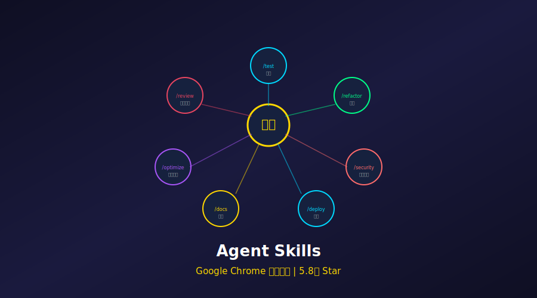
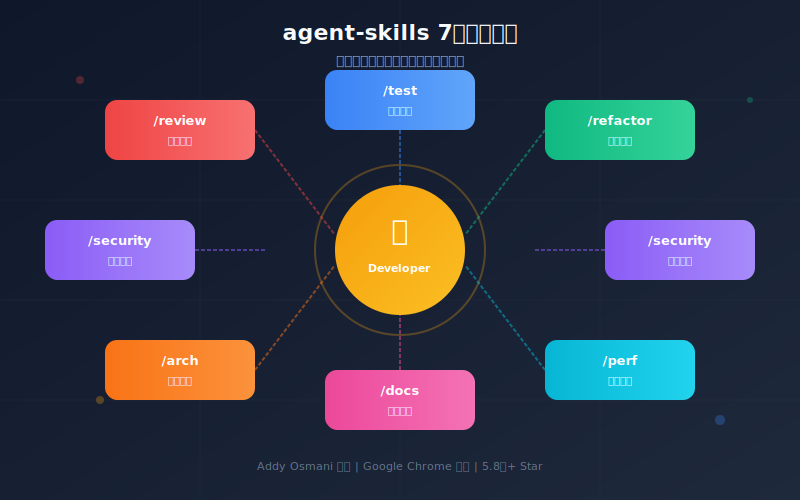
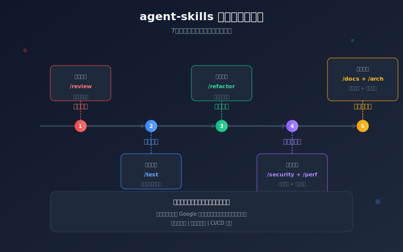

# 5.8万Star！2026生产级工程技能，Google大神把开发全流程装进了7个命令！太强了



> **项目速览**
> - 项目：addyosmani/agent-skills
> - GitHub：[github.com/addyosmani/agent-skills](https://github.com/addyosmani/agent-skills)
> - Stars：**58,000+** | 周新增：+9,348 | Fork：7,100+
> - 作者：Addy Osmani（Google Chrome 团队高级工程师）
> - 核心标签：AI 编程 / Slash 命令 / Google / 工程技能

---

## 一、痛点：代码写完了，真正的麻烦才开始

有没有发现，写代码只占开发时间的 20%？

剩下的 80% 在干嘛？**Review、测试、重构、文档、性能优化......** 这些脏活累活，比写代码还折磨人。

更惨的是，AI 辅助编程工具（Copilot、Cursor 这些）确实能帮你快速生成代码，但生成完之后呢？

- 代码质量怎么样？有没有安全漏洞？
- 测试覆盖了吗？边界情况考虑了没？
- 性能达标吗？会不会上线就崩？
- 文档更新了没？后人能看懂吗？

**AI 帮你写代码的速度是快了，但后续工程化环节的坑，一个都没少。**

就像请了个跑得飞快的装修队，三天给你盖完房子，但没验收、没质检、没保修。你敢住吗？

Google Chrome 团队的 Addy Osmani 显然也意识到了这个问题。于是他开源了 **agent-skills**——一套覆盖完整开发周期的生产级工程技能。

---

## 二、项目介绍：addyosmani/agent-skills 什么来头？



**agent-skills** 是 Addy Osmani（Google Chrome 团队工程师、著名前端性能专家）开源的项目。GitHub 上 **5.8万+ Star**，周趋势暴涨 **+9,348**，这增速简直是现象级！

Addy Osmani 是谁？如果你做前端，一定读过他的《Learning JavaScript Design Patterns》；如果你关注性能，一定用过他写的 Lighthouse。这哥们是**工程化领域的大神级人物**。

这个项目的核心理念特别简单：**把工程最佳实践封装成 7 个 Slash 命令，让 AI Agent 也能像资深工程师一样干活。**

不是生成代码就完事，而是覆盖从代码审查到性能优化的**完整生命周期**。

GitHub 地址：`https://github.com/addyosmani/agent-skills`

---

## 三、核心亮点：这7个命令，每个都是救命稻草

### 命令1：/review —— 代码审查，AI 当面试官

写完代码先别急着提交，让 AI 帮你审一遍：

```python
# agent-skills 使用示例（概念演示）
from agent_skills import ReviewSkill

reviewer = ReviewSkill()
result = reviewer.run(
    code="""
    async function fetchUserData(userId) {
        const res = await fetch(`/api/users/${userId}`);
        return res.json();
    }
    """,
    language="javascript"
)

print(result)
```

输出结果：

```markdown
## 代码审查报告

### 严重问题
- **缺少错误处理**: fetch 失败时没有 try/catch，网络异常会导致未捕获的 Promise 拒绝
- **缺少输入验证**: userId 没有校验，可能传入恶意字符串导致注入攻击
- **缺少超时处理**: 请求可能永远挂起

### 建议改进
- 添加 try/catch 块处理网络错误
- 对 userId 进行类型检查和 sanitize
- 使用 AbortController 添加请求超时
- 检查 response.ok 状态码

### 评分: 4/10
**不推荐合入，请先修复严重问题。**
```

看到没？**不是泛泛而谈，而是具体到每一行的问题。** 这就像有个资深架构师坐在你旁边，逐行给你挑毛病。

### 命令2：/test —— 测试生成，覆盖率强迫症福音

写测试是最让人头大的事之一。agent-skills 能自动分析你的代码，生成全面的测试用例：

```python
from agent_skills import TestSkill

tester = TestSkill()
test_suite = tester.generate(
    code="""
    def calculate_discount(price, coupon_code):
        if coupon_code == "SAVE20":
            return price * 0.8
        elif coupon_code == "SAVE50":
            return price * 0.5
        return price
    """,
    framework="pytest"
)

print(test_suite)
```

生成的测试：

```python
import pytest
from discount import calculate_discount

class TestCalculateDiscount:
    def test_valid_save20_coupon(self):
        assert calculate_discount(100, "SAVE20") == 80
    
    def test_valid_save50_coupon(self):
        assert calculate_discount(200, "SAVE50") == 100
    
    def test_invalid_coupon_returns_full_price(self):
        assert calculate_discount(100, "INVALID") == 100
    
    def test_empty_coupon_returns_full_price(self):
        assert calculate_discount(100, "") == 100
    
    def test_zero_price(self):
        assert calculate_discount(0, "SAVE20") == 0
    
    def test_negative_price_raises_error(self):
        with pytest.raises(ValueError):
            calculate_discount(-10, "SAVE20")
    
    def test_none_coupon_code(self):
        assert calculate_discount(100, None) == 100
    
    def test_case_sensitive_coupon(self):
        # 边界情况：大小写敏感
        assert calculate_discount(100, "save20") == 100
```

**8 个测试用例，覆盖了正常路径、边界情况、异常输入。** 你自己写可能都想不到这么多边界情况！

### 命令3：/refactor —— 重构建议，代码洁癖患者狂喜

代码能跑，但看着难受？让 AI 帮你重构：

```python
from agent_skills import RefactorSkill

refactorer = RefactorSkill()
suggestion = refactorer.analyze("""
function processData(data) {
    let result = [];
    for (let i = 0; i < data.length; i++) {
        if (data[i].active === true) {
            let temp = {};
            temp.id = data[i].id;
            temp.name = data[i].name.toUpperCase();
            temp.value = data[i].value * 2;
            result.push(temp);
        }
    }
    return result;
}
""")

print(suggestion)
```

输出：

```javascript
// 重构后：使用 filter + map，声明式编程
const processData = (data) =>
    data
        .filter(item => item.active)
        .map(({ id, name, value }) => ({
            id,
            name: name.toUpperCase(),
            value: value * 2
        }));

// 改进点：
// 1. 消除命令式循环，使用声明式数组方法
// 2. 解构赋值减少重复引用
// 3. 箭头函数简化语法
// 4. 省略 === true，利用真值判断
// 5. 代码从 15 行缩减到 6 行
```

**从 15 行命令式代码，变成 6 行声明式代码。** 不止变短了，可读性和可维护性都大幅提升。

### 命令4：/security —— 安全扫描，提前堵漏洞

安全漏洞是最贵的 Bug。agent-skills 内置了安全扫描能力：

```python
from agent_skills import SecuritySkill

scanner = SecuritySkill()
report = scanner.scan("""
const query = `SELECT * FROM users WHERE id = ${req.params.id}`;
db.query(query, (err, results) => {
    res.json(results);
});
""")

print(report)
```

输出：

```markdown
## 安全扫描报告

### 高危漏洞
- **SQL 注入 (CWE-89)**: 直接拼接用户输入到 SQL 查询中
  - 位置: 第 1 行
  - 风险: 攻击者可读取/修改/删除任意数据
  - 修复: 使用参数化查询

### 中危漏洞
- **缺少输入验证**: req.params.id 未校验类型和范围
- **错误信息泄露**: 直接将 err 暴露给客户端

### 修复代码
```javascript
const { id } = req.params;
if (!/^\\\\(d+$/.test(id)) {
    return res.status(400).json({ error: "Invalid ID" });
}
db.query("SELECT * FROM users WHERE id = ?", [id], (err, results) => {
    if (err) {
        console.error(err);
        return res.status(500).json({ error: "Internal error" });
    }
    res.json(results);
});
```
```

**直接把漏洞和修复代码一起给你**，不用再去翻 OWASP 文档了。

### 命令5：/perf —— 性能分析，找出瓶颈

性能优化最怕什么？**不知道慢在哪里。**

```python
from agent_skills import PerfSkill

perf = PerfSkill()
analysis = perf.analyze("""
function findDuplicates(arr) {
    const duplicates = [];
    for (let i = 0; i < arr.length; i++) {
        for (let j = i + 1; j < arr.length; j++) {
            if (arr[i] === arr[j] && !duplicates.includes(arr[i])) {
                duplicates.push(arr[i]);
            }
        }
    }
    return duplicates;
}
""")

print(analysis)
```

输出：

```markdown
## 性能分析报告

### 复杂度分析
- **时间复杂度**: O(n³) — 三重嵌套（双层循环 + includes 扫描）
- **空间复杂度**: O(k) — k 为重复元素数量

### 瓶颈识别
1. **includes() 内部扫描**: 每次检查都要遍历 duplicates 数组
2. **双重循环比较**: 大量不必要的重复比较

### 优化方案
使用 Set 将时间复杂度降至 O(n)：

```javascript
function findDuplicates(arr) {
    const seen = new Set();
    const duplicates = new Set();
    
    for (const item of arr) {
        if (seen.has(item)) {
            duplicates.add(item);
        } else {
            seen.add(item);
        }
    }
    
    return [...duplicates];
}
// 时间复杂度: O(n)
// 对于 10万 数据量，性能提升约 1000 倍
```

**从 O(n³) 优化到 O(n)，10万数据量提升 1000 倍。** 这种优化靠经验，更靠工具。

### 命令6：/docs —— 文档生成，告别文档债

代码写了，文档呢？agent-skills 自动生成高质量文档：

```python
from agent_skills import DocsSkill

docs = DocsSkill()
documentation = docs.generate("""
def authenticate_user(username, password, options=None):
    \"\"\"Authenticate a user with credentials.\"\"\"
    if not options:
        options = {}
    
    user = db.find_user(username)
    if not user:
        raise AuthError("User not found")
    
    if not verify_password(password, user.password_hash):
        raise AuthError("Invalid password")
    
    if options.get('mfa_required') and not verify_mfa(user, options.get('mfa_code')):
        raise AuthError("MFA verification failed")
    
    return create_token(user)
""")

print(documentation)
```

输出：

```markdown
## authenticate_user

用户认证函数，支持多因素认证 (MFA)。

### 参数

| 参数 | 类型 | 必填 | 说明 |
|------|------|------|------|
| username | str | 是 | 用户名 |
| password | str | 是 | 明文密码（内部会哈希比对） |
| options | dict | 否 | 额外选项 |
| options.mfa_required | bool | 否 | 是否启用 MFA |
| options.mfa_code | str | 否 | MFA 验证码 |

### 返回值
- **类型**: `Token`
- **说明**: 认证成功返回 JWT Token

### 异常
- `AuthError`: 用户不存在、密码错误、MFA 验证失败

### 示例

```python
try:
    token = authenticate_user("john", "secret123", {
        "mfa_required": True,
        "mfa_code": "123456"
    })
except AuthError as e:
    print(f"认证失败: {e}")
```

### 安全注意
- 密码使用 bcrypt 哈希存储，支持慢哈希防暴力破解
- 建议配合速率限制使用，防止暴力攻击
```

**参数表、返回值、异常、示例、安全提示，一应俱全。** 这文档质量，比很多开源项目都强。

### 命令7：/arch —— 架构评估，防止技术债堆积

最可怕的技术债不是烂代码，是烂架构。agent-skills 能评估架构健康度：

```python
from agent_skills import ArchSkill

arch = ArchSkill()
assessment = arch.evaluate(project_path="./my-project")

print(assessment)
```

输出示例：

```markdown
## 架构健康度评估

### 总体评分: 72/100

### 模块依赖分析
```
api/     → db/, auth/, cache/
auth/    → db/
cache/   → (无依赖)
db/      → (无依赖)
```

### 发现的问题
1. **循环依赖风险**: api/ 和 auth/ 存在潜在循环依赖
2. **上帝模块**: utils/ 包含 47 个函数，建议拆分
3. **接口不一致**: db/ 模块同时暴露 sync 和 async API

### 建议
- 引入依赖注入解耦 api/ 和 auth/
- 将 utils/ 拆分为 logger/, formatter/, validator/
- 统一 db/ 接口为 async-only

### 技术债趋势
- 近 30 天新增 12 处 TODO
- 3 个文件超过 500 行，建议重构
```



上图展示了这 7 个技能如何覆盖完整的软件开发生命周期。从代码编写到上线运维，每个环节都有对应的技能保驾护航。

---

## 四、技术实现：7个命令背后的工程哲学

Addy Osmani 设计这套技能时，有几个核心原则：

### 1. 基于真实代码库训练

不是用 toy example 做演示，而是基于**真实的生产代码库**提炼模式：

- 代码审查规则来自 Google 内部 Code Review 规范
- 安全规则覆盖 OWASP Top 10
- 性能建议基于 Chrome 团队的实战经验

### 2. 上下文感知

技能不是孤立运行的，它们共享项目上下文：

```python
from agent_skills import AgentContext

ctx = AgentContext(project_path="./my-app")

# Review 知道项目的编码规范
ctx.review.run(code=new_feature)

# Test 知道已有的测试框架和 mocking 策略
ctx.test.generate(code=new_feature)

# Security 知道项目依赖的漏洞数据库
ctx.security.scan(code=new_feature)
```

### 3. 可扩展的插件体系

你可以自定义技能，或者覆盖默认行为：

```python
from agent_skills import Skill, register_skill

class MyCustomReview(Skill):
    name = "review"
    
    def run(self, code, **kwargs):
        # 先运行默认审查
        base_result = super().run(code, **kwargs)
        
        # 添加团队特定的规则
        if "TODO" in code:
            base_result.add_warning("代码中包含 TODO，请创建跟踪 Issue")
        
        return base_result

register_skill(MyCustomReview())
```

---

## 五、社区反响：周增9000+Star，开发者们疯了

5.8万 Star，周增 9348，这数据什么概念？**平均每天涨 1300+ Star**，比很多项目一年的增长还快。

我翻了下讨论区，大家为什么这么疯狂：

**核心原因：解决了真正的痛点**

- "终于有人把工程化最佳实践打包成工具了"
- "/review 找出的问题，比我们团队资深工程师还细"
- "用 /test 生成的用例，帮我发现了 3 个隐藏 Bug"
- "Addy Osmani 出品，质量有保障"

**使用场景：**

- 个人开发者：相当于免费请了个技术导师
- 小团队：弥补没有专职 QA、安全工程师的空缺
- 大企业：统一代码质量标准，降低 review 成本

**也有吐槽：**

- 对非英语代码的支持还不够完善
- 某些极端复杂的架构模式识别不够准
- 运行一次需要消耗不少 API tokens

但瑕不掩瑜，**这套技能确实把 AI 辅助编程从"写代码"推进到了"工程化"的新阶段。**

---

## 六、快速上手：10分钟配齐你的工程技能库

### 安装

```bash
pip install agent-skills
```

### 配置 API Key

```bash
export OPENAI_API_KEY="sk-xxxxxxxx"
# 或 export ANTHROPIC_API_KEY="sk-ant-xxxxxxxx"
```

### 使用单个技能

```python
from agent_skills import ReviewSkill, TestSkill

# 代码审查
code = """
def divide(a, b):
    return a / b
"""

reviewer = ReviewSkill()
report = reviewer.run(code, language="python")
print(report.summary)
# 输出: 发现 1 个严重问题: 缺少除零检查

# 生成测试
tester = TestSkill()
tests = tester.generate(code, framework="pytest")
print(tests)
# 输出: 包含除零测试、类型检查测试等的完整测试文件
```

### 批量处理整个项目

```python
from agent_skills import ProjectAgent

agent = ProjectAgent("./my-project")

# 对项目进行全面体检
report = agent.run_full_check()

print(f"代码审查: {report.review.score}/100")
print(f"测试覆盖: {report.test.coverage}%")
print(f"安全漏洞: {report.security.issues_count} 个")
print(f"性能瓶颈: {report.perf.bottlenecks}")
print(f"架构评分: {report.arch.score}/100")
```

### 集成到 CI/CD

```yaml
# .github/workflows/quality-check.yml
name: Quality Check
on: [pull_request]

jobs:
  agent-skills:
    runs-on: ubuntu-latest
    steps:
      - uses: actions/checkout@v4
      - name: Run agent-skills review
        run: |
          pip install agent-skills
          python -m agent_skills review --path . --fail-on-error
```

---

## 七、写在最后

2026 年，AI 编程助手已经能帮我们写代码了。但**写代码只是软件工程的开始，不是结束。**

Addy Osmani 的 agent-skills 提醒我们：真正的工程能力，体现在代码审查的细致、测试覆盖的全面、安全漏洞的敏感、性能优化的精准、文档编写的清晰、架构设计的远见。

这 7 个 Slash 命令，不只是工具，更是**一套工程化的思维方式**。它让 AI 从"代码生成器"进化成了"工程伙伴"。

如果你也在用 Copilot、Cursor 这些工具，强烈建议搭配 agent-skills 使用。**生成代码用 AI，保证质量用 skills。**

**GitHub 地址：** https://github.com/addyosmani/agent-skills

**Star 数：** 5.8万+（周增 +9,348，增速惊人！）

---

> 你最头疼的开发环节是哪个？Review、测试、还是文档？评论区聊聊～
>
> 觉得有用就点个「在看」，让更多开发者看到这套神器！
