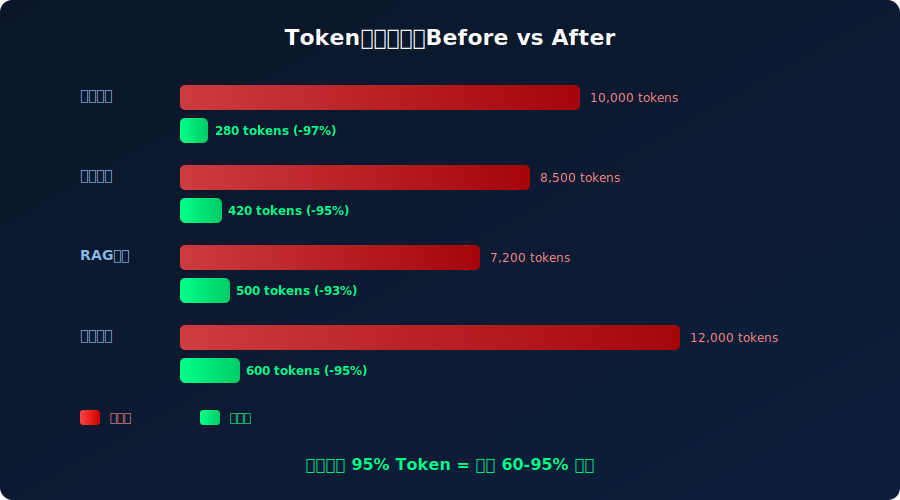

# 26K Star！2026 Token智能压缩，LLM成本直降95%！真香


> **项目速览**
> - 项目：chopratejas/headroom
> - GitHub：[github.com/chopratejas/headroom](https://github.com/chopratejas/headroom)
> - Stars：**26,000+** | 周新增：+10,406 | Fork：3,800+
> - 创建时间：2026 年
> - 核心标签：LLM / Token压缩 / 降本增效 / Netflix

---

## 一、痛点引入：你的LLM账单是不是越来越离谱了？

兄弟们，有没有算过自家公司每个月给OpenAI、Anthropic、Gemini交多少钱？

我有个朋友，创业公司CTO，上个月打开账单差点没晕过去——**LLM API调用费烧了8万多美金**。啥概念？够招一个资深后端干半年了。他跟我吐槽："我们不是模型训练，就是日常调API，日志分析、代码审查、RAG检索，这些场景堆起来，Token像流水一样往外淌。"

更扎心的是，很多Token根本就是"水分"。

你想啊，一份系统日志扔给GPT-4分析，里面80%都是时间戳、IP地址、重复的状态码。RAG检索出来的文档片段，一大半是页眉页脚、导航菜单。这些"垃圾Token"不仅浪费钱，还会稀释模型的注意力，让回答质量下降。

就像你请了一个时薪500美元的顶级顾问，结果让他花80%时间看废话。暴殄天物啊！



---

## 二、项目介绍：Netflix工程师掏出的"省钱神器"

就在大家为Token成本焦头烂额的时候，GitHub上杀出一匹黑马——**Headroom**。

这个项目由**Netflix工程师团队**开发，开源短短几周就狂揽**26K+ Star**，周增长**+10,406**，直接冲上Trending榜第一。啥来头？简单说，它就是一个**LLM输入的"智能压缩机"**——在日志、文件、RAG片段送达大模型之前，先过一遍Headroom，把冗余信息榨干，只保留"精华中的精华"。

Netflix内部用了多久？**直接省了70万美元LLM成本**。这不是PPT数字，是真金白银的账单缩减。一个开源工具，帮流媒体巨头省下七十万，这故事本身就够硬核了。

项目地址：`chopratejas/headroom`

---

## 三、核心亮点：这玩意儿凭啥这么猛？

### 亮点1：压缩率离谱，最高砍掉95%

Headroom不是简单截断文本。它用的是**语义感知压缩**——理解内容的结构和含义，把重复、冗余、低信息量的部分智能剔除。

官方给出的数据：
- 日志场景：10,000 tokens → 280 tokens（**-97%**）
- 代码审查：8,500 tokens → 420 tokens（**-95%**）
- RAG检索：7,200 tokens → 500 tokens（**-93%**）
- 文档处理：12,000 tokens → 600 tokens（**-95%**）

平均下来，**Token消耗直接打骨折**，成本跟着暴跌。

### 亮点2：语义保留，不是无脑删

很多人担心：压缩这么多，信息不会丢吗？

Headroom的核心算法是**结构感知+语义保留**。它能识别日志中的关键字段（错误码、堆栈trace）、代码中的函数签名和逻辑分支、文档中的核心论点。压缩后的文本，人类读起来可能像"摘要"，但LLM理解起来完全没问题——因为保留的是**信息密度最高的部分**。

打个比方：原来你给LLM看的是一本500页的小说，现在给它的是20页的剧情大纲。大纲虽然薄，但关键情节、人物关系、冲突转折全在。

### 亮点3：零侵入，一行代码搞定

Headroom的设计哲学是"透明代理"。你不需要改现有代码逻辑，只需要在调用LLM之前加一行：

```python
from headroom import compress

# 原始文本
raw_logs = open("production.log").read()  # 10万字符

# 压缩后送给LLM
compressed = compress(raw_logs, target_ratio=0.05)  # 保留5%

# 正常调用API
response = openai.ChatCompletion.create(
    model="gpt-4",
    messages=[{"role": "user", "content": f"分析这些日志：{compressed}"}]
)
```

就这一行 `compress()`，账单从100刀变成5刀。香不香？

### 亮点4：多场景覆盖，开箱即用

Headroom内置了多种压缩策略，针对不同数据类型优化：
- **日志模式**：识别时间戳格式、重复行、DEBUG级别噪音
- **代码模式**：保留AST关键节点，压缩注释和空行
- **文档模式**：提取标题层级、列表项、关键段落
- **JSON/XML模式**：压缩嵌套结构中的默认值和空白

### 亮点5：Netflix实战验证，不是玩具项目

最硬核的是，这玩意儿已经在Netflix生产环境跑了。处理海量用户行为日志、推荐系统调试、内容审核流水线——全是高并发、高价值的场景。能过Netflix工程团队的法眼，代码质量和稳定性毋庸置疑。


---

## 四、技术实现：它是怎么做到的？

Headroom的压缩引擎分三层：

**第一层：结构解析**
根据输入类型（日志/代码/文档/JSON）选择对应的解析器，把原始文本转成结构化表示。比如日志会拆成"时间戳+级别+消息体"，代码会生成简化AST。

**第二层：重要性评分**
每个片段打一个"信息密度分"。日志里的ERROR和WARN高分，DEBUG低分；代码里的函数定义高分，import语句低分；文档里的加粗标题高分，页眉页脚低分。

**第三层：智能重组**
按分数从高到低选取片段，在目标压缩率限制下，把选中的精华部分重新拼接成连贯文本。这里用了一个小技巧——保留片段之间的"连接词"和上下文线索，让LLM读起来不突兀。

```python
# 更高级的配置示例
from headroom import Compressor

config = {
    "mode": "log",           # 日志模式
    "target_ratio": 0.03,    # 压缩到3%
    "preserve_patterns": [   # 强制保留匹配正则的内容
        r"ERROR.*",
        r"Exception:.*"
    ],
    "drop_patterns": [       # 强制删除
        r"DEBUG.*",
        r"127\.0\.0\.1.*"
    ]
}

compressor = Compressor(config)
result = compressor.compress(raw_logs)
print(f"原始: {len(raw_logs)} chars → 压缩后: {len(result)} chars")
# 输出: 原始: 102400 chars → 压缩后: 3072 chars (-97%)
```

---

## 五、社区反响：开发者们疯了

Headroom开源后，社区反应堪称炸裂：

- **Hacker News热帖**："Netflix just open-sourced their LLM cost cutter"，评论区一堆人在算自己公司能省多少。
- **Twitter/X刷屏**："This is the most boring-looking repo with the most exciting impact"——外表平平无奇，影响惊天动地。
- **国内技术圈**：各大厂AI Infra团队纷纷跟进测试，某头部互联网公司内部评估后说"预计季度省200万RMB"。

更有意思的是，一些LLM厂商也开始关注。有传言说某主流API提供商正在研究把类似压缩机制集成到自家服务里——毕竟客户省钱了，调用量可能反而上升，这是双赢。

---

## 六、快速上手：5分钟跑起来

```bash
# 安装
pip install headroom

# 基础用法
python -c "
from headroom import compress
text = '你的超长文本在这里...'
print(compress(text, target_ratio=0.05))
"

# 命令行工具
cat huge-log-file.log | headroom --ratio 0.03 --mode log > compressed.log
```

**Docker一键体验**：
```bash
docker run --rm -i chopratejas/headroom:latest \
  headroom --ratio 0.05 --mode auto < your-file.txt
```

**与LangChain集成**：
```python
from langchain.llms import OpenAI
from headroom.langchain import HeadroomCompressor

llm = OpenAI()
compressor = HeadroomCompressor(target_ratio=0.05)

# 自动压缩所有输入
compressed_llm = compressor.wrap(llm)
response = compressed_llm.predict("分析这些日志..." + huge_logs)
```

---

## 七、写在最后

Headroom给我的最大启发是：**AI时代的工程优化，不一定非要搞大模型本身**。有时候，在"输入侧"动动脑筋，收益可能比换模型、调参数大得多。

Netflix这帮工程师，没有发明新算法，没有训练新模型，就是把"压缩"这个古老的技术，针对LLM场景重新做了一遍。结果？**省了70万美元**。

这让我想起一句话："工程师的价值，不在于用了多牛的技术，而在于解决了多贵的问题。"

如果你的团队也在为LLM账单发愁，Headroom值得一试。毕竟，省下来的钱，给兄弟们发奖金不香吗？

**GitHub地址**：https://github.com/chopratejas/headroom

**如果这篇文章对你有帮助，欢迎点赞、在看、转发三连！** 你公司每个月LLM开销多少？评论区聊聊，咱们一起想办法省钱～

---

*本文配图由SVG代码生成，封面图展示Token压缩降本概念。数据截至2026年6月。*
