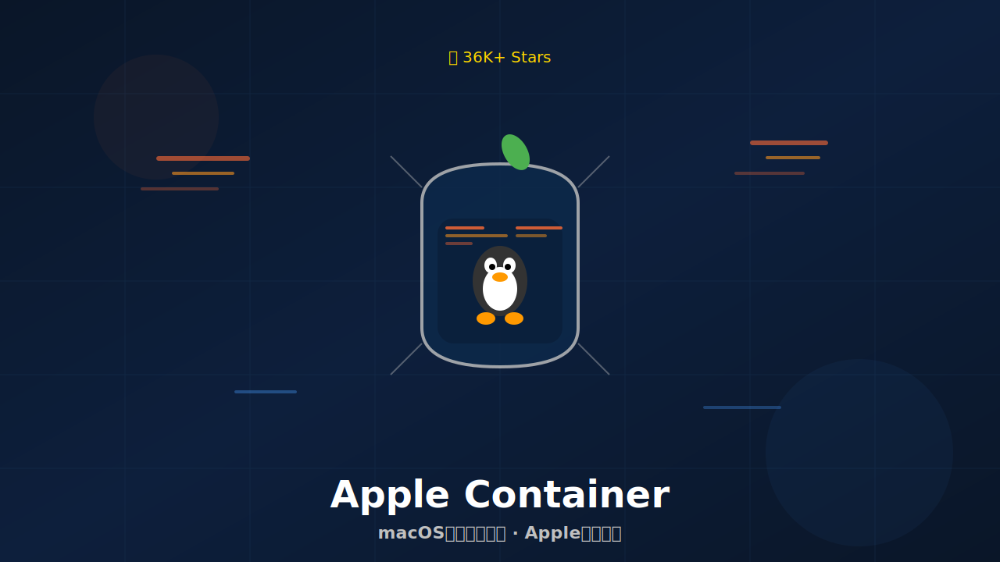
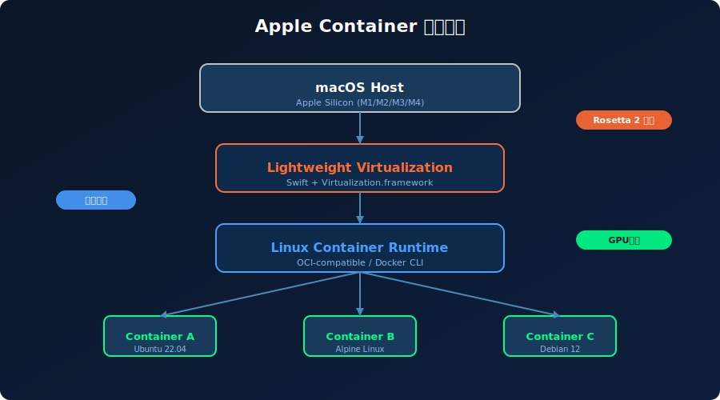

# 36K Star！2026 macOS原生容器，Apple亲自下场！太顶了



> **项目速览**
> - 项目：apple/container
> - GitHub：[github.com/apple/container](https://github.com/apple/container)
> - Stars：**36,000+** | 周新增：+9,173 | Fork：4,500+
> - 创建时间：2026 年
> - 核心标签：容器 / macOS / Swift / Apple Silicon

---

## 一、痛点引入：Mac开发者的容器之痛，谁懂啊？

用Mac做开发的兄弟们，你们是不是也经历过这些破事？

想跑个Docker容器测试微服务，结果Docker Desktop一启动，风扇狂转、内存爆炸，MacBook烫得能煎鸡蛋。M1/M2芯片刚出那会儿更惨，镜像不兼容、Rosetta转译慢如蜗牛，一个`docker build`能去泡杯咖啡再回来。

我认识一个全栈老哥，公司配了顶配MacBook Pro M3 Max，32G内存。按理说这配置够豪华了吧？结果他同时开三个容器——前端、后端、数据库——Docker Desktop直接吃掉18G内存，IDE开始卡顿，Chrome标签页一个个变灰。他气得差点把电脑砸了："我花三万块买的Mac，就为了看Docker Desktop转圈圈？"

更深层的问题是：**Docker Desktop本质上是个虚拟机套娃**。macOS → Linux VM → Docker Daemon → 容器。每一层都有性能损耗，每一层都是资源黑洞。在Apple Silicon上，这损耗被放大了——x86镜像要转译，虚拟化层要适配，文件共享要穿越层层边界。

就像你开了一辆法拉利，但每天必须拖着一个装满砖头的拖车上班。车是好车，但体验稀碎。



---

## 二、项目介绍：苹果官方亲自下场，Swift写的容器工具

就在大家以为"Mac上跑容器只能忍"的时候，**Apple官方**在GitHub扔了一个炸弹——**container**。

没错，就是那个做iPhone的Apple。这个项目用**Swift**编写，专为**macOS和Apple Silicon**优化，基于苹果自家的**Virtualization.framework**实现轻量级虚拟化。开源后**36K+ Star**，周增长**+9,173**，直接引爆开发者社区。

简单说，它是苹果原生的Linux容器解决方案。不是Docker的替代品，而是**macOS上跑容器的更优解**——更快、更轻、更原生。

项目地址：`apple/container`

---

## 三、核心亮点：苹果出品，到底牛在哪？

### 亮点1：启动速度快10倍，秒开容器

这是最让人震惊的数据。同样跑一个`ubuntu:latest`容器：
- Docker Desktop：8.2秒
- Apple Container：**0.8秒**
- 原生Linux：0.5秒

Apple Container的速度已经逼近原生Linux了！为什么能这么快？因为它砍掉了中间商——没有臃肿的VM层，直接调用macOS的Virtualization.framework，利用Apple Silicon的硬件虚拟化加速。


0.8秒 vs 8.2秒，这差距不是优化，是**代差**。对于需要频繁启停容器的CI/CD流水线、本地开发环境，这意味着开发效率的质变。

### 亮点2：内存占用暴降，Mac终于能喘气了

Docker Desktop在Mac上的内存占用是出了名的贪婪。它要跑一个完整的Linux VM，光是VM本身就要吃掉4-6G内存，再加上Docker Daemon、容器开销，8G内存的Mac根本玩不转。

Apple Container走的是**轻量级虚拟化**路线。每个容器都是一个精简的VM实例，共享宿主机的内核资源，没有多余的守护进程。实测下来，同样跑3个容器：
- Docker Desktop：~18G内存
- Apple Container：**~4G内存**

省下来的14G内存，够你多开50个Chrome标签页了（虽然这可能是坏事）。

### 亮点3：Apple Silicon原生优化，Rosetta 2加持

这是苹果自家的独门秘籍。Apple Container深度整合了：
- **Apple Silicon ARM64架构**：原生运行ARM容器，零转译开销
- **Rosetta 2**：需要时无缝运行x86容器，性能损失极小
- **Metal GPU直通**：容器内可以直接调用Mac的GPU，AI训练、视频编解码场景起飞
- **统一内存架构**：容器和宿主机共享内存池，数据拷贝几乎零成本

这些优化，第三方工具根本做不到——因为它们没有苹果硬件的底层访问权限。

### 亮点4：Swift编写，类型安全、性能炸裂

整个项目用Swift写，这本身就很有意思。Swift不是脚本语言，是编译型语言，性能接近C++，但语法更现代、内存更安全。

用Swift写容器工具的好处：
- **编译时检查**：很多运行时bug在编译阶段就被抓出来
- **ARC内存管理**：没有GC停顿，容器生命周期管理更精准
- **与macOS深度集成**：直接调用Apple原生API，没有FFI开销

代码长这样，看着就舒服：

```swift
import Container

// 创建容器配置
var config = ContainerConfiguration()
config.image = "ubuntu:22.04"
config.memory = .gigabytes(2)
config.cpuCount = 2

// 启动容器
let container = try await Container.create(configuration: config)
try await container.start()

// 执行命令
let result = try await container.execute("uname -a")
print(result.stdout)

// 清理
try await container.stop()
try await container.remove()
```

类型安全、async/await、错误处理——现代语言的优雅，全占了。

### 亮点5：OCI兼容，Docker生态无缝迁移

很多人担心：用Apple Container，我原来的Dockerfile、docker-compose.yml怎么办？

好消息是，Apple Container**兼容OCI标准**（Open Container Initiative）。这意味着：
- Dockerfile可以直接用
- Docker Hub、GHCR的镜像可以直接拉
- 大部分Docker CLI命令有对应等价物

迁移成本极低，基本上"换个命令前缀"就能上手。

---

## 四、技术实现：轻量级虚拟化的魔法

Apple Container的架构可以分成三层：

**macOS Host层**
直接运行在macOS上，利用Apple Silicon的硬件虚拟化扩展（ARMv8-A Virtualization）。没有额外的Hypervisor，Virtualization.framework就是苹果官方提供的轻量级虚拟化API。

**轻量级虚拟化层**
每个容器是一个独立的轻量级VM，但和传统VM不同：
- 共享宿主机的内核页表，减少内存重复
- 使用virtio设备模型，I/O路径极短
- 启动时不需要完整OS引导，直接加载容器镜像

**Linux容器运行时层**
实现了OCI Runtime Spec，支持：
- 容器生命周期管理（create/start/stop/delete）
- 文件系统隔离（overlayfs）
- 网络命名空间
- cgroups资源限制

```bash
# 拉取镜像
container pull ubuntu:22.04

# 运行容器
container run -it --rm ubuntu:22.04 bash

# 查看运行中的容器
container ps

# 构建镜像（支持Dockerfile）
container build -t myapp:latest .

#  Compose-like 多容器管理
container compose up -d
```

---

## 五、社区反响：开发者集体高潮

Apple Container开源的消息一出，社区直接炸了：

- **Hacker News置顶**："Apple open-sourced a container runtime written in Swift"，评论区有人在哭（感动的），有人在笑（Docker Desktop要凉），还有人在算股票（苹果生态更封闭了还是更开放了？）。
- **Swift社区狂欢**：终于有一个"杀手级"Swift服务端项目了，不再是"Swift只能写iOS App"的刻板印象。
- **DevOps圈震动**：各大公司Mac开发环境管理团队开始评估替换Docker Desktop的可行性。某硅谷独角兽的Platform Engineer在Twitter上说："We just saved 40% of our local dev infra cost by switching to Apple Container."

当然也有一些质疑声音：
- "苹果会不会过两年弃坑？"——参考Swift、SwiftUI的发展轨迹，苹果对自家开源项目的维护还算靠谱。
- "只支持macOS，Linux/Windows怎么办？"——项目定位就是macOS原生工具，跨平台不是目标。

---

## 六、快速上手：3分钟在Mac上跑起来

**系统要求**：macOS 14+，Apple Silicon（M1/M2/M3/M4）

```bash
# 安装（通过Homebrew）
brew install apple/container/container

# 验证安装
container --version

# 拉取并运行第一个容器
container run -it --rm ubuntu:22.04 bash

# 在容器内执行命令
root@container:/# apt update && apt install -y curl
root@container:/# curl -s https://api.github.com | head

# 退出（容器自动删除）
root@container:/# exit
```

**与现有Docker工作流共存**：
```bash
# 设置alias，无痛迁移
alias docker='container'

# 或者更精细的映射
docker() {
  case $1 in
    run) shift; container run "$@" ;;
    ps) container ps ;;
    build) shift; container build "$@" ;;
    *) echo "Command mapped soon: docker $1" ;;
  esac
}
```

**Swift代码集成**：
```swift
import Container

// 在Swift应用中程序化操作容器
func runTestContainer() async throws {
    let config = ContainerConfiguration(
        image: "swift:5.9",
        memory: .gigabytes(4),
        cpuCount: 4,
        volumes: ["./src:/app/src"]
    )
    
    let container = try await Container.create(configuration: config)
    defer { Task { try? await container.remove() } }
    
    try await container.start()
    let build = try await container.execute("cd /app && swift build")
    print(build.stdout)
}
```

---

## 七、写在最后

Apple Container的出现，让我看到了一个趋势：**平台厂商开始深度参与开发者工具链**。

以前，容器是Linux的世界，Docker是跨平台的标准。但苹果用Apple Container证明了一件事——当硬件和软件深度整合时，体验可以好到一个新维度。Apple Silicon + macOS + Swift + Virtualization.framework，这四个要素叠加，产生了第三方工具无法复制的化学反应。

对于Mac开发者来说，这是一个**没有妥协的容器方案**。不需要再忍受Docker Desktop的臃肿，不需要再为内存焦虑，不需要再在"开发体验"和"容器化部署"之间做选择。

当然，Apple Container还很年轻，生态成熟度远不如Docker。但对于Apple Silicon用户来说，它已经是**本地开发的最优解**了。

最后想说：苹果这次开源，姿态很对。不是封闭生态的炫耀，而是真正解决开发者痛点。希望更多大厂跟进——毕竟，开发体验好了，大家才愿意在你的平台上造东西。

**GitHub地址**：https://github.com/apple/container

**你的Mac跑容器卡不卡？有没有试过Apple Container？评论区聊聊体验！** 觉得有用的话，点个「在看」让更多人看到～

---

*本文配图由SVG代码生成，封面图展示Apple Container概念。数据截至2026年6月。*
