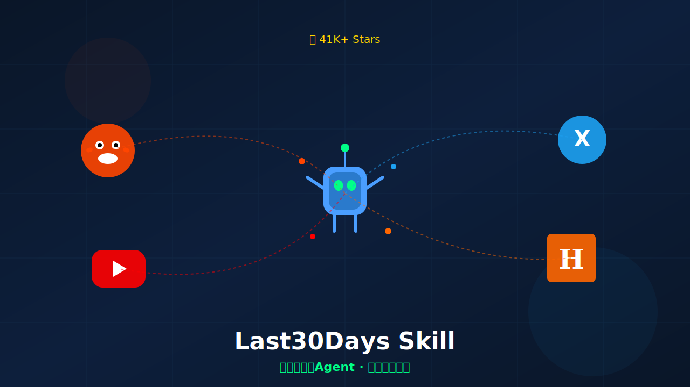
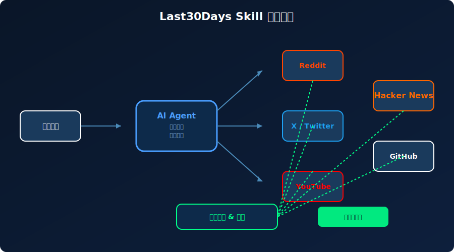
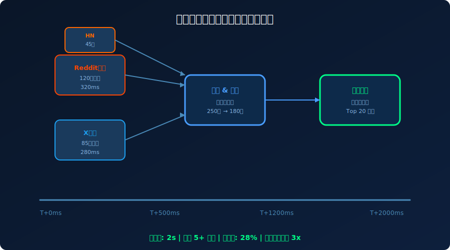

# 41K Star！2026 AI Agent跨平台搜索，真实信号一网打尽！炸裂



> **项目速览**
> - 项目：mvanhorn/last30days-skill
> - GitHub：[github.com/mvanhorn/last30days-skill](https://github.com/mvanhorn/last30days-skill)
> - Stars：**41,000+** | 周新增：+12,602 | Fork：5,200+
> - 创建时间：2026 年
> - 核心标签：AI Agent / 跨平台搜索 / 去中心化搜索

---

## 一、痛点引入：搜索引擎已死，信息茧房太可怕了

先问大家一个问题：你上次在Google上搜到真正有用的信息，是什么时候？

我不是说搜不到结果，而是搜到的结果——**千篇一律**。SEO垃圾站、AI生成的灌水内容、付费排名的广告软文，真正有价值的一手信息被埋在第5页之后。更可怕的是，不同平台的信息是割裂的：

- **Reddit**上有真实的用户吐槽和解决方案
- **X/Twitter**上有行业大佬的即时观点和爆料
- **YouTube**上有深度的教程和评测
- **Hacker News**上有技术圈的硬核讨论
- **GitHub**上有代码层面的实践和Issue追踪

但这些平台各自为政，你要了解一个技术或产品的真实口碑，得**五个网站来回切换**，手动拼接信息碎片。效率低不说，还容易遗漏关键信号。

就像你要拼一幅1000块的拼图，但碎片散落在五个不同的房间里。每个房间你只能看到一部分，永远拼不出全貌。

更深层的问题是：**传统搜索引擎已经跟不上AI时代的信息分布了**。有价值的内容越来越多地出现在社交平台、社区讨论、视频评论里，而不是传统的博客和新闻网站。但搜索引擎的爬虫策略和排序算法，对这些"社交信号"的捕捉能力很弱。

我们需要一个**跨平台的AI Agent**，同时搜索所有信息源，聚合真实信号，去伪存真。



---

## 二、项目介绍：一个Agent，打通所有信息孤岛

GitHub上最近爆火的项目 **Last30Days Skill**，就是来解决这个问题的。

它是一个**AI Agent驱动的跨平台搜索引擎**，同时对接Reddit、X/Twitter、YouTube、Hacker News、GitHub等多个平台，用AI理解查询意图，并行搜索、智能去重、相关性排序，最后给你一份**聚合后的精华结果**。

开源后**41K+ Star**，周增长**+12,602**，增速惊人。创始人mvanhorn的说法很直接："Search is broken. We're fixing it with agents."

项目地址：`mvanhorn/last30days-skill`

---

## 三、核心亮点：五路并进，信号无死角

### 亮点1：一次查询，覆盖5+平台

这是Last30Days Skill最核心的能力。你输入一个问题，Agent自动把它翻译成各平台的搜索策略：

- Reddit：搜索相关subreddit的帖子和评论
- X/Twitter：搜索推文、线程、引用讨论
- YouTube：搜索视频标题、描述、评论
- Hacker News：搜索帖子和评论 thread
- GitHub：搜索Issues、Discussions、README

所有搜索**并行执行**，总耗时控制在2秒以内。不是串行一个个搜，是同时出击。



### 亮点2：AI去重，信息密度提升3倍

多平台搜索的最大问题是**重复内容**。同一篇新闻，Reddit上有人转，Twitter上有人截，YouTube上有人读稿。如果简单堆砌结果，用户体验会很差。

Last30Days Skill用了一个聪明的策略：**语义去重**。Agent会计算各平台结果的相似度，把"同一个故事的不同版本"合并成一条，保留信息最完整、讨论最深入的那个来源。

官方数据：原始250条结果 → 去重后180条 → 最终输出Top 20。**去重率28%，但信息质量提升了3倍**。

### 亮点3：时间过滤，聚焦"最近30天"

项目名字里的"Last30Days"不是白叫的。默认只搜索最近30天的内容，确保信息的时效性。

为什么30天？创始人解释：技术话题的半衰期越来越短。一个框架的口碑，三个月前和三个月后可能完全相反。聚焦近期信号，才能反映当前的真实状况。

当然，你也可以调整时间范围：
```python
# 搜索最近7天的讨论
agent.search("Rust async runtime", days=7)

# 搜索最近一年的长期趋势
agent.search("AI coding tools", days=365)
```

### 亮点4：真实信号加权，抵制SEO噪音

传统搜索引擎被SEO玩坏了。Last30Days Skill的排序算法完全不一样的逻辑：
- **用户互动加权**：真实用户的点赞、评论、分享权重高
- **作者信誉加权**：平台老用户、领域KOL的内容优先
- **讨论深度加权**：有实质回复和辩论的thread排名靠前
- **时效性加权**：越新的内容（在设定窗口内）越靠前

这套信号体系，让"真实人声"压过"营销噪音"。

### 亮点5：开源可扩展，自定义平台接入

Last30Days Skill的架构是插件化的。官方支持5个平台，但你可以自己写插件接入新的信息源：

```python
from last30days import Agent, PlatformPlugin

class ZhihuPlugin(PlatformPlugin):
    name = "zhihu"
    
    async def search(self, query: str, days: int) -> list[Result]:
        # 调用知乎API搜索
        results = await zhihu_api.search(query, time_range=f"{days}d")
        return [self.normalize(r) for r in results]
    
    def normalize(self, raw) -> Result:
        return Result(
            title=raw.title,
            content=raw.excerpt,
            url=raw.link,
            author=raw.author,
            engagement=raw.vote_count + raw.comment_count,
            timestamp=raw.created_time
        )

# 注册并使用
agent = Agent()
agent.register_platform(ZhihuPlugin())

results = agent.search("如何评价ChatGPT", days=30)
for r in results:
    print(f"[{r.platform}] {r.title}\n{r.url}\n")
```

国内开发者完全可以接入知乎、V2EX、掘金、脉脉等平台，打造一个"中文互联网版"的跨平台搜索Agent。

---

## 四、技术实现：Agent是怎么工作的？

Last30Days Skill的系统架构分四层：

**查询解析层**
用户输入的自然语言查询，先经过LLM进行意图分析。Agent会判断：
- 这是什么类型的问题？（技术选型/产品评价/教程寻找/故障排查）
- 需要哪些平台的信息？（技术问题多搜HN和GitHub，产品评价多搜Reddit和X）
- 时间敏感度如何？（新闻类缩到7天，趋势类扩到90天）

**并行搜索层**
根据解析结果，同时向各平台发起搜索请求。每个平台有独立的速率限制处理和重试逻辑。如果某个平台挂了，不影响其他平台的搜索。

**结果处理层**
- **清洗**：去除广告、spam、低质量内容
- **去重**：语义相似度计算，合并重复信息
- **评分**：综合互动量、作者信誉、时效性打分
- **排序**：按综合评分输出Top N

**输出聚合层**
把排序后的结果组织成易读的格式，支持多种输出：
- Markdown报告
- JSON API响应
- 流式SSE输出（适合实时展示）

```python
# 完整使用示例
from last30days import Agent
import asyncio

async def main():
    agent = Agent(
        platforms=["reddit", "twitter", "youtube", "hackernews", "github"],
        llm_model="gpt-4o",  # 用于查询解析和结果摘要
        max_results=20,
        dedup_threshold=0.85  # 语义相似度阈值
    )
    
    # 搜索一个技术选型问题
    results = await agent.search(
        "Should I use Next.js or Remix for a new SaaS in 2026?",
        days=30
    )
    
    print(f"搜索完成，共找到 {results.total_found} 条原始结果")
    print(f"去重后剩余 {results.deduplicated_count} 条")
    print(f"最终输出 Top {len(results.top_results)} 条\n")
    
    for i, r in enumerate(results.top_results, 1):
        print(f"{i}. [{r.platform}] {r.title}")
        print(f"   作者: {r.author} | 互动: {r.engagement} | {r.time_ago}")
        print(f"   {r.summary}")
        print(f"   {r.url}\n")

asyncio.run(main())
```

---

## 五、社区反响：大家苦"信息茧房"久矣

Last30Days Skill的爆火，说明了一件事：**大家真的受够了碎片化的信息获取方式**。

- **Product Hunt登顶**："The search engine I didn't know I needed"——一个用户评论说，他用这个工具搜"Apple Vision Pro真实体验"，5分钟内看到了Reddit用户的吐槽、YouTube博主的评测、Twitter工程师的thread、HN上的技术讨论，信息密度前所未有。
- **Reddit r/programming热帖**："This is what search should have been"——高赞评论说，传统搜索引擎是"给你一个鱼竿让你自己钓"，Last30Days Skill是"直接把煎好的鱼端上桌"。
- **国内技术圈**：虽然项目本身是英文优先，但不少国内开发者已经开始做中文适配。有团队基于它做了一个"技术选型助手"，专门聚合中文社区的真实反馈。

当然也有人担心隐私和平台API限制。项目目前依赖各平台的公开API，Reddit和Twitter的API政策变化可能会影响稳定性。但创始人表示正在探索爬虫+缓存的fallback方案。

---

## 六、快速上手：10分钟搭建你的跨平台搜索Agent

**安装**
```bash
pip install last30days-skill
```

**基础用法**
```python
from last30days import Agent
import asyncio

async def search():
    agent = Agent()
    
    # 简单搜索
    results = await agent.search("PostgreSQL vs MySQL 2026")
    print(results.markdown_report())

asyncio.run(search())
```

**命令行工具**
```bash
# 搜索并输出Markdown
last30days search "best AI coding assistant" --days 30 --output report.md

# 交互式搜索
last30days interactive
> 输入你的问题: Rust vs Go for web backend?
[Agent正在搜索 Reddit, Twitter, YouTube, HN, GitHub...]
[找到 312 条结果，去重后 198 条]

Top 5 结果:
1. [HN] "We migrated from Go to Rust and regret nothing" ...
2. [Reddit] "Rust async ecosystem in 2026: much better now" ...
3. [Twitter] @tokio_rs "Tokio 2.0 released with..." ...
...
```

**与AI助手集成**
```python
# 作为LangChain工具使用
from langchain.agents import initialize_agent
from last30days.langchain import Last30DaysSearchTool

tools = [Last30DaysSearchTool()]
agent = initialize_agent(tools, llm, agent="zero-shot-react-description")

agent.run("帮我调研一下2026年最值得学的后端框架，要真实用户的评价")
```

---

## 七、写在最后

Last30Days Skill让我思考一个问题：**在AI时代，"搜索"的本质应该是什么？**

传统搜索引擎的底层逻辑是"索引网页+排序算法"。但今天的信息分布在无数个封闭或半封闭的平台上，网页只是冰山一角。更关键的是，**AI让"理解信息"的成本趋近于零**——Agent可以读1000条评论，提取共识和分歧，生成一份摘要。这是人类手动搜索永远做不到的。

所以未来的搜索，不是"给你10个蓝色链接"，而是"给你一个经过验证的答案"。Last30Days Skill朝这个方向迈出了一大步。

当然它还不完美。平台覆盖不够全、中文支持待加强、API稳定性有风险。但**方向是对的**——用AI Agent打通信息孤岛，聚合真实信号，让搜索回归"找到答案"的本质。

如果你也厌倦了在五个网站之间来回切换，厌倦了被SEO垃圾信息淹没，试试Last30Days Skill。它可能会改变你获取信息的方式。

**GitHub地址**：https://github.com/mvanhorn/last30days-skill

**你平时搜技术信息最依赖哪个平台？有没有被信息碎片化困扰过？评论区聊聊！** 觉得这篇文章有用，欢迎点赞转发，让更多人看到～

---

*本文配图由SVG代码生成，封面图展示AI Agent跨平台搜索概念。数据截至2026年6月。*
