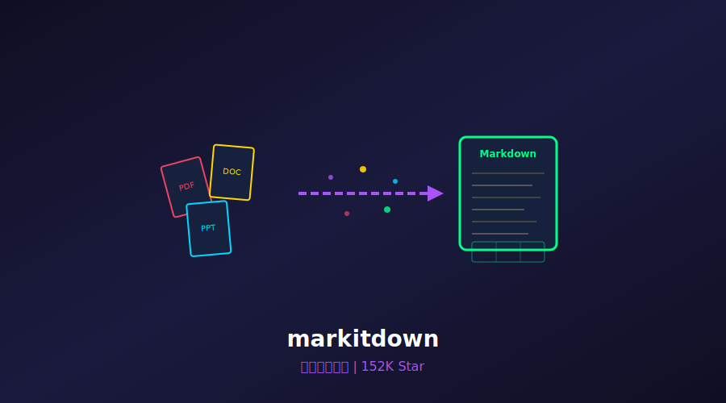
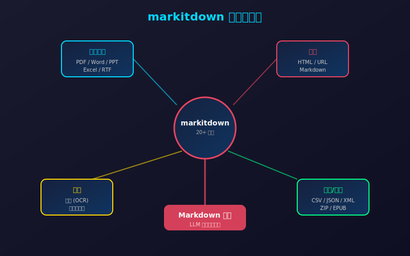
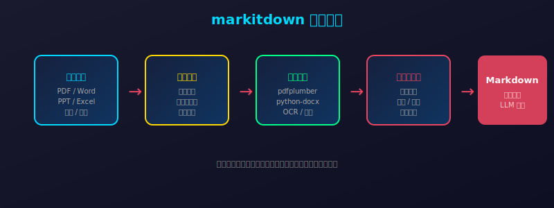

# 152K Star！微软官方出手，PDF/Word/PPT 一键转 Markdown，LLM 处理文档的神器来了！



> **项目速览**
> - 项目：microsoft/markitdown
> - GitHub：[github.com/microsoft/markitdown](https://github.com/microsoft/markitdown)
> - Stars：**152,000+** | 月度新增：+29,000 | Fork：8,200+
> - 创建时间：2024 年（2026 年爆发式增长）
> - 核心标签：文档转换 / Markdown / LLM 友好 / 微软官方

---

## 一、开篇：你的文档，LLM 根本"看不懂"

2026 年，几乎每个人都在用大模型处理文档：

- 让 AI 总结一份 50 页的 PDF 财报
- 让 AI 从 Word 合同里提取关键条款
- 让 AI 把 PPT 转成结构化的知识库

但你可能没意识到一个致命问题：**LLM 最擅长处理的是纯文本，尤其是 Markdown 格式。而你的文档，它根本"看不懂"。**

PDF 对 LLM 来说是一堆乱码。Word 里的表格、页眉页脚、格式标记，全成了干扰信息。PPT 的排版逻辑，AI 更是一头雾水。

你辛辛苦苦把文档丢给 GPT-4 或 Claude，结果它给你总结得乱七八糟——不是模型不行，是**输入格式不对**。

**微软也发现了这个问题。**

于是他们开源了 **markitdown**——一个能把几乎所有办公文档格式，一键转成 LLM 最友好的 Markdown 的神器。152K Star，月度增长 2.9 万，成为 2026 年文档处理领域的现象级项目。

---

## 二、markitdown 是什么？

一句话：**markitdown 是微软开源的文档转 Markdown 工具，支持 PDF、Word、PPT、Excel、图片、音频、HTML 等 20+ 格式。**

它解决的核心痛点很简单：

| 场景 | 传统做法 | markitdown 做法 |
|------|---------|----------------|
| PDF 转文本 | 复制粘贴，格式全丢 | 保留标题层级、表格、列表结构 |
| Word 转 Markdown | 手动调整，耗时耗力 | 一键转换，格式完美映射 |
| PPT 转文本 | 逐页复制，逻辑混乱 | 按幻灯片结构输出，层次分明 |
| Excel 转文本 | 粘贴成乱码表格 | 转为 Markdown 表格，LLM 直接理解 |
| 图片转文本 | OCR 工具单独处理 | 内置 OCR，图文一并转换 |

**markitdown 的核心设计哲学：不是简单提取文字，而是保留文档的语义结构。**

标题还是标题，表格还是表格，列表还是列表。LLM 拿到这样的输入，理解准确率能提升一个量级。



---

## 三、五大核心亮点

### 1. 20+ 格式全覆盖，一个工具搞定所有文档

markitdown 支持的格式清单，堪称恐怖：

- **办公文档**：PDF、Word (.doc/.docx)、PowerPoint (.ppt/.pptx)、Excel (.xls/.xlsx)
- **网页**：HTML、URL 直接抓取
- **媒体**：图片（带 OCR）、音频（语音转文字）
- **代码/数据**：CSV、JSON、XML、ZIP 压缩包
- **其他**：EPUB、RTF、TXT

**一个命令行工具，替代了以前五六个工具的组合。**

### 2. LLM 友好的输出格式

markitdown 不是简单地把文档"导出"成文本。它做了大量针对 LLM 的优化：

```python
# 转换 PDF，保留语义结构
from markitdown import MarkItDown

md = MarkItDown()
result = md.convert("annual-report.pdf")

print(result.text_content)
# 输出：
# # 2025 年度财报
# 
# ## 一、营收概况
# 
# | 季度 | 营收（亿美元） | 同比增长 |
# |------|---------------|---------|
# | Q1   | 120           | +15%    |
# | Q2   | 135           | +18%    |
# ...
```

注意看：
- 标题自动转成 Markdown 的 `#` 层级
- 表格转成 Markdown 表格格式
- 列表保留缩进结构
- 页眉页脚等噪音被自动过滤

### 3. 插件化架构，扩展能力极强

markitdown 设计了优雅的插件系统：

```python
# 自定义插件：给转换结果添加元数据
from markitdown import MarkItDown, DocumentConverter

class MetadataPlugin(DocumentConverter):
    def convert(self, local_path):
        result = super().convert(local_path)
        # 添加文档来源、转换时间等元数据
        result.text_content = f"<!-- Source: {local_path} -->\n" + result.text_content
        return result

md = MarkItDown(plugins=[MetadataPlugin()])
```

你可以写插件来：
- 自定义特定格式的转换逻辑
- 添加文档元数据（来源、作者、时间）
- 集成第三方服务（比如翻译、摘要）

### 4. 与微软生态深度整合

作为微软官方项目，markitdown 天然支持：

- **Azure Document Intelligence**：企业级文档解析能力
- **Azure OpenAI Service**：转换后的 Markdown 直接送入 GPT-4
- **Microsoft 365**：与 Word、OneDrive 等无缝衔接

企业用户可以直接把 OneDrive 里的文档批量转成 Markdown，然后送入 RAG 系统。

### 5. 命令行 + Python API 双模式

无论你是脚本小子还是 Python 开发者，都能快速上手：

```bash
# 命令行一键转换
markitdown report.pdf > report.md
markitdown slides.pptx > slides.md
markitdown https://example.com/article > article.md

# 批量转换整个目录
markitdown --batch ./documents/ --output ./markdown/
```



---

## 四、技术实现揭秘

markitdown 的架构设计非常精巧：

### 核心架构

```
输入层 → 格式检测 → 专用解析器 → 结构化提取 → Markdown 生成 → 输出
```

1. **格式检测**：通过文件头魔数（magic number）和扩展名双重判断
2. **专用解析器**：每种格式有独立的解析器（PDF 用 pdfplumber，Word 用 python-docx 等）
3. **结构化提取**：提取标题、段落、表格、列表等语义元素
4. **Markdown 生成**：按规范映射为 Markdown 语法

### 针对 LLM 的特殊优化

```python
# 内部处理逻辑示意
def optimize_for_llm(content):
    # 1. 移除页眉页脚等噪音
    content = remove_headers_footers(content)
    
    # 2. 合并被分页打断的段落
    content = merge_broken_paragraphs(content)
    
    # 3. 表格规范化（确保 Markdown 表格语法正确）
    content = normalize_tables(content)
    
    # 4. 图片转为 [图片描述] 占位符
    content = replace_images_with_alt_text(content)
    
    # 5. 控制单次输出长度（避免超出 LLM 上下文窗口）
    content = chunk_for_context_window(content, max_tokens=8000)
    
    return content
```

---

## 五、社区反响

markitdown 的 Star 增长曲线堪称微软开源项目的教科书：

- **2024 Q4**：开源发布，首月 10K Star
- **2025 Q2**：支持格式扩展到 15+，突破 50K
- **2025 Q4**：加入 Azure 集成，突破 100K
- **2026 Q2**：月度增长 2.9 万，总 Star 突破 152K

**开发者评价：**

> "以前处理 PDF 财报，要么用 PyPDF 提取一堆乱码，要么付费买 API。markitdown 免费、开源、效果还更好。" —— Hacker News 用户

> "我们公司的知识库 RAG 系统，文档转换环节从 3 个工具缩到 1 个，准确率反而提升了 30%。" —— Reddit r/MachineLearning

> "微软终于开源了一个真正解决痛点的东西。不是那种为了开源而开源的项目。" —— Twitter @tech_lead

---

## 六、快速上手

```bash
# 1. 安装
pip install markitdown

# 2. 命令行使用
markitdown document.pdf > output.md
markitdown presentation.pptx > slides.md
markitdown spreadsheet.xlsx > table.md

# 3. Python API
from markitdown import MarkItDown

md = MarkItDown()
result = md.convert("report.pdf")
print(result.text_content)

# 4. 批量转换
import os
from markitdown import MarkItDown

md = MarkItDown()
for file in os.listdir("./docs"):
    if file.endswith((".pdf", ".docx", ".pptx")):
        result = md.convert(f"./docs/{file}")
        with open(f"./markdown/{file}.md", "w") as f:
            f.write(result.text_content)
```

**进阶：与 LLM  pipeline 集成**

```python
from markitdown import MarkItDown
import openai

md = MarkItDown()

# 转换文档
doc = md.convert("contract.pdf")

# 直接送入 LLM 做分析
response = openai.chat.completions.create(
    model="gpt-4",
    messages=[
        {"role": "system", "content": "你是一位合同审查专家。"},
        {"role": "user", "content": f"请分析以下合同的关键条款和风险点：\n\n{doc.text_content}"}
    ]
)

print(response.choices[0].message.content)
```

---

## 七、写在最后

markitdown 的 152K Star，揭示了一个被忽视的趋势：**LLM 时代的文档处理，核心不是"提取文字"，而是"保留语义结构"。**

PDF、Word、PPT 这些格式，本质上是为人类阅读设计的。它们充满了视觉排版信息——字体大小、颜色、页边距、分页符——这些对 LLM 来说全是噪音。

Markdown 之所以成为 LLM 的"母语"，是因为它用纯文本表达了文档的语义结构。标题就是标题，表格就是表格，没有多余的视觉干扰。

微软用 markitdown 做了一个示范：**在 AI 时代，文档转换不是格式转换，而是语义转换。**

152K Star 只是一个开始。随着 RAG、Agent 等技术的普及，文档到 Markdown 的转换将成为每个 AI 应用的标配环节。

**GitHub 地址**：[github.com/microsoft/markitdown](https://github.com/microsoft/markitdown)

---

*本文数据截至 2026 年 6 月 15 日。Star 数实时变化，以 GitHub 页面为准。*

---

> 如果本文对你有帮助，欢迎点赞👍、在看、转发三连！你平时用 LLM 处理文档遇到的最大坑是什么？评论区聊聊～
