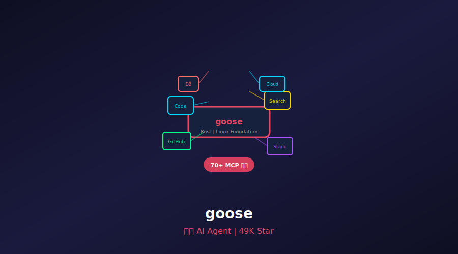
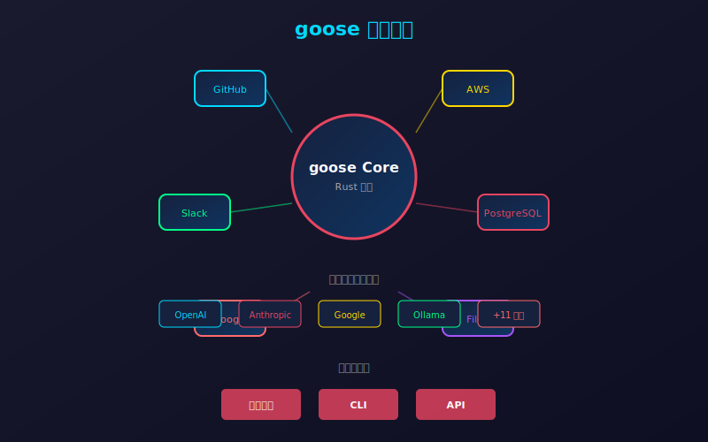
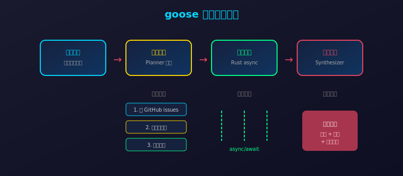

# 49K Star！加入 Linux 基金会的开源 AI Agent，70+ MCP 扩展，Rust 写的"瑞士军刀"！



> **项目速览**
> - 项目：aaif-goose/goose
> - GitHub：[github.com/aaif-goose/goose](https://github.com/aaif-goose/goose)
> - Stars：**49,000+** | 周新增：+2,366 | Fork：5,800+
> - 创建时间：2025 年
> - 核心标签：AI Agent / Rust / MCP / Linux 基金会 / 通用自动化

---

## 一、开篇：AI Agent 很多，但真正能用的没几个

2026 年，AI Agent 的概念火得一塌糊涂。

OpenAI 的 Operator、Anthropic 的 Claude Computer Use、Google 的 Deep Research……大厂们都在推自己的 Agent 产品。

但作为一个开发者，你会发现一个尴尬的现实：**这些 Agent 要么闭源，要么只能干特定的事。**

- 这个 Agent 只能写代码
- 那个 Agent 只能查资料
- 另一个 Agent 只能操作浏览器

**你真正想要的，是一个像瑞士军刀一样的通用 Agent——能写代码、能查资料、能操作文件、能调用 API，还能根据你的需求不断扩展能力。**

而且最好是开源的、本地运行的、数据隐私有保障的。

**goose 就是答案。**

2025 年开源，2026 年加入 Linux 基金会，49K Star，支持 15+ 模型提供商和 70+ MCP 扩展。Rust 编写，原生桌面应用 + CLI + API 三形态。

它不是又一个"演示级"Agent。它是**生产级的通用 AI Agent 框架**。

---

## 二、goose 是什么？

一句话：**goose 是一个开源、可扩展的通用 AI Agent，支持安装、执行、编辑、测试等全生命周期操作，已加入 Linux 基金会。**

它和其他 Agent 的核心区别：

| 特性 | 其他 Agent | goose |
|------|-----------|-------|
| 开源程度 | 部分开源或闭源 | 完全开源，Linux 基金会托管 |
| 扩展能力 | 固定功能集 | 70+ MCP 扩展，持续增加 |
| 模型支持 | 绑定单一厂商 | 15+ 模型提供商自由切换 |
| 运行形态 | 仅 CLI 或仅 Web | 桌面应用 + CLI + API 三形态 |
| 编程语言 | Python/TypeScript | Rust，性能极致 |
| 使用场景 | 单一领域 | 研究、写作、自动化、数据分析、编码全场景 |

**goose 的设计哲学：Agent 不应该被定义死，而应该像搭积木一样自由组合能力。**



---

## 三、五大核心亮点

### 1. 70+ MCP 扩展，能力无上限

MCP（Model Context Protocol）是 2026 年最火的开源协议之一。它定义了 AI 模型如何与外部工具交互的标准接口。

goose 原生支持 MCP，目前已有 70+ 扩展：

- **开发工具**：GitHub、GitLab、Jira、Linear
- **云服务**：AWS、Azure、GCP、Vercel
- **数据库**：PostgreSQL、MySQL、MongoDB、Redis
- **通信**：Slack、Discord、邮件
- **搜索**：Google、Bing、DuckDuckGo
- **文件系统**：本地文件、Google Drive、Dropbox

```bash
# 查看所有可用扩展
goose extensions list

# 安装 GitHub 扩展
goose extensions install github

# 安装后直接在对话中使用
> 帮我查看最近 3 个未解决的 issue
```

**这意味着什么？** 你的 goose Agent 可以随时"学会"新技能。今天它能写代码，明天它能操作 AWS，后天它能帮你发邮件——而这一切只需要安装一个扩展。

### 2. 15+ 模型提供商，不被任何一家绑定

goose 不绑死任何一家 AI 厂商：

- OpenAI（GPT-4、o3）
- Anthropic（Claude 3.5/4）
- Google（Gemini 2.0）
- 本地模型（Ollama、LM Studio）
- 以及 10+ 其他提供商

```bash
# 切换模型提供商
goose config set provider openai
goose config set model gpt-4

# 或者本地模型
goose config set provider ollama
goose config set model llama3:70b
```

**你可以根据任务选择最合适的模型。** 写代码用 Claude，分析数据用 GPT-4，本地隐私任务用 Ollama。

### 3. 三形态运行：桌面 + CLI + API

goose 提供了三种使用方式，覆盖所有场景：

**桌面应用（推荐新手）**

图形界面，像聊天软件一样使用。支持：
- 多会话管理
- 文件拖拽上传
- 实时预览执行结果
- 扩展一键安装

**CLI（开发者最爱）**

```bash
# 启动交互式会话
goose session start

# 执行单条命令
goose run "分析当前目录的代码结构，找出重复代码"

# 批量处理
goose run --file tasks.txt
```

**API（集成到应用）**

```python
import goose

client = goose.Client(api_key="your-key")

response = client.execute(
    task="创建一个新的 React 组件",
    context={"project": "my-app", "style": "typescript"}
)

print(response.result)
```

### 4. Rust 编写，性能极致

goose 选择 Rust 作为核心语言，这不是偶然：

- **内存安全**：没有 GC 停顿，长时间运行的 Agent 不会内存泄漏
- **零成本抽象**：高性能的同时保持代码简洁
- **并发优秀**：多任务并行执行，充分利用多核 CPU
- **跨平台**：Windows、macOS、Linux 原生支持

```rust
// goose 核心执行引擎示意
pub async fn execute_task(&self, task: Task) -> Result<TaskResult> {
    // 1. 任务分解
    let subtasks = self.planner.decompose(task).await?;
    
    // 2. 并行执行（Rust async/await）
    let results = futures::future::join_all(
        subtasks.into_iter().map(|t| self.executor.run(t))
    ).await;
    
    // 3. 结果聚合
    self.synthesizer.merge(results).await
}
```

### 5. Linux 基金会背书，生态有保障

2026 年，goose 正式加入 Linux 基金会。这意味着：

- **治理透明**：开源协议、贡献规范、路线图全部公开
- **企业友好**：知识产权清晰，大公司可以放心采用
- **长期维护**：不会因为创始团队变动而弃坑
- **生态繁荣**：Linux 基金会的资源网络加速生态建设



---

## 四、真实使用场景

### 场景 1：全栈开发助手

```bash
# 创建一个新项目
goose run "创建一个 Next.js + Prisma + PostgreSQL 的全栈项目，包含用户认证"

# goose 会自动：
# 1. 初始化 Next.js 项目
# 2. 安装 Prisma 和依赖
# 3. 配置 PostgreSQL 连接
# 4. 生成用户认证代码
# 5. 创建数据库迁移
# 6. 运行测试验证
```

### 场景 2：自动化数据分析

```bash
# 连接数据库，生成报表
goose run """
连接 PostgreSQL 数据库（连接字符串在 .env 里），
分析过去 30 天的用户行为数据，
生成一份包含留存率、转化率、热门功能的报告，
保存为 PDF 并发送到 slack #data 频道
"""
```

### 场景 3：智能客服 Agent

```python
import goose

# 配置多个扩展
agent = goose.Agent()
agent.install_extension("slack")
agent.install_extension("postgres")
agent.install_extension("openai")

# 自动回复 Slack 问题
@agent.on("slack.message")
def handle_question(message):
    # 查询知识库
    context = agent.query_db("faq", message.text)
    
    # 生成回复
    reply = agent.generate_response(
        prompt=message.text,
        context=context
    )
    
    # 发送回复
    agent.slack.send(message.channel, reply)
```

---

## 五、社区反响

goose 加入 Linux 基金会的消息，让社区沸腾了：

> "终于有一个不是某家大厂控制的 Agent 框架了。Linux 基金会背书，企业可以放心用了。" —— Hacker News 热评

> "从 AutoGPT 到 goose，Agent 框架进化了两代。goose 是第一个我觉得能真正上生产的。" —— Reddit r/LocalLLaMA

> "Rust + MCP + Linux 基金会，这三个关键词组合在一起，意味着 Agent 基础设施正在走向标准化。" —— Twitter @ai_engineer

Star 增长数据：
- **2025 Q3**：开源发布，首月 8K Star
- **2025 Q4**：MCP 扩展生态爆发，突破 25K
- **2026 Q1**：加入 Linux 基金会，突破 40K
- **2026 Q2**：49K Star，周增稳定在 2,000+

---

## 六、快速上手

```bash
# 1. 安装（支持 macOS/Linux/Windows）
curl -fsSL https://goose.ai/install.sh | sh

# 2. 配置 API Key
goose config set provider openai
goose config set api-key $OPENAI_API_KEY

# 3. 启动交互式会话
goose session start

# 4. 安装常用扩展
goose extensions install github
goose extensions install filesystem
goose extensions install web-search
```

**第一个任务：**

```bash
goose run "帮我查看当前 Git 仓库的状态，如果有未提交的修改，生成提交信息并推送"
```

**进阶：自定义 MCP 扩展**

```python
# my_extension.py
from goose.mcp import Extension, Tool

class MyExtension(Extension):
    @Tool(description="查询公司内部 API")
    def query_internal_api(self, endpoint: str) -> str:
        import requests
        response = requests.get(f"https://internal.api.com{endpoint}")
        return response.json()

# 注册扩展
goose extensions install ./my_extension.py
```

---

## 七、写在最后

goose 的 49K Star 和 Linux 基金会背书，标志着一个重要的转折点：**开源 AI Agent 正在从"玩具"走向"基础设施"。**

回顾 Agent 的发展：

- **2023**：AutoGPT 横空出世，概念火爆但实用性差
- **2024**：各家大厂推出闭源 Agent，功能强大但不开放
- **2025**：MCP 协议诞生，Agent 扩展标准化
- **2026**：goose 加入 Linux 基金会，开源 Agent 基础设施化

goose 的意义不在于它有多少功能，而在于它证明了：**一个开放、可扩展、社区驱动的 AI Agent 框架，完全可以和大厂的闭源产品抗衡。**

70+ MCP 扩展意味着它的能力每天都在增长。15+ 模型提供商意味着你不被任何一家 AI 厂商绑架。Rust 的核心意味着它能跑得又快又稳。

**GitHub 地址**：[github.com/aaif-goose/goose](https://github.com/aaif-goose/goose)

---

*本文数据截至 2026 年 6 月 15 日。Star 数实时变化，以 GitHub 页面为准。*

---

> 如果本文对你有帮助，欢迎点赞👍、在看、转发三连！你用过哪些 AI Agent 框架？goose 这种通用 Agent 和专用 Agent，你更倾向哪个？评论区聊聊～
