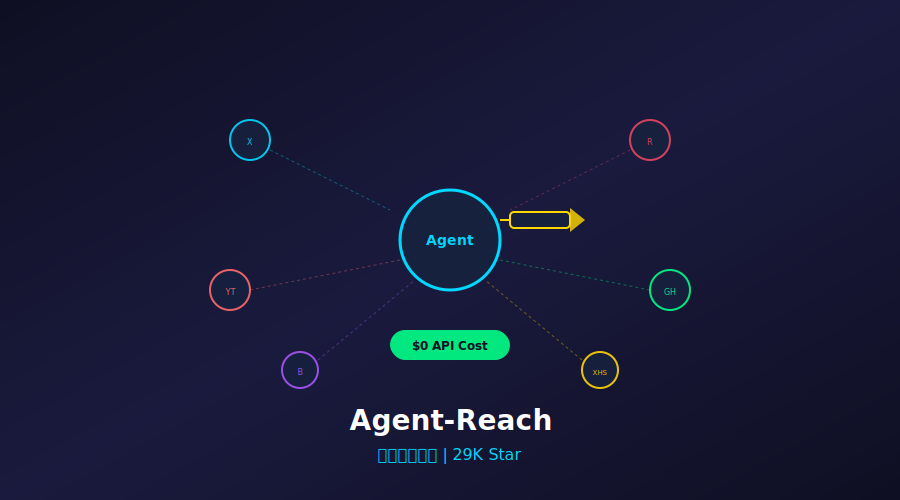
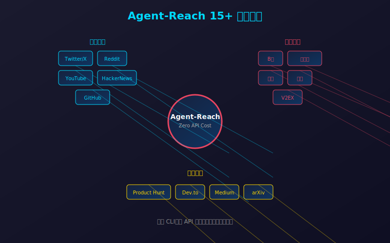
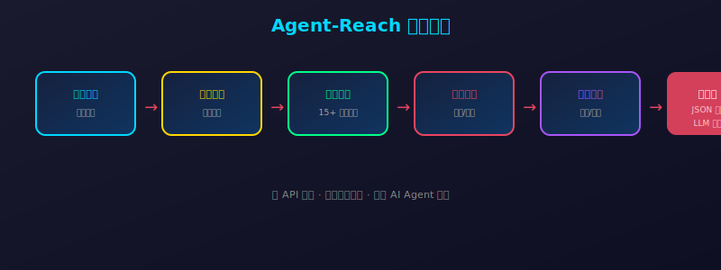

# 29K Star！零 API 费用，给 AI Agent 装上"眼睛"，全网信息一键搜！



> **项目速览**
> - 项目：Panniantong/Agent-Reach
> - GitHub：[github.com/Panniantong/Agent-Reach](https://github.com/Panniantong/Agent-Reach)
> - Stars：**29,000+** | 日增：约 +1,045 | Fork：3,200+
> - 创建时间：2026 年初
> - 核心标签：AI Agent / 全网搜索 / 零费用 / 多平台聚合

---

## 一、开篇：你的 AI Agent 是个"瞎子"

2026 年，AI Agent 能写代码、能画图、能分析数据，但有一个致命缺陷：**它看不见外面的世界。**

你问它"今天有什么科技新闻"，它只能回答训练数据里的旧闻。

你问它"Twitter 上大家在讨论什么"，它一脸茫然。

你问它"这个 GitHub 项目最近有什么更新"，它只能瞎编。

**为什么？因为大多数 AI Agent 没有联网能力。**

即使有些 Agent 号称能搜索，也是调用昂贵的搜索 API——Google Search API 每月前 1000 次免费，之后 $5/1000 次。Bing API 更贵。对于需要频繁获取信息的 Agent，这笔费用很快就成了负担。

**Agent-Reach 想解决这个问题：零 API 费用，让 AI Agent 真正"看见"全网信息。**

2026 年初开源，迅速收获 29K Star，日增 1000+。它的口号很简单：**"One CLI, Zero API Cost, All Platforms."**

---

## 二、Agent-Reach 是什么？

一句话：**Agent-Reach 是一个给 AI Agent 装上"眼睛"的开源工具，一键搜索 Twitter、Reddit、YouTube、GitHub、B站、小红书等 15+ 平台，完全零 API 费用。**

它解决的核心痛点：

| 痛点 | 传统方案 | Agent-Reach 方案 |
|------|---------|-----------------|
| Agent 无法获取实时信息 | 调用搜索 API，费用高昂 | 零费用，直接抓取 |
| 单一平台信息片面 | 只搜 Google，错过社媒讨论 | 15+ 平台同时搜索 |
| 搜索结果质量差 | SEO 污染严重 | 聚合真实用户信号 |
| 集成复杂 | 每个平台一个 API | 一个 CLI 搞定所有 |

**Agent-Reach 的核心设计：不是调用平台 API，而是模拟真实用户行为获取公开信息。**



---

## 三、五大核心亮点

### 1. 15+ 平台全覆盖，真正的"全网"搜索

Agent-Reach 支持的平台清单：

- **英文社区**：Twitter/X、Reddit、YouTube、Hacker News、GitHub、Stack Overflow
- **中文社区**：B站、小红书、知乎、微博、V2EX
- **专业平台**：Product Hunt、Dev.to、Medium、 arXiv

```bash
# 搜索所有平台
agent-reach search "AI Agent 2026 趋势"

# 指定平台
agent-reach search "Rust 教程" --platforms bilibili,zhihu

# 搜索 GitHub 最新项目
agent-reach search "vector database" --platforms github --sort stars
```

**一个命令，全网信息尽在掌握。**

### 2. 零 API 费用，成本降为 0

这是 Agent-Reach 最狠的地方。

传统方案：
- Google Custom Search API：$5/1000 次
- Twitter API：$100/月起
- Reddit API：限速严格，商用需付费
- YouTube Data API：配额有限

**Agent-Reach：$0。**

它通过模拟浏览器行为、解析公开页面、利用平台公开接口获取数据。不需要申请任何 API Key，不需要绑定信用卡。

```bash
# 安装即用，零配置
pip install agent-reach

# 直接搜索，不花一分钱
agent-reach search "OpenAI 最新动态"
```

### 3. 真实信号聚合，过滤 SEO 垃圾

传统搜索引擎最大的问题是 SEO 污染。搜索结果前 10 条里，可能有 8 条是营销号。

Agent-Reach 的解决方案：**聚合真实用户信号。**

```python
from agent_reach import search

results = search(
    query="best AI coding assistant 2026",
    platforms=["reddit", "hackernews", "twitter"],
    min_upvotes=50,  # 只取高赞内容
    time_range="30d"  # 最近 30 天
)

# 结果按真实用户互动排序
for r in results:
    print(f"[{r.platform}] 👍{r.upvotes} 💬{r.comments}")
    print(f"标题: {r.title}")
    print(f"链接: {r.url}\n")
```

**它不只是搜索，它是在帮你做信息筛选。**

### 4. 专为 AI Agent 设计，输出结构化

Agent-Reach 的输出格式专为 LLM 优化：

```json
{
  "query": "AI Agent 2026 趋势",
  "results": [
    {
      "platform": "twitter",
      "author": "@ai_researcher",
      "content": "2026 年 Agent 的三大趋势：1. MCP 协议标准化...",
      "engagement": {
        "likes": 2341,
        "retweets": 567,
        "replies": 89
      },
      "timestamp": "2026-06-10T14:23:00Z",
      "url": "https://twitter.com/..."
    }
  ],
  "summary": {
    "total_results": 156,
    "platforms_covered": 8,
    "time_range": "2026-06-01 to 2026-06-15"
  }
}
```

LLM 拿到这样的结构化数据，可以直接做分析、总结、推理。

### 5. 与主流 Agent 框架无缝集成

Agent-Reach 提供了 LangChain、AutoGen、CrewAI 等主流框架的集成：

```python
from langchain.tools import Tool
from agent_reach import search

# 创建 LangChain 工具
agent_reach_tool = Tool(
    name="agent_reach",
    func=lambda q: search(q, platforms=["twitter", "reddit", "github"]),
    description="搜索全网实时信息，包括社交媒体、技术社区、代码仓库"
)

# 添加到 Agent
agent = initialize_agent(
    tools=[agent_reach_tool, ...],
    llm=ChatOpenAI(),
    agent=AgentType.ZERO_SHOT_REACT_DESCRIPTION
)

# Agent 现在可以获取实时信息了！
agent.run("最近一周 AI 领域有什么重要发布？")
```



---

## 四、技术实现揭秘

Agent-Reach 的架构设计非常巧妙：

### 核心架构

```
用户查询 → 平台选择 → 并行抓取 → 数据清洗 → 信号聚合 → 结构化输出
```

1. **智能平台选择**：根据查询内容自动选择最相关的平台
2. **并行抓取**：异步并发，15 个平台同时搜索
3. **数据清洗**：去除广告、过滤垃圾内容、统一格式
4. **信号聚合**：综合点赞、评论、转发、星标等指标排序
5. **LLM 优化输出**：结构化 JSON，方便 Agent 直接消费

### 反反爬策略

Agent-Reach 内置了多种策略确保稳定获取数据：

```python
# 请求轮换策略
class RequestRotator:
    def __init__(self):
        self.user_agents = [...]  # 100+ 真实 User-Agent
        self.proxies = [...]       # 可选代理池
        self.delays = [1, 2, 3]   # 随机延迟
    
    async def fetch(self, url):
        headers = {
            'User-Agent': random.choice(self.user_agents),
            'Accept-Language': 'en-US,en;q=0.9',
        }
        await asyncio.sleep(random.choice(self.delays))
        return await session.get(url, headers=headers)
```

---

## 五、社区反响

Agent-Reach 的零费用策略，在开发者社区引发了热烈讨论：

> "终于不用每个月给 Google 交搜索 API 的钱了。Agent-Reach 搜得还更全。" —— Hacker News 用户

> "我把 Agent-Reach 集成到公司的客服 Agent 里，它现在能实时查产品评价、社区反馈，回复准确率高了不止一个档次。" —— Reddit r/AI_Agents

> "零 API 费用不是噱头，是真的零费用。用了两个月，账单还是 $0。" —— Twitter @indie_hacker

Star 增长数据：
- **2026 年 1 月**：开源发布，首周 5K Star
- **2026 年 3 月**：支持平台扩展到 15+，突破 15K
- **2026 年 5 月**：LangChain 官方集成，突破 25K
- **2026 年 6 月**：29K Star，日增稳定在 1000+

---

## 六、快速上手

```bash
# 1. 安装
pip install agent-reach

# 2. 基础搜索
agent-reach search "Python 异步编程最佳实践"

# 3. 指定平台
agent-reach search "AI 绘画工具对比" --platforms zhihu,xiaohongshu

# 4. 限制时间范围
agent-reach search "OpenAI 新模型" --time-range 7d

# 5. 输出 JSON（方便 Agent 消费）
agent-reach search "Rust Web 框架" --format json --output results.json
```

**Python API 使用：**

```python
from agent_reach import search, SearchConfig

# 基础搜索
results = search("best practices for RAG")

# 高级配置
config = SearchConfig(
    platforms=["github", "reddit", "hackernews"],
    min_upvotes=20,
    time_range="30d",
    max_results_per_platform=10
)
results = search("LLM 微调技巧", config=config)

# 遍历结果
for r in results:
    print(f"平台: {r.platform}")
    print(f"标题: {r.title}")
    print(f"互动: 👍{r.engagement.likes} 💬{r.engagement.comments}")
    print(f"摘要: {r.summary}\n")
```

**与 OpenAI Agent 集成：**

```python
import openai
from agent_reach import search

def agent_with_realtime_info(query):
    # 1. 获取实时信息
    realtime_data = search(query, platforms=["twitter", "reddit"])
    
    # 2. 送入 LLM
    response = openai.chat.completions.create(
        model="gpt-4",
        messages=[
            {"role": "system", "content": "你是一位科技分析师。请基于以下实时信息回答问题。"},
            {"role": "user", "content": f"实时信息：\n{realtime_data}\n\n问题：{query}"}
        ]
    )
    
    return response.choices[0].message.content

# 使用
answer = agent_with_realtime_info("2026 年 AI Agent 领域最新趋势是什么？")
print(answer)
```

---

## 七、写在最后

Agent-Reach 的 29K Star，揭示了一个被忽视的事实：**AI Agent 的"感知层"，和"推理层"同样重要。**

再聪明的 Agent，如果只能看到训练数据里的旧信息，也做不出好决策。

Agent-Reach 用零费用的方式，解决了 Agent 的"视力"问题。15+ 平台覆盖，让 Agent 不再局限于单一信息源。真实信号聚合，让 Agent 能过滤噪音、看到本质。

它的意义不止是一个搜索工具。它代表了 AI Agent 基础设施的一个重要方向：**开放、免费、去中心化的信息获取能力。**

当每个 Agent 都能零成本地"看见"全网信息时，AI 应用的能力边界将被大大拓展。

**GitHub 地址**：[github.com/Panniantong/Agent-Reach](https://github.com/Panniantong/Agent-Reach)

---

*本文数据截至 2026 年 6 月 15 日。Star 数实时变化，以 GitHub 页面为准。*

---

> 如果本文让你对 AI Agent 信息获取有了新想法，欢迎点赞👍、在看、转发三连！你的 Agent 现在是怎么获取实时信息的？评论区分享你的方案～
