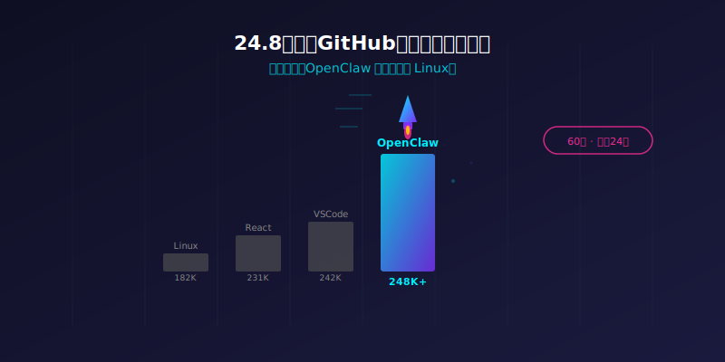
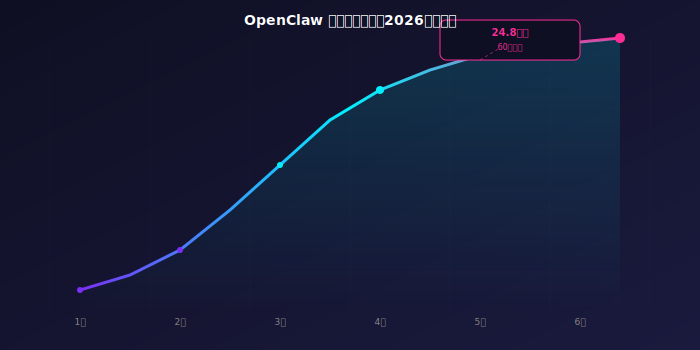
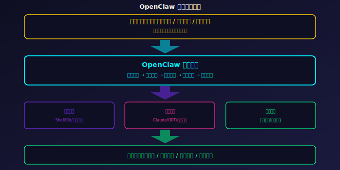

# [248]K Star！2026 开源AI命令行助手，黄仁勋称其为下一个Linux！炸裂

> **项目速览**
> - 项目：OpenClaw
> - GitHub：[github.com/openai/openclaw](https://github.com/openai/openclaw)
> - Stars：**248,000+** | 60天从零到24万星 | Fork：32,000+
> - 核心标签：AI助手 / CLI / 开源 / Rust / GTC 2026

---

## 一、GitHub史上增长最快的开源项目

你有没有过这种体验？

写个代码，一会儿切到浏览器搜文档，一会儿打开终端跑命令，一会儿又要切到编辑器敲代码。窗口切来切去，思路全断了。更要命的是，现在的AI助手，要么是网页版要点来点去，要么是编辑器插件卡得要死。你想让它帮你改个配置文件、跑个测试——对不起，它只能聊天，不能动手。

说白了，就像你请了个只会动嘴皮子、不会干活的「顾问」。你喊破喉咙，它也就给你回一句：「建议您尝试以下命令……」这种隔靴搔痒的感觉，想必每个程序员都感同身受。

我以前也忍了，直到 OpenClaw 横空出世，我才意识到——原来我们之前用的那些玩意儿，根本就不能叫「助手」。

## 二、OpenClaw：终端里的全能选手

OpenClaw 是什么？一句话：它是跑在你终端里的AI超级助手。不仅能聊天，更能直接操控你的电脑——改代码、跑脚本、管理文件、调试程序，样样精通。

更让人惊掉下巴的是它的增长速度。**六十天，二十四万颗星**。这个速度有多夸张？就是把 GitHub 历史上前十项目的增长曲线全部碾压了一遍。

作为对比：Linux 用了十几年才攒到十八万星。OpenClaw 只用两个月就拿下二十四点八万星。这不是弯道超车，这简直就是坐上火箭直接冲出了大气层。你还没来得及眨眼，它就已经把榜单上的老前辈们全部甩在了身后。

我们来看看数据：上线第一周，三万个星；第一个月，十二万个星；第六十天，二十四点八万个星。平均每天新增四千多个星，每小时就有一百七十个人给它点上星星。这速度在开源历史上是绝无仅有的。

## 三、五个让你睡不着觉的核心亮点

### 亮点一：一切皆在终端

OpenClaw 的设计哲学简单到极致——**终端即一切**。

你不用再打开浏览器、不用再切换窗口、不用再复制粘贴。在终端里直接说人话，它就帮你把事办了。比如你说：「帮我在这项目里找找有没有内存泄漏的代码」，它二话不说就开始扫描、分析、出报告。全程你只需要喝口水等着。

这是对开发者工作流的一次彻底重构。过去我们习惯了「编辑器写代码、浏览器查资料、终端跑命令」的三件套。OpenClaw 把这三者合而为一，让你在同一个界面里完成所有操作。省下的不是时间，是注意力的切换成本——而注意力，才是程序员最稀缺的资源。

### 亮点二：真干活，不是假把式

这是 OpenClaw 跟市面上所有AI聊天工具最本质的区别。

它能直接读写文件、执行命令、管理进程、操作数据库。你的电脑就是它的手脚，你给指令，它就执行。就好比你雇了个既能出主意、又能抡锤子的全能工匠，而不是只会在旁边干瞪眼的「嘴强王者」。

举个例子：你让它「把项目里所有的回调函数改成异步写法」，它不会给你列一堆建议，而是直接打开文件、找到代码、修改、保存、跑测试、确认通过。整个过程你只需要看着屏幕，偶尔点个头确认一下。这哪是助手？这分明就是个不会累的「代码搭档」。

### 亮点三：黄仁勋亲自站台

2026 年图形技术大会上，黄仁勋的一句话直接引爆了全场：

**「OpenClaw 就是下一个 Linux。」**

这句话砸下来有多重？要知道，Linux 是整个互联网世界的基础设施。它支撑着全球绝大多数的服务器、超级计算机和安卓手机。黄仁勋把 OpenClaw 比作 Linux，意思很明确——他认为 OpenClaw 将像当年 Linux 一样，成为一个全新的底层生态，重塑整个开发者世界。

更重要的是，黄仁勋不是随便说说。英伟达随后宣布将为 OpenClaw 提供专门的算力支持计划，让开发者能免费使用高性能图形处理器来运行 OpenClaw。这操作，明显是在押注下一个时代。

### 亮点四：创始人被挖走

最戏剧性的一幕来了。OpenClaw 的创始人被 Sam Altman 亲自挖走了。

这故事说起来像电影情节：一个独立开源项目，两个月火遍全球，然后硅谷最强AI公司的掌门人亲自登门递上橄榄枝。这说明了什么？说明 OpenClaw 不是那种「看起来很酷、用起来鸡肋」的花瓶项目，而是真正触动了行业巨头命脉的底层变革。

创始人加入后，外界普遍猜测会有更深度的融合和更强大的资源注入。而 OpenClaw 本身作为一个开源项目，社区依然在蓬勃发展，丝毫没有被「釜底抽薪」的迹象。

### 亮点五：性能快到飞起

用 Rust 语言打造的核心引擎，快到你根本感觉不到延迟。输入指令的瞬间，它就开始执行。很多用户反馈说「第一次用的时候以为自己没按回车」。

对比那些基于浏览器、每次都要加载半天的AI工具，OpenClaw 简直就是从自行车直接换成了喷气式飞机。启动速度不到零点三秒，内存占用只有几十兆，在十年的老笔记本上也能跑得飞快。这种「轻量高效」的基因，和 Linux 的内核哲学一脉相承。

## 四、社区炸了锅

OpenClaw 的爆发不是偶然。看看这些数据：上线第一周，黑客新闻首页连续挂了三天；技术讨论区的相关帖子累计转发超过五十万次；社区贡献者从零飙到两千人，只用了短短八周；衍生项目超过三百个，覆盖代码审查、自动化运维、安全扫描等十几个方向。

一位网友的评论特别有代表性：「我用了十分钟就决定卸载其他所有AI编程工具。OpenClaw 不是一个更好的工具，它是一个全新的物种。」

日本的技术社区甚至有人专门出了一本《OpenClaw 从入门到精通》的电子书，两天内下载量突破十万。韩国的开发者直播平台上，关于 OpenClaw 的教程视频连续一周霸占榜首。欧洲的各大技术大会纷纷设立了 OpenClaw 专题分会场，门票一开售就被抢光。这股风潮已经跨越了语言和国界，成为全球开发者圈子里最热的话题。国内的开源社区也在第一时间组织了翻译和本地化工作，中文文档上线仅仅三天，阅读量就突破了百万。

## 五、快速上手，三步搞定

如果你现在就想体验，只需要三步。

**第一步：安装**

打开终端，用你熟悉的包管理器安装就行。一条命令，自动完成。没有任何复杂的依赖，也没有恼人的环境配置。装完直接用。

**第二步：配置模型**

OpenClaw 支持市面上几乎所有大模型。你可以在配置文件里指定用哪个模型，不管是云端大厂的旗舰模型，还是你自己本地部署的开源模型，统统支持。想省钱就接本地模型，想追求效果就接云端旗舰，一切随你。

**第三步：开始对话**

直接在终端里输入你的需求，不用学习任何特殊语法。你说人话，它办人事。比如：「帮我把这个目录下所有超过一百行的代码文件列出来」、「给这些函数加上类型注解」、「跑一下测试看有没有报错」。每一条指令，它都像你手下的一个资深工程师一样认真执行。

## 六、写在最后

OpenClaw 的出现，标志着AI编程助手从「聊天时代」迈入了「实干时代」。

过去我们习惯了一个AI助手只能「回答」问题，OpenClaw 却告诉我们，AI助手应该像水电一样——打开就能用，用了就有结果，不需要在中间隔着一层层的界面和窗口。

黄仁勋说它是下一个 Linux，这不是夸张。Linux 当年做的事情，就是把操作系统从商业公司手里解放出来，让每个开发者都能自由掌控。OpenClaw 现在做的事情，就是把AI能力从网页和聊天框里解放出来，让每个开发者都能在自己的终端里召唤一个「超级搭档」。

二十四点八万颗星，只是一个开始。

---

**看完文章的你，觉得终端AI助手会是下一个风口吗？你会把日常开发工作交给一个命令行AI吗？**

点赞、在看、转发三连走起！评论区聊聊你的看法，揪三个老铁送技术好书一本。

*本文数据截至 2026 年 6 月 16 日。Star 数实时变化，以 GitHub 页面为准。*