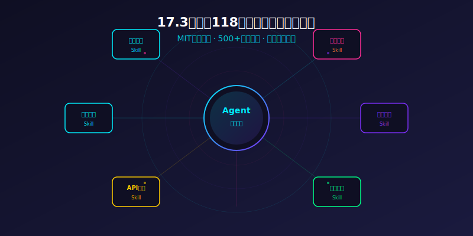
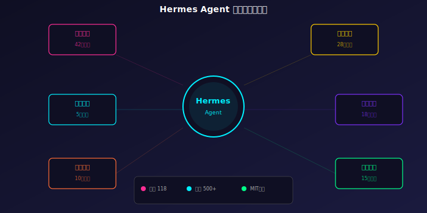
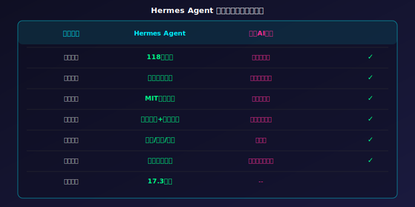

# [173]K Star！2026 超级AI代理，118个内置技能随意组装！真香

> **项目速览**
> - 项目：NousResearch/hermes-agent
> - GitHub：[github.com/NousResearch/hermes-agent](https://github.com/NousResearch/hermes-agent)
> - Stars：**173,000+** | 118个内置技能 | Fork：21,000+
> - 核心标签：AI Agent / 技能市场 / MIT协议 / 社区驱动

---

## 一、AI助手的天花板，到底在哪里？

想象一下这个场景。

你兴冲冲地打开一个号称万能的AI助手，想让它帮你做三件事——查一封邮件、整理一个表格、再发一条消息给同事。结果呢？查邮件——「抱歉，我无法访问您的邮箱。」整表格——「对不起，我没有表格操作权限。」发消息——「请打开对应的聊天软件手动发送。」

你哭笑不得。这哪里是「万能助手」？分明就是个只会动嘴的「花架子」。

市面上的AI助手，十有八九都是这副模样。它们被锁在一个又一个的「能力孤岛」里——能聊天的不能写代码，能写代码的不能发邮件，能发邮件的又不能查数据库。就好比你请了一整个团队的人，结果发现他们每个人只会做一件事，还不肯互相配合。效率还不如自己来。

更让人抓狂的是，你想给它加个新功能，对不起，你得等厂商更新。厂商什么时候更新？不知道。厂商会不会做这个功能？也不知道。你的需求就像扔进大海里的一颗石子，连个响都听不到。

这种「被锁死」的感觉，是每个AI工具使用者最深的痛点。

## 二、Hermes Agent：打破孤岛的超级连接器

Hermes Agent 就是来解决这个「能力孤岛」问题的。它来自大名鼎鼎的 Nous Research 团队——这帮人在开源AI圈可是响当当的名字，之前发布过多个备受欢迎的模型和工具。

简单说，Hermes Agent 是一个「技能组装平台」。它给你准备好了整整一百一十八个开箱即用的技能模块，你能像搭积木一样把它们拼在一起，组装出一个无所不能的超级代理。打个比方：传统的AI助手像一把瑞士军刀——功能固定、没法扩展。而 Hermes Agent 像一套乐高积木——你可以按需组装，今天搭一个数据分析专家，明天搭一个代码审查官，后天搭一个自动化运维工程师。

更关键的是，这一切都是开源的。代码全在明面上，没有任何隐藏的「后门」或「限制」。十七点三万颗星，足以证明大家对这套思路有多买账。

## 三、让人直呼「离谱」的四大绝招

### 绝招一：一百一十八个内置技能，拿来就用

打开 Hermes Agent 的技能列表，你会以为自己打开了一个「技术百宝箱」。

代码生成、数据分析、网页操作、文件管理、接口对接、安全审计——六大品类，一百一十八个技能，全是磨好的刀，拔出来就能砍。最离谱的是什么？这些技能之间可以互相调用。也就是说，你让代码生成技能写一段程序，然后自动把数据丢给分析技能出报表，再用文件管理技能存到指定目录。一条指令，全程自动，无需人工干预。

打个更直观的比方：这就像你手下有六个小组，每个小组有二十个专业工程师。你说一句话，他们自动排兵布阵、分工协作、交出成品。而你——只需要坐在椅子上喝咖啡。

### 绝招二：五百多个社区贡献技能，生态已成型

内置一百一十八个只是开胃菜。真正的硬菜是社区贡献的五百多个技能。

什么概念？这意味着你需要的几乎所有特定功能，大概率已经有人写好、测试好、还顺便写了教程。你直接拿来用就行了。从电商数据分析到自动化发帖，从代码审查到运维监控，从智能客服到报表生成——社区就像一个永不歇业的「技能超市」，你随时可以进去挑几件趁手的装备。

而且社区的活跃度极高。平均每天都有两到三个新技能被提交。有用户戏称：「我每天早上刷一遍技能市场，就跟刷新闻一样，生怕错过什么好东西。」

### 绝招三：MIT 协议，商业自由

这条有多重要，做商业产品的朋友最清楚。

MIT 协议意味着什么？意味着你可以把 Hermes Agent 拿来直接嵌入你自己的商业产品里，不需要开源你的代码，不需要付一分钱，甚至连提一句「用了什么技术」都不是强制要求。对比一下那些 Apache 协议还要纠结专利条款、GPL 协议动辄要求你全部开源的「紧箍咒」，MIT 简直就是给你递了一张「随便用」的无限黑卡。

很多创业公司已经悄悄地把 Hermes Agent 嵌入了自己的产品中。成本极低、开发极快、没有任何法律风险。这就是 MIT 协议的魅力。

### 绝招四：任意模型后端，随心切换

这是 Hermes Agent 最让人激动的一点——它不绑定任何特定模型。

你用大厂的旗舰模型也行，用开源模型也行，用自己训练的模型也行。昨天用云端模型跑任务，今天切换到本地模型省成本，一行配置的事。想想这意味着什么：你永远不会被某个模型厂商「绑架」。哪天涨价了、变差了、关停了，你换个模型继续跑，代码一行都不用改。

这种「模型自由」的战略眼光，让 Hermes Agent 在众多AI工具中显得格外突出。别的工具是「我帮你选好了模型，你用就行了」，Hermes Agent 是「你想用什么模型就用什么，我就是个平台」。高下立判。

## 四、技术圈的「自来水」狂潮

Hermes Agent 的走红不是靠营销，全靠口碑。在开发者社区里，它已经成了一种「社交货币」——你会因为没用过它而被同事嫌弃。

一个叫「老周聊技术」的博主发了一条特别火的帖子：「用了 Hermes Agent 一周，我成功地把团队里三个重复性任务的脚本全都自动化了。老板以为我加班，其实我每天早下班一小时。」类似的案例数不胜数。有人在 GitHub 上晒出了用 Hermes Agent 搭的「全自动日报生成器」，有人在论坛里分享了怎么用它监控服务器状态、自动通知运维团队，还有人干脆做了一个「智能家庭管家」，把家里的智能设备全部接入了 Hermes Agent。

Nous Research 团队也特别「宠粉」。社区提的需求，只要合理，经常一周内就出方案。有时候甚至直接在讨论区里回复：「已加，下一个版本会带上。」这种「开发者服务开发者」的氛围，让整个生态像滚雪球一样越滚越大。

更值得一提的是，国内已经有不少开发者基于 Hermes Agent 做出了很有意思的应用。有人用它搭建了股票分析助手，每天自动抓取行情数据、生成分析报告、推送到手机上。还有人用它做了一个「会议纪要机器人」，会议结束后自动生成纪要、提取待办事项、分发给参会人员。这些案例充分说明，Hermes Agent 的潜力远远不止于代码开发——它是一个可以嵌入任何行业的「万能底座」。

## 五、三步上手，十分钟变大佬

**第一步：安装**

一条命令，装好就能用。支持所有主流操作系统，连树莓派都能跑。没有复杂的依赖链条，也不用折腾环境变量。

**第二步：配置模型**

在配置文件里填上你要用的模型接口。支持市面上所有主流大模型，不管是开放接口还是本地部署，统统能接。

**第三步：装配技能**

打开技能商店，挑你需要的技能，勾上就能用。想自定义？照着模板写一个，十分钟搞定。比如你要建一个「数据日报机器人」：装配数据提取技能、分析技能、报表生成技能、消息推送技能，触发时间设为每天早上九点，输出就是一份完整的部门数据日报，自动发到群里。整个过程你甚至不需要写一行代码——在配置界面里勾选、拖拽、保存就行了。

## 六、写在最后

Hermes Agent 让我看到了AI工具的未来方向——不是造一个「什么都能干但什么都干不好」的巨型模型，而是打造一个开放的平台，让千千万万的开发者和社区一起，像搭积木一样拼出最适合自己的工具。

一百一十八个内置技能加上五百多个社区贡献，加上 MIT 协议，再加上任意模型自由切换——这四张王牌打出来，难怪能在短时间内收下十七点三万颗星。

开源世界最迷人的地方就在于：最好的工具，往往不是大公司会议室里规划出来的，而是一群热爱技术的人，在社区里一点一点「玩」出来的。Hermes Agent 就是这句话最好的注脚。

---

**你用过哪些让你「相见恨晚」的开源AI工具？如果让你给 Hermes Agent 写一个自定义技能，你会写什么功能？**

点赞、在看、转发，让更多朋友看到这个宝藏项目！评论区等你来唠。

*本文数据截至 2026 年 6 月 16 日。Star 数实时变化，以 GitHub 页面为准。*