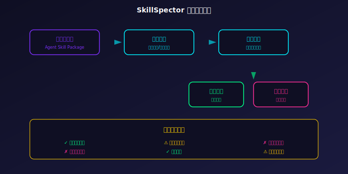
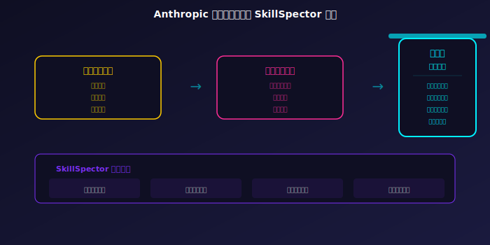

# [6]K Star！2026 AI技能安全卫士，英伟达出品漏洞零容忍！硬核

> **项目速览**
> - 项目：NVIDIA/SkillSpector
> - GitHub：[github.com/NVIDIA/SkillSpector](https://github.com/NVIDIA/SkillSpector)
> - Stars：**6,000+** | 本周 +3,669 | Fork：460+
> - 核心标签：AI安全 / 技能扫描 / 漏洞检测 / Agent安全

---

## 一、AI代理的「定时炸弹」

先讲一个真实的故事。

上个月，一个开发者从社区下载了一个看起来很实用的AI代理技能包——「一键生成测试用例」。装上之后，测试用例确实生成了，测试也跑得飞快。一切看起来完美无缺。直到有一天，他发现服务器上多了几个莫名其妙的进程，数据库里的用户数据被悄悄地打包上传到了一个陌生的地址。

他下载的那个技能包里，藏了一段恶意代码。表面上是帮你写测试，背地里在偷你的数据。这就是AI代理时代最恐怖的「特洛伊木马」——AI技能包。它们看起来人畜无害，功能诱人，但肚子里可能藏着你想都想不到的陷阱。

更可怕的是，这种事情并不是个例。随着AI代理生态的爆发，技能包的数量正在以指数级增长。每天都有成千上万个新技能被上传到各种社区平台。而目前，绝大多数开发者在安装这些技能包时，根本不做任何安全检查。

不是不想查，而是没法查。代码量太大，看不完；恶意行为太隐蔽，看不出来；依赖链太复杂，查不清。这就好比你在一个没有安检的机场里，每天几万人进进出出，你怎么知道谁是好人、谁是坏人？

## 二、SkillSpector：英伟达亮出的「照妖镜」

就在整个行业还在为AI代理的便利性欢呼雀跃的时候，英伟达悄悄掏出了一件利器——SkillSpector。

这是一款专门为AI代理技能包设计的安全扫描器。它就像一个安检门，每一个想要进入你系统的技能包，都必须先过它这一关。静态分析、沙箱执行、威胁情报匹配——三管齐下，把技能包里的每一行代码、每一个行为都扒得干干净净。是骡子是马，拉出来一验便知。

虽然目前只有六千多颗星，但本周就暴涨了三千六百多颗。这增速说明什么？说明大家终于意识到了——AI代理的安全问题，已经不是「将来有一天可能会发生」，而是「现在正在发生」。火烧眉毛了，才想起要找灭火器。而 SkillSpector，就是英伟达递过来的那个灭火器。

## 三、五大硬核能力，一个都不能少

### 能力一：静态代码分析

这是第一道防线。SkillSpector 会把技能包的代码从头到尾过一遍，检查有没有可疑的函数调用、有没有异常的权限请求、有没有嵌入了不该有的网络地址。就像一个经验丰富的安检员，不用打开你的箱子，光看轮廓就能判断里面有没有违禁品。

它还能识别代码中的「混淆」技巧——很多恶意代码会故意把函数名写得很乱，让人看不懂。SkillSpector 的静态分析引擎不吃这一套，不管你怎么藏，它都能揪出来。

### 能力二：动态沙箱执行

光看代码还不够，因为有些恶意行为只在特定条件下才会触发。所以 SkillSpector 会把技能包丢进一个隔离的沙箱环境里跑一遍，看它到底会做什么。

比如，它会故意触发技能的「删除文件」功能，看这个技能会不会趁机去删不该删的东西。它会在沙箱里放几个「诱饵文件」，看技能有没有偷偷访问。它还会模拟各种边界条件——时间到了凌晨三点、系统内存不足、网络突然断开——看技能在这些极端情况下会不会暴露出恶意行为。

这个沙箱环境是完全隔离的，里面的任何操作都不会影响到你的真实系统。就算技能包里藏了核弹级别的恶意代码，也炸不到你一根毫毛。

### 能力三：威胁情报匹配

英伟达手里握着一份持续更新的AI安全威胁情报库。每次扫描，SkillSpector 都会把结果和情报库做比对，看看有没有匹配到已知的恶意模式。这就像警察查身份证——先在数据库里跑一圈，看看这人有没有前科。

而且这个情报库是实时更新的。今天发现的新攻击手法，明天就能被 SkillSpector 识别出来。英伟达的安全团队和全球的网络安全社区保持着紧密合作，确保情报库始终走在攻击者的前面。

### 能力四：权限越界检查

很多恶意技能包的套路是这样：明明只需要读写一个文件夹，它却申请了整个文件系统的权限。明明只需要本地运行，它却留了一个远程连接的接口。明明只需要读取数据，它却偷偷申请了写入权限。

SkillSpector 会自动分析技能的权限声明和实际使用情况，发现「权限越界」就立刻报警。绝不让一个技能拿到超出它需要的权限。这个功能的精妙之处在于，它不只是看「申请了什么权限」，而是对比「申请了」和「实际需要」之间的差距。那些「多要」的权限，就是最可疑的地方。

### 能力五：依赖链溯源

一个技能包可能依赖几十个第三方库，而每个库又可能依赖更多库。这条依赖链上任何一环被污染，整个技能包都不安全。SkillSpector 能沿着依赖链一层层往上追溯，直到确认每一环都是干净的。这就像查食品供应链——从餐桌一路查到田间地头，确保没有哪个环节出了问题。

在实际使用中，这个功能已经被证明非常有效。有一次，它发现了一个技能包引用的某个底层日志库在两个月前被植入了一段恶意代码——而那个日志库本身有超过十万的使用者，居然没有一个人发现。SkillSpector 顺着依赖链一路追了下去，精准地定位了污染源。

## 四、呼应 Anthropic 的第三层安全

这里有个很有意思的背景。

Anthropic 在 2025 年底提出了一个「AI代理三层安全模型」。第一层是用户安全，解决身份认证和权限控制的问题。第二层是模型安全，防止提示注入和输出过滤被绕过。第三层是技能安全——也就是防止AI代理使用的工具和技能本身藏有漏洞或恶意代码。

SkillSpector 恰好就是为第三层安全量身定做的。换句话说，这不是英伟达一拍脑袋想出来的项目，而是整个行业在AI安全方向上的一次集体共识。只不过英伟达动作最快，先把工具甩了出来。

Anthropic 的安全团队甚至在公开场合提到过这个项目，表示「社区中有像 SkillSpector 这样的工具，是推动整个行业安全水平提升的重要力量」。来自竞争对手的认可，往往比自家宣传更有说服力。

## 五、社区反应：从「没听过」到「必装」

一周前，大多数开发者还不知道 SkillSpector 是什么。一周后，它已经成了很多AI代理开发者的「装机必备」。

在 Hacker News 讨论区里，一位开发者留言说：「我拿 SkillSpector 扫了一下我上个月装的三个技能包，结果发现其中一个居然在偷偷往外部发请求。吓得我赶紧卸了。」另一位开发者说：「之前一直觉得自己的技能包应该没问题，扫完之后才发现有一个依赖库的版本已经一年没更新了，里面有两个已知漏洞。要不是 SkillSpector，我可能到现在都不知道。」

安全研究圈子也对它评价极高。一位知名安全博主说：「这项目虽然才六千星，但它的重要性不亚于当年第一个杀毒软件。AI代理的技能生态要健康发展，离不开这种基础安全设施。用量越大，安全越重要。」

## 六、快速上手

**第一步：安装**

克隆仓库，安装依赖，一条命令搞定。英伟达特意把安装流程做得极简，就是为了降低使用门槛。

**第二步：扫描技能包**

把你要检查的技能包路径丢给它，按下回车，等着看报告就行。支持单个扫描和批量扫描两种模式。

**第三步：查看报告**

报告里会清晰地列出：哪些检查通过了（绿色），哪些需要关注（黄色），哪些有明确风险（红色）。一目了然，不需要你是安全专家也能看懂。每个风险项都有详细的说明和修复建议。

**第四步：持续监控**

把 SkillSpector 接入你的开发流程，每次安装新技能包之前自动扫描。安全这件事，最好的策略不是「出事了再补救」，而是「从一开始就防住」。

## 七、写在最后

AI代理的时代已经来了，这是毫无疑问的。但就像互联网刚兴起时没人想到会有病毒和木马一样，AI代理的技能生态里，恶意代码和安全隐患也必然会随之而来。

SkillSpector 现在只有六千颗星，但在我看来，它比很多十万星的项目都更有战略价值。因为它解决的不是「好不好用」的问题，而是「安不安全」的问题。在一个每天都有几万个新技能包涌入社区的时代，安全扫描不是锦上添花，而是生死攸关。

英伟达这次出手，真正踩准了节奏。在所有人都忙着给AI代理加功能的时候，只有少数人想到了要先给它穿上防弹衣。而 SkillSpector，就是那件防弹衣。

---

**你平时会从社区下载AI技能包来用吗？在安装之前，你会检查它的安全性吗？**

点赞、在看、转发，让更多开发者重视AI代理安全！评论区聊聊你有没有遇到过「可疑技能包」的经历。

*本文数据截至 2026 年 6 月 16 日。Star 数实时变化，以 GitHub 页面为准。*