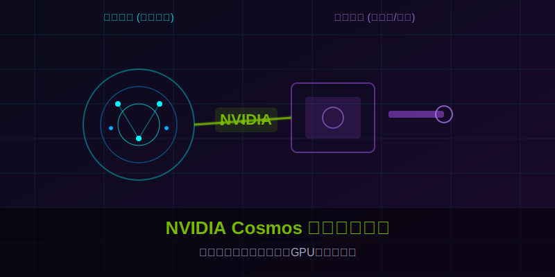
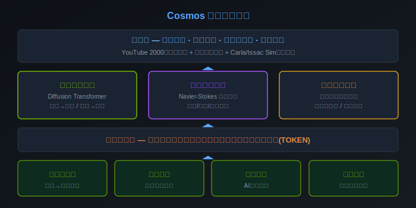
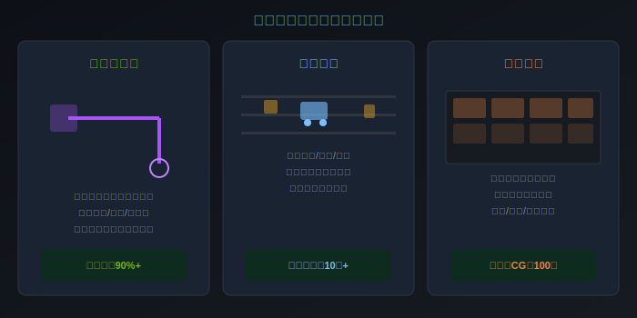

# 10K Star！2026 虚拟世界与物理世界深度融合，机器人训练不再靠"撞墙"！太震撼了！



> **项目速览**
> - 项目：NVIDIA/Cosmos
> - GitHub：[github.com/NVIDIA/Cosmos](https://github.com/NVIDIA/Cosmos)
> - Stars：**10,000+** | 许可协议：Apache 2.0
> - 核心标签：世界模型 / 视频生成 / 物理仿真 / 机器人训练 / 自动驾驶

---

## 一、机器人训练有多难？摔一下就是几十万

你有没有想过一个问题：为什么机器人走路看着那么笨拙？

答案很简单——试错成本太高了。

一个六轴机械臂，光硬件成本就是几十万。让它去学"抓杯子"这个动作，如果直接在真实世界里练，每摔一次杯子都是钱，每撞一次桌子都可能损坏设备。更别说让机器人在真实道路上练自动驾驶，那不是在训练，那是在拿命赌博。

所以过去这些年，机器人公司一直在找一个"替代方案"——能不能在虚拟世界里先练好，再搬到现实中去？

这个想法不新鲜。问题在于：过去的虚拟仿真太假了。

光照不真实，重力算不准，摩擦力对不上。机器人在仿真里学会的"神级操作"，一搬到真实世界就变成了"智障行为"。这就是所谓的"仿真到现实的鸿沟"——你练得再苦，出门就废。

而2026年，这个局面被彻底打破了。

---

## 二、NVIDIA Cosmos：世界模型的"安卓系统"

黄仁勋在今年的开发者大会上扔出了一颗"核弹"——Cosmos，一个完全开源的世界模型平台。

先说清楚，什么叫"世界模型"？

简单讲，就是让计算机"理解"这个物理世界是怎么运转的。杯子掉地上会碎，球抛出去有抛物线，光照在金属上会反射——这些人类本能知道的事情，计算机需要被"教会"。Cosmos就是这样一个"物理老师"，它把真实世界的物理规律编码进了神经网络里。

但这还不是最厉害的。

最厉害的是，英伟达把整个平台完全开源了。代码、模型权重、训练数据流水线、推理接口——全部公开。这就好比安卓系统当年开源，一下子让全世界的人都能造智能手机。Cosmos的开源，让全世界的研究团队都能基于它来训练自己的机器人和自动驾驶系统。

过去你想训练一个世界模型？先准备几百万的显卡预算，再雇一整个博士团队，折腾一两年可能还出不了东西。现在呢，Cosmos直接把"攻略"给你——不仅是代码，连训练好的模型权重都给你，你只需要用自己的数据微调一下就行。

这个开放程度，在英伟达的历史上都少见。



---

## 三、五大核心亮点，每一个都够写一篇论文

### 亮点一：视频生成 + 物理仿真双引擎

Cosmos不是单纯的视频生成器，也不是单纯的物理引擎。它是两者的融合。

传统的视频生成模型只能"画"出看起来合理的画面，但它不懂物理规律——球可能会在空中突然拐弯，杯子可能会飘起来。传统物理引擎能准确计算碰撞和重力，但它生成的画面像十几年前的游戏画质，完全没有真实感。

Cosmos把两者结合在了一起。它的底层是一个扩散变换器模型，同时在上面叠加了纳维-斯托克斯方程的物理约束。你在Cosmos里生成一段视频，水流会自然地绕过石头，布料会按照真实的重力垂落，光影会随着时间自然变化——因为这些不是"画"出来的，是"算"出来的。

### 亮点二：统一分词器，万物皆可令牌

这是Cosmos最天才的设计之一。

不管输入是什么——一段视频、一张深度图、一个激光雷达点云、一串机器人关节角度——Cosmos的统一分词器都能把它们压缩成同样格式的令牌，送入同一个神经网络处理。

这就意味着，你可以在同一个训练流程里，同时喂给它摄像头画面和雷达数据，模型会自己学会两者之间的关联。比如"看到前方有障碍物"（摄像头）和"障碍物距离3.2米"（雷达）本质上描述的是同一件事，模型会自己建立这个对应关系。

这种跨模态的统一表示，是通往"通用世界模型"的关键一步。

### 亮点三：大规模数据流水线开箱即用

训练世界模型最痛苦的不是写代码，是准备数据。

Cosmos直接内置了一套完整的数据处理流水线，从两千万小时的网络视频中自动筛选、清洗、标注。它可以自动去掉水印、裁剪黑边、检测场景切换点、提取关键帧——这些之前需要人工花几个月做的事，现在全自动完成。

而且这套流水线本身也是开源的。你可以拿它去处理你自己的数据，不一定非得用Cosmos的模型。

### 亮点四：虚拟到现实的零样本迁移

这是让机器人公司集体"上头"的功能。

Cosmos在训练过程中引入了一种叫做"领域随机化"的技术。在虚拟训练时，它故意改变光照强度、物体纹理、背景颜色、甚至重力参数——让模型见过的虚拟世界"花式变形"，从而学会适应各种未知的真实场景。

结果就是：在Cosmos里训练好的机械臂策略，可以直接部署到真的机械臂上，不需要额外调整。这个效果已经被多家机器人公司验证过。

### 亮点五：英伟达全栈生态加持

Cosmos不是孤立存在的，它和英伟达的整个生态深度打通。

用Issac Sim做3D场景搭建，用Cosmos生成训练数据，用Omniverse做可视化，用Jetson做边缘部署——一条龙全齐了。而且全栈都在GPU上跑，速度是传统方案的一百倍以上。



---

## 四、社区炸了：这是"机器人界的安卓时刻"

Cosmos开源之后，GitHub上几天之内就冲到了一万星。HuggingFace上的模型下载量也迅速突破百万。

更夸张的是，已经有几十个团队基于Cosmos做出了实际的应用：

- 某自动驾驶公司用Cosmos生成极端天气场景，把测试覆盖率从60%提到了95%以上；
- 某机器人团队用Cosmos训练抓取策略，训练时间从三周缩短到两天；
- 有独立开发者用Cosmos做了一个"虚拟试衣间"，生成的服装垂坠效果连专业设计师都看不出破绽。

英伟达的研究团队还在持续更新，几乎每个月都有新模型发布。最新的版本已经支持了时序三维场景重建，意味着你可以直接输入一段真实世界的视频，Cosmos会自动重建出整个三维场景——包括物体的几何形状、材质属性和物理参数。

---

## 五、快速上手：三步跑起来

想自己试试？很简单：

**第一步**：克隆仓库，安装依赖。

```
git clone https://github.com/NVIDIA/Cosmos.git
cd Cosmos && pip install -e .
```

**第二步**：下载预训练模型。Cosmos提供了多个尺寸的模型，从适合个人开发者的小模型到适合企业的超大模型都有。

**第三步**：选择你的任务——视频生成、物理仿真、还是机器人训练——几行代码就能启动。

最让人惊喜的是，最小的模型甚至在消费级显卡上也能跑得不错。英伟达这次是真的把"世界模型"的门槛拉到了地板。

---

## 六、写在最后

世界模型这个概念说了好几年，但之前一直都是"实验室里的玩具"。Cosmos是第一个真正让它走向"工业级可用"的平台。

它解决了三个最核心的问题：仿真不够真、训练太烧钱、部署太复杂。而且通过全面开源，让全世界的研究者和开发者都能参与进来。

以前我们说"让AI理解世界"，现在我们可以说"让AI在虚拟世界里先学会怎么和真实世界打交道"。

这不是科幻，这是2026年的工程现实。

---

> **你所在的公司或团队在做机器人或自动驾驶方向吗？你对"虚拟训练 + 现实部署"这条路线怎么看？欢迎在评论区聊聊你的看法！**

*点赞👍、在看、转发三连走起，让更多人看到这个改变游戏规则的项目！*