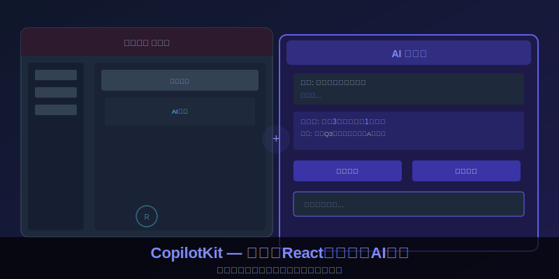
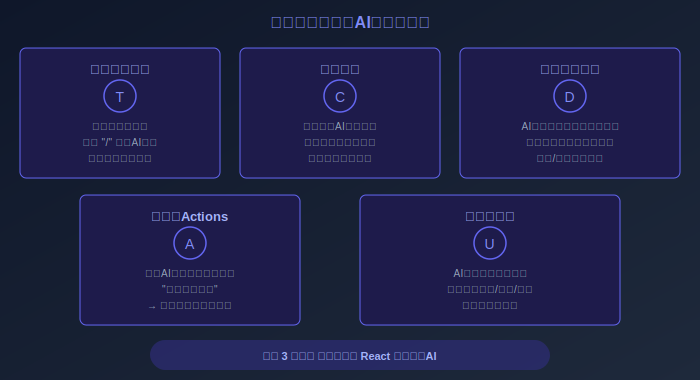

# 15K Star！2026 给你的产品装上AI大脑，一天涨粉613颗星！这框架太香了！



---

## 项目速览

> **项目速览**
> - 项目：CopilotKit
> - GitHub：[github.com/CopilotKit/CopilotKit](https://github.com/CopilotKit/CopilotKit)
> - Stars：**15,000+** | 日增：+613 | Fork：1,800+
> - 核心标签：AI副驾驶 / React框架 / 前端智能 / 大模型集成 / MIT协议

---

## 一、"能不能给我们的产品也加个AI助手？"

这句话，大概是2026年产品经理说得最多的一句话了。

用户已经被ChatGPT、Claude这些聊天工具惯坏了。他们打开任何一个软件，心里都默认应该有一个"智能助手"来帮他们做事——不管是文档编辑器里的自动续写，还是数据分析工具里的辅助洞察，还是项目管理软件里的智能排期。

需求很清晰，但实现呢？

如果你是一个前端团队，老板丢来一句话"下个月上线AI助手功能"，你的第一反应大概率是：完蛋了。

因为加一个AI功能不是放一个输入框那么简单。你需要处理对话管理、上下文维护、流式响应、多轮对话、模型切换、提示词工程、以及最重要的——把AI的输出和你现有的业务数据"打通"。随便一个环节，都够一个团队折腾几个月。

这就是为什么CopilotKit能在2026年一天涨六百多颗星——它帮开发者把上述所有痛点，用一个框架全解决了。

---

## 二、CopilotKit是什么？三句话说清楚

第一句：它是一个专门给React应用加AI能力的开源框架。

第二句：你只需要几行代码，就能在你的应用里嵌入一个完整的AI副驾驶——包括聊天面板、智能文本补全、数据协同更新、生成式界面。

第三句：它支持几乎所有主流大模型，而且你可以随时切换，完全不绑定厂商。

简单粗暴地理解：如果你的React应用是一个房子，那CopilotKit就是一套"精装修AI套件"——水电走好了、墙面刷好了、家具配齐了，你只需要搬进去住就行。


---

## 三、五大核心能力，每一个都直击痛点

### 能力一：智能文本补全 —— 比"/ "更懂你

在你的任何文本框里，用户只要输入斜杠"/"，就能触发AI辅助。和市面上那些简单的自动补全不同，CopilotKit的智能补全是"上下文感知"的。

比如用户在一个项目描述框里输入了"/帮我写一个"，CopilotKit会自动感知：当前项目的名称、之前填写的内容、这个字段的用途，然后生成对应的建议。不是一个通用的模板，而是"就在这个场景下最合适的文字"。

### 能力二：对话面板 —— 零样式烦恼

做过AI聊天界面的都知道，光是对话气泡的样式、滚动到底部的逻辑、消息状态的显示——就够你调一周的CSS。

CopilotKit直接给你一个开箱即用的聊天面板组件。拖进你的页面，立刻就能用。而且它完全可定制——颜色、字体、布局、品牌风格，想改成什么样都行。

更绝的是，它还支持"就地对话"。用户在表格的某个单元格旁边点一下，弹出的对话面板会自动带上这个单元格的上下文。这种体验，以前只有像微软Office这样的大厂产品才能做到。

### 能力三：数据协同更新 —— AI直接操控界面

这是CopilotKit最"魔法"的功能。

通常情况下，AI回复就是一段文字。用户看完之后，还需要自己动手去操作界面。但CopilotKit允许AI"直接动手"——修改表单数据、刷新图表、更新表格内容。

比如用户说"帮我把这个月的销售额按地区排序"，CopilotKit不只是"告诉你怎么做"，而是真的帮你把表格排好了。用户看到的是表格瞬间变样，而不是一段操作指南。

这种"对话即操作"的体验，是AI和传统软件最大的分水岭。

### 能力四：自定义动作 —— 你想让AI做什么都行

你可以定义任意业务操作，暴露给AI去调用。

比如在客服系统里，定义一个"查询订单状态"的动作；在数据分析工具里，定义一个"生成周报"的动作；在项目管理系统里，定义一个"创建任务"的动作。

用户只需要在对话里说"帮我查一下昨天的订单有没有异常"，AI就会自动调用对应的动作，拿到结果，再用自然语言呈现给用户。整个过程用户根本不知道背后发生了多少次接口调用。

### 能力五：生成式界面 —— 告别纯文本回复

最让人眼前一亮的功能。AI可以不只是回复文字，而是直接渲染出交互式组件——图表、卡片、表格、表单。

比如你问"这个季度的销售趋势怎么样"，AI不只是给你一段文字分析，而是直接在你的界面里画出一张折线图。你想看详细数据，点一下图上的某个点就行。

这才是真正的"AI原生界面"——不是加了一个聊天框，而是整个界面都变成了AI的表达媒介。



---

## 四、为什么社区这么疯狂？

15,000星、日增613星——这个增长速度在开源框架里绝对算得上"爆发"。

背后的原因其实很简单：

第一，需求到了。2026年，"AI副驾驶"已经从"锦上添花"变成了"标配"。没有AI能力的产品，用户会直接抛弃。

第二，门槛够低。CopilotKit把"接入AI"这件事的复杂度降到了极致。以前可能需要一个五人团队干三个月的事，现在一个前端开发花一个下午就能搞定。

第三，不锁定厂商。你可以今天用OpenAI的模型，明天换成Claude，后天换成自己部署的本地模型——CopilotKit对底层大模型的切换完全透明。

社区里已经有用户分享了把CopilotKit接入各种产品的案例：财务软件、在线教育平台、电商后台、医疗记录系统——覆盖的场景越来越广。

---

## 五、快速上手：真的只要这几步

第一步，在你的React项目里安装CopilotKit：

```
npm install @copilotkit/react-core @copilotkit/react-ui
```

第二步，用Provider包裹你的应用，配置好你要用的大模型：

```jsx
<CopilotKit runtimeUrl="/api/copilotkit">
  <YourApp />
</CopilotKit>
```

第三步，在需要的地方嵌入聊天面板：

```jsx
<CopilotPopup
  labels={{ title: "我的AI助手", placeholder: "有什么可以帮你？" }}
/>
```

就这三步，你的应用就有了一个完整的AI副驾驶。至于更高级的文本补全、数据协同、自定义动作，文档里都有详细的示例代码。

---

## 六、写在最后

AI正在从"一个独立的产品"变成"每一个产品的内置能力"。

CopilotKit在这个大趋势里扮演的角色，就像当年jQuery之于前端开发——它把一件复杂到只有大厂才能做的事，变成了任何人一个下午就能完成的任务。

如果你的产品还没有AI能力，现在就是最好的时机。不是因为你慢了别人一步，而是因为门槛已经低到没有任何借口了。

---

> **你已经在自己的产品里集成了AI能力吗？用的是自研还是开源方案？踩过什么坑？评论区来聊聊——你的经验可能就是别人的"救命指南"！**

*觉得有用？点赞👍、在看、转发，让更多正在纠结的开发者看到这个宝藏框架！*