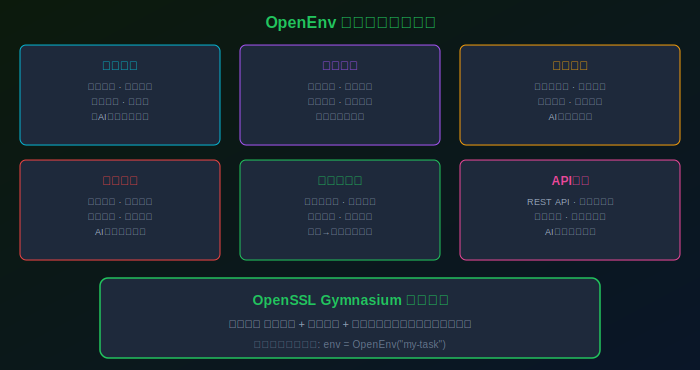

# 8K Star！2026 给AI装上"身体"，HuggingFace打造虚拟训练场，每个动作都是学出来的！


---

## 项目速览

> **项目速览**
> - 项目：huggingface/OpenEnv
> - GitHub：[github.com/huggingface/OpenEnv](https://github.com/huggingface/OpenEnv)
> - Stars：**8,000+** | 许可协议：Apache 2.0
> - 核心标签：强化学习 / 后训练 / 智能体 / 虚拟环境 / HuggingFace

---

## 一、AI能聊天，但能"动手"吗？

这是一个细思极恐的问题。

今天的AI可以写诗、写代码、做翻译、分析财报——这些全是"脑力活"。但你让它帮你操作一下电脑呢？打开一个网页，填一个表单，点击提交按钮——这些三岁小孩都能做的事，AI反而做不好。

为什么？因为"动手"需要的不是"知识"，而是"交互能力"。

举个例子。你知道怎么骑自行车，你能用语言描述怎么骑——保持平衡、踩踏板、转车把。但如果你从来没有真的骑过，给你一辆自行车，你还是会摔。因为"知道"和"能做"之间，隔着一万次摔倒的经验。

AI面临的就是这个问题。大语言模型"知道"很多事情，但它从来没有"做过"任何事情。它就像一个读了几万本书但从没出过门的书呆子——满腹经纶，但连门把手都不会拧。

HuggingFace推出的OpenEnv，就是为了解决这个问题。

---

## 二、OpenEnv：给AI一个"虚拟健身房"

OpenEnv是一个开源的强化学习后训练环境。说人话就是：一个让AI在虚拟世界里"练手"的沙盒。

传统的AI训练是这样的：喂给它海量的文本数据，让它学会预测下一个词。训练完了，它就"知道"了很多东西。但它从出生到退役，从来没有"动"过一次。

OpenEnv改变了这个范式。它把AI放进一个虚拟环境里——这个环境可以是一个网页、一个桌面操作系统、一个命令行终端、甚至是一个机器人仿真器。AI在这个环境里可以"看"（观察环境状态）、"想"（制定策略）、"做"（执行动作），然后收到"奖励"或"惩罚"（反馈信号）。

通过成千上万次的试错，AI逐渐学会"如何正确地行动"。

这个过程，就像你学骑自行车。没有人能教你"保持平衡"的具体公式，你只能一遍遍摔、一遍遍调整，直到肌肉记住那个感觉。AI也是一样——它通过反复尝试，摸索出"在什么情况下做什么动作能拿到奖励"的策略。


---

## 三、五大核心亮点，重新定义"AI能力"

### 亮点一：标准化环境接口，万物皆可训练

OpenEnv最核心的贡献，是定义了一套标准化的环境接口。这套接口只有三个核心概念：

- **观察空间**：AI能看到什么（屏幕截图、HTML结构、传感器数据）
- **动作空间**：AI能做什么（点击、输入、移动、按键）
- **奖励函数**：什么行为算"好"（完成了任务、找到了信息、节省了时间）

只要你能用这三个概念描述一个任务，就能把它变成一个OpenEnv的训练环境。不管是"帮我填一个网页表单"还是"帮我在终端里装一个软件"——万物皆可训练。

### 亮点二：内置六大场景，覆盖主流应用

OpenEnv不是只给一个空框架让你自己填。它内置了六个已经配置好的训练场景：

桌面操作——让AI学会用鼠标和键盘操作Windows或Linux桌面；网页浏览——让AI学会在浏览器里导航、填表、提取信息；终端命令——让AI学会写命令行指令、管理文件、安装软件；编程环境——让AI学会写代码、调试、测试；机器人仿真——让AI学会控制机械臂、规划路径；接口调用——让AI学会调用各种网络服务。

这些场景够你玩一年了。

### 亮点三：PPO算法加持，安全稳定收敛

强化学习有一个著名的坑：策略崩溃。训练到一半，AI突然"发疯"了——之前学到的所有技能全部清零，开始乱来。

OpenEnv采用了PPO（近端策略优化）算法，这是目前最稳定的强化学习算法之一。它通过限制每次更新的幅度，防止策略"一下子变得太离谱"。简单说就是，AI每次只允许自己进步一点点，不许跨大步——这样就不会摔跤了。

### 亮点四：HuggingFace生态无缝对接

OpenEnv和HuggingFace的整个生态完全打通。你可以用HuggingFace上的任何模型作为基础模型，在OpenEnv里训练，训练好后一键发布到HuggingFace Hub上，供全世界的人下载使用。

而且训练过程中产生的所有数据——每一次观察、每一个动作、每一个奖励——都可以自动记录和可视化。你可以在训练面板上实时看到AI的学习曲线，像一个游戏玩家看着自己的角色升级一样。

### 亮点五：学术研究到工业落地的桥梁

OpenEnv的设计理念非常清晰：它不只是给研究者用的，更是给工程师用的。

所有训练好的策略都可以导出为标准的推理格式，直接部署到生产环境。这意味着你可以在OpenEnv里训练一个"AI客服"，然后直接把它部署到你的客服系统里——它会自动接单、查信息、回复用户，就像一个真正的客服一样。



---

## 四、社区反响：这是"AI操作系统的雏形"

OpenEnv开源之后，社区的反应很有意思。

有人把它比作"AI的操作系统"——就像Windows给软件提供了运行环境，OpenEnv给AI Agent提供了"行动"的环境。在这个环境里，AI能看到、能操作、能学习。

也有人把它比作"AI的体育课"——大语言模型给了AI"大脑"，而OpenEnv给了AI"身体"。只有大脑没有身体，AI始终只是一个"纸上谈兵"的角色。有了身体，它才能真正"做事"。

还有研究者指出，OpenEnv的意义在于它把"强化学习"从一门高深的学问变成了"普通工程师也能用"的工具。以前搞强化学习，你需要自己搭环境、写算法、调参数——每一步都像在走钢丝。现在OpenEnv把这些都打包好了，你只需要定义"能做什么"和"什么算好"，剩下的交给框架。

---

## 五、快速上手：两步开启训练

第一步，安装OpenEnv：

```
pip install openenv
```

第二步，选择一个场景，启动训练：

```python
from openenv import OpenEnv, PPO

env = OpenEnv("web-browsing")
agent = PPO(env)
agent.train(steps=100000)
```

就这么简单。训练过程中可以看到实时的奖励曲线，训练完成后可以直接导出模型。

最让人舒服的是，OpenEnv的文档写得非常详细。每个场景都有完整的教程，从环境配置到超参数调优，每一步都有说明。这在开源项目中真的不多见。

---

## 六、写在最后

AI的发展正在经历一个关键的转折点。

过去几年，我们的焦点一直放在"让AI更聪明"上——更大的模型、更多的参数、更强的推理能力。但现在，"聪明"已经不再是瓶颈。真正的瓶颈是"能力"——AI能不能真的做事，而不只是"说"它能做事。

OpenEnv代表了这个转折的方向。它不是在训练一个更聪明的AI，而是在训练一个"能动手"的AI。它把虚拟世界变成了AI的"训练场"，让AI在里面摔跤、爬起来、再摔跤、再爬起来——直到学会为止。

这条路还很长，但方向已经非常清晰了。未来的AI，不只是会聊天，还能帮你操作电脑、管理文档、处理数据、甚至控制机器人。而这一切的起点，就是一个像OpenEnv这样的训练环境。

---

> **你觉得未来的AI应该只是一个"聊天伙伴"，还是应该成为一个"能动手的助手"？你更期待AI在哪个场景下帮你"做事"？评论区聊聊你的想法！**

*点赞👍、在看、转发，让更多AI从业者看到这个改变游戏规则的训练环境！*