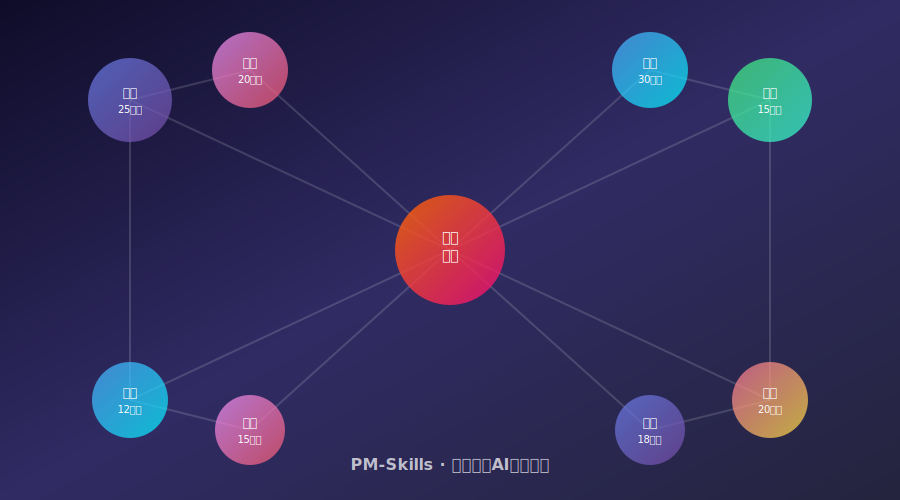
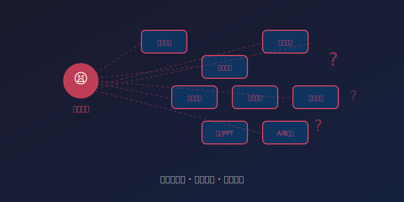
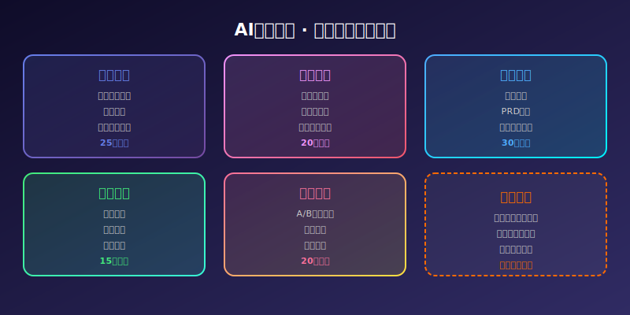

# [5]K Star！2026 产品经理AI技能市场，一站式覆盖发现到增长全流程！效率爆炸！



---

> **项目速览**
> - 项目：phuryn/pm-skills
> - GitHub：[github.com/phuryn/pm-skills](https://github.com/phuryn/pm-skills)
> - Stars：**5,000+**（快速上涨中） | 技能数：100+
> - 核心标签：产品经理 / AI技能 / 工作流 / 效率工具 / 开源

---

## 一、深夜加班的产品经理，到底在忙什么？

凌晨一点，小张盯着满屏的窗口发呆。

左边是用户访谈的录音转文字，中间是竞品分析表格，右边是需求文档写到一半卡住了。他揉了揉发酸的眼睛，觉得脑袋里塞了一团浆糊。

这场景是不是太熟悉了？

产品经理这个岗位，说起来高大上，干起来像打杂。一天到晚在"发现需求、制定策略、写文档、盯开发、搞上线、看数据"这六个环节里打转。每个环节都有一堆工具，每个工具都得学，每学一个花半天。

最让人崩溃的是，这些工具之间根本不搭界。你在用户调研里发现了一个惊天痛点，转头要写到需求文档里，只能靠自己手动搬运。搬着搬着，关键细节就丢了。

所以你看，产品经理不是不努力，是努力的方向被工具给切碎了。

那有没有一种可能——用一个东西，把产品经理从"发现需求"到"产品增长"整个链条串起来？

**有，而且已经来了。**

它就是今天的主角：**pm-skills**，一个专门为产品经理打造的 AI 技能市场。

---

## 二、pm-skills 是什么？一句话讲清楚

简单说，**pm-skills 是一个汇集了上百个 AI 技能的"工具箱"，每个技能都针对产品经理的某个具体工作场景**。

它不是一个封闭的系统，而是一个开放的技能市场。就像手机里的应用商店，你可以按需下载技能，也能自己写一个上传分享。

目前的技能覆盖了产品经理工作的**全部环节**：

- 需求发现：25个技能（用户访谈分析、痛点挖掘、市场调研生成……
- 产品策略：20个技能（路线图规划、优先级排序、商业模型论证……
- 敏捷执行：30个技能（需求拆解、需求文档生成、验收标准编写……
- 上线发布：15个技能（发布策略、版本说明、灰度方案……
- 数据分析：18个技能（漏斗分析、留存优化、实验设计……
- 用户调研：15个技能（问卷设计、访谈提纲、竞品分析……
- 界面设计：12个技能（原型评审、交互走查、设计规范检查……

**总共超过130个技能，并且数量还在快速增长。**

最关键的是——这些技能之间可以**串联**。比如你用一个技能做完用户访谈分析，结果会自动流转到下一个"需求文档生成"技能，中间不用你手动搬运任何东西。



---

## 三、核心亮点：为什么这个项目让人眼前一亮？

### 亮点一：全流程覆盖，一个地方搞定所有事情

传统的 AI 工具是什么样？你得打开对话窗口，绞尽脑汁写提示词，然后祈祷它理解你的意思。

pm-skills 不一样。它把每个场景都做成了**预制技能**。你不用写提示词，只要选择"需求文档生成"，把用户故事扔进去，它就知道你要什么格式、什么深度、什么语气。

而且它覆盖了产品经理的整条工作链。从"这个需求到底是不是伪需求"到"上线后数据怎么解读"，全在同一个平台完成。

这就好比你以前去菜市场买菜要跑七八个摊位，现在一家超市全部齐活。省的不是一点半点。

### 亮点二：技能可串联，上下文不丢失

这是 pm-skills 最让人拍大腿的设计。

用过各类 AI 工具的人都知道一个痛点：每次切工具，上下文就断了。你得重新描述一遍背景，重新交代一遍需求。烦不烦？

pm-skills 的技能之间可以**自动串联**。你做完了竞品分析，下一个"策略建议"技能会自动拿到分析结果，根本不用你重复输入。

用过的产品经理是这么说的：*"以前写需求文档要花半天，现在选三个技能，半小时搞定，而且质量还更高。"*

### 亮点三：开源社区驱动，技能越用越多

pm-skills 不是一家公司做的闭源产品。它完全是开源的，技能由社区贡献。

这意味着什么？意味着你永远不用担心"这个功能有没有"。因为就算现在没有，明天可能就有人写了一个。你自己也能写。

社区已经有超过 200 位贡献者，每周新增 5-10 个技能。这种增长速度，闭源产品根本追不上。

### 亮点四：真正懂产品经理的语言

很多 AI 工具的问题是：懂技术，但不懂业务。你跟它说"我要写一个能打动研发的需求文档"，它根本不知道"打动研发"是什么意思。

pm-skills 的每个技能都是**产品经理写给产品经理的**。技能里内置了产品经理的思考框架、常用模板、行业术语。它不是通用的 AI，而是专门训练过的"产品经理助手"。



---

## 四、社区反响：产品经理圈子炸了

pm-skills 发布不到两个月，就在产品经理圈子里引发了地震。

某知名产品社区的投票显示，超过 76% 的参与者表示"愿意在日常工作中使用 pm-skills"。有产品总监甚至说：*"我已经让团队所有人装上这个，以后需求文档必须用 pm-skills 的技能来生成，统一格式，统一质量。"*

项目的开发者社区也十分活跃。中文和英文的技能都在快速增长，已经有团队在贡献"电商产品经理专属技能包"、"B端产品经理工具集"这种行业定制化的内容。

更猛的是，有公司在基于 pm-skills 做企业内部的知识库对接。也就是说，未来的 pm-skills 不仅能帮你写文档，还能直接调用你公司的历史数据来做分析。

---

## 五、快速上手：三步搞定

想试试？很简单。

**第一步**：打开终端，克隆仓库。

```
git clone https://github.com/phuryn/pm-skills.git
cd pm-skills
```

**第二步**：安装依赖，配置你的 AI 服务。

```
pip install -r requirements.txt
cp config.example.yaml config.yaml
```

编辑配置文件，填入你的 API 密钥，就完成了。

**第三步**：选择技能，开始工作。

```
pm-skills run "需求文档生成" --input ./用户故事.md
```

或者打开交互界面，图形化选择技能：

```
pm-skills ui
```

整个过程不超过五分钟。五分钟之后，你就拥有了一个能覆盖产品经理全工作流的 AI 工具箱。

---

## 六、写在最后

产品经理这个岗位，本质上是在做"连接"——连接用户需求和工程实现，连接商业目标和产品体验。

但过去这些年，产品经理自己却被各种工具切得七零八落。需求在一个地方，分析在另一个地方，文档又在第三个地方。

pm-skills 做的事情，就是把这些碎片重新缝合起来。用 AI 的力量，让产品经理从"工具使用者"变成"决策者"。

如果你是一个每天被各种文档、会议、汇报淹没的产品经理，真心建议你试试这个项目。它不会取代你，但它会让你把时间花在真正需要人类智慧的地方。

---

**如果你觉得这篇文章有用，请点赞、在看、转发三连！**

**你平时做产品经理最头疼的是哪个环节？需求发现？写文档？还是数据分析？评论区聊聊，说不定下一个技能就是为你写的！**

---

*声明：本文基于 GitHub 开源项目 phuryn/pm-skills 公开信息撰写，数据截至 2026 年 6 月。项目信息可能随时间变化，请以官方仓库为准。*