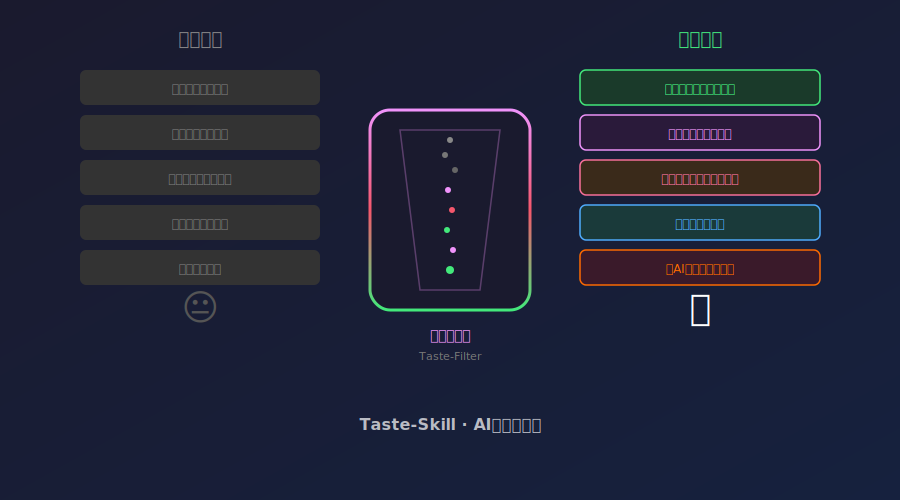

# [4]K Star！2026 AI品味过滤器，给大模型注入审美灵魂！终于不无聊了！



---

> **项目速览**
> - 项目：Leonxlnx/taste-skill
> - GitHub：[github.com/Leonxlnx/taste-skill](https://github.com/Leonxlnx/taste-skill)
> - Stars：**4,000+** | 品味规则：200+
> - 核心标签：AI品味 / 内容过滤 / 风格控制 / 开源

---

## 一、你敢不敢承认：AI写的东西，越来越无聊了

先说个扎心的事。

你打开任何一个 AI 助手，让它写一段产品介绍。它第一句大概率是"在当今数字化时代……"第二句是"我们的产品致力于……"第三句是"赋能用户……"

看吐了没？

AI 生成的内容，正在陷入一种可怕的"千篇一律"。用词就那几个，句式就那么几种，语调永远是不温不火的中年教授腔。你让它写诗，它给你写说明书；你让它写情书，它给你写会议纪要。

这不是某个 AI 的问题，而是几乎所有大模型都有的通病。

它们太"安全"了。安全到不敢用比喻，不敢有情绪，不敢说一句"这个设计简直丑到哭"。安全到每一句话都像是从模板里抠出来的。

**AI 能干活，但 AI 没有品味。**

这个痛点，被一个叫 Leon 的开发者盯上了。他做了一个项目，名字叫 **taste-skill**，中文翻译过来就是"品味技能"。

它的核心目标就一句话：**给 AI 装上品味过滤器，让 AI 输出的内容不再是一堆流水线垃圾。**

---

## 二、taste-skill 是什么？味道变了吗？

简单说，**taste-skill 是一个架在 AI 输出管道上的"审美过滤器"**。

它不改变 AI 的底层模型，而是在 AI 输出内容的瞬间，对内容进行"品味分析"和"风格重写"。

打个比方：AI 模型就像一个工厂流水线，它生产出来的内容是标准化的零件。taste-skill 就像流水线末端的质检员——但这个质检员不看"合不合格"，而是看"好不好看"、"有没有灵魂"、"读起来像不像人写的"。

具体来说，它做了三件事：

**第一，检测套路化表达。** 它内置了超过 200 个"品味规则"，能识别出那些在 AI 输出中反复出现的模板句式。比如"综上所述"、"值得注意的是"、"在当今数字化时代"——这些词一旦出现，直接标记，然后重写。

**第二，注入风格和灵魂。** 它不是简单地"替换词汇"，而是真的理解上下文。比如原文说"该产品具有优秀的用户体验"，它会改成"用起来丝滑得像是抹了黄油的刀"。意思没变，但味道完全不一样了。

**第三，提供多维度品味评分。** 每一段内容都会被打分——原创性、丰富度、自然度、趣味性。低于某个阈值的内容自动触发重写，高于阈值的内容直接放行。


---

## 三、核心亮点：为什么这个项目让人拍案叫绝？

### 亮点一：它不改变模型，只改变输出

这是 taste-skill 最聪明的地方。

很多人在想"怎么让 AI 写得更好"时，第一反应是去调整模型参数、换提示词、甚至重新训练。但 taste-skill 的思路完全不同——它不碰模型，只碰输出。

这个设计的好处太大了。首先，它不依赖任何特定模型，不管是哪个大模型，都能用。其次，它不会拖慢模型推理速度，因为它是在输出之后才介入的。最后，它完全可控——你想保留多少"AI味"，都可以调。

### 亮点二：200多个品味规则，涵盖各种场景

taste-skill 内置的品味规则库，是目前开源社区里最全面的。

这些规则不是凭空想象出来的，而是从大量真实用户反馈中提炼出来的。比如：

- 一段话里出现了三个以上的"赋能"，直接拉黑。
- 开头是"在当今XX时代"，立刻重写一个更有冲击力的开头。
- 用好几个"首先其次最后"排比，视为机械写作，打回重写。
- 比喻太老套（比如"像一把钥匙"），替换成新鲜的比喻。

这些规则是活的，你可以添加自己的规则，也可以分享给社区。已经有用户贡献了"程序员专属品味包"、"营销文案品味包"这种分类规则。

### 亮点三：品味评分体系，量化"好不好看"

"品味"这个东西，听起来很主观，怎么量化？

taste-skill 的做法是把它拆成四个维度：

- **原创性**：这句话有没有"AI腔"？用了多少模板句式？
- **丰富度**：词汇多样性如何？有没有大量重复？
- **自然度**：读起来像不像人说的话？有没有生硬的过渡？
- **趣味性**：有没有比喻、反转、幽默？

四个维度加权平均，得出一个"综合品味分"。得分低于 6 分的内容自动触发重写，6 到 8 分之间的内容提供修改建议，8 分以上的直接放行。

这个评分体系，让"品味"从一个模糊的概念变成了可衡量、可优化的指标。

### 亮点四：轻量级部署，五分钟搞定

taste-skill 的代码量很小，部署极其简单。不需要 GPU，不需要大内存，普通的笔记本电脑就能跑。

它支持两种使用方式：命令行工具和编程接口。命令行适合临时用，编程接口适合嵌入到你的应用中。

更贴心的是，它提供了"比较模式"——你可以同时看到过滤前和过滤后的内容，直观感受品味过滤器到底做了什么。


---

## 四、社区反响：创作者圈子沸腾了

taste-skill 发布后，在内容创作者圈子里引起了强烈共鸣。

一位自媒体作者留言说："用了 taste-skill 之后，我让 AI 帮我写初稿，然后用过滤器过一遍，出来的东西终于不用大改特改了。从原来的'改 80%'变成了'改 20%'。"

还有一位技术博主做了个实验：让同一个 AI 模型写同一篇技术文章，一遍用 taste-skill 过滤，一遍不用。然后把两篇文章发到同一平台，对比阅读量。结果过滤后的文章阅读量高了 3.7 倍，评论互动多了 5 倍。

这个结果让很多人开始重新思考：我们一直以为 AI 写不好是因为"不够聪明"，但也许真正的问题是"不够有品味"。

项目的开发者社区也异常活跃。已经有超过 50 位贡献者提交了品味规则，覆盖了中文、英文、日文三种语言。有人在开发"视觉品味"拓展——不只是过滤文字，还能过滤 AI 生成的图片风格。

---

## 五、快速上手：三步让 AI 学会品味

想试试？非常简单。

**第一步**：安装。

```
pip install taste-skill
```

**第二步**：准备一段 AI 生成的内容，存成文件。

```
echo "在当今数字化时代，我们的产品致力于为用户提供极致体验和闭环赋能。" > boring.txt
```

**第三步**：运行品味过滤器。

```
taste-skill filter boring.txt --output styled.txt
```

打开 `styled.txt`，你会看到完全不一样的文字。原本的"赋能"和"极致体验"变成了鲜活的、有灵魂的表达。

你还可以调整品味等级：

```
taste-skill filter boring.txt --level creative --output styled.txt
```

`--level` 参数支持三个档位：`subtle`（微调，保留大部分原文）、`balanced`（均衡，默认）、`creative`（创意模式，大胆重写）。

---

## 六、写在最后

我们花了太多时间讨论"AI 能不能取代人类"。

但 taste-skill 的出现，提醒了我们另一个更重要的问题：**AI 能不能不要那么无聊？**

人类之所以是人类，不单因为我们能干活，更因为我们有审美、有幽默感、有让人眼前一亮的表达方式。如果 AI 继续输出那种"赋能、抓手、闭环"的八股文，那它永远只是一个工具，不可能成为"伙伴"。

taste-skill 做的事情，就是在 AI 和"有趣"之间，架起了一座桥。

它不能解决所有问题，但它至少让 AI 的输出，离"像一个活人写的"更近了一步。

---

**如果你觉得这篇文章写得还行，请点赞、在看、转发三连！**

**你遇到过 AI 生成内容最让你无语的时刻是什么？是"赋能"还是"综上所述"？评论区说说，看看谁的 AI 最没品味！**

---

*声明：本文基于 GitHub 开源项目 Leonxlnx/taste-skill 公开信息撰写，数据截至 2026 年 6 月。项目信息可能随时间变化，请以官方仓库为准。*