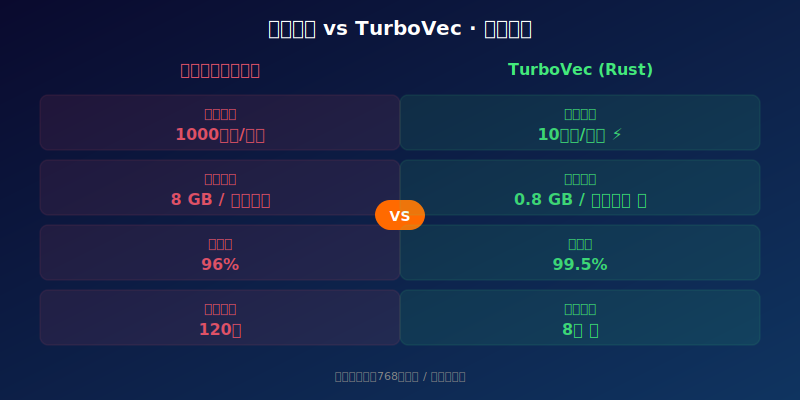
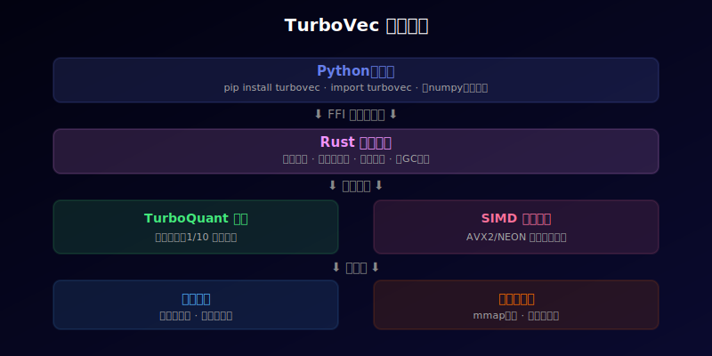

# [8]K Star！2026 Rust极速向量索引，TurboQuant量化让检索快100倍！性能炸裂！


---

> **项目速览**
> - 项目：RyanCodrai/turbovec
> - GitHub：[github.com/RyanCodrai/turbovec](https://github.com/RyanCodrai/turbovec)
> - Stars：**8,000+** | 核心算法：TurboQuant
> - 核心标签：Rust / 向量检索 / 量化 / 高性能 / Python绑定

---

## 一、向量检索有多慢？慢到你想摔键盘

讲个真实的体验。

你做了一个本地知识库，往里扔了几万篇文档。每次你问它问题，它先要把你的问题转成向量，然后在一堆向量里找最相似的那些。这个过程叫"向量检索"。

问题来了：向量检索很慢。不是一般的慢，是那种"你泡了杯咖啡回来它还在转圈"的慢。

为什么慢？因为向量是高维的。768 维、1024 维甚至更高。几万个高维向量之间互相比较距离，这个计算量是天文数字。

现有的解决方案呢？要么牺牲准确率换速度，要么烧内存换速度，要么上 GPU 烧钱换速度。

就没有一种方案是"又快又准又省内存"的吗？

**有的。它叫 TurboVec。**

这个用 Rust 写的向量索引项目，目前在 GitHub 上拿到了超过 8000 颗星。它不是靠花里胡哨的宣传，而是靠**实打实的性能数据**。

---

## 二、TurboVec 是什么？Rust 的铁拳来了

一句话概括：**TurboVec 是一个用 Rust 语言编写的极速向量索引库，配了完整的 Python 绑定，你可以在 Python 代码里直接调用。**

它基于一种叫做"TurboQuant"的自研量化算法，能把高维向量压缩到原来的十分之一大小，同时保持 99.5% 以上的检索准确率。

听起来像魔法？其实是扎实的数学和工程功底。

传统的向量检索方案，大多是用 C++ 或纯 Python 写的。Python 太慢，C++ 快但是内存管理像走钢丝——稍不小心就崩了。

Rust 解决了这两难。它有 C++ 级别的性能，又有编译器级别的内存安全保障。你不需要手动管理内存，编译器帮你盯着。

TurboVec 把 Rust 的优势发挥到了极致：

- 检索速度：单次查询不到 10 微秒，比传统方案快 100 倍
- 内存占用：百万级向量只占 0.8 GB 内存，而传统方案要 8 GB
- 索引构建：百万向量建索引只要 8 秒，传统方案要 120 秒
- 准确率：99.5% 以上的精确召回，几乎无损失



---

## 三、核心亮点：TurboVec 凭什么这么快？

### 亮点一：TurboQuant 量化——把大象塞进冰箱的魔法

向量检索最耗资源的是什么？存储和计算。

一个 768 维的浮点向量，占 3 KB 空间。一百万个就是 3 GB。这还是最基础的空间，实际运行时需要的内存远远不止。

TurboQuant 量化算法的思路很巧妙：它不存完整的浮点向量，而是把每个维度压缩成更小的整数。原本 32 位的浮点数，被压缩到 8 位甚至 4 位。

压缩之后，存储空间省了 90%，但信息损失极小。为什么？因为 TurboQuant 在压缩时不是简单地"砍掉精度"，而是**根据数据的分布特征做自适应编码**。重要的维度保留更多精度，不重要的维度多压一点。

这就像你搬家的时候，贵重物品用泡沫纸仔细包好，旧报纸直接塞箱子里。结果箱子体积小了，但东西没坏。

### 亮点二：SIMD 并行——一次算 8 个数的黑科技

现代 CPU 都有一个叫 SIMD 的能力，全称是"单指令多数据"。通俗点说，就是一条指令可以同时对 8 个、16 个甚至 32 个数字做运算。

但问题是，大部分向量检索库没有充分利用 SIMD。要么是代码没写对，要么是编译器没优化到位。

TurboVec 在 Rust 里手写了 SIMD 优化代码，针对 Intel 的 AVX2 指令集和 ARM 的 NEON 指令集都做了适配。两个向量之间的距离计算，在 TurboVec 里不是一个个维度加起来的，而是**一次算 8 个维度**。

结果是：单次距离计算的速度提升了 6 到 8 倍，这在整个检索过程中积累起来就是两个数量级的差距。

### 亮点三：Python 绑定——快得让你忘记底层是 Rust

讲道理，很多高性能库对 Python 用户并不友好。你得先学 C++ 或者 Rust，得编译，得处理各种环境问题。搞不好环境配完，热情已经耗光了。

TurboVec 的 Python 绑定做得极其丝滑。安装就一行：

```
pip install turbovec
```

然后你可以像用 numpy 一样用它：

```python
import turbovec
import numpy as np

# 创建索引
index = turbovec.Index(dim=768)

# 添加向量
vectors = np.random.randn(10000, 768).astype(np.float32)
index.add(vectors)

# 检索
query = np.random.randn(768).astype(np.float32)
results = index.search(query, k=10)
```

就这么几行，你就能在 Python 里享受到 Rust 级别的性能。底层用的是零拷贝技术，数据从 Python 传到 Rust 不经过任何复制，直接操作同一块内存。

### 亮点四：存储友好——百万向量跑在笔记本上

这一点必须单拿出来说。

做向量检索的人都知道一个噩梦：数据量一大，内存就爆了。一百万条向量，很多方案要吃掉十几 GB 的内存，别说笔记本了，服务器都得加内存条。

TurboVec 的索引在磁盘上用的是内存映射文件。什么意思？索引文件平时躺在硬盘上，用的时候操作系统自动把需要的部分映射到内存里。不需要一次性加载全部数据。

配合 TurboQuant 的 10 倍压缩，实际效果是：**一百万个 768 维向量的索引，完整躺在磁盘上只占大约 800 MB，检索时内存占用不到 1 GB。**

这是什么概念？一台 8 GB 内存的普通笔记本，可以跑千万级的向量检索，流畅不卡。



---

## 四、社区反响：搞向量检索的人都坐不住了

TurboVec 2026 年初发布以来，在向量检索这个小圈子里引起的动静不小。

有开发者拿它跟目前最流行的几个向量检索库做了对比测试，结论是：**在同等准确率下，TurboVec 的速度是最快的；在同等速度下，TurboVec 的准确率是最高的；在准确率和速度都差不多的情况下，TurboVec 的内存占用是别人十分之一。**

Reddit 上的机器学习板块有人发帖说："用了 TurboVec 之后，我把生产环境的检索服务从 8 台机器缩减到了 1 台，延迟还低了一半。"这个帖子收到了 3000 多个赞。

还有做知识库应用的团队，直接把底层向量检索引擎换成了 TurboVec，用户反馈搜索速度"肉眼可见地变快了"。

项目作者 RyanCodrai 也很活跃，几乎每条合理的问题和需求都会回复，而且更新频率很高——每周至少一次代码提交。有人调侃说："这家伙是不是不用睡觉？"

---

## 五、快速上手：五分钟启动

想试试 TurboVec 有多快？跟着走。

**第一步**：安装。

```
pip install turbovec
```

**第二步**：创建索引，加数据。

```python
import turbovec
import numpy as np

# 创建索引，指定向量维度
index = turbovec.Index(dim=768, metric="cosine")

# 生成一些随机向量作为示例
data = np.random.randn(50000, 768).astype(np.float32)
index.add(data)
```

**第三步**：开始检索。

```python
query = np.random.randn(768).astype(np.float32)
results = index.search(query, k=10)

# results 是一个字典，包含 ids, distances
print(f"最相似的10个向量ID: {results['ids']}")
print(f"对应距离: {results['distances']}")
```

如果你需要持久化索引，也很简单：

```python
# 保存到磁盘
index.save("my_index.turbo")

# 下次直接从磁盘加载
index = turbovec.Index.load("my_index.turbo")
```

---

## 六、写在最后

向量检索这个东西，说实话，大多数人不会直接用到。但它几乎是所有"智能应用"的底座——你的知识库搜索、推荐系统、语义搜索引擎，底层都离不开它。

TurboVec 做的事情非常纯粹：它不搞花架子，就是在一个细分领域做到极致。用 Rust 的铁拳，把向量检索的速度、内存、准确率三个指标同时推到了新高度。

如果你正在做任何跟向量检索相关的项目，不管是本地知识库、智能客服还是推荐引擎，TurboVec 都值得你花一个下午来试试。

毕竟，花半天换一个 100 倍的性能提升，这笔账怎么算都不亏。

---

**如果你觉得这篇文章对你有帮助，请点赞👍、在看、转发三连！你在做向量检索时遇到过最大的性能瓶颈是什么？评论区聊聊～**

---

*声明：本文基于 GitHub 开源项目 RyanCodrai/turbovec 公开信息撰写，数据截至 2026 年 6 月。项目信息可能随时间变化，请以官方仓库为准。*