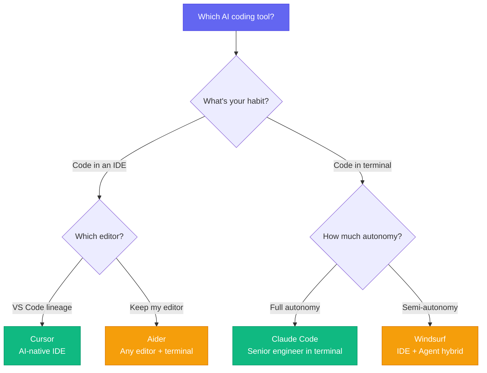
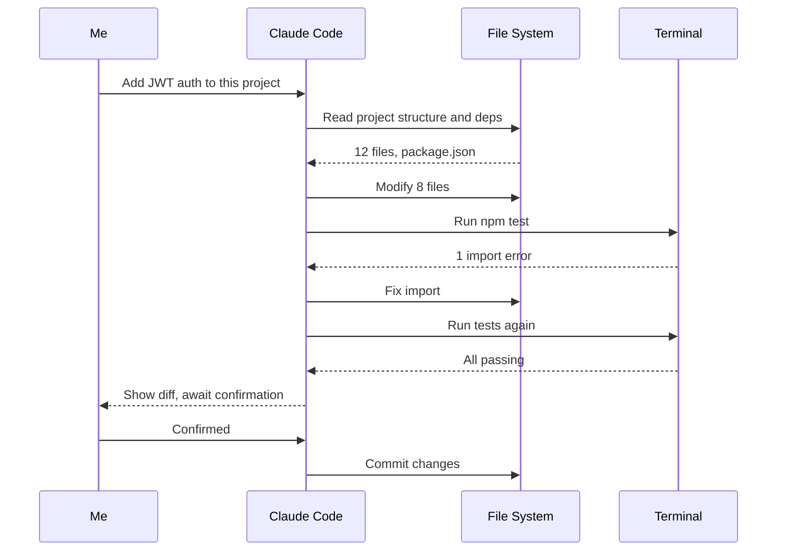

# I Used All 4 AI Coding Tools — Here's the One I Kept

[English](./day-02.md) | [简体中文](../zh/day-02.md)

Last week I spent four days running the same full-stack project (React + Node + PostgreSQL) through Cursor, Claude Code, Aider, and Windsurf. The result surprised me — only one of them made me go from "trying it out" to "opening it every day."

---

## 🔥 01 Cursor — The Ceiling of AI-Native IDEs

**Pricing: $20/mo (Business) | Models: Claude 4 Sonnet / GPT-4.1 / Gemini 2.5 Pro — pick your own**

Cursor was the first AI coding tool I used, and the one I stuck with the longest. It gets one thing right: **AI lives inside every corner of the editor, not in a bolted-on chat window.**

Tab completion, Cmd+K inline edits, Composer multi-file changes — three entry points covering everything from "change one line" to "refactor a module." By 2026, Cursor has evolved from an "AI-assisted editor" into an "AI-native IDE," rebuilding VS Code's editor core rather than skinning it.

**Before: Writing a CRUD endpoint took 20 min → Now: Composer generates 5 files in 3 min → This means: I no longer write boilerplate.**

But Cursor has a fatal flaw: **context management is a black box.** You don't know which files it read, and you don't know why it ignored one of your files. Once a project exceeds 50 files, Composer regularly "forgets" schemas you defined earlier. Smart but uncontrollable.

---

## 🛠️ 02 Claude Code — The Senior Engineer in Your Terminal

**Pricing: API pay-per-use | Models: Claude 4 Sonnet/Opus**

Claude Code is an entirely different creature. It doesn't live in an IDE — it lives in your terminal. You give it a task, and it reads code, modifies code, runs tests, and fixes bugs on its own. All you do is watch.

I tested it with: "Add JWT authentication to this project." It spent 47 seconds reading the entire project structure, then modified 8 files, ran two rounds of tests, fixed an import error, and output a diff for my approval. **I didn't type a single line of code the entire time.**

Claude Code's superpower is **autonomy**. It's not "you ask, it answers" — it's "you give a goal, it executes." But that means you need to trust it, and trust takes time. For the first two weeks I checked every modification carefully; now I just skim the diff summary.

Honestly, Claude Code has the steepest learning curve of the four. You need to learn to write CLAUDE.md, use subagents, set up hooks for automation. But once you cross that threshold, you realize: **this isn't a coding tool — it's a 24/7 engineer you hired.**

---

## 💡 03 Aider — The Hacker's Swiss Army Knife

**Pricing: Open source / API pay-per-use | Models: Supports virtually every model**

Aider is the most "programmer-y" of the four. No IDE, no UI — just a terminal REPL. But its design philosophy is razor-sharp: **git integration is the lifeline of AI coding.**

Every modification auto-commits, every conversation has git history, and you can `git diff` to roll back anytime. You'll never panic because AI broke your code — one command and you're back.

Aider also has a killer feature: **model agnosticism.** Claude, GPT, Gemini, DeepSeek, Qwen — any model with an API works. Use Claude today, switch to GPT when a new model drops, zero migration cost.

**Before: Switching models meant switching tools → Now: One Aider works with every model → This means: You always use the cheapest capable model.**

But Aider's weaknesses are equally clear: **no IDE integration, no visual diff, no project-level context understanding.** It's better for "change a few files" scenarios, not "refactor an entire module."

---

## 📋 Four Tools at a Glance

| Tool | Form Factor | Best For | Worst For | Monthly Cost |
|------|-------------|----------|-----------|--------------|
| Cursor | AI-native IDE | Daily dev, multi-file edits | Large refactors, terminal workflows | $20 |
| Claude Code | Terminal Agent | Autonomous tasks, complex refactors | GUI needed, quick small changes | API fees |
| Aider | Terminal REPL | Model flexibility, git-friendly | Project-level understanding, beginners | API fees |
| Windsurf | IDE + Agent hybrid | Transitioning from IDE to Agent | Deep customization, pure terminal | $15 |

---

## ⚠️ Caveats and Reflections

Honestly, none of these four tools is perfect. My biggest takeaway: **the bottleneck in AI coding isn't the AI — it's context management.**

Cursor's context is a black box, Claude Code requires manual CLAUDE.md, Aider relies on manual `/add`, and Windsurf's Cascade frequently reads the wrong files. All four are still far from "understanding your project."

Another overlooked issue: **cost.** Cursor's monthly fee looks cheap, but heavy Composer usage burns tokens fast. Claude Code billed me $180 one month. Aider with Opus isn't cheap either. Many people look at the subscription price but ignore the token bill — that's a trap.

---

## Closing Thought

I ended up keeping Claude Code. Not because it's "the best," but because its autonomy matches my workflow — I'd rather spend 5 minutes writing a clear task description and let it run, than sit in an IDE confirming changes line by line.

**Pick the AI coding tool that matches your rhythm, not the one with the highest benchmark. A powerful tool out of sync with you is just noise.**
