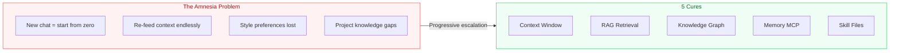
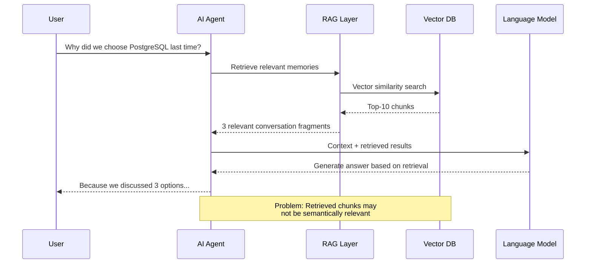

# Why Does Your AI Assistant Keep Forting? I Tried 5 Cures

[English](./day-03.md) | [简体中文](../zh/day-03.md)

Yesterday I asked Claude to refactor a module. We talked for 40 minutes, changed 12 files. Today I open a new conversation — it doesn't even remember what framework the project uses. I had to re-feed the entire context. Another 20 minutes gone. This happens at least 3 times a week.

---

## 🔥 01 Context Window: The Most Intuitive — and Most Fragile — Solution

Every AI assistant's "memory" is fundamentally a context window — how many tokens the model can read at once. Claude 4 has 200K tokens, GPT-4.1 has 128K, Gemini 2.5 Pro has 1M.

Sounds like a lot, right? But do the math: a mid-size project (50 files, ~200 lines each) eats about 150K tokens in code alone. Add conversation history, system prompts, tool definitions — **200K tokens isn't enough.**

I ran an experiment: Claude Code on an 80-file TypeScript project. For the first 30 minutes it performed like a senior engineer who knew the codebase inside out. By minute 45, it started "forgetting" interfaces defined earlier, re-asking questions it had already gotten answers to.

**Before: Crystal-clear memory within 30 min → Now: Amnesia kicks in after 45 min → This means: Context window is short-term memory, not long-term memory.**

Put simply, using the context window as memory is like using RAM as a hard drive — power off and it's gone.

---

## 🛠️ 02 RAG Retrieval: Giving AI a "Search Engine"

RAG (Retrieval-Augmented Generation) is the most mainstream memory solution today. The principle is simple: store your project docs, conversation history, and code snippets in a vector database, then retrieve relevant content and inject it into context before each conversation.

I built a RAG pipeline with LangChain: chunked all project docs and code comments, stored them in ChromaDB, retrieved top-10 relevant chunks before each conversation.

The result? **Above average.** For factual questions like "what does this function do," RAG performs well. But for contextual questions like "why did we choose option B in last week's architecture discussion," RAG often fails — because the relevant content might be scattered across 5 different conversations.

RAG's core problem is **retrieval precision.** Vector similarity ≠ semantic relevance. You search "why PostgreSQL," it might return "PostgreSQL installation steps" — close in vector space, but semantically useless.

---

## 💡 03 Memory MCP Server: The Most Promising Solution in 2026

Memory MCP Server is the closest thing to "real memory" I've found. It's not a database — it's a **memory management layer** that lets AI Agents actively "remember" and "recall" information via the MCP protocol.

I used it for two weeks, configuring `@anthropic/memory-mcp` and `@modelcontextprotocol/server-memory`. The core mechanism is three-layer memory:

1. **Working Memory** — current conversation context, automatically managed
2. **Episodic Memory** — key decisions and conclusions from past conversations, retrieved on demand
3. **Semantic Memory** — project knowledge graph, persistently stored

**Before: Re-explain the project every new conversation → Now: Agent proactively says "I remember we discussed..." → This means: AI finally has cross-conversation memory.**

But honestly, Memory MCP is far from perfect. The biggest issue is **memory pollution** — the Agent remembers things it shouldn't (like an offhand "let's just do this for now"), then treats them as decisions in subsequent conversations. You need to periodically "clean memory," which is more annoying than clearing browser cache.

---

## 📋 Five Memory Approaches Compared

| Approach | Persistence | Precision | Cost | Best For |
|----------|-------------|-----------|------|----------|
| Context Window | Single conversation | High | High token burn | Short tasks, simple chats |
| RAG Retrieval | Persistent | Medium | Vector DB costs | Factual queries, doc Q&A |
| Knowledge Graph | Persistent | High | Very high build cost | Complex relationship reasoning, enterprise KB |
| Memory MCP | Persistent | Medium-high | Server costs | Long-term Agent collaboration |
| Skill/MD Files | Persistent | High | Nearly zero | Project conventions, style preferences |

---

## ⚠️ Caveats and Reflections

Honestly, no single approach solves the problem alone. My current setup is a **hybrid**: Skill files for project conventions, Memory MCP for conversation memory, RAG for document retrieval. But maintaining three memory systems is itself a burden.

The deeper issue: **AI "memory" and human memory aren't the same thing.** Human memory forgets, blurs, and reorganizes — which is actually an advantage, because forgetting is information compression. AI memory either remembers everything (creating noise) or forgets everything (creating amnesia). There's no middle ground.

Another overlooked issue: **privacy.** Where is your memory stored? Memory MCP Server is local, fine. But if you use a cloud RAG service, your project decisions, architecture discussions, and even code snippets live on someone else's servers.

---

## Closing Thought

The AI Agent memory problem isn't fundamentally a technology problem — it's an **architecture problem.** You can't solve all memory needs with one approach, just like the human brain can't function with the hippocampus alone.

**Memory isn't storage — memory is retrieval. Store 100TB but can't find anything? That's the same as not storing it at all.**
