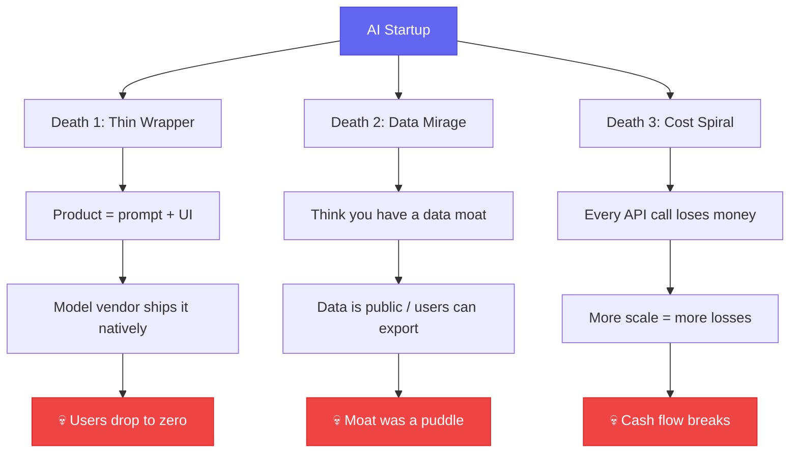
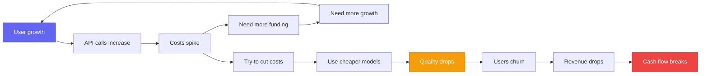

# 3 Ways AI Startups Die — and 90% of Founders Walk Right Into Them

[English](./day-04.md) | [简体中文](../zh/day-04.md)

Last month I attended a closed-door session for AI founders. Twelve teams — eight had already pivoted, two were laying people off, only two were still alive. The two survivors weren't building "AI products" — one was a legal document review SaaS for law firms, the other was a quality control system for manufacturing.

---

## 🔥 01 The Thin Wrapper: Your Product Is Someone Else's Prompt

The bloodiest wave of shutdowns in 2025 was "AI writing assistants." Jasper, Copy.ai, and dozens of "AI writes your weekly report / copy / essay" products — when ChatGPT added Custom Instructions and GPTs, these products lost their reason to exist overnight.

I know a founder who raised $1.2M in 2024 for an AI resume optimization tool. The product: user uploads resume → backend calls GPT-4 → frontend displays optimized resume. Beautiful UI, but the core logic was a 200-word prompt.

In March 2025, OpenAI added a "resume optimization" template to GPT. His DAU dropped from 12,000 to 800. Company shut down in June.

**Before: 12K DAU → After: 800 DAU → This means: Your moat is a prompt that takes 5 minutes to copy.**

The common thread in thin wrapper deaths: **you're selling AI's capability, not the business problem you solve.** Users don't buy "AI-written resumes" — they buy "better interview opportunities." When you only provide the former and the model vendor does the latter, you're done.

How to tell if you're a thin wrapper? One test: **paste your prompt into ChatGPT. If the result is roughly as good as your product, you're a thin wrapper.**

---

## 🛠️ 02 The Data Mirage: Your Moat Is a Puddle

"We have a data moat" — the most common thing I hear from AI founders. But 90% of the time, that moat is fake.

Three classic data mirages:

**Mirage 1: Public datasets repackaged as "proprietary data."** An AI legal advisory team claimed a "million-document legal database." I looked — it was just China Judgements Online with a vector index. Anyone with $3K could replicate it in a weekend.

**Mirage 2: User data with no lock-in.** An AI study assistant claimed "100K users' learning data is our moat." But users can export their conversation history and notes anytime. Your data is on loan from users — it's not yours.

**Mirage 3: Data flywheel that never closes.** Many teams draw a beautiful flywheel: more users → more data → better model → more users. But there's a missing link: **the gap between "model improves from 85 to 88" and "users notice the improvement" is enormous.** Users can't feel a 3-point improvement.

What does a real data moat look like? One example: a manufacturing SaaS company spent 3 years deploying sensors in factories, accumulating 2M real quality inspection data points. This data isn't on the public internet, and users can't take it with them — because it comes from physical-world sensors, not user input.

**Before: Thought public data + vector index = moat → Now: Realized anyone can replicate in 2 weeks → This means: Data without physical-world or process binding isn't a moat.**

---

## 💡 03 The Cost Spiral: Scale More, Lose More

This is the most insidious and lethal death. Many AI founders don't realize the severity until a month before their cash runs out.

Do the math: an AI customer service product, 50 conversations per user per day, ~2000 tokens each. At Claude 4 Sonnet pricing ($3/M input, $15/M output), cost per user per day is about $1.50. You charge $29/mo, but cost is $45/mo. **You lose $16 per user per month.**

You might say: costs drop at scale. Reality: **model vendors drop prices slower than your customer acquisition costs rise.** API prices fell ~60% in 2024, but CAC rose ~40% in the same period (because everyone's bidding for the same users).

The real killer is the **cost spiral**: more users → more API calls → higher costs → need more funding → need more growth → more users → even higher costs... This isn't a growth flywheel. It's a death spiral.

What do survivors do differently? One shared trait: **they use AI to cut costs, not to build products.** That legal SaaS? AI is just one component of their document review pipeline — 80% of the work is done by rule engines, AI only handles the 20% that needs "understanding." API costs are only 8% of total costs, and gross margins hit 72%.

---

## 📋 Three Death Modes at a Glance

| Death Mode | Early Warning | Self-Check | The Way Out |
|------------|---------------|------------|-------------|
| Thin Wrapper | Core product is a prompt | Paste prompt into ChatGPT — same result? | Sell business outcomes, not AI capability |
| Data Mirage | Data from public sets or user input | Ask: can users take their data elsewhere? | Bind to physical world or business process |
| Cost Spiral | Gross margin <30%, API >50% of costs | Calculate true per-user cost | AI is a cost-reduction tool, not the product |

---

## ⚠️ Caveats and Reflections

Honestly, these three death modes aren't mutually exclusive — many teams hit all three. And here's a harsher reality: **even if you avoid all three, you might still fail.** AI startup windows are brutally short. You might not find PMF before the market shifts again.

Another reflection: my "survivor" sample is tiny. Two teams don't prove a rule. It might just be survivorship bias — the ones who lived happened to do the right things, but doing the right things doesn't guarantee survival.

---

## Closing Thought

A founder told me something I keep coming back to: "I'm not using AI to build a startup. I'm using a startup to make AI useful."

**AI is the lever, not the fulcrum. The fulcrum is always a real business need. No matter how long the lever, without a fulcrum, you can't lift anything.**
