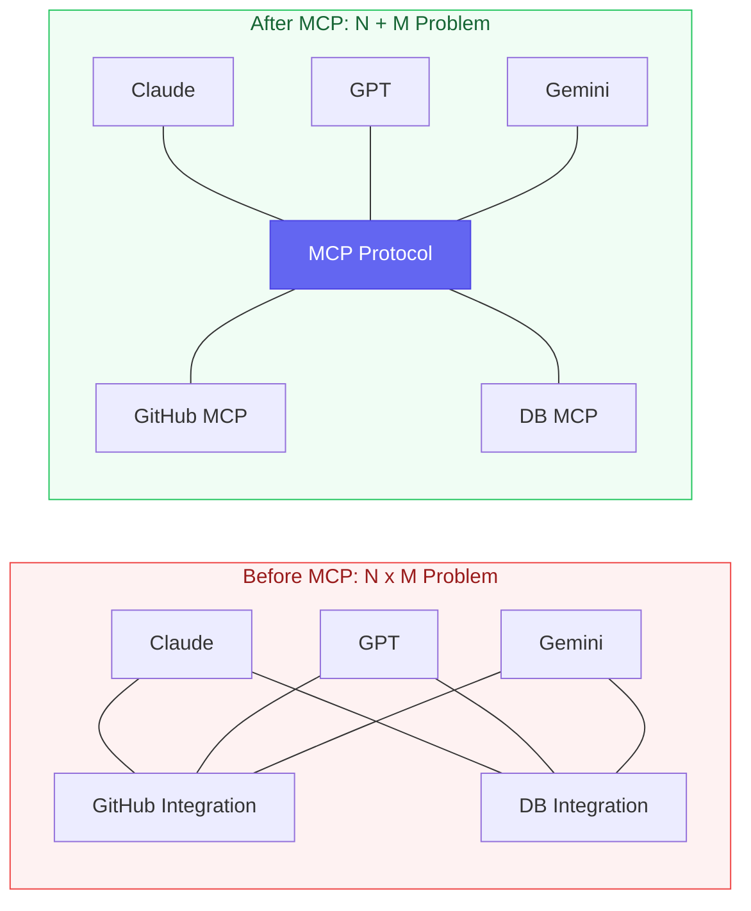
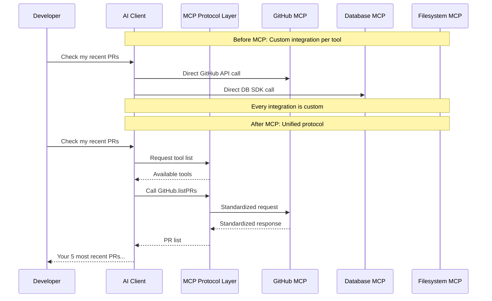

# MCP Is Six Months Old — What Has It Actually Changed?

[English](./day-05.md) | [简体中文](../zh/day-05.md)

Last week I installed 12 MCP Servers on Claude Code — GitHub, database, browser, filesystem, Figma, Slack... After the last one clicked into place, I realized something: the days of rewriting integration code every time I switched AI tools are finally over.

---

## 🔥 01 Before MCP: Every AI Was an Island

Before MCP, AI tool integration was an N×M problem. N AI clients, M external tools — every combination needed its own integration code. Claude wants GitHub? Write one. GPT wants GitHub? Write another. Gemini? Yet another.

Maintenance was worse. GitHub API changes a field, you update three integrations simultaneously. I used to maintain an AI customer service system with 5 AI models and 8 business systems — integration code alone was 12,000 lines, more than the business logic.

Before November 2024, every AI vendor was reinventing the wheel. OpenAI had Function Calling, Anthropic had Tool Use, Google had Extensions — different names, same job, zero interoperability. You wrote a GitHub integration for Claude? GPT couldn't use it at all.

**Before: 3 AIs × 5 tools = 15 integrations → Now: 3 AIs + 5 MCP Servers = 8 components → This means: Integration work dropped from N×M to N+M.**

Put simply, the pre-MCP world was like every phone having a different charging port — three phones, three cables.

---

## 🛠️ 02 After MCP: One Protocol to Unify AI's "Hands and Feet"

MCP (Model Context Protocol) solves one core problem: **a unified communication standard between AI tools and the external world.**

Just as USB unified device interfaces, MCP unified AI's "plug." Write an MCP Server once, and Claude, GPT, Gemini — any MCP-compatible client — can use it. Write once, run everywhere.

In practice, MCP changed three things:

**First, tool discovery is automatic.** Previously you hardcoded each tool's schema. Now MCP Servers declare their own capabilities, and clients discover them automatically. Installing a new MCP Server is like installing a VS Code extension — one click.

**Second, context passing is standardized.** Previously every tool returned data in a different format, requiring adapters. Now MCP defines unified Resource and Prompt types — consistent data formats across the board.

**Third, security boundaries are clear.** MCP Servers run as independent processes. AI clients can't directly access your system — they can only use MCP-defined interfaces. It's like an API Gateway: every request passes through a checkpoint.

In my own project, MCP cut integration code from 12,000 lines to 800. Half of those 800 lines are MCP Server config files. **This isn't a protocol upgrade — it's an architecture revolution.**

---

## 💡 03 How MCP Really Performs in Production

MCP looks beautiful in demos, but production is another story. I hit three pitfalls:

**Pitfall 1: MCP Server token consumption is a black hole.** Every MCP Server loads all its tool descriptions into context at startup. With 12 servers installed, tool descriptions alone ate about 8,000 tokens. That's 8K tokens gone before the conversation even starts. A friend installed 20 MCP Servers — tool descriptions consumed 15K tokens, costing him an extra $60/month just on "tool descriptions."

**Pitfall 2: Not all MCP Servers are reliable.** The MCP ecosystem exploded too fast; many servers are weekend projects — no error handling, no retries, no rate limiting. One Slack MCP Server I used crashed at 3+ concurrent requests, taking down the entire Agent chain.

**Pitfall 3: MCP's security model is immature.** Current permission control is all-or-nothing — give a MCP Server GitHub access, and it can read all your repos. No fine-grained permissions, no audit logs. In enterprise environments, this is a dealbreaker.

But even with these pitfalls, the efficiency gains are real. I did the math: **before MCP, integrating a new tool took 2 days of dev + 1 day of debugging. Now installing an MCP Server takes 30 minutes.** At 15 tool integrations per year, that's ~45 workdays saved.

---

## 📋 MCP Ecosystem Status

| Dimension | Current State | Trend |
|-----------|---------------|-------|
| Client Support | Claude Code, Cursor, Windsurf, Cline | OpenAI and Google announced support |
| Server Count | 10+ official, 500+ community | ~20 new per week |
| Enterprise Adoption | Early adopters | Finance and healthcare piloting |
| Standardization | Anthropic-led | Submitted to standards body |
| Security Model | Basic permission control | Fine-grained permissions in development |

---

## ⚠️ Caveats and Reflections

Honestly, MCP's biggest risk right now isn't technical — it's **governance.** Who controls the MCP standard? Anthropic. What if Anthropic designs MCP features that favor Claude over other models? This isn't conspiracy thinking — any standard dominated by a single company carries this risk.

Another reflection: MCP lowered the integration bar, but it also lowered the **quality bar.** Before, writing an integration at least required understanding the API. Now you just install an MCP Server — but if you don't understand the underlying API, you can't debug problems. MCP widened the gap between "can use" and "understands."

---

## Closing Thought

Six months into MCP, my biggest takeaway: **it didn't change what AI can do — it changed how AI connects to the world.** Before MCP, AI was a brain without hands. MCP gave AI standardized hands.

**A protocol's value isn't in the protocol itself — it's in the network it connects. The more AI tools MCP connects, the more valuable it becomes. That's the network effect of standards.**
