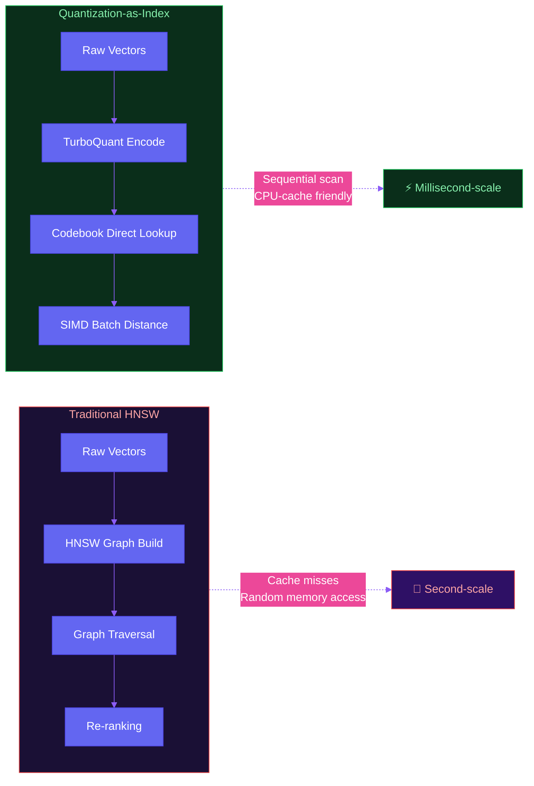

# Day 16 · The Rust Revolution in Vector Search & the Agent Skills Inflection Point

[English](./day-16.md) | [简体中文](../zh/day-16.md)
> **Date:** 2026-06-10 · **Category:** Deep Insight · **Read time:** ~6 min

## TL;DR

- **TurboVec** gained 1,600+ stars in a week by rewriting vector indexing in Rust — 10-100x faster search. The AI bottleneck is sliding from model inference to data retrieval.
- **Agent Skills ecosystem** is dominating GitHub Trending — CopilotKit (+613⭐/day), open-notebook (+783⭐/day). The 2026 competition axis shifted from "whose model is bigger" to "whose skills are richer."
- **AI hardware startups** have tech but no GTM. JD.com's AI hardware showcase exposed the core pain point: teams that can build but can't sell.

## GitHub Gems

### 1. RyanCodrai/turbovec — The Rust Rocket for Vector Search

7,600+ ⭐ · +1,600/week · Rust + Python · MIT

**WHY it matters:** When your RAG pipeline latency spikes into seconds on 10M vectors, you realize the bottleneck isn't the LLM — it's retrieval. TurboVec, built on the TurboQuant quantization algorithm, delivers 10-100x faster search than FAISS/HNSW implementations. This isn't incremental. This is a category shift.

**HOW it works:** The core insight is "quantization IS the index." Instead of maintaining a separate HNSW graph structure, TurboVec uses the quantization codebook directly as the index. This eliminates the random memory access pattern of graph traversal, sending CPU cache hit rates through the roof. Python bindings via PyO3 give you zero-copy interop — call it from your existing pipeline without rewriting anything.

**The INSIGHT:** This project marks vector search's graduation from "good enough" to "obsessively fast." Think Redis in 2015 vs. MySQL — not a replacement, but a purpose-built accelerator on the hot path. If your RAG stack is still running FAISS flat indexes, you're leaving 100x on the table.

### 2. CopilotKit — React Infrastructure for Agent UIs

+613 ⭐/day · TypeScript · MIT

**WHY it matters:** Anyone who's built an Agent frontend knows the pain — streaming output rendering, tool-call visualization, human-in-the-loop approval flows. Each one is a from-scratch implementation. CopilotKit abstracts these into React components: `<CopilotChat>`, `<CopilotTask>`, `<CopilotAction>`. Plug and play.

**HOW it works:** The architecture follows a "frontend-as-agent-control-plane" philosophy. LLM tool calls stream over WebSocket to the frontend, which renders them as interactive UI elements. User actions flow back to the LLM. Essentially, it moves the human-collaboration layer from the backend to the browser — where it belongs.

**The INSIGHT:** In 2024, everyone competed on Agent backend orchestration (LangGraph, CrewAI). In 2026, the competition is Agent frontend experience. CopilotKit's explosion signals: **Agent differentiation isn't about what the agent can do — it's about how the human participates.**

### 3. open-notebook — The Agent Workbench for Knowledge Distillation

+783 ⭐/day · Python · Apache-2.0

**WHY it matters:** There are a thousand "Obsidian + LLM" mashups. open-notebook is different. It models "read paper → extract insight → generate note" as a DAG workflow where every node is pluggable — swap LLMs, swap prompts, swap the entire transformation. It's an Agent orchestrator purpose-built for knowledge workers.

**HOW it works:** The core abstraction is the Notebook DAG. You define sources (PDF/URL/file), transforms (summarize/compare/critique), and sinks (Markdown/Anki cards/Notion). Each transform node independently configures model + temperature + system prompt. Built-in A/B comparison lets you evaluate prompt variants side by side.

**The INSIGHT:** This is what RAG should have been all along — not "retrieve and concatenate," but "retrieve → understand → reconstruct." The DAG pattern from open-notebook could become the standard architecture for knowledge agents.

## Architecture That Clicks: Quantization-as-Index

The bottleneck in traditional vector search (FAISS HNSW) isn't algorithmic complexity — it's **memory access patterns**. Graph traversal is inherently random, crushing CPU cache hit rates. TurboVec's "quantization-as-index" turns search into a sequential scan. SIMD instructions compute 8 distances simultaneously. Cache hit rates approach 100%. **Architecture lesson: sometimes the best optimization isn't a better algorithm — it's a data layout that matches your hardware.**

## Startup Signal: The GTM Abyss for AI Hardware

JD.com recently hosted an AI hardware showcase that laid bare a brutal truth: **most AI hardware teams have technology and vision but zero commercialization capability.** They don't know how to build distribution channels, price products, or handle returns. One team built an AI companion robot with a stunning demo — but sold only 200 units in 3 months. They priced it at ¥2,999 when consumers' mental anchor was ¥599.

This is fundamentally different from software startups. Hardware carries inventory risk, supply chain complexity, and return rates. **The moat for AI hardware isn't the model — it's the supply chain and channel.** If you're a technical team building hardware, you need at least one co-founder who's shipped consumer electronics before.

## One More Thing

Mitchell Hashimoto (HashiCorp founder) said on Hacker News that some companies have fallen into "AI psychosis" — not because AI is broken, but because their expectations have detached from reality. Harsh but precise: **organizations that treat AI as a silver bullet eventually get shot by their own bullet.** The survivors will be those who treat AI as a screwdriver — no showing off, just turning the screws that need turning.

## Key Takeaway

**In 2026's AI race, the winners aren't those with the biggest models — they're those with the fastest retrieval, the richest skills, and the sharpest go-to-market.**
