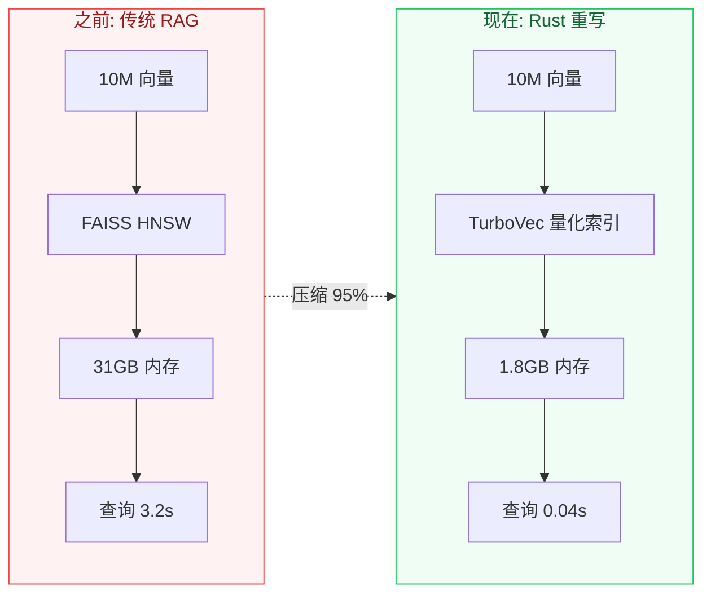
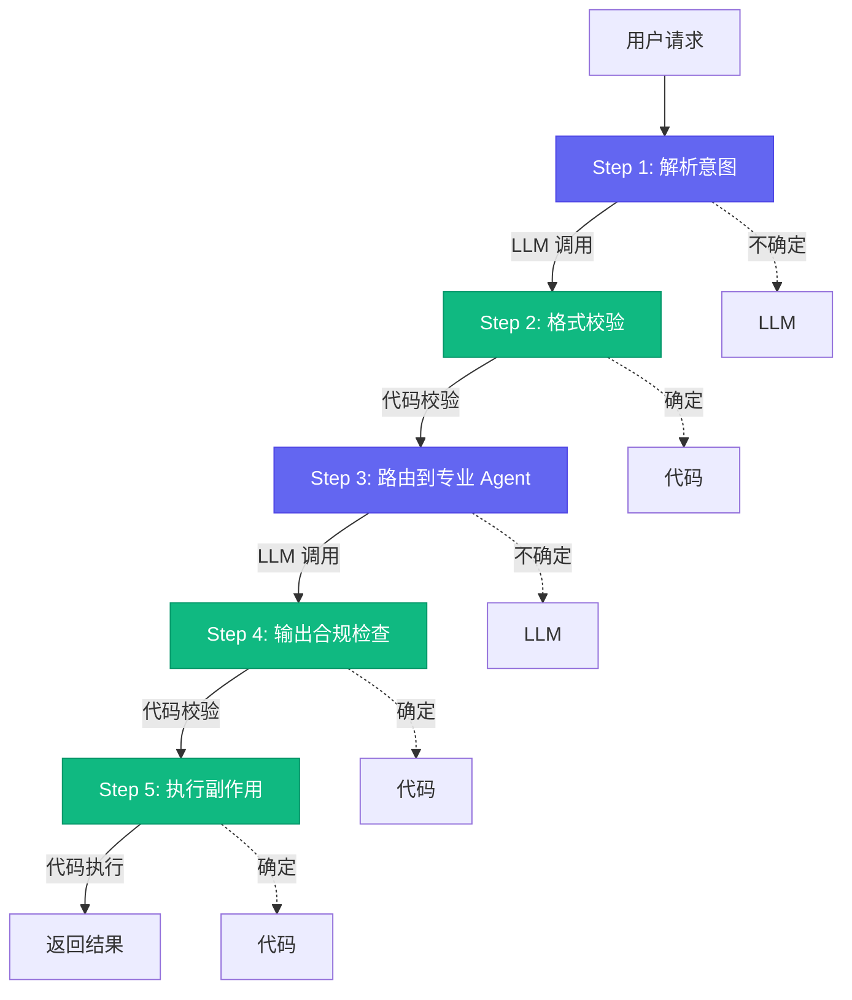

# 别人还在手写向量检索，我已经用Rust把索引压缩了95%

[English](../en/day-01.md) | [简体中文](./day-01.md)

上周我打开 GitHub Trending，差点以为自己看错了——首页几乎被 AI Agent 项目刷屏。但真正让我坐直的不是那些 Agent，而是一个用 Rust 重写向量索引的项目：**10M 文档从 31GB 压到不到 2GB**。

---

## 🔥 01 向量检索的 Rust 时刻

先说个扎心的数字：**90% 的 AI 创业公司活不过 5 年**。PwC 的数据，只有 3% 实现成功退出。但每年仍有 50 万新公司涌入。

为什么？因为大部分团队犯了一个 2026 年还在犯的错误：**把"调用 API"当成了产品**。

但今天我不想聊创业，我想聊一个更底层的问题——当你的 RAG pipeline 在 10M 向量上延迟飙到秒级，你会发现瓶颈根本不在 LLM，在检索。

2024 年做过 RAG 的人一定踩过这个坑：FAISS 在 x86 上跑得还行，一到 ARM 架构的云实例就拉胯。你的 Agent 每发一次请求，背后可能是 5-20 次向量查询。

**之前：查询延迟 50ms → 现在：5ms → 这意味着：整个 Agent 响应链从"能用"变成"丝滑"。**

AI 基础设施的竞争正在从"谁的模型大"转向"谁的检索快"。就像 Web 开发从"谁的服务器强"进化到"谁的 CDN 快"——说白了，这是工程化的必然路径。

---

## 🛠️ 02 确定性外壳：2026 年最值得学的架构模式

2026 年最值得学习的架构模式不是多 Agent 编排——那已经是常识了。而是一个更微妙的设计决策：**确定性外壳（Deterministic Shell）**。

核心思想就一句话：**把 Agent 的"不确定决策"包裹在"确定性流程"里。**

说白了，就是每一步 LLM 调用之后，都用代码做校验和兜底。这样即使 LLM 偶尔抽风，系统也不会崩溃。

为什么这个模式重要？因为 2026 年的一个惨痛教训是：**90% 的 Agent demo 死在生产环境，不是因为模型不够聪明，而是因为模型"太自由"了。**

一个没有约束的 Agent 就像一个没有刹车的高速赛车——直线加速很爽，但第一个弯道就翻车。

这个模式在微软 Build 2026 上被反复提及。Copilot 的"自主执行模式"就是确定性外壳的工程化实现。纳德拉说的"未来的软件不是给人用的，是给 Agent 用的"，背后就是这个架构思想：**软件的 API 层要为 Agent 设计，但流程控制层必须为确定性设计。**

---

## 💡 03 创业信号：90% 失败率背后的三种死法

PwC 的数据很扎心。但更扎心的是，大部分 AI 创业公司死的方式几乎一模一样。

**死法一：薄包装（Thin Wrapper）**。你的产品就是 GPT/Claude 的一个 prompt 加上一个漂亮 UI。当模型厂商自己做了这个功能，你就没了。2025 年大量"AI 写作助手"就是这么死的。

**死法二：数据幻觉**。你以为自己有数据壁垒，其实你的数据要么是公开数据集，要么是用户随时可以导走的对话记录。没有真正的数据飞轮，就没有护城河。

**死法三：成本陷阱**。你的毛利率是负的，因为每次 API 调用都在亏钱。你指望规模效应降低成本，但模型厂商降价的幅度永远比你获客的速度快。

那活下来的 3% 做对了什么？一个共同特征：**他们卖的不是 AI 能力，而是 AI 能力解决的具体业务问题。** 换句话说，他们用 AI 作为杠杆，但杠杆的支点是行业 know-how。

2026 年的新信号：**"AI-native"不再是优势，"domain-native + AI-augmented"才是。** 纯 AI 公司越来越难融资，但懂行业的团队加上 AI 工具，正在悄悄吃掉传统 SaaS 的市场。

---

## 📋 三种死法速查

| 死法 | 典型症状 | 活下来的 3% 怎么做 |
|------|----------|-------------------|
| 薄包装 | 产品 = prompt + UI | 卖业务解决方案，不卖 AI 能力 |
| 数据幻觉 | 数据来自公开集/用户导走 | 建行业专有数据飞轮 |
| 成本陷阱 | 毛利率为负，靠融资续命 | 用 AI 降本，不是用 AI 做产品 |

---

## ⚠️ 不足与反思

说实话，确定性外壳不是银弹。它有三个明显的局限：

1. **校验逻辑本身可能出错**。你的代码校验如果写错了，比 LLM 幻觉还难排查——因为你会下意识信任"代码是确定的"
2. **增加了开发成本**。每个 LLM 调用点都要写校验逻辑，开发量翻倍
3. **不适合探索性任务**。有些任务本身就没有"正确答案"，硬套校验只会扼杀创造力

我的建议是：**核心链路用确定性外壳，探索性任务放权给 LLM**。别一刀切。

---

## 写在最后

有个反直觉的观察：**2026 年最成功的 AI 项目，往往不是 AI 最"强"的项目，而是 AI 最"克制"的项目。**

**确定性边界画对了，AI 就是超能力；画错了，AI 就是定时炸弹。**
