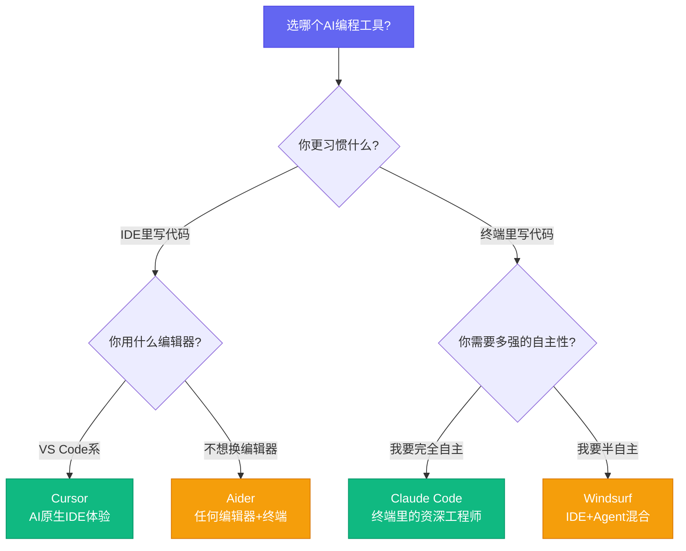
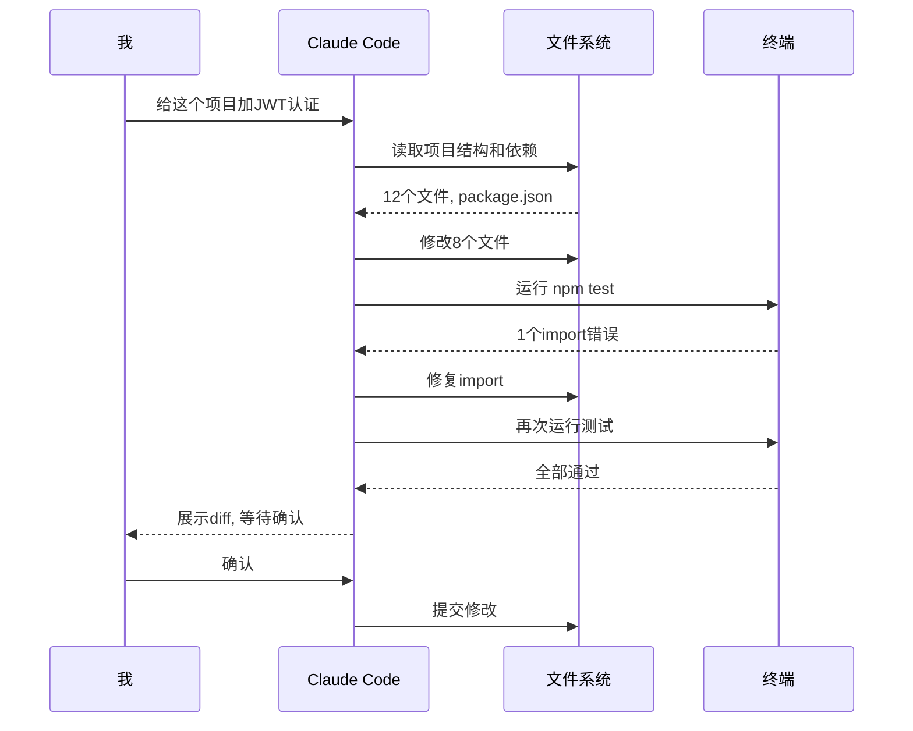

# 4个AI编程工具我全用了，最后留下了这1个

[English](../en/day-02.md) | [简体中文](./day-02.md)

上周我花了4天时间，用同一个全栈项目（React + Node + PostgreSQL）分别跑了一遍 Cursor、Claude Code、Aider、Windsurf。结果让我意外——4个工具里只有1个让我从"试用"变成了"每天都打开"。

---

## 🔥 01 Cursor — AI原生IDE的天花板

**定价: $20/月(Business) | 模型: Claude 4 Sonnet / GPT-4.1 / Gemini 2.5 Pro 自选**

Cursor 是我最早用、也是用得最久的AI编程工具。它做对了一件事：**把AI塞进编辑器的每一个角落，而不是在外面挂一个聊天窗口。**

Tab补全、Cmd+K行内编辑、Composer多文件修改——三个入口覆盖了从"改一行"到"改一个模块"的全部场景。2026年的Cursor已经从"AI辅助编辑器"进化成了"AI原生IDE"，它重新构建了VS Code的编辑器核心，不是简单套壳。

**之前：写一个CRUD接口20分钟 → 现在：Composer模式3分钟生成5个文件 → 这意味着：我不再写样板代码了。**

但Cursor有个致命问题：**上下文管理是黑盒**。你不知道它到底读了哪些文件，也不知道它为什么忽略了你的某个文件。项目超过50个文件后，Composer经常"忘记"你之前定义的schema。说白了，它聪明但不可控。

---

## 🛠️ 02 Claude Code — 终端里的资深工程师

**定价: API按量计费 | 模型: Claude 4 Sonnet/Opus**

Claude Code 完全是另一种生物。它不活在IDE里，它活在终端里。你给它一个任务，它自己读代码、自己改代码、自己跑测试、自己修bug——全程你只需要看。

我试过给它一个任务："给这个项目加JWT认证"。它花了47秒读了整个项目结构，然后自己改了8个文件，跑了两轮测试，修了一个import错误，最后输出一个diff让我确认。**全程我没有敲一行代码。**

Claude Code 最强的地方是**自主性**。它不是"你问它答"，而是"你给目标它执行"。但这也意味着你需要信任它——而信任需要时间建立。前两周我每次都仔细检查它的修改，现在我只看diff摘要。

说实话，Claude Code 的学习曲线是4个工具里最陡的。你得学会写 CLAUDE.md，学会用 subagent，学会用 hook 做自动化。但一旦跨过这个坎，你会发现：**这哪是编程工具，这是你雇了一个24小时在线的工程师。**

---

## 💡 03 Aider — 极客的瑞士军刀

**定价: 开源免费 / API按量计费 | 模型: 支持几乎所有模型**

Aider 是4个工具里最"程序员味"的。它不给你IDE，不给你UI，就给你一个终端REPL。但它的设计哲学极其精准：**git集成是AI编程的命脉。**

每个修改自动commit，每次对话都有git历史，随时 `git diff` 回滚。这意味着你永远不会因为AI改坏了代码而抓狂——回滚一行命令的事。

Aider 还有一个杀手锏：**模型无关**。你可以用 Claude、GPT、Gemini、DeepSeek、Qwen——任何有API的模型。今天 Claude 好用就用 Claude，明天 GPT 出了新模型切过去，零迁移成本。

**之前：换模型要换工具 → 现在：一个Aider通吃所有模型 → 这意味着：你永远用得上最便宜的模型。**

但Aider的短板也很明显：**没有IDE集成，没有可视化diff，没有项目级别的上下文理解**。它更适合"改几个文件"的场景，不太适合"重构整个模块"。

---

## 📋 四个工具速查

| 工具 | 形态 | 最强场景 | 最弱场景 | 月成本 |
|------|------|----------|----------|--------|
| Cursor | AI原生IDE | 日常开发、多文件编辑 | 大规模重构、终端工作流 | $20 |
| Claude Code | 终端Agent | 自主完成任务、复杂重构 | 需要GUI、快速小改动 | API费用 |
| Aider | 终端REPL | 模型灵活切换、git友好 | 项目级理解、新手友好 | API费用 |
| Windsurf | IDE+Agent混合 | 从IDE过渡到Agent | 深度定制、纯终端流 | $15 |

---

## ⚠️ 不足与反思

说实话，这4个工具没有一个是完美的。我最大的感触是：**AI编程工具的瓶颈不在AI，在上下文管理。**

Cursor的上下文是黑盒，Claude Code需要你手动写CLAUDE.md，Aider靠你手动 `/add` 文件，Windsurf的Cascade经常读错文件。4个工具在"理解你的项目"这件事上，都还差得远。

另一个被忽略的问题：**成本**。Cursor月费看着便宜，但重度使用时Composer的token消耗惊人。Claude Code按API计费，我一个月跑了$180。Aider如果用Opus模型也不便宜。很多人只看月费，不看token账单——这是坑。

---

## 写在最后

最后我留下了Claude Code。不是因为它是"最好的"，而是因为它的自主性最匹配我的工作方式——我更愿意花5分钟写好一个任务描述，然后让它自己跑，而不是坐在IDE里一行行确认。

**选AI编程工具，不是选最强的，是选最匹配你工作节奏的。工具再强，和你不在一个节拍上，就是噪音。**
