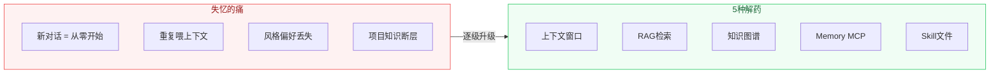
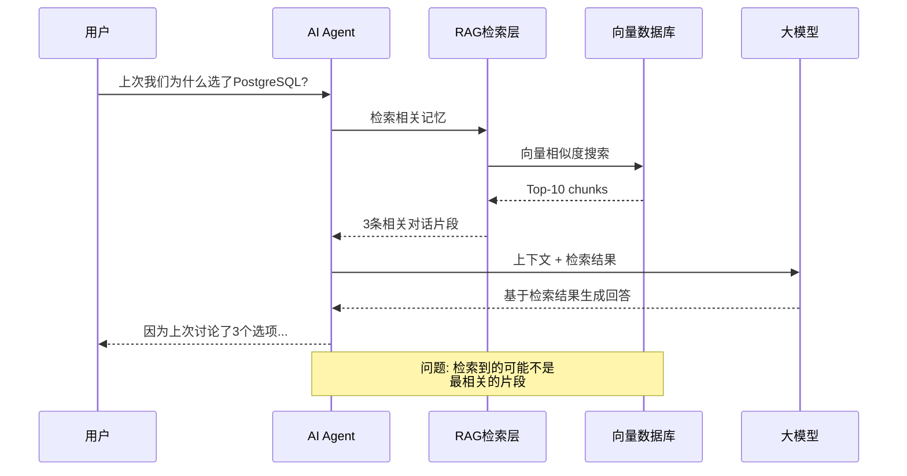

# 你的AI助手为什么总是失忆？我试了5种解药

[English](../en/day-03.md) | [简体中文](./day-03.md)

昨天我让Claude帮我重构一个模块，聊了40分钟，改了12个文件。今天打开新对话，它连项目用什么框架都不记得了。我不得不重新喂一遍上下文——又是20分钟。这种事每周至少发生3次。

---

## 🔥 01 上下文窗口：最直觉但最脆弱的方案

所有AI助手的"记忆"本质上都是上下文窗口——就是模型一次能读多少token。Claude 4有200K token，GPT-4.1有128K，Gemini 2.5 Pro有1M。

听起来很多对吧？但算一笔账：一个中型项目（50个文件，平均200行），光代码就吃掉约150K token。再加上对话历史、系统提示、工具定义——**200K的窗口根本不够用**。

我做过一个实验：让Claude Code处理一个有80个TypeScript文件的项目。前30分钟它表现得像个资深工程师，对项目结构了如指掌。但到了第45分钟，它开始"忘记"之前定义的接口，重复问已经回答过的问题。

**之前：对话30分钟内记忆清晰 → 现在：超过45分钟开始失忆 → 这意味着：上下文窗口是短期记忆，不是长期记忆。**

说白了，把上下文窗口当记忆用，就像把RAM当硬盘用——断电就没了。

---

## 🛠️ 02 RAG检索：给AI装一个"搜索引擎"

RAG（Retrieval-Augmented Generation）是目前最主流的记忆方案。原理很简单：把你的项目文档、对话历史、代码片段存进向量数据库，每次对话时检索相关内容塞进上下文。

我试过用LangChain搭了一个RAG pipeline：把项目的所有文档和代码注释切成chunk，存进ChromaDB，每次对话前先检索top-10相关片段。

效果？**中等偏上**。对于"这个函数是干什么的"这种事实性问题，RAG表现很好。但对于"上次我们讨论的架构决策为什么选了方案B"这种需要上下文关联的问题，RAG经常检索不到——因为相关内容可能分散在5个不同的对话里。

RAG的核心问题是**检索精度**。向量相似度≠语义相关性。你搜"为什么选PostgreSQL"，它可能返回"PostgreSQL的安装步骤"——因为向量距离近，但语义完全不对。

---

## 💡 03 Memory MCP Server：2026年最值得关注的方案

Memory MCP Server 是我目前找到的最接近"真记忆"的方案。它不是一个数据库，而是一个**记忆管理层**——通过MCP协议让AI Agent可以主动"记住"和"回忆"信息。

我用了两个星期，配置了 `@anthropic/memory-mcp` 和 `@modelcontextprotocol/server-memory`。核心机制是三层记忆：

1. **工作记忆（Working Memory）** — 当前对话的上下文，自动管理
2. **情景记忆（Episodic Memory）** — 过往对话的关键决策和结论，按需检索
3. **语义记忆（Semantic Memory）** — 项目知识图谱，持久化存储

**之前：每次新对话重新解释项目 → 现在：Agent主动说"我记得上次我们..." → 这意味着：AI终于有了"跨对话"的记忆。**

但说实话，Memory MCP 还远不完美。最大的问题是**记忆污染**——Agent会记住一些不该记住的东西（比如你随口说的一句"先这样吧"），然后在后续对话里当成决策依据。你需要定期"清理记忆"，这比清理浏览器缓存还烦。

---

## 📋 5种记忆方案对比

| 方案 | 持久性 | 精度 | 成本 | 适合场景 |
|------|--------|------|------|----------|
| 上下文窗口 | 单次对话 | 高 | Token消耗大 | 短任务、简单对话 |
| RAG检索 | 持久 | 中 | 向量数据库成本 | 事实性查询、文档问答 |
| 知识图谱 | 持久 | 高 | 构建成本极高 | 复杂关系推理、企业知识库 |
| Memory MCP | 持久 | 中高 | 服务器成本 | Agent长期协作 |
| Skill/MD文件 | 持久 | 高 | 几乎为零 | 项目规范、风格偏好 |

---

## ⚠️ 不足与反思

说实话，5种方案没有一种能单独解决问题。我现在用的是**混合方案**：Skill文件存项目规范，Memory MCP存对话记忆，RAG存文档检索。但维护3套记忆系统本身就是一种负担。

更深层的问题是：**AI的"记忆"和人的记忆不是一回事**。人的记忆会遗忘、会模糊、会重新组织——这反而是一种优势，因为遗忘是信息压缩。AI的记忆要么全记（导致噪声），要么全忘（导致失忆），没有中间态。

另一个被忽略的问题：**隐私**。你的记忆存在哪里？Memory MCP Server是本地的还好，如果用云端的RAG服务，你的项目决策、架构讨论、甚至代码片段都在别人的服务器上。

---

## 写在最后

AI Agent的记忆问题，本质上不是技术问题，是**架构问题**。你不可能用一个方案解决所有记忆需求——就像人脑不可能只用海马体。

**记忆不是存储，记忆是检索。存了100TB但找不到，等于没存。**
