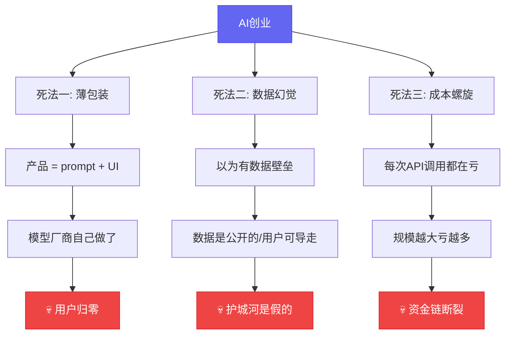
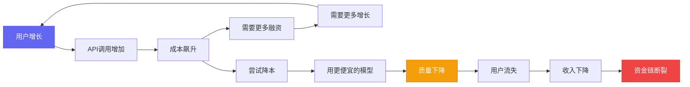

# AI创业的3个死法，90%的人都踩了

[English](../en/day-04.md) | [简体中文](./day-04.md)

上个月我参加了一个AI创业者的闭门会，12个团队，8个已经转型，2个在裁员，只有2个还活着。活着的那2个，做的都不是"AI产品"——一个是用AI做法律文书审查的律所SaaS，一个是用AI做质检的制造业系统。

---

## 🔥 01 薄包装：你的产品就是别人的prompt

2025年最惨烈的一波倒闭潮，就是"AI写作助手"。Jasper、Copy.ai、还有国内几十个"AI帮你写周报/写文案/写论文"的产品——当ChatGPT自己加了Custom Instructions和GPTs之后，这些产品一夜之间失去了存在意义。

我认识一个创始人，2024年融了800万做AI简历优化工具。产品就是：用户上传简历 → 后端调GPT-4 → 前端展示优化后的简历。UI确实做得漂亮，但核心逻辑就是一段200字的prompt。

2025年3月，OpenAI在GPT里加了"简历优化"模板。他的日活从1.2万掉到800。6月份公司关门。

**之前：日活1.2万 → 现在：日活800 → 这意味着：你的护城河就是一段prompt，别人复制只要5分钟。**

说白了，薄包装的死法有一个共同特征：**你卖的是AI的能力，不是你解决的业务问题。** 用户买的不是"AI写的简历"，是"更好的面试机会"。当你只提供前者，模型厂商自己做了后者，你就没了。

怎么判断自己是不是薄包装？一个简单的测试：**把你的prompt贴到ChatGPT里，如果效果和你的产品差不多，你就是薄包装。**

---

## 🛠️ 02 数据幻觉：你以为的护城河，其实是个水坑

"我们有数据壁垒"——这是我听AI创业者说得最多的一句话。但90%的情况下，这个壁垒是假的。

我见过三种典型的数据幻觉：

**幻觉一：公开数据集包装成"专有数据"**。一个做AI法律咨询的团队，号称有"百万级法律文书数据库"。我一看，就是中国裁判文书网的公开数据加了个向量索引。任何人花2万块都能搞出来。

**幻觉二：用户数据没有锁定效应**。一个做AI学习助手的团队，号称"10万用户的学习数据是我们的壁垒"。但用户随时可以导走自己的对话记录和学习笔记。你的数据是用户借给你的，不是你的。

**幻觉三：数据飞轮没有闭合**。很多团队画了一个漂亮的飞轮图：用户越多→数据越多→模型越好→用户越多。但中间缺了一环：**模型变好到用户感知到变好之间，有一个巨大的鸿沟**。你的模型从85分提到88分，用户根本感觉不到。

真正的数据壁垒长什么样？一个例子：某制造业SaaS公司，花了3年在工厂里部署传感器，积累了200万条真实质检数据。这些数据不在公开互联网上，用户也带不走——因为数据来自物理世界的传感器，不是用户的输入。

**之前：以为公开数据+向量索引=壁垒 → 现在：发现任何人2周都能复制 → 这意味着：没有物理世界或业务流程绑定的数据，就不是壁垒。**

---

## 💡 03 成本螺旋：规模越大，亏得越多

这是最隐蔽也最致命的死法。很多AI创业者直到资金链断裂前一个月，才意识到问题的严重性。

算一笔账：一个AI客服产品，每个用户每天平均50次对话，每次对话消耗约2000 token。按Claude 4 Sonnet的价格（$3/M input, $15/M output），每个用户每天的成本约$1.5。你收用户$29/月，但成本是$45/月。**每个用户每月亏$16。**

你可能会说：规模大了成本会降。但现实是：**模型厂商降价的幅度，永远比你获客的速度慢。** 2024年API价格降了约60%，但同期获客成本涨了约40%（因为所有人都在投广告抢同一批用户）。

更可怕的是**成本螺旋**：用户越多 → API调用越多 → 成本越高 → 需要更多融资 → 需要更多用户增长 → 用户更多 → 成本更高……这不是增长飞轮，这是死亡螺旋。

活下来的团队怎么做的？一个共同点：**他们用AI降本，而不是用AI做产品。** 那个律所SaaS，AI只是他们文书审查流程中的一个环节——80%的工作是规则引擎做的，AI只处理那20%需要"理解"的部分。这样API成本只占总成本的8%，毛利率能做到72%。

---

## 📋 三种死法速查

| 死法 | 早期信号 | 自检方法 | 活路 |
|------|----------|----------|------|
| 薄包装 | 产品核心就是一段prompt | 把prompt贴到ChatGPT里看效果 | 卖业务结果，不卖AI能力 |
| 数据幻觉 | 数据来自公开集或用户输入 | 问自己：用户能带走数据吗？ | 绑定物理世界或业务流程 |
| 成本螺旋 | 毛利率<30%且API成本占比>50% | 算每个用户的真实成本 | AI是降本工具，不是产品本身 |

---

## ⚠️ 不足与反思

说实话，这三种死法不是互斥的——很多团队三种全踩了。而且我观察到一个更残酷的现实：**即使你避开了这三种死法，也不一定能活下来。** 因为AI创业的窗口期极短，你可能还没找到PMF，市场就变了。

另一个反思：我说的"活下来"的案例，样本量太小了。2个团队不代表普遍规律。可能只是幸存者偏差——活着的恰好做了对的事，但做对的事不一定能活。

---

## 写在最后

有个创业者跟我说了一句话，我记到现在："我不是在用AI创业，我是在用创业让AI有用。"

**AI是杠杆，不是支点。支点永远是真实的业务需求。杠杆再长，没有支点，翘不起任何东西。**
