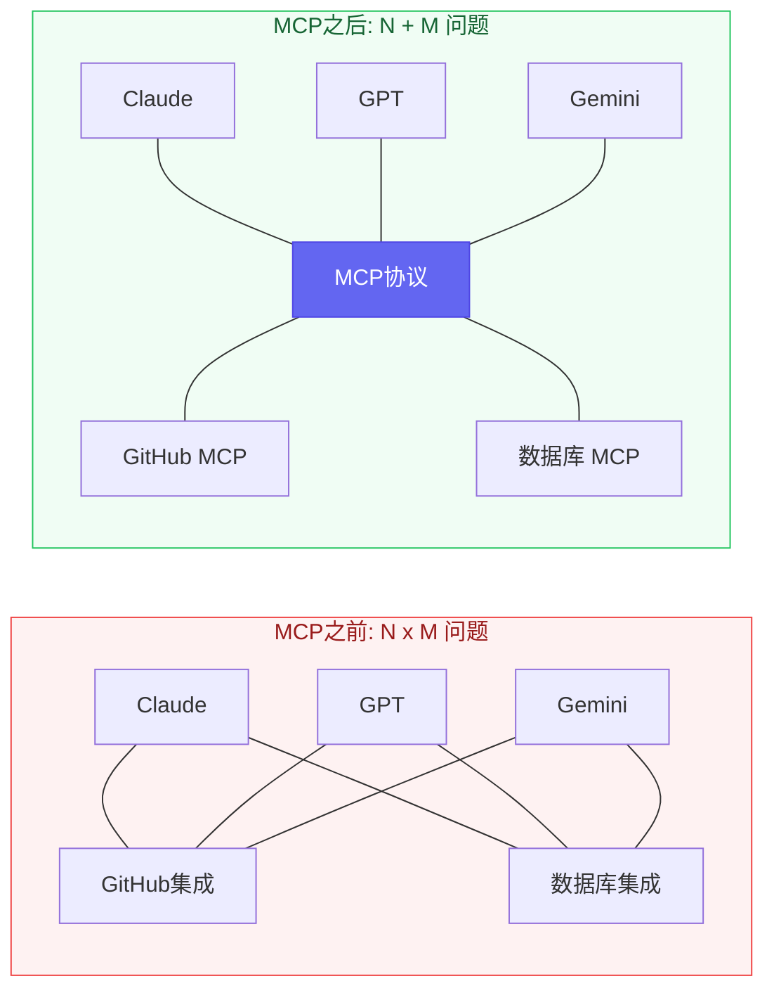
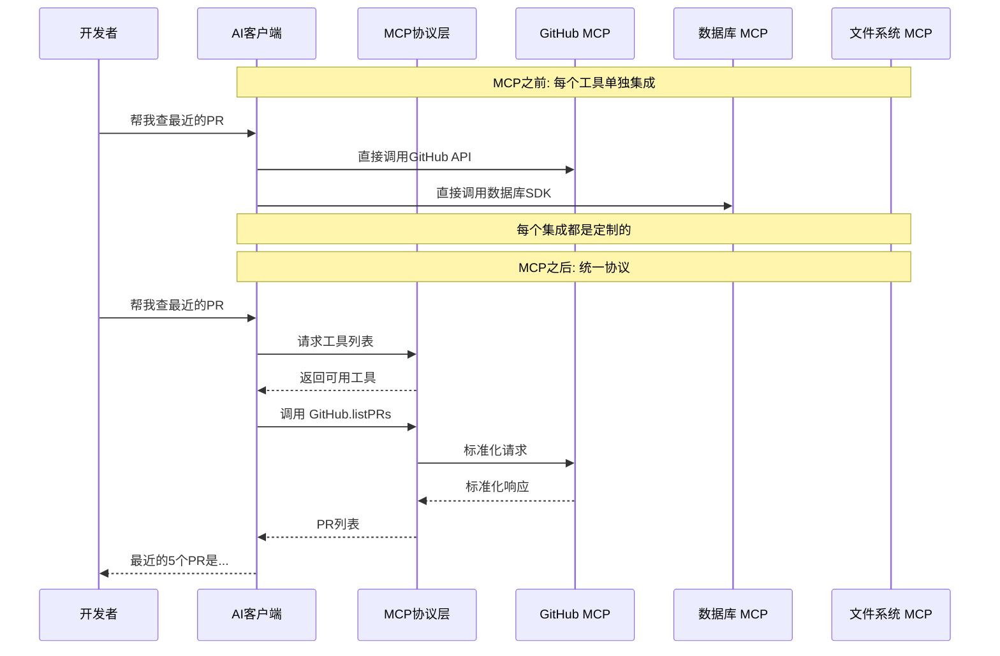

# MCP协议出来半年了，到底改变了什么？

[English](../en/day-05.md) | [简体中文](./day-05.md)

上周我给Claude Code装了12个MCP Server——GitHub、数据库、浏览器、文件系统、Figma、Slack……装完那一刻我突然意识到：我之前每换一个AI工具，就要重新写一遍集成代码的日子，终于结束了。

---

## 🔥 01 MCP之前：每个AI都是一座孤岛

MCP出来之前，AI工具的集成是一个N×M问题。N个AI客户端，M个外部工具，每个组合都要写一遍集成代码。Claude想连GitHub？写一个。GPT想连GitHub？再写一个。Gemini想连？又写一个。

更痛苦的是维护。GitHub API改了一个字段，你得同时更新3个集成。我之前维护一个AI客服系统，接了5个AI模型、8个业务系统，光集成代码就有1.2万行——比业务逻辑还多。

2024年11月之前，每个AI工具厂商都在造自己的轮子。OpenAI有Function Calling，Anthropic有Tool Use，Google有Extensions——名字不同，干的活一样，但互不兼容。你写了一个GitHub集成给Claude用，GPT完全用不了。

**之前：3个AI x 5个工具 = 15个集成 → 现在：3个AI + 5个MCP Server = 8个组件 → 这意味着：集成工作量从N×M降到了N+M。**

说白了，MCP之前的世界就像每个手机用不同的充电口——你有3部手机，就得带3根线。

---

## 🛠️ 02 MCP之后：一个协议统一了AI的"手脚"

MCP（Model Context Protocol）解决的核心问题就一个：**让AI工具和外部世界之间有一个统一的通信标准。**

就像USB统一了设备接口，MCP统一了AI的"插头"。一个MCP Server写好了，Claude、GPT、Gemini、任何支持MCP的客户端都能用。你写一次，到处运行。

我实际体验下来，MCP改变了三件事：

**第一，工具发现自动化了。** 以前你要在代码里硬编码每个工具的schema。现在MCP Server自己声明能力，客户端自动发现。装一个新MCP Server就像装一个VS Code插件——点一下就行。

**第二，上下文传递标准化了。** 以前每个工具返回的数据格式不一样，你得写适配器。现在MCP定义了统一的Resource和Prompt类型，数据格式一致。

**第三，安全边界清晰了。** MCP Server是独立进程，AI客户端不能直接访问你的系统——只能通过MCP定义的接口。这就像API Gateway，所有请求都经过一道关卡。

我自己的项目里，MCP让我把集成代码从1.2万行砍到了800行。800行里还有一半是MCP Server的配置文件。**这哪是协议升级，这是架构革命。**

---

## 💡 03 生产环境里MCP的真实表现

MCP在demo里看起来很美，但生产环境是另一回事。我踩了三个坑：

**坑一：MCP Server的Token消耗是个黑洞。** 每个MCP Server启动时会把所有工具描述加载到上下文里。我装了12个MCP Server，光工具描述就吃了约8000 token。这意味着每次对话还没开始，8K token就没了。一个朋友装了20个MCP Server，工具描述占了15K token——他每个月多花了$60在"工具描述"上。

**坑二：不是所有MCP Server都靠谱。** MCP生态爆发太快，大量Server是周末项目——没有错误处理、没有重试机制、没有速率限制。我用的一个Slack MCP Server，在并发请求超过3个时直接崩溃，把整个Agent链路带崩。

**坑三：MCP的安全模型还不够成熟。** 目前的权限控制是"全有或全无"——你给了一个MCP Server访问GitHub的权限，它就能读你所有仓库。没有细粒度的权限控制，没有审计日志。在企业环境里，这是硬伤。

但即便有这些坑，MCP带来的效率提升是实打实的。我算过一笔账：**之前每接一个新工具平均2天开发+1天调试，现在装一个MCP Server只要30分钟。** 按我一年接15个工具算，省了约45个工作日。

---

## 📋 MCP生态现状速查

| 维度 | 现状 | 趋势 |
|------|------|------|
| 客户端支持 | Claude Code, Cursor, Windsurf, Cline | OpenAI和Google已宣布支持 |
| Server数量 | 官方10+，社区500+ | 每周新增约20个 |
| 企业采用 | 早期采用阶段 | 金融和医疗开始试点 |
| 标准化 | Anthropic主导 | 已提交标准组织 |
| 安全模型 | 基础权限控制 | 细粒度权限开发中 |

---

## ⚠️ 不足与反思

说实话，MCP目前最大的风险不是技术问题，是**治理问题**。谁控制MCP标准？Anthropic。如果Anthropic在MCP里做了对Claude有利但对其他模型不利的设计怎么办？这不是阴谋论——任何由单一公司主导的标准都有这个风险。

另一个反思：MCP降低了集成门槛，但也降低了**质量门槛**。以前写一个集成至少要理解API，现在装个MCP Server就完了——但你不理解底层API，出了问题根本排查不了。MCP让"会用"和"理解"之间的鸿沟更大了。

---

## 写在最后

MCP出来半年，我最大的感触是：**它改变的不是AI的能力，而是AI和世界连接的方式。** 以前AI是大脑但没有手脚，MCP给了AI标准化的手脚。

**协议的价值不在协议本身，在它连接的那个网络。MCP连接的AI工具越多，它的价值就越大——这是标准的网络效应。**
