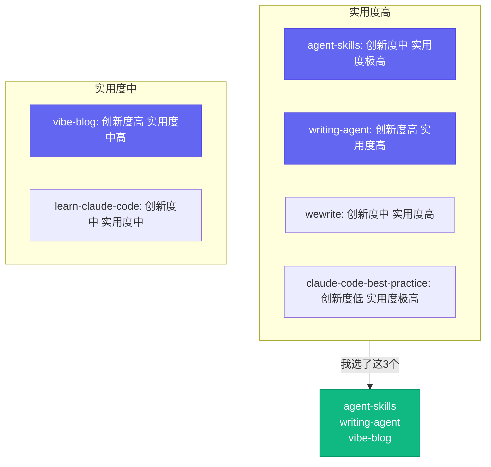
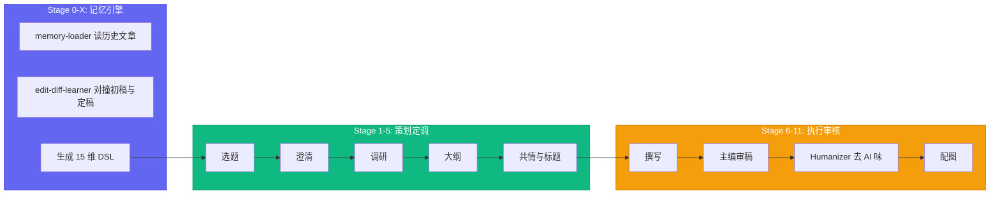

# 6个AI技能项目，我选了这3个

[English](../en/day-06.md) | [简体中文](./day-06.md)

我花了两个周末把 200+ 个 skill 仓库全扫了一遍。说实话，大部分看完就关了——要么是 hello world 级别的 demo，要么是三个月没更新的僵尸项目。最后能让我反复打开的，只有 6 个。而真正让我觉得"这东西改变了我的工作方式"的，只有 3 个。

---

## 🔥 01 addyosmani/agent-skills — Google 工程师的"skill 地图"

**Stars: 47.4k · 本月 +22.2k · 作者: Addy Osmani (Chrome 团队)**

如果你只 star 一个 skill 仓库，就这个。

它不是实现，是**索引**——一份 1800+ 行的 markdown 文件，把当前 Claude / GPT / Gemini 能用上的"写代码 skill"按场景分类。每个 skill 一段话、一段 prompt 示例、一个维护状态。

Addy 不是写最多 skill 的人，他是**整个社区的过滤器**。每周亲自跑每个新出的 skill，删过时的、合相似的、留真正好用的。你读这份目录 30 分钟，能省下 2 周自己摸索的时间。

Addy 在 README 里那句话被引用过几千次：

> "Skills are the new hot config. But the real value is the prompt, not the file extension."

翻译：**skill 文件本身不重要，重要的是里面那段 prompt 的措辞。** markdown 的扩展名只是壳，prompt 才是肉。

**之前：自己摸索 2 周 → 现在：读目录 30 分钟 → 这意味着：省掉 95% 的试错时间。**

说实话，这哪是索引，这是技能界的"米其林指南"。

---

## 🛠️ 02 Koalalive/writing-agent — 16 个 Subagent 协作的"去 AI 味"写作系统

**Stars: 5.3k · 本月 +5.3k · 作者: Koalalive**

这是目前开源圈最完整的"反 AI 味"实现。

16 个独立的 Claude Code subagent（clarifier / researcher / outline-architect / empathy-designer / title-designer / writing-executor / editor-review / humanizer / article-illustrator / ...），通过"记忆包 + 风格 DSL"串成 14 阶段流水线。**目标是写出"不像 AI 写"的文章**——不光去掉"此外/至关重要/格局"这些 AI 黑话，还要主动注入第一人称时局感、具体生活细节、刻意的逻辑混乱。

15 维风格 DSL 是个狠活：把"作者画像 / 思维内核 / 创作路径 / 句式节奏 / 词汇指纹 / 修辞手法 / 招牌动作 / 反 AI 特征 / 典型段落模板 / 禁忌清单"全部结构化。你给它 5 篇你喜欢的公众号文章，它能学会你的全部写作特征。

Koalalive 的核心哲学：**AI 写作不是 prompt 工程，是 agent 编排。** 16 个 subagent 做上下文隔离，用"记忆包"做跨 session 持久化，用"50 分制质量自评"做内部 anti-laugh 机制（低于 40 分自动打回重写）。

说白了，这哪是写作工具，这是一个"写作工厂"——每个 subagent 就是一个工位的工人。

---

## 💡 03 datawhalechina/vibe-blog — 10 Agent 协作的万字长文工厂

**Stars: 54.9k · 本月 +13.2k · 作者: DataWhale**

中文圈把 multi-agent 落到**真生产**的代表作。

10 个 agent 协作的 LangGraph 流水线：Orchestrator / Researcher / SearchCoordinator / Planner / Writer / Questioner / Coder / Artist / Reviewer / Assembler。输入一句话主题，输出一篇带配图 + Mermaid 图表 + 可运行代码 + 专业排版的万字长文。

三件事别人没做到：

1. **Type x Style 二维配图系统** — 6 种插图类型 x 8 种视觉风格 = 48 种组合
2. **深度追问模式** — 每章都触发 Questioner 做 What/How/Why 三层检查
3. **humanness_score.py** — 给文章打 0-100 分，低于 60 直接打回。检测的 24 种 AI 痕迹里，"小标题病"和"排比上瘾"是中文特有，其他工具都漏了这两条

**之前：AI 写的文章一看就是 AI → 现在：humanness_score 低于 60 自动打回 → 这意味着：输出质量有底线保障。**

---

## 📋 另外 3 个简评

| 项目 | Stars | 一句话 | 适合谁 |
|------|-------|--------|--------|
| [xtyseven8/wewrite](https://github.com/xtyseven8/wewrite) | 3.1k | 公众号全流程：抓热点到草稿箱一句话搞定 | 写公众号的人 |
| [shanraisshan/claude-code-best-practice](https://github.com/shanraisshan/claude-code-best-practice) | 46.5k | 300+ 个 Q&A，中文圈最接近"实战手册"的东西 | Claude Code 用户 |
| [shareAI-lab/learn-claude-code](https://github.com/shareAI-lab/learn-claude-code) | 54.8k | 从源码级别讲 Claude Code，200+ 个 runnable example | 想深入理解 Claude Code 的人 |

wewrite 的亮点是"写作的瓶颈不是写，是发"——它把排版 + 草稿箱直推也自动化了。best-practice 的亮点是"90% 的用户用错了 Claude Code"——chat 只是冰山一角，CLI + Skill + Subagent + Hook 才是真正的力量。learn-claude-code 的亮点是它把 Claude Code 的 5 万行 TypeScript 拆成了 12 个模块，逐模块画了依赖图。

---

## ⚠️ 不足与反思

说实话，这 6 个项目都有一个共同的短板：**记忆持久化做得都不好**。除了 Koalalive 的"记忆包"勉强能用，其他 5 个跨 session 的风格学习基本靠手动。你今天调好的风格，明天新开一个对话可能就丢了。

另外，6 个项目里 4 个是中文圈项目，英文生态的 skill 质量明显落后——这不是因为英文开发者不行，而是因为中文公众号的"去 AI 味"需求太强烈了，倒逼出了更好的工具。

---

## 写在最后

2026 H1 是"skill"从一个 GitHub 概念变成"Agent 生态共识"的关键半年。我从这 6 个项目里学到的最重要的一件事：

**好的 skill 名字 70% 的功劳，描述 20%，实现 10%。** 你花 3 小时调 prompt 的措辞，比花 3 小时写代码更值。

**skill 不是文件，skill 是 prompt。记住这句话，能帮你省掉 80% 的弯路。**
