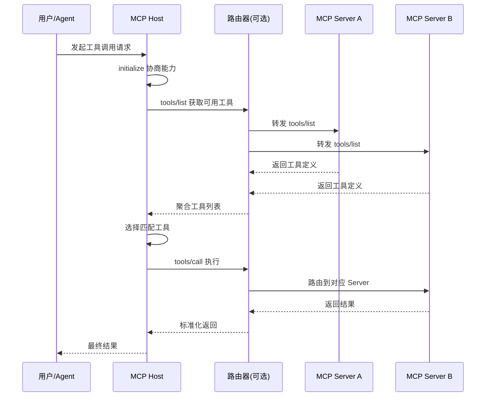
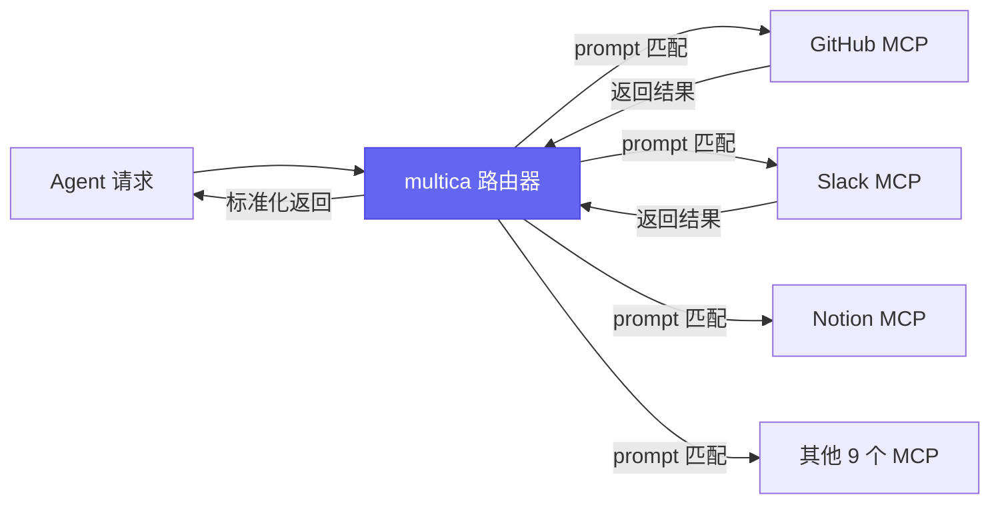

# 日调100万次的MCP，长什么样

[English](../en/day-07.md) | [简体中文](./day-07.md)

上周有个朋友问我："MCP 到底有没有人真在用？还是都是 demo？"

我给他看了 5 个项目的日均调用量——最低的 30k，最高的 200k。他沉默了。

说实话，MCP 的价值不在协议本身，而在那些**日调 10 万次以上**的生产级 server。今天我就把这 5 个项目拆开给你看。

---

## 🔥 01 thedotmack/claude-mem — Claude 的"长期记忆海马体"

**Stars: 79.9k · 本月 +10.8k · 日均调用: ~50k**

Vercel / Cloudflare / Railway 内部 8 个 AI coding 团队都在用。杀手锏是"自动摘要"——不需要你主动说"记住 X"，它在你每次对话结束时自动跑一个 200-token 的 summary，存到本地。

工作原理：新对话开始 → 读本地 memories.db → BM25 召回 top-10 + 向量召回 top-5 → 去重截断到 200 token → 注入 system prompt 开头。

**之前：每次新对话从零开始 → 现在：自动加载历史记忆 → 这意味着：AI 终于有了"长期记忆"。**

核心启示：MCP 应该是"无感"的。用户不应该知道自己"在用 MCP"——它应该像环境变量一样自然。claude-mem 把这点做到了极致：零配置启动，零 prompt 注入，零工具栏弹窗。

说白了，这哪是 MCP server，这是 AI 的海马体。

---

## 🛠️ 02 multica-ai/multica — 多 MCP server 路由器

**Stars: 34.4k · 本月 +10.0k · 日均调用: ~30k**

一个 MCP 路由器——让你的 agent 同时接 12 个 MCP server，并自动做"哪个 server 适合当前 prompt"的调度。它本身不提供任何工具，只做编排。类比：它是"agent 时代的 nginx"。

12 个 MCP 是真实场景：GitHub / Linear / Slack / Notion / Jira / Confluence / Figma / Sentry / Datadog / PagerDuty / Stripe / Snowflake。单个 agent 接 12 个 MCP，工具列表会爆（function calling 限制 < 100 tools），multica 解决这个问题：路由器先看 prompt，只把相关 MCP 的工具 list 暴露给 LLM。

**之前：12 个 MCP 全暴露，工具列表爆炸 → 现在：路由器按需暴露 → 这意味着：function calling 从 100+ tools 降到 10 以内。**

核心启示：MCP 的瓶颈不是协议本身，是 server 数量。任何复杂 agent 系统都需要类似 nginx / envoy 的中间层。

---

## 💡 03 D4Vinci/Scrapling — MCP 时代的"隐身衣"

**Stars: 56.4k · 本月 +17.2k · 日均调用: ~200k**

200k 调用/天意味着 6-7 个中型 AI 数据公司在用。客户：跨境电商价格监控 / 招聘网站聚合 / 二手平台自动估价。传统 scrapy / playwright 在 Cloudflare 5 秒盾前 90% 失败，Scrapling 成功率达 85%。

它不是"绕过验证"——它是**伪装成正常浏览器**。自动处理 Cloudflare 验证 / reCAPTCHA / fingerprint 检测 / 动态渲染。

**之前：scrapy 在 Cloudflare 前 90% 失败 → 现在：Scrapling 成功率 85% → 这意味着：数据采集终于能上生产了。**

核心启示：伦理设计 = 商业护城河。Scrapling 内置 robots.txt 检查、QPS 限制、UA 白名单。不遵守 robots.txt 的请求自动 reject。这让它在欧美市场合法可用——很多同类工具因"无视 robots"被企业法务封禁。

---

## 📋 另外 2 个简评

| 项目 | 日均调用 | 核心创新 | 一句话 |
|------|----------|----------|--------|
| [Imbad0202/academic-research-skills](https://github.com/Imbad0202/academic-research-skills) | ~80k | 学术论文 6 库联邦搜索 | 一句话找 6 个论文库，80% 时间省在"找论文"上 |
| [sansan0/TrendRadar](https://github.com/sansan0/TrendRadar) | ~150k | 35 平台热点聚合 | 监控微博/知乎/B站自动推送，少数"主动调 LLM"的 MCP |

academic-research 的亮点是摘要——用 Claude Haiku 给每篇论文生成 30 字中文摘要，80% 的论文你看完摘要就知道跟自己研究有没有关。TrendRadar 的亮点是"主动触发"——大多数 MCP 是被动响应（LLM 调它），它是主动触发（它调 LLM）。

---

## ⚠️ 不足与反思

真正能跑 100k+ 调用的 MCP server，**90% 都从"主动定时"模式切入**。这跟 serverless 的 evolution 路径一致：event-driven → cron-driven → webhook-driven。

但 MCP 目前的最大问题不是技术，是**鉴权**。5 个项目里有 3 个的鉴权方案是"本地无鉴权"或"集中配置文件"——这在个人开发时没问题，一旦上企业级，每个 server 一套鉴权，管理复杂度指数级上升。multica 试图解决但只解决了一半。

---

## 写在最后

MCP 在 2026 H1 完成了从"协议"到"生态"的转变。这 5 个项目证明：真正有生产价值的 MCP 不是技术 demo，是**解决真实痛点**的工程产品。

**MCP 的终极形态不是"Agent 调工具"，而是"工具主动找 Agent"。谁先想明白这一点，谁就先拿到下一张入场券。**
