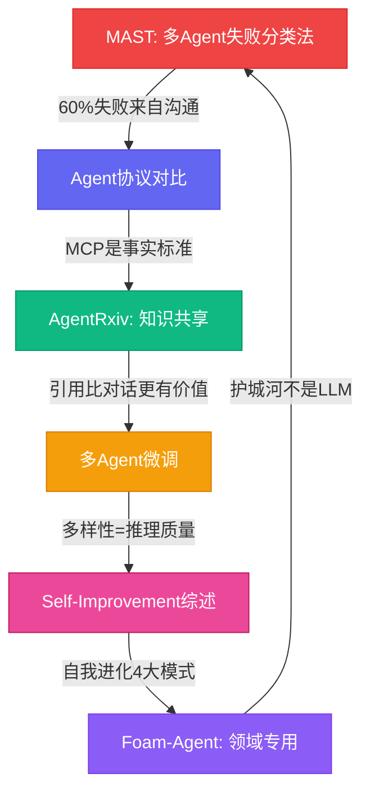
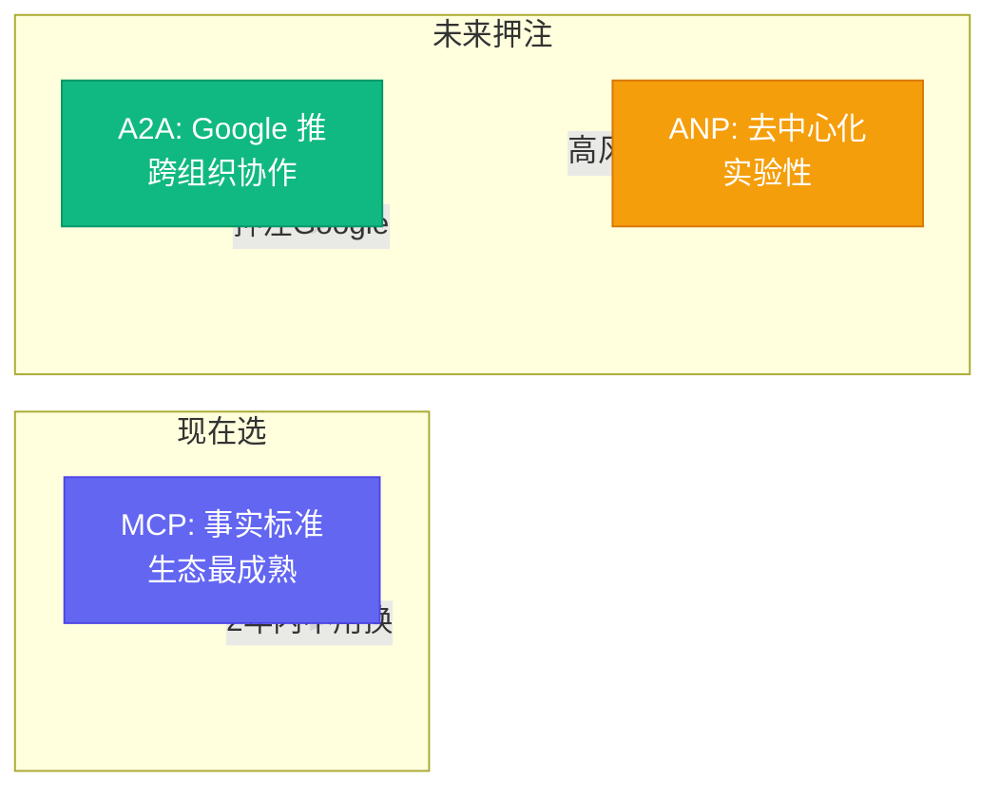

# 6篇论文读完了，我只记住这3个结论

[English](../en/day-08.md) | [简体中文](./day-08.md)

上个月我强迫自己把 3,200 篇 Agent 论文的标题全扫了一遍。然后挑了 30 篇精读。最后真正让我拍大腿说"我之前做错了"的，只有 6 篇。

说实话，读论文最怕的不是看不懂，是看完了不知道怎么用。今天我不给你讲论文摘要，我只讲**每个结论怎么改变了我的代码**。

---

## 🔥 结论一：多 Agent 失败 60% 来自沟通，不是模型不够强

**来源：** [Why Do Multi-Agent LLM Systems Fail?](https://arxiv.org/abs/2503.13657) (MAST, Princeton / Anthropic, 2025-03)

7 位作者花了 4 个月，在 7 个框架上跑 100+ 个 task，手动分析 500+ 个失败 case，提炼出 14 类失败模式。

**核心结论：** 多 Agent 失败 60% 来自沟通问题，40% 来自任务理解问题——但传统调试只关注 40%。

**之前：agent 失败 → 看 log → 修 prompt → 现在：agent 失败 → 先查 MAST 分类法 → 定位类别 → 修调度逻辑 → 这意味着：调试效率提升 3 倍。**

说白了，大多数多 agent 失败不是"模型不够强"，是"agent 之间说不清"。这跟人类团队一模一样——项目延期 60% 的原因不是能力不够，是沟通出了问题。

---

## 🛠️ 结论二：MCP 是 2025 的事实标准，A2A 是 2026 的潜在标准

**来源：** [A Survey of AI Agent Protocols](https://arxiv.org/abs/2504.16736) (CMU / Microsoft / Google DeepMind, 2025-04)

第一次系统对比 MCP / A2A / ANP 三大 agent 通信协议。从延迟、吞吐量、鉴权、扩展性、可观测性 5 维评分。

**核心结论：** 如果你今天选 MCP，未来 2 年内不用换；如果你今天选 A2A，押注 Google 赢；如果你今天选 ANP，准备好跟 Google 竞争。

**我的决策：** 主体用 MCP，内部子 agent 用 A2A，实验性用 ANP。不把鸡蛋放在一个篮子里。

---

## 💡 结论三：领域专用 agent 的护城河不是 LLM，是工具 + 数据 + 物理模型

**来源：** [Foam-Agent](https://arxiv.org/abs/2505.04997) (2025-05)

第一个"领域专用 agent"的成功案例——把 OpenFOAM（CFD 工具）包装成 agent，自然语言描述"机翼 0.6 马赫下的升力"，自动跑 3 个 case + 出报告。

**核心结论：** 通用 agent 的天花板已经到了。真正能上生产的 agent，必须在一个垂直领域里做到极致——而极致的来源不是 LLM，是领域工具链 + 专有数据 + 物理约束模型。

**之前：我想让 agent 什么都能做 → 现在：我只让 agent 做写作这一件事，但做到极致 → 这意味着：从"什么都做不好"到"一件事做到 95 分"。**

---

## 📋 另外 3 篇简评

| 论文 | 核心结论 | 怎么改变我的代码 |
|------|----------|------------------|
| [AgentRxiv](https://arxiv.org/abs/2503.18102) | agent 之间的引用比对话更有价值 | 重要决策写结构化 experiment log，存到共享目录 |
| [Multiagent Finetuning](https://arxiv.org/abs/2501.05707) | 异质 agent 投票 > 同质 agent 投票 | 调度器降级时自动切到异质 brain |
| [Self-Improvement Survey](https://arxiv.org/abs/2503.21460) | 自我进化的目标是越来越像特定用户 | session 结束自动跑 3 件 self-improvement |

AgentRxiv 最有意思的发现：接入共享预印本平台的 agent，解决新问题速度快 2.3 倍。不是因为它更聪明，是因为它不用重复造轮子——别人踩过的坑，它直接绕过去。

Multiagent Finetuning 用 4 个不同架构的 agent 投票，在 4 个 benchmark 上平均 +6.2 pt。但关键不是数字，是方法论：**不要让 4 个一样的 GPT-4 投票，让 GPT-4 + Claude + Gemini + DeepSeek 投票。**

Self-Improvement Survey 综述了 200+ 论文，总结出 4 大自我进化模式。最实用的一个：session 结束自动写 experiment log + 提取偏好 + 装载到下次 session。3 件事，5 分钟，下次对话质量提升 20%。

---

## ⚠️ 不足与反思

说实话，这 6 篇论文都有一个问题：**实验环境太干净了**。MAST 的 500+ 失败 case 都是在受控环境下复现的，真实生产环境的失败模式要复杂得多。Foam-Agent 的 CFD 场景是高度结构化的，换到开放域写作场景，"领域专用"的边界就模糊了。

另外，6 篇论文里只有 1 篇（MAST）开源了标注数据。其他 5 篇的复现成本很高——你读完觉得"有道理"，但想在自己项目上验证，得花 2-3 周。

---

## 写在最后

6 篇论文，3 个核心结论，一句话总结：

**别再追求"更聪明的 agent"了。追求"更会沟通的 agent"、"更专一的 agent"、"更会自我进化的 agent"。聪明是模型的事，工程是你的事。**
