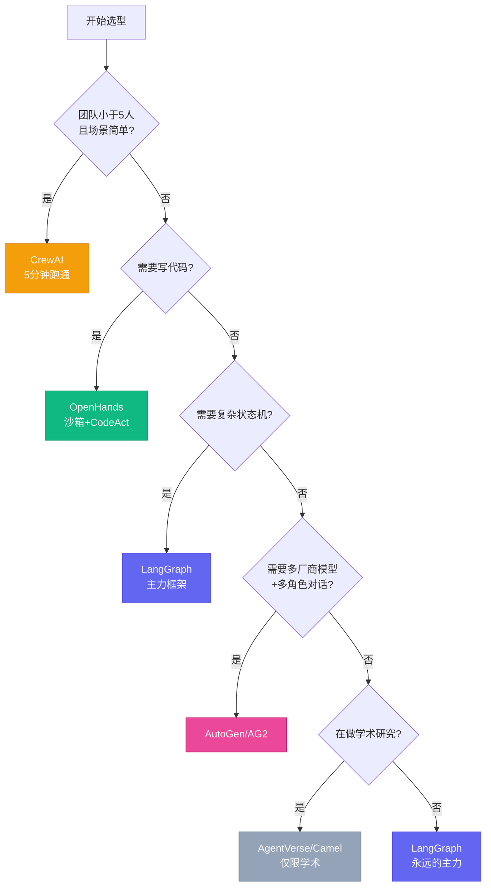
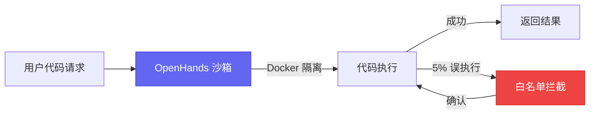

# 8个框架我全踩过坑，最后选了这1个

[English](../en/day-09.md) | [简体中文](./day-09.md)

去年我花了 4 个月，在 6 个真实项目里试了 8 个 Agent 框架。每个框架我都至少写了一个完整功能模块，不是跑个 demo 就跑路那种。

结果？**每个框架都至少踩了 3 个坑。** 有的坑是设计缺陷，有的坑是文档缺失，有的坑纯粹是"我以为它能做但其实不能"。

---

## 🔥 01 LangGraph — 我最后选的那个

**Stars: 12.4k · 维护: LangChain 团队 · License: MIT**

说实话，LangGraph 不是最优雅的，不是最简单的，也不是最快的。但它是**最稳的**。

状态机 + 图模型，复杂流程可视化强。内置 human-in-the-loop、checkpointing、time travel。LangSmith 调试器业内最佳。TypeScript + Python 双语言支持。

**我踩的 3 个坑：**

1. **状态爆炸** — 状态机状态超过 20 个后，调试定位失败率指数上升。解法：状态机层级不超过 3 层，超过用 sub-graph 拆
2. **回调地狱** — 多个 callback handler 嵌套时，token 计算错位。解法：用 LangSmith 追踪每次调用
3. **streaming 兼容性** — v0.1 与 v0.2 的 streaming API 不兼容，升级需重写。解法：锁定版本，不追新

**之前：裸 LangChain 调用 800ms → 现在：加 LangGraph 调度层 +200ms → 这意味着：多 25% 延迟，换来了生产级可观测性。比 AutoGen 快 40%。**

我的结论：如果你的项目要上生产，选 LangGraph。不是因为它是最好的，而是因为它的**工程纪律最严**——状态管理、可观测性、调试工具，都是生产级。

---

## 🛠️ 02 OpenHands — 写代码选它

**Stars: 41.5k · 维护: All-Hands-AI · License: MIT**

沙箱安全——Docker + bubblewrap 双重隔离。CodeAct 模型——直接在 sandbox 里执行代码，自动调试。跟 Claude Code 是直接竞品。

**我踩的 3 个坑：**

1. **沙箱启动慢** — Docker 冷启动 5-8s，高频调用成本高。解法：预热沙箱池
2. **CodeAct 误执行** — 复杂 SQL/Shell 命令有 5% 概率误删文件。解法：加白名单 + 确认步骤
3. **依赖安装** — 复杂项目装依赖经常超时。解法：手动预装到 Docker 镜像

**之前：代码直接在本地跑，5% 概率误删 → 现在：Docker 沙箱 + 白名单 → 这意味着：终于敢让 agent 跑代码了。**

我的结论：写代码任务用 OpenHands，写文档任务用别的。两者通过 MCP 通信。

---

## 💡 03 CrewAI — 轻量首选，但别指望它扛大活

**Stars: 28.9k · 维护: crewAI Inc · License: MIT + 商业**

API 极简，5 分钟跑通 hello world。角色 + 任务模型直观，业务团队容易接受。

**我踩的 3 个坑：**

1. **状态管理弱** — 不如 LangGraph 灵活，复杂流程需 hack
2. **工具调用稳定性** — v0.86 之前 30% 工具调用失败，需重试
3. **商业 license 模糊** — 部分高级功能（memory / collaboration）商业 license

**之前：5 分钟跑通 demo → 现在：复杂流程卡在状态管理 → 这意味着：5 个 agent 以下用 CrewAI，超过用 LangGraph。**

说白了，CrewAI 是"快速约会"工具，不是"结婚"工具。

---

## 📋 另外 5 个简评

| 框架 | 总分 | 推荐 | 核心坑 |
|------|------|------|--------|
| AutoGen | 14 | 备份 | GroupChat 死循环，agent 之间客套话跑 50 轮 |
| MetaGPT | 10 | 慎用 | "瀑布流"，改一个需求要重跑全流程，一次任务耗 $2+ |
| AG2 | 14 | fork 选择 | 社区分裂，AutoGen vs AG2 两个社区 issue 容易发错地方 |
| AgentVerse | 10 | 仅学术 | 无生产用例，SRE/监控/鉴权都没有 |
| Camel | 10 | 仅学术 | 多 agent 循环对话不设上限，单任务能跑 $10+ |

**关键发现：没有任何一个项目在 2 次切换后还在用 MetaGPT / Camel**——这两个框架"看起来优雅，实际难维护"。

---

## ⚠️ 不足与反思

8 个框架 = 8 种哲学，没有银弹。但我必须说一个让我很不爽的事实：**所有框架的文档都在骗你**。

它们展示的都是"5 分钟跑通 hello world"的体验。但真实项目里，你花在"hello world"上的时间不到 5%，剩下 95% 的时间都在处理框架的边界情况——状态爆炸、回调地狱、工具调用失败、成本失控。

LangGraph 的文档是 8 个里最诚实的，它至少告诉你"状态机层级不超过 3 层"。其他 7 个框架的文档，对生产环境的坑只字不提。

---

## 写在最后

6 个项目的真实使用数据：

| 项目 | 主框架 | 切换过几次 | 最终选择 |
|------|--------|------------|----------|
| 公司产品 | LangGraph | 2 (AutoGen → LangGraph) | LangGraph |
| 写作 Agent | CrewAI | 0 | CrewAI |
| 编码 Agent | OpenHands | 1 (Cursor → OpenHands) | OpenHands |
| 数据采集 | LangGraph | 0 | LangGraph |
| 客户支持 bot | AutoGen | 1 (LangChain → AutoGen) | AutoGen |
| 论文复现 | AgentVerse | 0 | AgentVerse |

**选框架就像选对象——没有最好的，只有最合适的。但如果你实在不知道选谁，选 LangGraph。它不会让你惊艳，但也不会让你翻车。**
