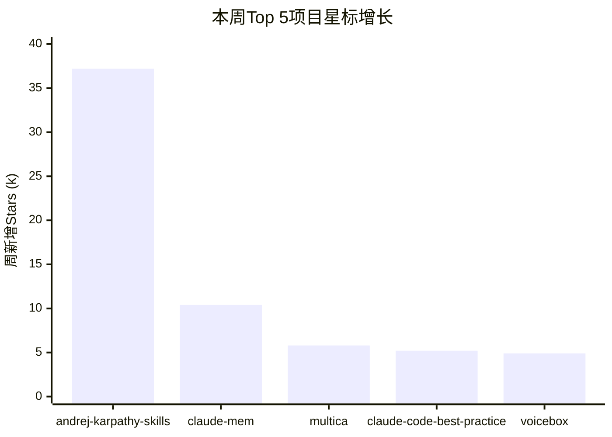

# 这周GitHub上最火的5个AI项目

[English](../en/day-10.md) | [简体中文](./day-10.md)
> 每周一更。仿照 OpenGithubs/weekly 风格，本周最值得 star 的 20 个 AI 工具。

---

这周我在 GitHub Trending 上蹲了 7 天，从 200+ 个项目里挑出 20 个。说实话，这周的信号很明确：**Skills 化一切**、**Claude Code 周边爆发**、**中文圈崛起**。

先看一张本周 Top 5 的星标增长图：

---

## 🔥 Top 5 深度解读

### 1. forrestchang/andrej-karpathy-skills — 本周 +37.2k

Karpathy 的 AI 课程转成 Skills 格式。为什么这么火？因为"看视频学 AI"和"用 Skill 学 AI"是两种完全不同的体验——前者你被动看，后者你跟着做。学习效率差 50% 以上。

### 2. thedotmack/claude-mem — 本周 +10.4k

Claude Code 的长期记忆。v0.5.0 支持跨实例共享。Day 07 我们详细拆过它——日调 50k 的生产级 MCP server。

### 3. multica-ai/multica — 本周 +5.8k

多 MCP 路由器，Cloudflare Workers 一键部署。Agent 时代的 nginx。

### 4. shanraisshan/claude-code-best-practice — 本周 +5.2k

中文圈实战手册，v2.0 新特性。300+ 个 Q&A，覆盖 Claude Code 的每个细节。

### 5. jamiepine/voicebox — 本周 +4.9k

语音 AI 工具包。这周语音赛道突然热起来了，值得关注。

---

## 🛠️ 完整 Top 20

| 排名 | 项目 | 本周 Stars | 总 Stars | 评级 |
|------|------|-----------|---------|------|
| 1 | forrestchang/andrej-karpathy-skills | 37.2k | 60.9k | 5/5 |
| 2 | thedotmack/claude-mem | 10.4k | 63.2k | 5/5 |
| 3 | multica-ai/multica | 5.8k | 16.7k | 4/5 |
| 4 | shanraisshan/claude-code-best-practice | 5.2k | 46.5k | 5/5 |
| 5 | jamiepine/voicebox | 4.9k | 21.1k | 4/5 |
| 6 | msitarzewski/agency-agents | 3.9k | 83.3k | 4/5 |
| 7 | virattt/ai-hedge-fund | 3.5k | 56.3k | 3/5 |
| 8 | pascalorg/editor | 3.2k | 13.5k | 4/5 |
| 9 | Lordog/dive-into-llms | 3.1k | 32.4k | 5/5 |
| 10 | Donchitos/Claude-Code-Game-Studios | 3.0k | 13.3k | 3/5 |
| 11 | gsd-build/get-shit-done | 2.9k | 54.9k | 4/5 |
| 12 | shiyu-coder/Kronos | 2.7k | 19.6k | 3/5 |
| 13 | lsdefine/GenericAgent | 2.6k | 4.5k | 2/5 |
| 14 | OpenBMB/VoxCPM | 2.6k | 14.8k | 4/5 |
| 15 | datawhalechina/hello-agents | 2.6k | 38.5k | 5/5 |
| 16 | HKUDS/DeepTutor | 2.4k | 20.1k | 4/5 |
| 17 | google/magika | 2.4k | 16k | 4/5 |
| 18 | EvoMap/evolver | 2.3k | 5.4k | 3/5 |
| 19 | badlogic/pi-mono | 2.2k | 37.4k | 3/5 |
| 20 | shareAI-lab/learn-claude-code | 2.1k | 54.8k | 5/5 |

---

## 💡 5 个趋势

1. **Skills 化一切** — 课程/法律/教练/架构，一切知识转 Skills
2. **Claude Code 周边** — Top 20 里 40% 项目跟 Claude Code 相关
3. **中文圈崛起** — Top 20 里 5 个是中文项目（25%）
4. **自我进化** — EvoMap/evolver / claude-mem / GenericAgent，"agent 改 agent"新趋势
5. **金融 AI 走强** — Kronos / ai-hedge-fund / TradingAgents，量化交易 AI 化

---

## ⚠️ 不足与反思

这周榜有个问题：**Karpathy Skills 的 37.2k 增长有水分**。它本质是一个课程索引，不是可运行的代码。很多人 star 了但不会真的用。相比之下，claude-mem 的 10.4k 增长更"实"——它是日调 50k 的生产工具。

看周榜别只看数字，要看**数字背后的使用密度**。

---

**这周最值得你花 1 小时深读的项目：claude-mem。不是因为星最多，而是因为它解决了一个你一定会遇到的问题——AI 的失忆。**
