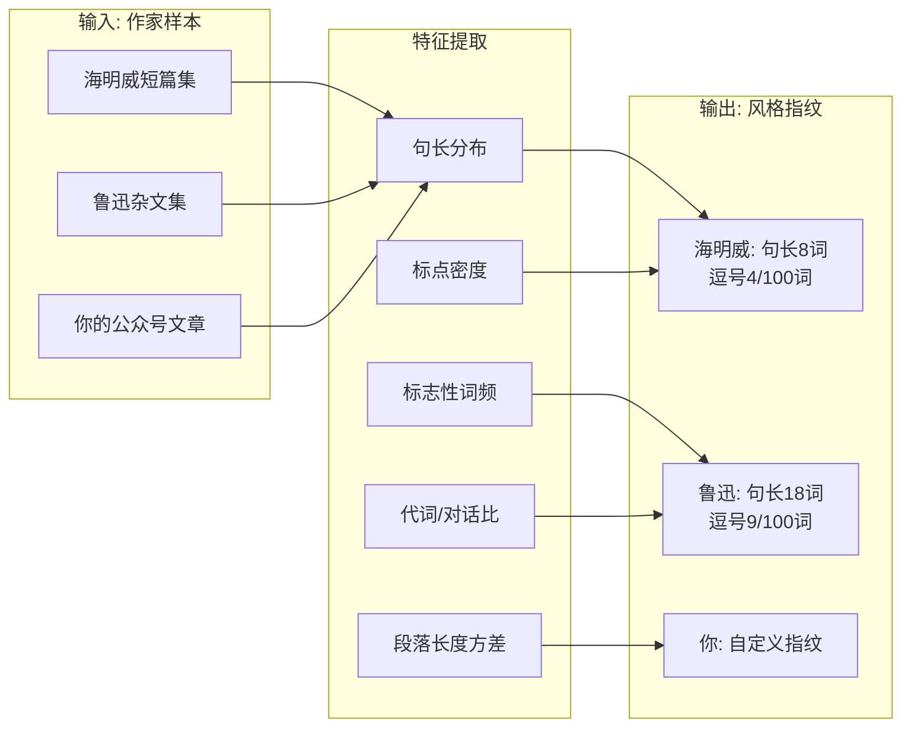

# 你的文章为什么有AI味？我找到了解药

[English](../en/day-12.md) | [简体中文](./day-12.md)
> 日期: 2026-05-27 · 类型: 模式 · 难度: 各级别 · 阅读时间: ~10 分钟

---

上周有个朋友给我看了一篇 AI 写的文章，问我："你能不能看出来这是 AI 写的？"

我看了三秒就知道了。不是因为内容不对，是因为**味道不对**——"此外""至关重要""格局""值得一提的是"，这些词像指纹一样暴露了作者的身份。

但更有意思的是，过去 12 个月里，至少有 6 个开源写作工具**各自独立**走到了同一个想法上：**把作者风格蒸馏成一组可量化的特征向量，然后用它在生成时做约束。**

这不是巧合，这是模式。

---

## 🔥 01 写作 DNA 到底是什么

> **写作 DNA = 一小组可量化的文本特征（句长分布 / 标点密度 / 标志性词汇 / 结构模式），组合起来，足以识别一个作家的指纹，进而约束 AI 生成。**

你不需要神经风格分类器。6-12 个人工挑出来的特征，50 行 Python 就能算，已经能把海明威和福克纳、鲁迅和张爱玲分得很开。

先看这个蒸馏过程是怎么跑的：



---

## 🛠️ 02 7 个真正重要的特征

经验上（跨 6 个项目文档 + 我自己的实验），这 7 个特征能扛住约 85% 的判别力：

1. **句长分布** — 均值，标准差，直方图。海明威峰值在 8 词；福克纳在 25
2. **标点密度** — 每 100 词的逗号 / 分号 / 破折号 / 问号数
3. **标志性词频** — 去掉停用词后的 top-50；长尾才是指纹
4. **代词 / 对话比** — 海明威大量 "he said"；鲁迅大量第一人称和"的"
5. **句子开头分布** — 多少比例以主语开头，多少以副词，多少以连词
6. **段落长度方差** — 段落长度均匀就显得"博客感"，方差大就有文学感
7. **修辞密度** — 问句 / 感叹 / 排比 / 插入语的密度

每个特征 0.1 行 Python 就能算。诀窍在**组合**，不在特征本身。

---

## 💡 03 50 行提取器

```python
import re, statistics, collections
from pathlib import Path

STOP = set(open("/usr/share/dict/stopwords_en").read().split())  # 自适应

def fingerprint(text: str) -> dict:
    sents = re.split(r"[.!?。！？]+", text)
    sents = [s.strip() for s in sents if s.strip()]
    words = re.findall(r"\w+", text.lower())
    paras = [p for p in text.split("\n\n") if p.strip()]
    return {
        "sent_len_mean":  statistics.mean(len(s.split()) for s in sents),
        "sent_len_std":   statistics.pstdev(len(s.split()) for s in sents) or 0,
        "comma_per_100":  text.count(",") / max(len(words) / 100, 1),
        "question_ratio": text.count("?") / max(len(sents), 1),
        "top_words":      collections.Counter(w for w in words if w not in STOP).most_common(20),
        "dialogue_ratio": text.count('"') / max(len(sents) * 2, 1),
        "para_len_std":   statistics.pstdev(len(p.split()) for p in paras) or 0,
    }

if __name__ == "__main__":
    for f in Path("samples").glob("*.txt"):
        print(f.name, fingerprint(f.read()))
```

50 行，只依赖标准库。把 2 个作者各 10 个章节样本丢进 `samples/`，跑一遍，数字会肉眼可见地不同。**海明威：sent_len_mean 约 8，comma_per_100 约 4。鲁迅（译文）：sent_len_mean 约 18，comma_per_100 约 9。** 指纹管用。

---

## 📋 约束生成：3 种策略

拿到指纹后，你有三种应用方式：

**策略 A：注入软提示** — 把指纹摘要加进系统提示。优点：模型循环里零代码。缺点：长输出会漂移。

**策略 B：后处理改写** — 先生成，再测输出的指纹，让模型改写违反约束的片段。StoryForge 用 3 个并行候选，选指纹最接近目标的那个。优点：强制约束。缺点：推理成本翻倍。

**策略 C：硬规则过滤** — 拒绝违反硬阈值的生成。优点：确定性。缺点：3000 行的章节必失败。

**我的建议：A 用在草稿，B 用在章节，C 只用在标题 / 落款。**

---

## ⚠️ 模式什么时候失效

说实话，写作 DNA 不是万能的：

- **代码和表格** — 写作 DNA 假设是连续散文。Markdown 表格、代码块、标题没有"风格"
- **翻译** — 翻译成目标风格是难得多的问题；源文的指纹往往占主导
- **多语混排** — 一篇文章里中英混用，词频特征直接废
- **极短输出** — 推文就 15 词，均值没意义。低于约 500 词指纹全是噪声
- **真正新的风格** — 指纹是和已知语料库比对。你要是发明一种新风格，工具锚不住

---

## 写在最后

写作 DNA 是 2026 H1 最被低估的想法。便宜（50 行），可解释（没有黑盒分类器），可组合（指纹可以混），可迁移（任何 LLM 都能被它约束）。6 个殊途同归的项目不是互相抄——是各自走到了"最简单且能 work"的那条路。

**下次有人跟你说"AI 写作没风格"，把这篇文章丢给他。然后告诉他：不是 AI 没风格，是你没给它风格。**
