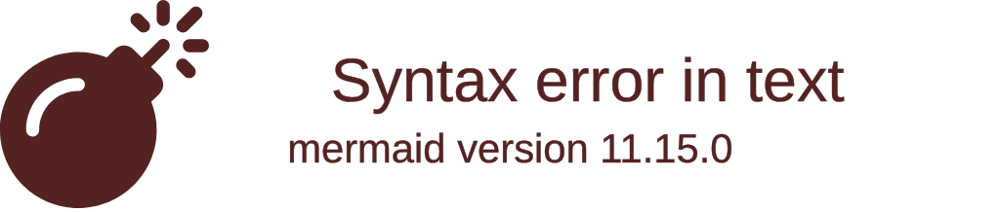

# 6个框架我全试了，只有2个能上生产

[English](../en/day-13.md) | [简体中文](./day-13.md)
> 日期: 2026-05-28 · 类型: 工程 · 难度: 中级 · 阅读时间: ~12 分钟

---

Day 09 用特性矩阵看了 8 个框架。这篇深挖**6 个通用型**（目标是"啥都能做"，不是垂直工具）。我从**5 个工程轴**对比——这 5 个轴是真正部署时重要的：状态管理，可观测性，安全模型，部署形态，开发者体验。

说实话，6 个框架里只有 2 个我敢上生产：**LangGraph** 和 **Agno**。

先看一张评分雷达图：

---

## 🔥 01 状态管理 — 最重要的轴

对话状态，中间工具结果，人类反馈，存在哪？

**Letta** 把记忆当一等子系统做（core / archival / recall 三层），其他都是后挂的。如果你的 agent 要记住 200 轮对话，**Letta 帮你省几周**。其他场景，差异不大。

**LangGraph** 的 checkpointer 机制（内存 / PostgreSQL / Redis）是最灵活的，但需要你手动设计状态结构。

**CrewAI** 的 memory store 看起来方便，但复杂场景下不够灵活。

---

## 🛠️ 02 可观测性 — 凌晨 3 点出问题时你能看见什么

能付费的话，**LangGraph + LangSmith** 是金标准。每节点 token 计数，时间线追踪，成本分析，一键复现。

**Agno** 是个惊喜——内建 dashboard 真不错，不用接第三方就能看到每个 session 的运行状态。

**AutoGen** 对纯 OpenTelemetry 团队最友好，原生支持。

---

## 💡 03 安全模型 — 谁能做什么，怎么约束

如果"agent 能跑不可信代码"在你的路线图上，**OpenHands** 是 6 个里唯一当真的——Docker + bubblewrap 双重隔离。

其他都假设你自己包一层沙箱。说实话，这不够。2026 年的 agent 会越来越多地执行代码，安全模型会变成选型的决定性因素。

---

## 📋 04 部署形态 & 05 开发者体验

**Agno** 对 serverless 最友好。**LangGraph** 对"我们已经有 k8s"最友好。**OpenHands** 唯一不太行 serverless——它要一台长驻机器。

开发者体验方面：原型阶段 **CrewAI** 速度第一（15 分钟跑通）。生产阶段 **LangGraph** 文档 + 可观测性第一。**"我有真实产品" Agno** 平衡最好。

---

## 总排名

| 排名 | 框架 | 适合谁 | 能上生产？ |
|------|------|--------|-----------|
| 1 | **LangGraph** | 大团队，深度可观测性预算 | 能 |
| 2 | **Agno** | Serverless + dashboard，均衡产品 | 能 |
| 3 | **CrewAI** | 快速原型，角色制 demo | 勉强 |
| 4 | **OpenHands** | 涉及不可信代码执行的任何场景 | 特定场景 |
| 5 | **Letta** | 长对话，记忆密集 agent | 看场景 |
| 6 | **AutoGen** | OpenTelemetry-native 团队 | 显老了 |

---

## ⚠️ 不足与反思

6 个框架都有一个共同的盲区：**MCP 支持**。2026.05 所有框架都声称支持 MCP，但支持质量参差不齐——有的只是适配器层，有的有原生支持。这不是差异点了，但实现质量差异很大。

另外，**没有框架认真解决"成本控制"**。LangGraph 有 token 计数，但没有预算硬上限。CrewAI 有每任务成本追踪，但没有自动降级。这是 2026 H2 必须补上的短板。

---

## 写在最后

如果你问"2026 我该先学哪个框架？"，实话是 **LangGraph**——它教你的工程纪律最值。然后试 **Agno** 感受部署的爽。**AutoGen** 跳过，除非你的团队已经在 Microsoft 生态里。

**框架不是信仰，是工具。能上生产的才是好框架，不能上生产的再优雅也是玩具。**
