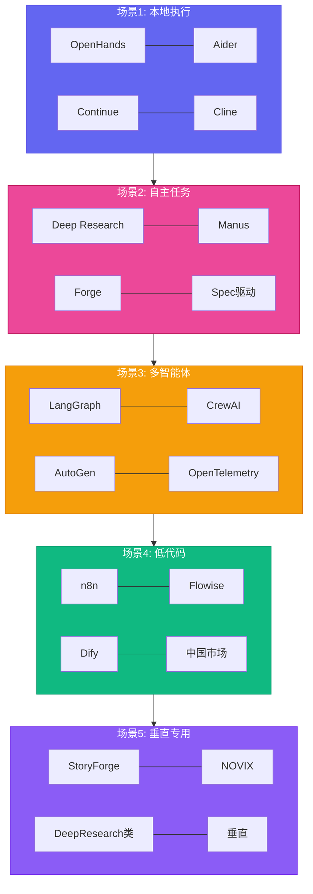
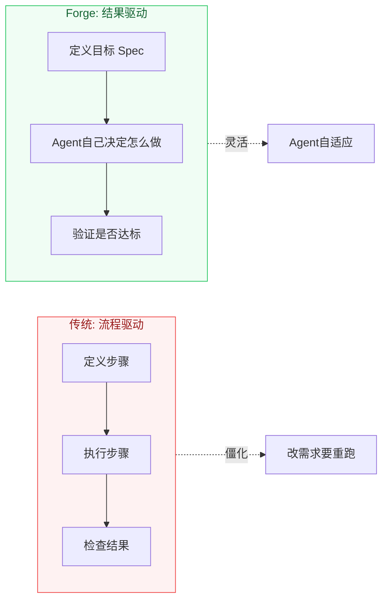

# AI Agent现在到底能干什么？我画了张图

[English](../en/day-14.md) | [简体中文](./day-14.md)

每次有人问我"AI Agent 现在到底能干什么"，我都得花 10 分钟解释。今天我画了张图，一图胜千言。

我挑了 16 个有代表性的项目，横跨 5 个场景。目标不是排名——Day 09 和 13 排了——目标是给你一张心理地图，下次有人扔个名字，你知道往哪放。

---

## 🔥 场景 1 — 本地执行（4 个项目）

"跑在你笔记本上"那一档。用户是 agent 唯一的利益相关者。

| 项目 | 一句话 | 为什么重要 |
|------|--------|------------|
| **OpenHands** | Docker 里跑的沙箱 dev agent | 主流框架里唯一把代码执行当安全边界的 |
| **Aider** | 终端里配对的 AI 编程 | "好的配对编程 UX 长什么样"的标杆 |
| **Continue** | VS Code / JetBrains 插件 | 最可扩展的 IDE 侧 agent（开源，MCP 原生） |
| **Cline** | 带 MCP 的 VS Code 插件 | IDE 圈最激进的 MCP 拥抱者 |

**之前：AI 编程工具各自为战 → 现在：4 个项目都在向 MCP-native 收敛 → 这意味着：工具互操作性终于不是梦了。**

这档的教训：本地 agent 赢在**延迟和信任**——用户看到每个动作，沙箱是一个容器，循环紧凑（亚秒级每次工具调用）。天花板是"一个人一节会能审完的东西"。

---

## 🛠️ 场景 2 — 自主任务（3 个项目）

"我给你个目标，你 2 小时后回来"那一档。

| 项目 | 一句话 | 为什么重要 |
|------|--------|------------|
| **OpenAI Deep Research** | 多步研究，引用链 | 证明了"长时域 + 工具用 + 验证"能规模化 |
| **Manus** | 通才云 agent（闭测） | 第一个把"computer use"真正部署上线的 |
| **Forge** | 结果驱动的编排 | 把成功定义为规范而不是流程——最干净的契约 |

**之前：定义步骤 → 执行 → 出错重来 → 现在：定义目标 → Agent 自己决定怎么做 → 这意味着：设计瓶颈从"流程设计"转移到"验证设计"。**

这档的教训：设计瓶颈已经不是 LLM；是**验证循环**。Forge 的"spec 作为契约，agent 决定怎么做"模式是最有希望的方向。

---

## 💡 场景 3 — 多智能体（3 个项目）

"专家团队"那一档。角色，交接，有时冲突。

| 项目 | 一句话 | 为什么重要 |
|------|--------|------------|
| **LangGraph** | 基于图的编排 | 行业标准；"agent 图的 k8s" |
| **CrewAI** | 角色制 crew | 学习曲线最低；对 agent-as-person 最有主张 |
| **AutoGen** | 对话优先 | OpenTelemetry 故事最好；学术研究最友好 |

这档的教训："多智能体"不等于"更多 agent"。赢在**清晰的角色边界**和**显式交接协议**，不是堆更多 LLM。

---

## 📋 场景 4 & 5 — 低代码 & 垂直专用

**低代码（3 个项目）：** n8n（70k+ stars，原生 LLM 步骤）、Flowise（一个下午搭原型 RAG）、Dify（中国市场最强）。教训：可视化构造器没干掉框架开发，它们服务非开发者构建者。

**垂直专用（3 个项目）：** StoryForge（52 种经典作家风格）、NOVIX（长篇连续性最佳）、DeepResearch 类（第一个用户超 100 万的垂直）。教训：agent 的未来是**垂直**的，不是横向的。

---

## ⚠️ 跨场景观察

1. **MCP 现在是入场券** — 16 个里 13 个支持 MCP。2025 的协议之争结束了：MCP 赢了本地工具层
2. **Skills 是新插件** — 16 个里 8 个有"skills"或"extensions"机制。Skills 胜过 raw code-as-config，因为它们模型可读
3. **记忆是未解决的问题** — 16 个里只有 Letta、StoryForge、NOVIX 对"跨 session 记忆"有认真的答案
4. **中国生态在 UX 上领先** — Manus、Dify、StoryForge 全部交付了英语圈没匹配的 UX

---

## 写在最后

如果你 2026.05 开始新 agent 项目，路径是：选个垂直（场景 5），搭在通才基底上（场景 3），通过 MCP 暴露以便任何 host 都能用，发 Skills 让模型能好用，把记忆当护城河。

**横向 agent 会商品化；有专有数据 + 记忆的垂直不会。这是 2026 年最值钱的一张图。**
