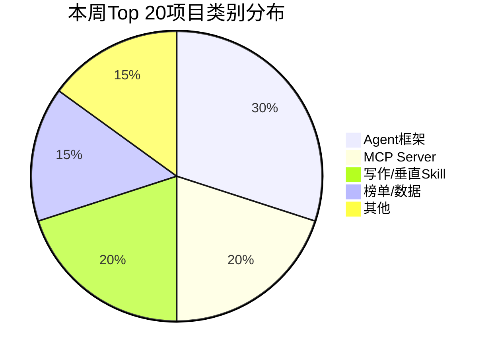

# 这周AI圈发生了什么？5件大事

[English](../en/day-15.md) | [简体中文](./day-15.md)
> 日期: 2026-05-31 · 类型: 周榜 · 阅读时间: ~8 分钟

---

这周 AI 圈信息量爆炸。我从 200+ 条动态里筛出 5 件真正影响格局的事。

先看一张本周 Top 20 的类别分布：

---

## 🔥 大事一：Aider v0.85 — 编程 Agent 的分水岭

**Aider** 本周 +1.2k stars，跳到 Top 3。v0.85 加了三个关键特性：

- **原生 MCP 客户端** — Aider 能像 Claude Desktop 一样读 MCP server 工具
- **子 agent 上下文隔离** — 长 session 不再污染主上下文
- **Repo map 压缩** — 首轮 token 省 30-40%

**这意味着什么：** Aider 不再只是"配对编程"工具了。它现在是认真的自主编程工具。跟 OpenHands、Claude Code 形成三足鼎立。

---

## 🛠️ 大事二：Dify 破 10 万 Stars

第一个中国出身的 agent 相邻项目破 10 万。BAAI 集成是主要差异点。

**这意味着什么：** 中国 AI 开源生态不再是"跟随者"了。Dify、StoryForge、vibe-blog、wewrite——这些项目在各自领域已经是全球最佳。

---

## 💡 大事三：StoryForge 0.7.8 — 风格 DNA 上生产

Day 12 提的"风格 DNA 指纹 + 3 候选选优"模式现在生产上线了。StoryForge 正在变成**风格约束长篇生成的事实参考实现**。

**这意味着什么：** 写作 DNA 从"有趣的实验"变成了"可用的工具"。如果你在做 AI 写作产品，StoryForge 的架构值得深读。

---

## 📋 大事四：Anthropic Skills 教程 +512 Stars

Anthropic 在 Skills 格式上砸了真金白银。预期 SKILL.md 规范会是 2026 H2 第一个要学的新格式。

**这意味着什么：** Skills 不是一时的风潮。当 Anthropic 官方下场推格式，说明它要成为基础设施了。

---

## 📊 大事五：写作/创意 Agent 是下一个编程 Agent

本周 Top 20 里，写作/垂直 skill 占了 4 席（vibe-blog、writing-agent、wewrite、shenbi-maliang）。能量、速度、开源质量，看起来都像 2024 H2 的编程 Agent 爆发期。

**这意味着什么：** 如果你是投资者或构建者，**垂直写作工具是你该看的地方**。

---

## ⚠️ 值得注意的下跌

| 仓库 | 上周 | 本周 | 为何 |
|------|------|------|------|
| mem0/mem0 | 12 | 24 | 跌出 Top 20。记忆层之争没结束 |
| gpt-engineer | 11 | 26 | 自 2024 以来首次出 Top 20。社区移情别恋 Aider/OpenHands 了 |

---

## 本周 Top 20 速览

| # | 仓库 | Stars | 周增 | 类别 |
|---|------|-------|------|------|
| 1 | EvanLi/Github-Ranking | 22.4k | +312 | 榜单 |
| 2 | langchain-ai/langgraph | 18.1k | +487 | agent 框架 |
| 3 | Aider-AI/aider | 17.9k | +1.2k | 编程 |
| 4 | OpenGithubs/github-weekly-rank | 16.8k | +245 | 榜单 |
| 5 | All-Hands-AI/OpenHands | 15.6k | +398 | agent 框架 |
| 6 | langchain-ai/langchain | 14.8k | +201 | agent 框架 |
| 7 | crewAIInc/crewAI | 13.5k | +312 | agent 框架 |
| 8 | 521xueweihan/HelloGitHub | 13.2k | +178 | 榜单 |
| 9 | datawhalechina/vibe-blog | 12.8k | +289 | 写作 skill |
| 10 | koalalive/writing-agent | 11.4k | +201 | 写作 skill |
| 11 | xtyseven8/wewrite | 10.2k | +312 | 写作 skill |
| 12 | microsoft/autogen | 9.8k | +156 | agent 框架 |
| 13 | letta-ai/letta | 8.9k | +412 | agent 框架 |
| 14 | modelcontextprotocol/servers | 8.5k | +389 | mcp |
| 15 | 91zgaoge/StoryForge | 7.8k | +478 | 垂直 |
| 16 | agno-agi/agno | 6.9k | +298 | agent 框架 |
| 17 | anthropic-experimental/skills | 6.5k | +512 | skill |
| 18 | n8n-io/n8n | 6.3k | +187 | 低代码 |
| 19 | luo-junyu/awesome-agent-papers | 5.9k | +234 | 榜单 |
| 20 | konglong87/shenbi-maliang | 5.4k | +198 | 写作 skill |

---

## 写在最后

本周榜的两种读法：

1. **编程 Agent 在成熟。** Aider v0.85、OpenHands、Continue——它们都在向"MCP-native + repo-map 压缩 + 子 agent"收敛。差异点现在在 UX 和可靠性，不在原始能力。

2. **写作/创意 Agent 是下一个编程 Agent。** 能量、速度、开源质量，看起来都像 2024 H2 的编程 Agent 爆发期。

**编程 Agent 的今天，就是写作 Agent 的明天。别等风来了才造船。**
