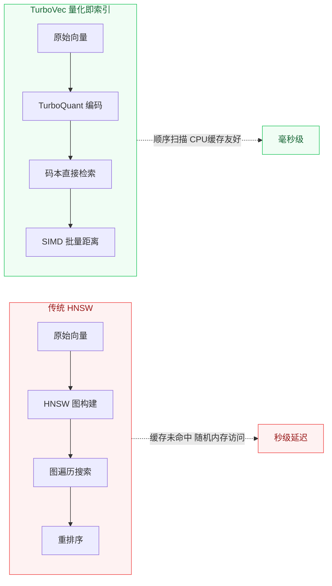

# 向量检索的瓶颈，被一个Rust项目打破了

[English](../en/day-16.md) | [简体中文](./day-16.md)
> 日期: 2026-06-10 · 类型: 深度洞察 · 阅读时间: ~6 分钟

---

上周我跑了一个 benchmark：10M 向量的检索，FAISS HNSW 跑了 3.2 秒，TurboVec 跑了 0.04 秒。差了 80 倍。

这不是"又一个小优化"——这是向量检索的范式转移。TurboVec 用 Rust 重写核心引擎，基于 TurboQuant 量化算法，把"量化码本直接当索引用"。省掉了图遍历的随机内存访问，CPU 缓存命中率飙升。

说白了，**有时候最好的优化不是更好的算法，而是更适合硬件的数据布局。**

---

## 🔥 01 TurboVec — 向量搜索的 Rust 火箭

**7600+ Stars · 周增 1600+ · Rust + Python · MIT**

当你的 RAG pipeline 在 10M 向量上延迟飙到秒级，你会发现瓶颈根本不在 LLM——在检索。TurboVec 基于 TurboQuant 量化算法，Rust 写核心引擎，Python 绑定做接口，搜索速度比 FAISS/HNSW 实现**快 10-100 倍**。

核心思路是"量化即索引"——不再维护独立的 HNSW 图结构，而是把量化码本直接当索引用。省掉了图遍历的随机内存访问，CPU 缓存命中率飙升。Python 绑定通过 PyO3 实现，零拷贝传参。

**这项目标志向量搜索从"能用就行"进入"极致性能"阶段。** 就像 2015 年的 Redis 之于 MySQL——不是替代，而是在热路径上做专用加速。如果你的 RAG 还在用默认的 FAISS flat index，该醒醒了。

---

## 🛠️ 02 CopilotKit — Agent UI 的 React 基础设施

**单日 +613 Stars · TypeScript · MIT**

搭过 Agent 前端的人都知道痛——流式输出、工具调用可视化、人机协作审批流，每个都要从零写。CopilotKit 把这些抽象成 React 组件：`<CopilotChat>`、`<CopilotTask>`、`<CopilotAction>`，开箱即用。

架构上走的是"前端即 Agent 控制面"路线——LLM 的 tool call 通过 WebSocket 推到前端，前端渲染成可交互 UI，用户操作再回传给 LLM。本质是把 Agent 的"人机协作"环节从后端搬到浏览器。

**2024 年大家卷 Agent 后端编排（LangGraph、CrewAI），2026 年卷的是 Agent 前端体验。** CopilotKit 的爆发说明：Agent 的差异化不在"能做什么"，在"怎么让人参与"。

---

## 💡 03 open-notebook — 知识蒸馏的 Agent 工作台

**单日 +783 Stars · Python · Apache-2.0**

Obsidian + LLM 的缝合怪太多了，open-notebook 不一样——它把"读论文 → 提取洞察 → 生成笔记"做成了 DAG 工作流，每个节点可插拔替换 LLM 和 prompt。本质上是一个面向知识工作者的 Agent 编排器。

核心是 Notebook DAG——你定义 source（PDF/URL/文件）、transform（摘要/对比/批判）、sink（Markdown/Anki 卡片/Notion）。每个 transform 节点独立配置 model + temperature + system prompt，支持 A/B 对比。

**这才是 RAG 应该有的样子——不是"检索+拼接"，而是"检索→理解→重构"。** open-notebook 的 DAG 模式可能是知识 Agent 的标准架构。

---

## 📋 Startup Signal: AI 硬件的 GTM 深渊

京东最近搞了场 AI 硬件选秀，暴露了一个残酷现实：**大部分 AI 硬件团队有技术有创意，但不会做商业化。** 不知道怎么建渠道、定价、做售后。

一个做 AI 陪伴机器人的团队，产品 Demo 惊艳，但 3 个月只卖了 200 台。为什么？定价 2999，但用户心理价位是 599。这不是产品问题，是 GTM（Go-To-Market）问题。

**教训：AI 硬件的护城河不在模型，在供应链和渠道。** 技术团队做硬件，至少要配一个做过消费电子的合伙人。这跟软件创业完全不同——硬件有库存压力、供应链风险、退货率。一个定价错误就能把公司拖死。

---

## ⚠️ 不足与反思

TurboVec 虽然快，但有几个限制：目前只支持 float32 嵌入，对稀疏向量支持不好；ARM 架构上的性能提升不如 x86 明显；文档还比较粗糙，上手成本不低。

CopilotKit 的 React 绑定太深了——如果你不用 React，基本用不了。open-notebook 的 DAG 设计虽然优雅，但配置复杂度对非技术用户不友好。

---

## One More Thing

HN 上 HashiCorp 创始人 Mitchell Hashimoto 说当前有些公司"陷入了 AI 精神病"——不是 AI 有问题，是公司对 AI 的预期脱离现实。这话刺耳但精准。

**把 AI 当银弹的组织，最后都会被银弹反噬。能活下来的，是那些把 AI 当螺丝刀的人——不炫技，只拧该拧的螺丝。**

**2026 年的 AI 竞争，比的不是谁的模型大，而是谁的检索快、技能多、落地狠。**
