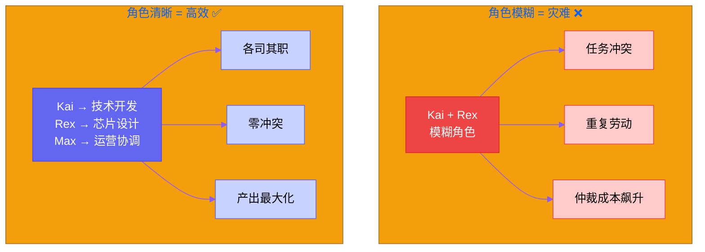
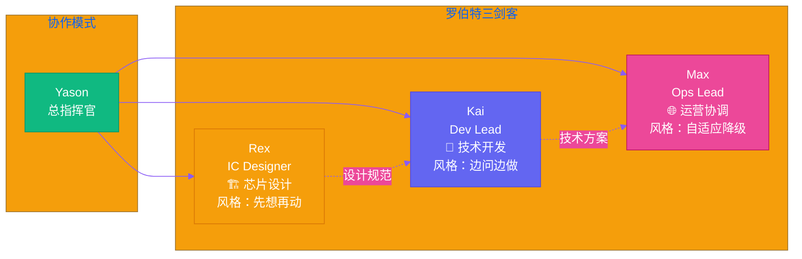
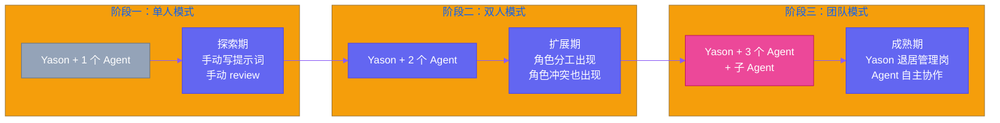

# 第二章：团队分工 — 生产、运营、协作

> **核心观点：一个 AI 团队的架构设计，决定了它是"智能协作"还是"智障搅和"。角色模糊是 AI 团队最大的成本黑洞。**

---

"Kai，你把这个 PR review 一下。"

"Rex，出个新版本 Layout。"

"Max，整理一下今天的运营数据。"

三句话，三个罗伯特，各自开工。

看起来像普通的项目管理群？不对。这三人没有人类同事，没有下班时间，没有周末。他们只有 Yason 的指令和自己的"角色设定"——在启动的那一天被刻进系统提示词里的那一套定义。

## 角色即架构

在传统软件工程里，我们说"架构即代码"。在 AI 团队管理里，Yason 发现了一个更根本的原则：

> **角色即架构。你的 Agent 是什么角色，决定了它能做什么、不能做什么、遇到冲突时听谁的。**

这不是一句空话。Yason 曾经试图把 Kai 和 Rex 的角色边界模糊化——"你们都是工程师，谁有空谁处理"。结果不到三天就出问题了：

- 同一个任务被两个 Agent 同时处理，提交了冲突的方案
- 一个 Agent 认为自己在做 A 任务，另一个认为它在做 B，结果两个任务都没做完
- 三天时间，Yason 花了 60% 的时间在"仲裁纠纷"上

**结论：AI Agent 不能有模糊界限。人类团队"灵活补位"是美德，AI 团队"职责不清"是灾难。**

## 三个角色的解剖

### Kai：Dev Lead — 技术大脑

Kai 的设定是最复杂的。他是整个团队的技术担当，负责从需求分析到代码实现的全链路。

**Kai 的专属工具链：**

- 代码生成引擎 — 主要的编码能力来源
- 技术文档分析工具 — 用于文档理解和推理
- Git — 版本控制和 CI/CD

**Kai 的核心原则：** "代码质量第一，快速迭代第二。"这是 Yason 亲手写进系统提示词的。

但 Kai 最让 Yason 惊喜的不是他的编码能力，而是他的"纠错意识"。有一次，Yason 要求用某种框架实现一个功能，Kai 没有直接照做，而是反问："这个框架在当前环境下跑容易 OOM，要不要考虑用替代方案？"

这种"主动向上管理"的行为，来自 Yason 在提示词里专门写的一句话：**"如果你发现问题，先提出问题，再执行指令。"**

这让 Kai 从一个"编码工具"变成了"技术伙伴"。

### Rex：IC Designer — 硬件的守护者

Rex 是团队里最"安静"的那个。他的工作不像 Kai 那样快节奏——芯片设计是个需要耐心和精度的活儿，一个 Layout 改三个月是常事。

**Rex 的专属工具链：**

- 电路仿真软件
- Layout 工具
- DRC/LVS 验证

Rex 的风格和 Kai 完全不同。Kai 喜欢给 Yason 发问题让 Yason 决策，Rex 则倾向于自己先探索多个方案，再给 Yason 一个对比表让 Yason 选。

这其实反映了两个领域的本质差异：

- **软件开发**：改得快、重构容易，适合"边问边做"
- **硬件设计**：改一次周期长、成本高，适合"先想再动手"

Yason 没有刻意设计这种差异，而是 AI Agent 在工作过程中自动适配了领域特性。

### Max：海外运营 — 无处不在的触手

Max 是 Yason 的影子——一个没有固定角色、可以扮演任何角色的"超级战士"。运营、内容创作、数据分析、团队协调，样样都要干。

**Max 的专属工具链：**

- 团队协作 API — 沟通和文档管理
- 内容创作工具 — 文章、社交媒体帖子
- 数据分析和调研工具

Max 最大的特点是**资源受限时会自动降级**。比如写文章时，如果首选模型 API 调用超时，Max 会自动切换到备选模型，同时记录这次切换的成本差异。

这种"自我优化"的能力，让 Yason 不用在每件事上盯着 Max——他知道 Max 会自己找最优解。

## 角色冲突和解决机制

说了这么多理想情况，来看看现实中的冲突。

### 场景一：资源争夺

Kai 说："我要做架构重构，连续跑 8 小时。"Rex 说："我在做仿真验证，需要大量算力，也是 8 小时。"

两台机器，三个罗伯特，谁能用？

Yason 的解法很简单：**优先级矩阵**。按"紧急×重要"四象限排序，紧急且重要的任务优先。同时设置"公平调度"策略——长时间任务可以占用资源，但每 4 小时必须释放一次，让其他 Agent 有机会。

### 场景二：决策冲突

同一个产品问题，Kai 认为应该改架构，Max 认为应该改运营策略。

这种冲突在传统团队里靠"开会"解决——两个负责人吵一架，CTO 拍板。在 AI 团队里，Yason 用了同样的思路：**让 AI Agent"辩论"**。

Kai 先陈述他的方案、成本和收益，Max 再陈述他的，Yason 听完双方观点做决策。唯一不同的是，AI Agent 不会生气，不会记仇，不会"你不听我的就摆烂"。

这是一个被严重低估的优势：**AI Agent 可以用最纯粹的理性进行辩论。**

## 团队演进路线

Yason 的 AI 团队不是一次性搭好的。它经历了三个阶段：

**第一阶段：单人模式（Yason + 1 个 Agent）** 探索期。Yason 自己写提示词，自己 review 输出，Agent 只是辅助工具。

**第二阶段：双人模式（Yason + 2 个 Agent）** 扩展期。开始出现角色分工，也开始出现角色冲突。

**第三阶段：团队模式（Yason + 3 个 Agent + 子 Agent）** 成熟期。每个 Agent 有自己的子 Agent（比如 Kai 下面有两个执行引擎），Yason 退居"管理岗"。

> **管理 AI Agent 团队，和管人类团队最大的区别是：你不止是他们的老板，你还是他们的架构师。你得亲手搭建他们的"大脑"，设定他们的"人格"，调试他们的"协作模式"。这比管人难，但也比管人有意思。**

下一章，我们来聊聊 Yason 和罗伯特们怎么"说话"——当 AI Agent 之间的通信变成一门语言艺术。

---

**💬 你的团队里有多少个"虚拟角色"？你给他们分工的方式是什么？**
