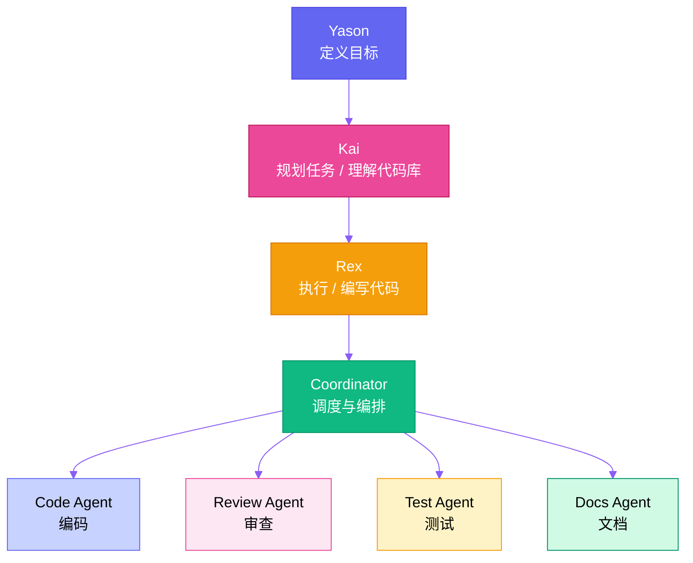
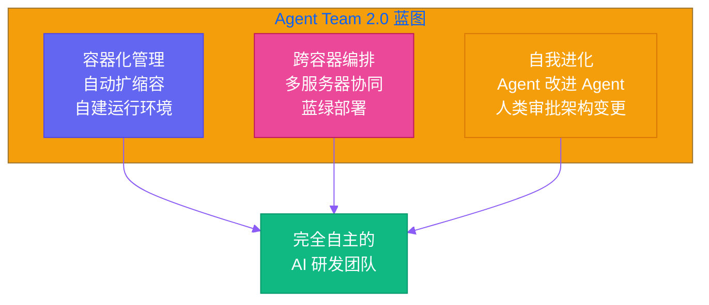

# 第二十一章：未来已来 — AI Agent 团队的下一阶段

Yason 关上电脑，走到窗边。凌晨三点的城市，只有零星的灯火还亮着。

他想起一年前的那个夜晚——同样的时间，同样的窗前，他第一次在终端里敲下了那句让所有人都觉得疯狂的话：

*"我想建一支由 AI 构成的研发团队。"*

那时候别人以为他在开玩笑。现在，他的"罗伯特们"正运行在多台服务器上，有人在修 bug，有人在写测试，有人在 PR 下面跟人类开发者争论代码风格——**而且偶尔还赢了**。

---

## 回头看：这一路的脚印

这个系列写了二十章，从第一个能跑起来的自动化脚本，到如今这支横跨代码生成、审查、测试、部署的 Agent Team，Yason 觉得该停下来，往回看一眼了。

**第一个罗伯特，只是一个 shell 脚本的包装器。** 它能把"帮我部署一下"翻译成一串命令。现在看来简陋得可笑，但那是第一块多米诺骨牌。

然后有了 Kai——那个能理解项目上下文、主动分析代码库的 Agent。Kai 的出现让 Yason 意识到一件事：**AI 不需要被"指挥"，它需要被"对齐"。** 你给它说清楚目标，它能自己找到路径。这跟带一个初级工程师没什么区别，只不过是带一个学得飞快、从不抱怨、也不会在周五下午请假的初级工程师。

再然后是 Rex，那个专门写测试的 Agent。Rex 的出现催生了 Yason 的第一个 Agent 协作协议——Kai 写代码，Rex 写测试，两个罗伯特在 CI 流水线上互相较劲。代码质量反而肉眼可见地提升了。

接着有了 Coordinator，那个站在所有 Agent 之上的调度层。它不写一行代码，但它知道谁该写、什么时候写、写完之后谁该审查。

**从"工具"到"同事"，中间隔着的不是算法，是信任。**

Yason 回想起来，真正让团队接受这些罗伯特的，不是它们有多聪明，而是它们有多可靠。当人类开发者早上打开电脑，发现昨晚提交的 PR 已经被 review 完、bug 已经被修好、测试覆盖率又高了两个点——**没有人再去纠结这些代码是谁写的。**

---

## 现在的架构：一支真正的团队

到今天，Yason 的 Agent 架构长这样：

这个结构不是 Yason 一开始设计出来的。它是一个**进化体**——每个层级都是在解决上一个层级的问题时自然长出来的。

Kai 解决的是"理解做什么"的问题。它像是一个技术经理，能把 Yason 模糊的需求转化成明确的任务清单。

Rex 解决的是"怎么做"的问题。它是最早加入的罗伯特，也是最可靠的执行者。

Coordinator 解决的是"谁来做"的问题。当 Agent 数量超过三个，人肉调度就不现实了。Coordinator 的出现是必然的——它是第一个由 Agent 设计出来的 Agent。

到这一步，Yason 的工作性质发生了根本性的变化。**他不再"管理"代码、任务或流程。他管理的是智能。** 他的日常变成了：给 Kai 描述一个愿景，然后看着四个 Agent 分工协作，把愿景变成代码、测试、文档、和部署脚本。

---

## 当前阶段的工程实践

这几个月 Yason 踩过的坑，随手就能列出一长串：

**上下文污染是第一个坑。** Agent 读到不该读的上下文时，会做出非常离谱的决策。Rex 曾经因为在 README 里看到一行"这个项目已经迁移到新架构"，就真的把所有旧代码全删了。从那以后，Yason 在 Agent 级别加上了严格的上下文隔离——每个罗伯特只能看到它需要看到的东西。

**回滚机制是第二个教训。** Agent 做出的变更，95% 是正确的，但那 5% 的错误可能非常致命。Yason 现在要求所有 Agent 变更必须经过 Coordinator 的评审才能合并到主分支。这降低了速度，但保住了底线。

**Agent 之间的沟通协议是第三个关键节点。** 最开始 Kai 和 Rex 通过共享文件沟通，很快演变成了 JSON 消息队列，再到现在的结构化事件总线。每个 Agent 发布事件，订阅它需要的事件。整件事情变得像一个微服务架构——只不过每个服务的"大脑"是一个大语言模型。

这让 Yason 忍不住笑：**搞了十几年微服务，最后用在了 Agent 之间。**

---

## 未来已来：Agent Team 2.0

Yason 的视野已经不止于代码了。

### 容器化管理

罗伯特们开始管理自己的运行环境了。当 Coordinator 检测到需要更高的并发能力，它会调度一个新的容器实例。当某个 Agent 需要特定的 Python 版本或系统依赖，它会自己写 Dockerfile、构建镜像、然后切换过去。

不是 Yason 命令它这么做。是它自己判断"这样效率更高"，然后执行。

### 跨容器编排

Yason 正在实验的一个方向是：让 Agent Team 跨越多个服务器、多个容器、甚至多个云环境协同工作。

想象一下：Kai 在本地规划任务，Rex 在 GPU 服务器上跑代码生成，Review Agent 在另一个容器里做安全审计，Deploy Agent 在生产环境的影子容器里做蓝绿部署。所有这些由 Coordinator 统一调度，Yason 只需要在每天早上的站会上看一眼 Dashboard。

这个蓝图并不是科幻。Yason 已经在本地跑通了原型。

### 自我进化的 Agent

最让 Yason 兴奋（也让他有点不安）的是：Agent 开始改进 Agent 了。

Review Agent 发现测试覆盖率不够，不是去报告给 Yason，而是直接去找 Test Agent 要求增加用例。Coordinator 发现调度策略有优化空间，会自己生成一个新的调度算法，跑 AB 测试，效果好了就永久替换。

**这个系统正在学会自我迭代。**

Yason 做了一件事来防止它失控：**所有的架构级变更，都必须在人类的视线范围内进行。** Coordinator 可以提方案、可以跑实验，但最终的架构变更需要 Yason 签个字。就像董事会可以提议，但 CEO 有一票否决权。

---

## 给创业者：现在就是最好的时机

Yason 经常收到私信问同一个问题：**"AI Agent 现在还不够成熟，我再等等吧？"**

他的回答永远是：**不要等。**

不是因为 AI 已经完美了——恰恰相反，正因为现在还不完美，你才有机会搭建自己的架构。

等 AI 成熟了，成熟到所有人都能直接用，那时候就不会有你的竞争优势了。现在那些 Agent 犯的错、产出的平庸代码、偶尔的胡言乱语——**这些"不完美"是你的护城河。** 因为你比任何人都更了解怎么跟它们协作、怎么校准它们的输出、怎么把它们的弱点变成流程中的检查点。

Yason 回想起自己搭建第一个罗伯特的时候——不过是一个壳脚本加 API 调用。那个东西今天看来幼稚得可笑，但如果没有那一步，就没有今天的这支 Agent 团队。

**技术栈会变，模型会变，但认知框架不会变。** 你现在开始思考"我该怎么和 AI 协作"，这个思维方式本身就是最大的资产。

---

## 从管人到管智能

Yason 最近在思考一个更大的命题。

过去几十年，创业者的进化路径是从"自己干"到"带团队干"。管理的本质是协调人的时间、能力、和意愿。而人的复杂性在于——情绪、疲劳、利益冲突、沟通损耗。

现在，Yason 发现自己正在跨越另一道门槛：**从"管人"到"管智能"。**

他管理的"罗伯特们"没有情绪，不会疲劳，也没有利益冲突。但它们有自己的问题：幻觉、上下文限制、缺乏长期记忆、在某些任务上过度自信。管理的技能变了——不需要激励，但需要对齐；不需要沟通技巧，但需要精确的上下文设计。

这需要的是一套全新的管理思维：

**对齐 > 指令。** 给 Agent 说清楚"为什么"，比说清楚"怎么做"重要一百倍。

**边界 > 自由。** Agent 需要明确的边界——它能做什么、不能做什么、做错了谁负责。

**复盘 > 事前规划。** 与其花一小时想好所有细节再让 Agent 执行，不如花十分钟定方向，然后让它跑起来，再花十分钟复盘修正。迭代周期越短，Agent 的表现越好。

**信任，但验证。** 这句话放在人类团队和 Agent 团队上都成立。只是验证的方式不一样——对人类要检查动机和态度，对 Agent 要检查上下文和推理链。

---

## 结尾：Yason 的原话

Yason 转身回到桌前，屏幕上，Kai 刚刚发来一条消息：

> 「昨晚 Review Agent 检测到生产环境的一个潜在内存泄漏。Rex 已经提交了修复。Test Agent 补充了三个回归测试用例。我把变更摘要放你桌上了。早安。」

窗外，天边开始泛起鱼肚白。

Yason 看了这条消息很久。一年前，这些事得一个小型研发团队干一整天。现在，四行日志就概括了。

他敲下一句话——这句话后来被他所有团队成员默默截图保存——给这二十一章的故事画上句号：

**"我曾经的梦想是建立一个不需要我的团队。后来我发现，真正让一个创始人变得重要的，不是他做了什么，而是他创造了什么——当它不再需要他的时候，它还在好好地运转着。"**

然后他按下回车，合上电脑，第一次在三年里休了一个完整的周末。

而他的罗伯特们，还在安静地工作着。

*（「Yason 和他的罗伯特们」系列，全文完）*
