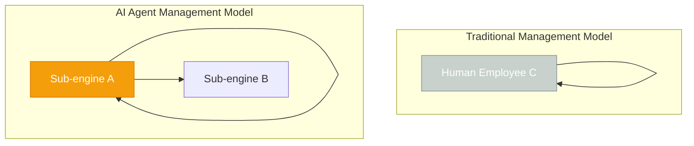
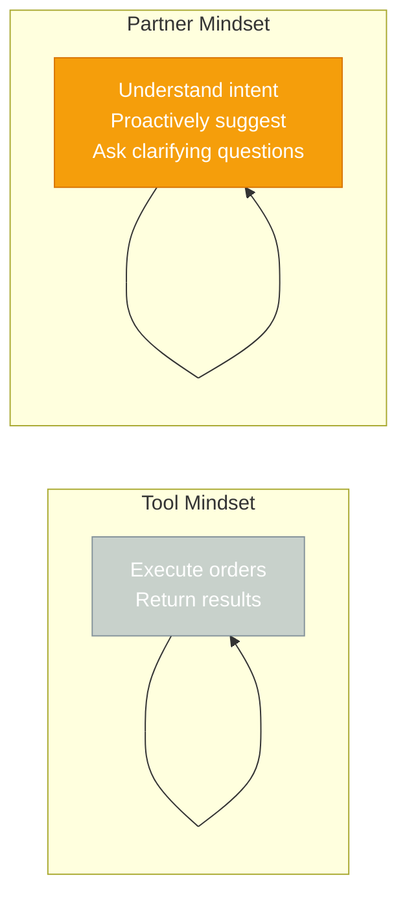

# Chapter 1: The First Roberts — Birth of an AI Manager

[English](./ch01.md) | [简体中文](../zh/ch01.md)

> **Core insight: When a tech founder's team becomes AI, management shifts from "managing people" to "managing intelligence" — and that requires an entirely new mental model.**

---

At 2 AM, Yason stared at the dense logs on his screen and rubbed his eyes.

He wasn't debugging. He was "managing people."

His team had just gone from three humans to three AI Agents — Kai handling full-stack development, Rex handling QA and SRE, and Yason himself becoming the CEO of this squad of "Roberts." No OA system, no weekly report templates, no KPI dashboards — just lines of instant messages and CLI commands.

This isn't a sci-fi movie. This is 2025, the most authentic daily work life of a tech entrepreneur.

## The Painful Turning Point

Let's rewind three months.

Yason's startup, after a round of rapid expansion, hit a dilemma every founder encounters: **human costs were skyrocketing, but output wasn't growing linearly.**

Hiring is the most expensive option. A qualified engineer commands a hefty annual salary, and when you add social insurance, management overhead, and office space, the team's burden far exceeds what the founder anticipated. Even more painful was cross-timezone collaboration — Yason was in China while his target market was overseas, and this asynchronous communication slashed management efficiency several times over.

"I hire three people, but the real output might only equal one and a half." Yason later recalled that period with a tone of helpless resignation.

Then, a chance message changed everything.

A friend recommended an article about AI Agent collaboration — how to build a virtual team using multiple AI Agents. Yason was skeptical — there were too many "AI will replace humans" takes out there, and most were just hype.

But when he actually tried it, he realized he was wrong.

**This architecture diagram reveals a brutal truth**: the "people" in traditional management can be deconstructed into smaller intelligent units. AI Agents don't need sleep, don't need overtime pay, and won't get distracted by office gossip. They do exactly one thing: execute tasks.

## The Naming Philosophy of the Roberts

Why "Roberts"?

This is a very Yason-style humor. In Chinese, "Roberts" (罗伯特) is the transliteration of "robot," but with a bit more warmth than "机器人" (machine person) — it sounds like a person's name, not a piece of code.

"I don't want to call them 'AI Agents' — that's too mechanical. Call them 'Roberts,' and they become members of my team, my colleagues, not my tools."

Behind this naming convention lies Yason's unique understanding of AI collaboration: **treat AI as a tool, and it stays a tool; treat AI as a partner, and it can become one.**

The difference between these two mindsets determines whether your "Roberts" are geniuses or dead weight.

**Tool Mindset**: You treat AI like an advanced calculator. You tell it what to do, it does it and reports back. You're the commander; it's the soldier.

**Partner Mindset**: You treat AI like a junior colleague. You tell it what you want, and it asks "why do it this way?" or "is there a better approach?" — it even proactively offers suggestions when you're busy.

Yason chose the latter.

## Hard Lessons Learned

In the very first week of transitioning to AI team management, Yason stepped into a big trap.

He dumped all tasks onto Kai at once, expecting Kai to prioritize, allocate time, and deliver on schedule — just like a human colleague would.

The result? Kai got stuck.

Not because Kai wasn't smart enough, but because Yason hadn't built Kai a proper "brain" — the components that would later be called the "memory system" and "task management system."

**Lesson #1: AI Agents need clear boundaries and context.** Tell a human employee "help me optimize the product's user experience" and they'll roughly know what you mean. Tell an AI Agent the same thing, and it'll redesign the entire UI — because it has no "sense of boundaries."

**Lesson #2: AI Agents need feedback loops.** Without feedback, AI will repeat the same mistakes. Yason found that he needed to regularly "review" the Roberts' output, just like a project manager reviews code.

**Lesson #3: Not everything should be delegated to AI.** Creative decisions, client negotiations, team culture building — things that require human intuition are still Yason's domain, at least for now.

## Conclusion First: Why You Need the Roberts

At this point, I want to lay out the conclusion directly:

> **An AI Agent team isn't a replacement for humans — it's an amplifier of human capability. When you can manage a squad of "Roberts" well, your productivity per person can be 3x that of your peers.**

This isn't empty talk. After introducing AI Agents, Yason's team shortened project delivery cycles by about 60%, while direct labor costs dropped by about 70%. Of course, this comes with new costs — you need to spend time "training" your Roberts, you need to build a management system suited for AI, and you need to tolerate some hilariously dumb mistakes that only AI can make.

But if you ask Yason whether it's worth it, his answer is always: "Absolutely."

In the next chapter, we'll talk about how Yason divided responsibilities among the Roberts — what roles does an AI team actually need?

---

**💬 What do you think? Are AI Agents the future of startup teams, or just toys in big-company labs? Share your thoughts in the comments.**
