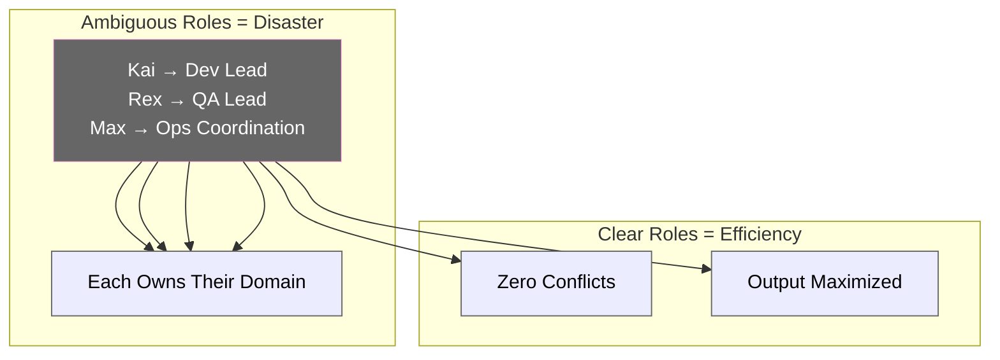
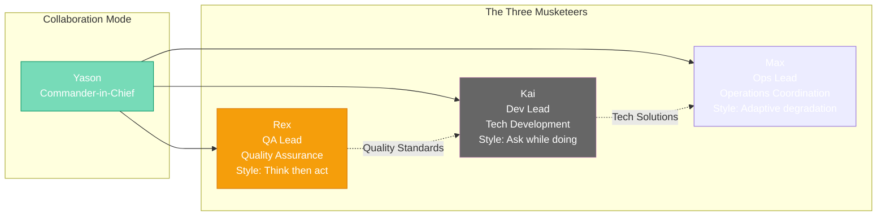
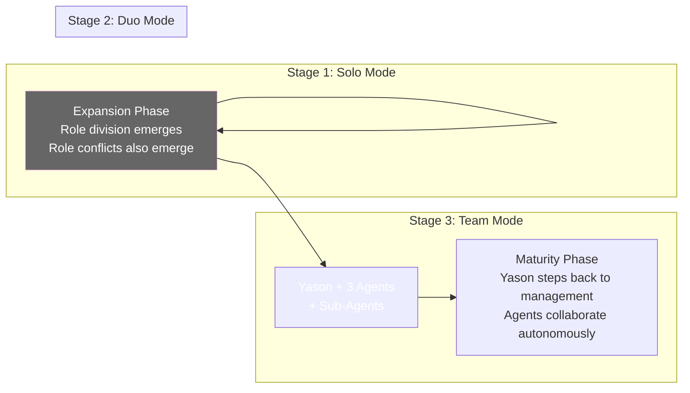

# Chapter 2: Team Division — Production, Operations, Collaboration

[English](./ch02.md) | [简体中文](../zh/ch02.md)

> **Core insight: The architecture design of an AI team determines whether it's "intelligent collaboration" or "idiotic chaos." Role ambiguity is the biggest cost black hole in an AI team.**

---

"Kai, review this PR."

"Rex, write up the test plan for the new release."

"Max, pull together today's operations data."

Three sentences, three Roberts, each getting to work.

Looks like a normal project management group chat? Not quite. These three have no human colleagues, no off-hours, no weekends. They only have Yason's instructions and their own "role definitions" — the set of descriptions etched into their system prompts on the day they were launched.

## Role Is Architecture

In traditional software engineering, we say "architecture is code." In AI team management, Yason discovered a more fundamental principle:

> **Role is architecture. What role your Agent plays determines what it can do, what it can't do, and who it defers to when conflicts arise.**

This isn't an empty slogan. Yason once tried to blur the boundaries between Kai and Rex — "you're both engineers, whoever's free handles it." Within three days, everything went sideways:

- The same task was processed by both Agents simultaneously, resulting in conflicting solutions
- One Agent thought it was working on Task A, the other thought it was Task B — neither task got finished
- Over three days, Yason spent 60% of his time "arbitrating disputes"

**Conclusion: AI Agents cannot have ambiguous boundaries. In a human team, "flexibly covering for each other" is a virtue; in an AI team, "unclear responsibilities" is a disaster.**

## Anatomy of the Three Roles

### Kai: Dev Lead — The Technical Brain

Kai's configuration is the most complex. He's the team's technical powerhouse, responsible for the entire pipeline from requirements analysis to code implementation.

**Kai's Dedicated Toolchain:**

- Code generation engine — the primary source of coding capability
- Technical documentation analysis tool — for document understanding and reasoning
- Git — version control and CI/CD

**Kai's Core Principle:** "Code quality first, rapid iteration second." Yason wrote this into the system prompt himself.

But what surprised Yason most about Kai wasn't his coding ability — it was his "error-correction awareness." Once, Yason asked Kai to implement a feature using a certain framework. Instead of just doing it, Kai pushed back: "This framework is prone to OOM in the current environment — should we consider an alternative?"

This kind of "proactive upward management" behavior came from a single line Yason wrote into the prompt: **"If you spot a problem, raise it first, then execute the instruction."**

That transformed Kai from a "coding tool" into a "technical partner."

### Rex: QA Lead — The Quality Guardian

Rex is the quietest member of the team. His work doesn't have the fast pace of Kai's — quality assurance and testing is a discipline that demands patience and precision. Writing comprehensive test suites, reviewing code for edge cases, and methodically verifying releases can take considerable time.

**Rex's Dedicated Toolchain:**

- Test automation frameworks — unit tests, integration tests, end-to-end tests
- Code review and static analysis tools
- Bug tracking and quality metrics dashboards

Rex's style is completely different from Kai's. Kai likes to send Yason questions for decision-making; Rex prefers to explore multiple approaches on his own first, then present Yason with a comparison table to choose from.

This actually reflects the essential difference between the two domains:

- **Software development**: Changes are fast, refactoring is easy — suited for "ask while doing"
- **Quality assurance**: A missed edge case can cascade into production failures — suited for "think thoroughly before acting"

Yason didn't deliberately design this difference — the AI Agents automatically adapted to the characteristics of their respective domains.

### Max: Ops Lead — The Omnipresent Tentacles

Max is Yason's shadow — a versatile "super warrior" with no fixed role who can play any part. Operations, content creation, data analysis, team coordination — Max does it all.

**Max's Dedicated Toolchain:**

- Team collaboration API — communication and document management
- Content creation tools — articles, social media posts
- Data analysis and research tools

Max's biggest feature is **automatic degradation when resources are constrained**. For example, when writing articles, if the preferred model API times out, Max automatically switches to a backup model while logging the cost difference of the switch.

This "self-optimization" capability means Yason doesn't need to watch over Max for every task — he knows Max will find the optimal solution on its own.

## Role Conflicts and Resolution Mechanisms

Enough about ideal scenarios — let's look at real-world conflicts.

### Scenario 1: Resource Contention

Kai says: "I need to do an architecture refactor, running continuously for 8 hours." Rex says: "I'm running a full regression test suite, needs heavy compute — also 8 hours."

Two machines, three Roberts — who gets to use them?

Yason's solution is simple: a **priority matrix**. Tasks are ranked by the "urgent × important" four-quadrant model, with urgent-and-important tasks going first. He also set up a "fair scheduling" policy — long-running tasks can hold resources, but must release them every 4 hours to give other Agents a chance.

### Scenario 2: Decision Conflicts

For the same product issue, Kai thinks the architecture should be changed, while Max thinks the operations strategy should be adjusted.

In a traditional team, this gets resolved by "having a meeting" — the two leads argue, and the CTO makes the call. In an AI team, Yason used the same approach: **let the AI Agents "debate."**

Kai presents his solution, costs, and benefits first, then Max presents his. Yason listens to both sides and makes the decision. The only difference? AI Agents don't get angry, don't hold grudges, and won't "quiet quit because you didn't listen to them."

This is a seriously underrated advantage: **AI Agents can debate with the purest rationality.**

## Team Evolution Roadmap

Yason's AI team wasn't built in one shot. It went through three stages:

**Stage 1: Solo Mode (Yason + 1 Agent)** — Exploration phase. Yason writes prompts himself, reviews output himself. The Agent is just an assistive tool.

**Stage 2: Duo Mode (Yason + 2 Agents)** — Expansion phase. Role division starts to emerge, and so do role conflicts.

**Stage 3: Team Mode (Yason + 3 Agents + Sub-Agents)** — Maturity phase. Each Agent has its own sub-Agents (for example, Kai has two execution engines underneath), and Yason steps back into a "management role."

> **Managing an AI Agent team is fundamentally different from managing a human team: you're not just their boss, you're their architect. You have to personally build their "brains," define their "personalities," and debug their "collaboration patterns." It's harder than managing people — but also more interesting.**

In the next chapter, we'll talk about how Yason and the Roberts "talk" to each other — when communication between AI Agents becomes an art of language.

---

**💬 How many "virtual roles" are on your team? How do you divide responsibilities among them?**
