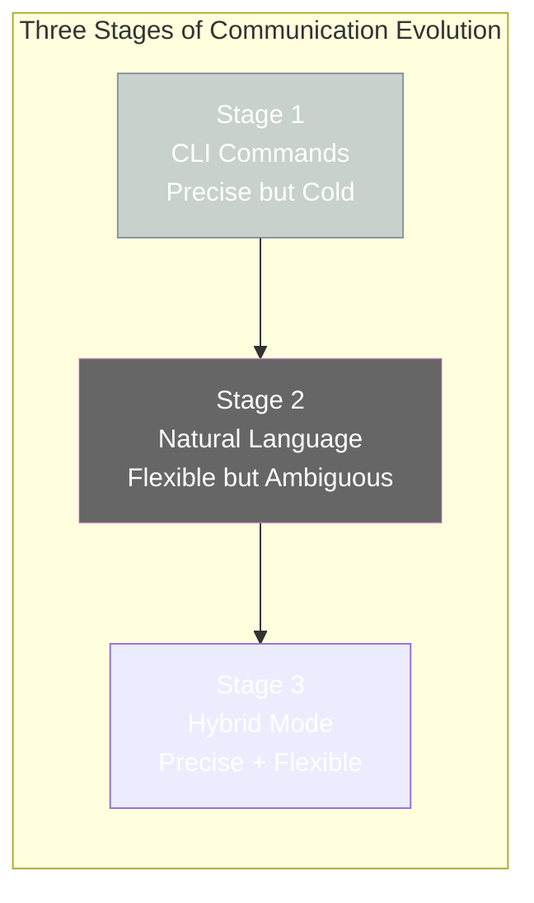

# Chapter 3: Communication — From CLI to LLM

[English](./ch03.md) | [简体中文](../zh/ch03.md)

> **Core insight: An AI Agent's communication capability determines its ceiling. From CLI commands to LLM conversations, each layer of communication has its optimal use case.**

---

"You just tell Kai 'write me an API' and that's it?"

This is one of the questions Yason gets asked the most.

Most people assume that communicating with an AI Agent should be like talking to a human colleague — say it once and they understand. But the reality is that Yason's communication with the Roberts went through three completely different stages, and each stage used a different "language."

This wasn't because Yason had nothing better to do — it was because **different tasks require different communication methods.**

## Stage 1: CLI Language — Precise but Cold

In the very beginning, Yason's "conversations" with Kai looked like this:

```plaintext
kai --create-api user-auth --method POST --path /api/v1/auth
kai --review-code --branch feature/user-auth-v2
kai --deploy --env staging
```

This isn't code — this is Yason's daily conversation with Kai.

Why not use natural language? Because in the early stages, Yason found that the ambiguity of natural language was an efficiency killer.

He'd say "help me fix the user authentication API," and Kai would respond "fix what? Change what? How?" — a simple task, and ten minutes gone just clarifying requirements.

CLI commands are precise down to every parameter — no ambiguity, no "I thought you meant..." misunderstandings. But they have an obvious downside: **high learning curve**. Yason needed to remember which commands each Agent supports, how to write the parameters, what the options are.



## Stage 2: Natural Language — Flexible but Ambiguous

As Yason and Kai's collaboration grew more seamless, he started experimenting with more natural language.

"Kai, help me find the most frequently mentioned issues in user feedback."

Kai understood and went straight to analyzing the user feedback data. No parameters, no command line — just like talking to a human colleague.

The advantages of natural language communication are obvious: **flexible, no need to memorize commands, great for open-ended questions**. Yason could directly discuss architecture plans, product direction, and code quality with Kai — things that CLI commands simply can't express.

But natural language has pitfalls. Big ones.

Yason once said "get this feature done ASAP," and Kai interpreted "ASAP" as "right this instant," interrupting a running test suite. What Yason meant by "ASAP" was actually "sometime within today."

**The ambiguity of natural language gets amplified in AI Agent communication.** AI doesn't contextualize "ASAP" the way a human would — it takes it literally.

## Stage 3: Hybrid Mode — Precise When Needed, Flexible When Appropriate

After two months of trial and error, Yason developed a **hybrid communication mode**:

- **Clear-cut tasks (what to do, how to do it)** → CLI commands
- **Open-ended questions (why, what-if)** → Natural language
- **Priority and timing** → Structured descriptions (not "ASAP," but "within 4 hours")

The core principle of this mode comes down to one sentence:

> **Precise tasks get precise instructions; open questions get open language. Using the wrong communication method is like talking past each other.**

```mermaid
graph TB
    T[New Task] --> D{Task Type?}

    D -->|"Clear Task<br>What & How"| CLI[CLI Command<br>kai --create-api ...]
    D -->|"Open Question<br>Why & What-if"| NL[Natural Language<br>"Help me analyze..."]
    D -->|"Timing/Priority"| SD[Structured Description<br>"Complete within 4 hours<br>Priority P0"]

    CLI --> R[Efficient Execution ✓]
    NL --> R
    SD --> R

    style T fill:#666f,stroke:#f6e5,color:#fff
    style D fill:#f59e0b,stroke:#d97706,color:#fff
    style CLI fill:#c7dfe,stroke:#666f,color:#000
    style NL fill:#fce7f3,stroke:#ec899,color:#000
    style SD fill:#fefc7,stroke:#f59e0b,color:#000
    style R fill:#0b98,stroke:#059669,color:#fff
```

## Cross-Agent Communication: From "Relay Phone" to "Protocol Stack"

The other dimension of communication is cross-Agent communication.

In the beginning, communication between Kai and Max relied entirely on Yason as a relay. Kai finished something and told Yason, then Yason told Max. Yason became a "high-end message relay" — spending 2-3 hours every workday just forwarding information.

Later, Yason tried letting Agents talk to each other directly. The result was catastrophic:

- Kai told Max: "I've finished modifying that API."
- Max understood this as "the API has been deployed to production" — when in reality Kai had only made changes locally and hadn't pushed yet.
- Max sent out an announcement, causing a serious information error.

**Root cause: Agents communicate in natural language, but natural language lacks "state semantics."**

Yason's solution was to establish a **cross-Agent communication protocol** — which later evolved into the core design of the "CLI Provider." The core rules are only three:

1. **Task dispatch uses structured messages** (who, what, priority, deadline)
2. **Status sync uses a unified format** (completed / in-progress / blocked / waiting)
3. **Exception notifications use an emergency channel** (directly notify Yason, bypassing the protocol stack)

This set of rules reduced inter-Agent communication errors from 40% to nearly zero.

## The Role of LLMs in Communication

It's important to note that the "CLI commands" and "structured messages" described above don't bypass the LLM's execution capability. Quite the opposite — after CLI commands are received by an Agent, they all pass through the LLM's "semantic understanding layer."

```plaintext
Yason: kai --create-api user-auth --method POST --path /api/v1/auth
          ↓
Kai's LLM understands: "The user wants to create a user authentication API, POST method, path /api/v1/auth"
          ↓
Kai: "Got it. I'll review the existing code structure, then write the code. Estimated 30 minutes."
```

CLI commands are just the **input format**; the LLM is still the **execution engine**. It's like how you can write a requirements document in Chinese (input format), but the person executing the requirements is still an engineer (execution engine) — not a machine that only reads Chinese characters.

> **Input format and execution engine are two different things. A good communication system doesn't discard the LLM's capabilities — it lets the LLM operate within the right framework.**

## Yason's Golden Rules of Communication

After months of practice, Yason distilled a few golden rules:

1. **Focus on the what, not the how** — When giving an Agent a requirement, be clear about "what you want," not "how to do it." The Agent knows the best way to execute — you just need to tell it the goal.
2. **One thing at a time** — Don't cram three tasks into one message. The Agent will prioritize the last one and forget the first two.
3. **Define acceptance criteria** — "Write an API" and "Write an API with JSON response format, 304 validation, and error handling" are completely different levels of communication quality.
4. **Confirm receipt** — After issuing an instruction to an Agent, wait for it to confirm before moving on. This habit prevents a lot of "I thought you received it" situations.

In the next two chapters, we'll dive into two specific tools — how Yason uses top-tier models at zero cost, and how the CLI Provider completely solves the inter-Agent communication problem.

---

**💬 How do you communicate with your AI Agents? CLI or natural language? Which works better for you?**
