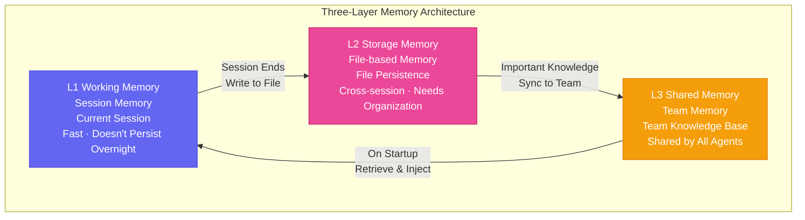
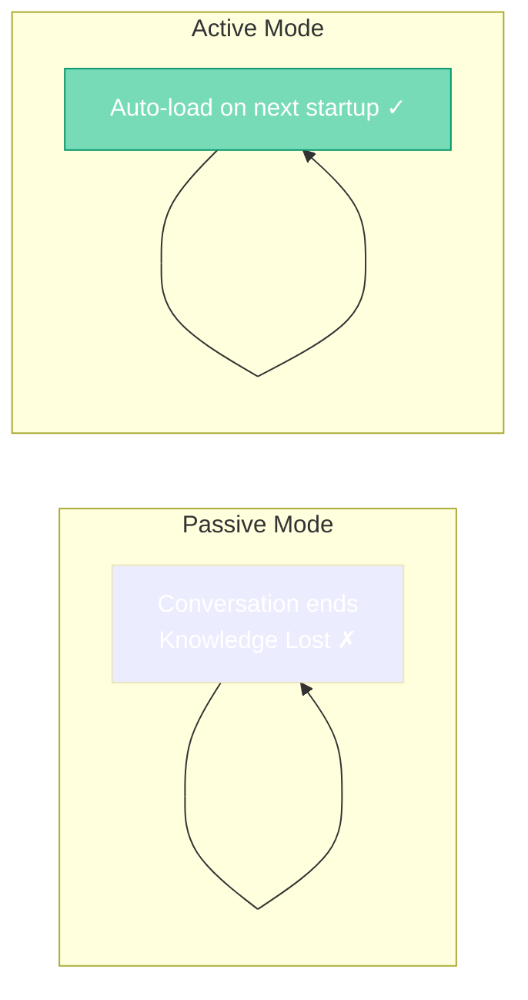

# Chapter 4: Memory — How to Make AI Remember Everything

[English](./ch04.md) | [简体中文](../zh/ch04.md)

> **Core insight: AI Agent "amnesia" isn't a bug — it's by design. Solving it requires a layered memory system — just like the human brain divides into short-term memory, long-term memory, and muscle memory.**

---

Yason first noticed the "amnesia" problem in a deeply awkward scenario.

That afternoon, he assigned Kai a task: "Fix that user feedback issue from before."

Kai replied: "Please specify which user feedback you're referring to? I couldn't find any related records."

Yason was stunned — this was the same user feedback that Kai had personally analyzed for an hour just three days ago. All that information, Kai had "forgotten" completely.

In that moment, Yason grasped the cruelest truth about AI Agent management:

> **AI Agents have no long-term memory. Every time a conversation ends, they're like a freshly booted machine — brand new, clean, and knowing nothing about you.**

This isn't Kai's fault. It's determined by the underlying design of AI systems — each session is independent, and old history doesn't carry over into new sessions. If you don't build an Agent a "memory system," it's a goldfish.

## The Three Layers of Memory

Yason spent a long time researching and iterating before designing a three-layer memory system.

### Layer 1: Working Memory (Session Memory)

This is the Agent's memory within the current session. Gone when the call ends.

- Content: Context of the current task, recently discussed items, last few conversation turns
- Capacity: Limited by the context window (typically 8K-32K tokens)
- Characteristics: Fast, high accuracy, but "doesn't survive the night"

**Yason's approach**: Stuff "all relevant information for the current task" into the session. For example, when asking Kai to modify an API, he puts the API documentation, requirements spec, and test cases all in the same conversation.

**Key lesson**: Never assume an Agent will remember what you said in the next session. It won't.

### Layer 2: Storage Memory (File-based Memory)

The Agent writes its "experience" into files and reads them on the next startup.

- Content: System prompts, work logs, preference settings, decision records
- Storage: Markdown files, JSON files, configuration files
- Characteristics: Data doesn't get lost, but reading and managing it requires good organizational structure

**Yason's approach**: Each Agent has its own workspace directory, organized by function into separate files.

- `MEMORY.md` — Long-term memory, recording the Agent's core identity and most important information
- `memory/YYYY-MM-DD.md` — Daily logs, recording decisions made that day
- `TOOLS.md` — Local tool configuration, recording the Agent's dedicated toolchain
- `USER.md` — User information, recording Yason's preferences and habits

### Layer 3: Shared Memory (Team Memory)

A knowledge base shared by the entire team.

- Content: Product specifications, project progress, team decisions
- Storage: Shared documents (primary), code repository (backup)
- Characteristics: Readable by all Agents, but writable only by Yason (to prevent Agents from overwriting each other)

**Yason's approach**: Put all "must-not-lose" information in shared documents.

Things like product roadmaps, API design specifications, team communication protocols — these are the infrastructure that keeps the Roberts "aligned in understanding." Any new Agent that joins the team can get up to speed just by reading these documents.

## "Writing" Memory Is Harder Than "Reading" It

Yason discovered a counterintuitive phenomenon: **feeding information to an AI Agent isn't hard — the hard part is making it know what's worth remembering.**

For example, Kai might do a full day of technical research and generate many useful insights. But those insights don't automatically get written to MEMORY.md — unless someone explicitly says in the prompt "write down the important stuff."

Yason's solution was to add an "iron law" to every Agent:

> **If you learn something important during a conversation (user preferences, project decisions, technology choices), you must write it to the appropriate file before the conversation ends. Not writing it is your fault.**

This rule seems simple, but it completely transformed the Agents' memory efficiency. From "waiting to be fed" to "actively absorbing."

## The Things That "Shouldn't Be Remembered"

Another challenge of the memory system: **not everything is worth remembering.**

Yason's Agents once made a classic mistake — Kai wrote all three failed debugging experiment logs from last week into MEMORY.md, causing the file to grow increasingly bloated and startup loading to slow down progressively.

"That's why AI also needs to learn how to 'forget,'" Yason said.

He added a **memory eviction mechanism**:

1. **Time-based eviction** — Information older than 30 days is automatically archived to the `archive/` directory
2. **Importance-based eviction** — Low-priority daily operations ("sent 3 emails today") don't go into long-term memory
3. **Relevance-based eviction** — Completed project information gets packed into a single file and removed from the main MEMORY.md

This mechanism upgraded the Agents' "memory capacity" from "goldfish-level" to "human-assistant-level" — not perfect long-term memory, but good enough.

> **A good memory system isn't about remembering everything — it's about remembering the right things at the right time.**

## The Future of the Memory System

Yason has bigger plans for the memory system's direction:

1. **Automatic Summarization** — AI Agents no longer need to be told "write this down." They can judge information importance on their own, automatically generate summaries, and archive them
2. **Cross-Agent Memory Sharing** — Experience Kai learns can directly be "taught" to Rex and Max. Not through files, but through real-time knowledge synchronization
3. **Decision Traceability** — Not just "remembering what happened," but being able to trace back "why this decision was made." This requires recording the context and reasoning process behind decisions

But for now, Yason feels the three-layer memory system is sufficient to support daily operations. The rest, he leaves to time.

After all, even humans themselves often forget their keys — we can't expect AI to remember everything either.

---

**💬 Has your AI assistant ever "lost its memory"? How did you solve it? Share your approach!**
